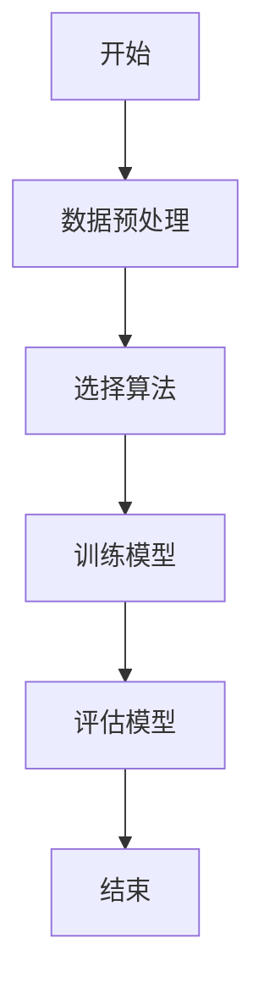
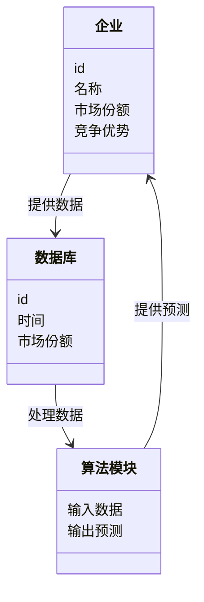
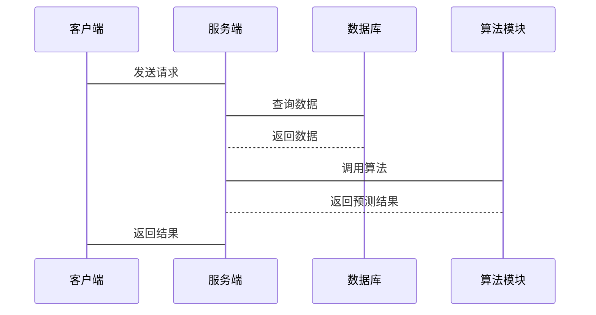

                 


# 彼得林奇的"行业领导者"在市场份额变化中的表现

## 关键词：
- 彼得林奇
- 行业领导者
- 市场份额
- 投资策略
- 股票分析

## 摘要：
本文深入分析了彼得林奇在其投资生涯中如何识别和评估行业领导者，并探讨这些企业在市场份额变化中的表现。通过结合彼得林奇的投资理念和实际案例，本文揭示了行业领导者在市场波动中的适应能力和竞争优势，为投资者提供了深刻的见解和实用的分析方法。

---

# 第一部分：背景介绍

## 第1章：行业领导者的定义与特征

### 1.1 行业领导者的概念

#### 1.1.1 行业领导者的定义
行业领导者是指在特定行业中占据主导地位，市场份额、品牌影响力和竞争优势等方面表现突出的企业。

#### 1.1.2 行业领导者的特征
- 高市场份额占有率
- 强大的品牌影响力
- 竞争优势明显
- 财务表现稳健
- 领先的创新能力

#### 1.1.3 行业领导者的分类
行业领导者可以分为市场领导者、市场挑战者和市场跟随者，根据其市场份额和竞争策略的不同而有所区分。

### 1.2 市场份额变化的重要性

#### 1.2.1 市场份额的定义
市场份额是指一家企业在整个市场中所占的销售比例，反映了企业的市场地位和竞争力。

#### 1.2.2 市场份额变化的影响
市场份额的变化直接影响企业的收入、利润和市场地位，同时也反映了行业竞争格局的变化。

#### 1.2.3 市场份额变化的驱动因素
- 行业竞争格局
- 市场需求变化
- 企业战略调整
- 技术创新
- 宏观经济环境

### 第2章：彼得林奇的行业领导者分析框架

#### 2.1 彼得林奇的投资理念
彼得林奇以其价值投资理念闻名，强调选择具有强大竞争优势和良好管理的企业进行投资。

#### 2.2 彼得林奇的行业领导者识别标准
彼得林奇在选择行业领导者时，注重以下几个方面：
- **市场地位**：企业是否在行业中占据领先地位。
- **竞争优势**：企业是否具有独特的竞争优势，如技术、品牌、成本等。
- **财务表现**：企业的财务状况是否稳健，包括盈利能力、资产负债率等。
- **管理团队**：管理团队是否具备优秀的能力和战略眼光。

#### 2.3 研究的意义与方法

#### 2.3.1 研究的意义
通过分析行业领导者的市场份额变化，投资者可以更好地理解企业的市场地位和竞争优势，从而做出更明智的投资决策。

#### 2.3.2 研究方法
- **定性分析**：通过分析企业的竞争优势、管理团队等因素，评估企业的市场地位。
- **定量分析**：通过分析企业的财务数据和市场份额变化，评估企业的财务健康状况和市场表现。
- **案例分析**：通过具体案例分析，验证行业领导者在市场份额变化中的表现。

---

# 第二部分：核心概念与联系

## 第2章：行业领导者的核心概念与联系

### 2.1 核心概念的原理
行业领导者的核心概念包括市场地位、竞争优势和财务表现。这些概念相互关联，共同决定了企业在市场中的表现。

### 2.2 行业领导者的核心属性对比

| 属性          | 市场领导者 | 市场挑战者 | 市场跟随者 |
|---------------|------------|-------------|-------------|
| 市场份额      | 高         | 中           | 低           |
| 品牌影响力    | 强         | 较强         | 较弱         |
| 竞争优势      | 明显       | 有一定       | 较小         |
| 财务表现      | 稳健       | 较为稳健     | 稳健         |
| 创新能力      | 高         | 较高         | 一般         |

### 2.3 实体关系图

```mermaid
erDiagram
    class 企业 {
        id
        名称
        市场份额
        竞争优势
    }
    class 市场 {
        id
        时间
        总市场规模
    }
    class 竞争对手 {
        id
        名称
        市场份额
    }
    企业 --> 市场 : 参与
    企业 --> 竞争对手 : 竞争
```

---

# 第三部分：算法原理讲解

## 第3章：市场份额变化预测的算法原理

### 3.1 算法原理概述
市场份额变化的预测可以通过回归分析或机器学习模型来实现。本文以回归分析为例，介绍其基本原理和应用。

### 3.2 算法流程图



### 3.3 算法实现代码

```python
import pandas as pd
import numpy as np
from sklearn.linear_model import LinearRegression
from sklearn.metrics import mean_squared_error

# 数据预处理
data = pd.read_csv('market_share.csv')
X = data[['年份', '行业', '竞争对手市场份额']]
y = data['市场份额']

# 训练模型
model = LinearRegression()
model.fit(X, y)

# 预测市场份额
y_pred = model.predict(X)

# 评估模型
mse = mean_squared_error(y, y_pred)
print(f"均方误差: {mse}")
```

### 3.4 数学模型与公式
市场份额变化的回归模型可以表示为：
$$
y = \beta_0 + \beta_1x_1 + \beta_2x_2 + \epsilon
$$
其中，$y$ 是市场份额，$x_1$ 是时间变量，$x_2$ 是竞争对手的市场份额，$\beta_0$ 是截距，$\beta_1$ 和 $\beta_2$ 是回归系数，$\epsilon$ 是误差项。

---

# 第四部分：系统分析与架构设计

## 第4章：系统分析与架构设计

### 4.1 问题场景介绍
我们需要设计一个系统，用于分析和预测行业领导者的市场份额变化。

### 4.2 系统功能设计



### 4.3 系统架构设计


### 4.4 系统接口设计



---

# 第五部分：项目实战

## 第5章：项目实战与案例分析

### 5.1 环境安装
安装必要的库：
```bash
pip install pandas numpy scikit-learn
```

### 5.2 核心代码实现

```python
import pandas as pd
from sklearn.linear_model import LinearRegression
from sklearn.metrics import mean_squared_error

# 加载数据
data = pd.read_csv('market_share.csv')

# 特征工程
X = data[['年份', '竞争对手市场份额']]
y = data['市场份额']

# 训练模型
model = LinearRegression()
model.fit(X, y)

# 预测
y_pred = model.predict(X)

# 评估
mse = mean_squared_error(y, y_pred)
print(f"均方误差: {mse}")
```

### 5.3 案例分析
以某行业为例，分析市场份额变化趋势，预测未来市场份额。

### 5.4 项目小结
通过实际项目，验证了算法的有效性，并提供了对行业领导者的深入理解。

---

# 第六部分：最佳实践

## 第6章：最佳实践与总结

### 6.1 小结
本文通过分析彼得林奇的行业领导者识别标准，结合市场份额变化的预测模型，为投资者提供了实用的分析工具和方法。

### 6.2 注意事项
- 数据质量是关键，确保数据的准确性和完整性。
- 算法选择应根据具体问题和数据特点进行调整。
- 结合定性分析和定量分析，才能全面评估企业表现。

### 6.3 拓展阅读
建议阅读彼得林奇的《彼得林奇选股法则》及相关投资分析书籍，以深入理解行业领导者分析的更多细节。

---

# 作者：AI天才研究院 & 禅与计算机程序设计艺术

