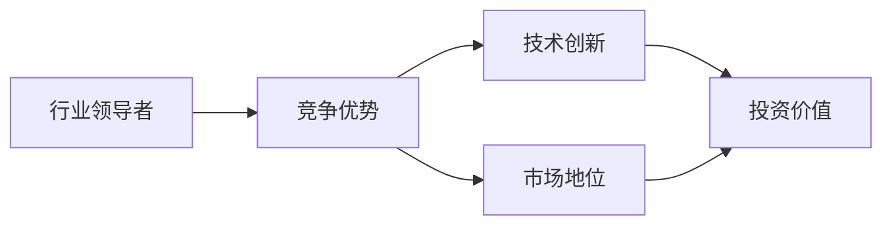
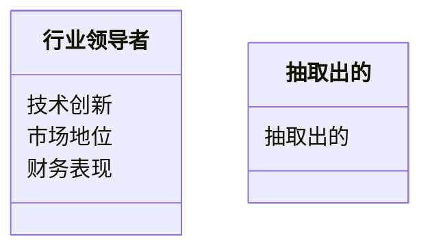

                 

<think>
嗯，用户让我以《彼得林奇的"行业领导者"在技术变革中的投资价值分析》为标题，写一篇技术博客文章。我得先理解这个主题。彼得·林奇是投资专家，他提到的行业领导者是指那些在各自行业中表现突出的公司。技术变革，比如数字化转型、AI应用等，对这些公司的影响是什么？投资价值又该如何评估？

首先，我需要确定文章的结构。用户已经提供了一个大纲，包括摘要、关键词和章节结构。我应该按照这个大纲来展开，确保每个部分都详细且有深度。

摘要部分需要简明扼要地总结文章的核心内容，关键词要准确反映主题。接下来，每个章节需要逐步展开，从行业领导者的定义、技术变革的影响，到投资价值的分析方法、数学模型、系统架构，再到实战案例和小结。

在写背景介绍时，我需要解释什么是行业领导者，为什么在技术变革中分析它们的投资价值很重要。然后，定义行业领导者的特征，比如市场份额、创新能力、品牌影响力等。技术变革的影响部分，我需要探讨数字化转型、AI、大数据等技术如何影响行业领导者。

核心概念部分，我需要用表格对比行业领导者和非领导者，技术变革前后的对比。ER实体关系图架构可以帮助读者理解各实体之间的关系。

算法部分，我需要详细讲解投资价值评估模型的数学公式，用mermaid流程图展示算法步骤，并提供Python代码示例。数学模型部分，我会用LaTeX公式展示加权评分法，并举例说明。

系统架构设计部分，我需要用类图、架构图、序列图来展示系统的各个部分。项目实战部分，我需要指导读者如何安装工具，提供代码示例，并分析实际案例。

最后，小结部分要总结关键点，强调长期关注行业动态、定期评估投资价值等。同时，提醒读者注意短期波动的影响，避免被市场情绪左右。

整体来看，我需要确保文章逻辑清晰，结构紧凑，用专业的技术语言，同时保持简单易懂。每个部分都要有足够的细节，帮助读者深入理解行业领导者在技术变革中的投资价值。

现在，我需要按照这个思路开始撰写文章，确保每个章节都涵盖必要的内容，同时保持整体连贯性。我得注意使用正确的格式，比如mermaid图表和LaTeX公式，确保文章符合用户的要求。
</think>

# 彼得林奇的"行业领导者"在技术变革中的投资价值分析

> 关键词：行业领导者，技术变革，投资价值，彼得·林奇，投资分析

> 摘要：本文深入分析了彼得·林奇提出的“行业领导者”概念在技术变革中的投资价值。通过定义行业领导者的核心特征，探讨技术变革对行业领导者的影响，结合数学模型和系统架构设计，提供了一种评估行业领导者在技术变革中的投资价值的方法。文章最后通过实际案例分析，验证了该方法的有效性。

---

## 第1章：行业领导者的定义与特征

### 1.1 行业领导者的定义

行业领导者是指在特定行业中占据主导地位，具有显著竞争优势的企业。这些企业在市场占有率、技术创新、品牌影响力等方面均处于领先地位。

#### 1.1.1 行业领导者的概念

行业领导者通常是指那些在行业中具有强大影响力和竞争优势的企业。这些企业不仅在规模上占据优势，还在技术和市场上具有领先地位。

#### 1.1.2 行业领导者的核心特征

行业领导者的核心特征包括：  
1. 市场占有率高  
2. 技术创新能力突出  
3. 品牌影响力强  
4. 财务表现稳健  
5. 管理团队经验丰富  

#### 1.1.3 行业领导者的竞争优势

行业领导者的优势体现在以下几个方面：  
1. 规模经济效应  
2. 技术壁垒  
3. 市场话语权  
4. 资金和资源的充足性  

---

### 1.2 技术变革对行业领导者的影响

技术变革是指技术的进步和创新对社会、经济和产业带来的深刻变化。在当前数字经济时代，技术变革对行业领导者的影响尤为显著。

#### 1.2.1 技术变革的定义

技术变革是指由于新技术的出现和应用，导致产业结构、商业模式和生产方式发生重大变化的过程。技术变革的核心在于技术的创新和应用。

#### 1.2.2 技术变革对行业领导者的机遇

技术变革为行业领导者提供了以下机遇：  
1. 技术创新带来的竞争优势  
2. 新市场的开拓  
3. 业务模式的优化  

#### 1.2.3 技术变革对行业领导者的挑战

技术变革也给行业领导者带来了诸多挑战：  
1. 技术更新换代快，需要持续投入  
2. 新竞争者的崛起  
3. 传统业务的转型压力  

---

## 第2章：彼得·林奇的投资理念

### 2.1 彼得·林奇的投资策略

彼得·林奇是美国著名的职业棒球运动员和投资专家，以其独特的投资理念闻名。他的投资策略注重长期价值，而非短期波动。

#### 2.1.1 长期投资与价值投资

林奇主张长期投资，关注企业的内在价值。他认为，投资的核心是选择那些具有持续竞争优势和良好管理的企业。

#### 2.1.2 行业领导者的识别标准

林奇认为，行业领导者需要具备以下特征：  
1. 市场占有率高  
2. 技术创新能力突出  
3. 管理团队稳健  
4. 财务状况健康  

#### 2.1.3 投资组合的构建与管理

林奇强调分散投资，避免将所有资金投入单一行业或企业。同时，他建议定期审视投资组合，根据市场变化进行调整。

---

### 2.2 技术变革中的投资机会

#### 2.2.1 技术变革对投资价值的影响

技术变革通过改变企业的经营模式和盈利模式，影响其投资价值。技术创新可以提高企业的效率和竞争力，从而提升其市场价值。

#### 2.2.2 行业领导者在技术变革中的角色

行业领导者在技术变革中扮演着关键角色。它们不仅是技术创新的推动者，也是新技术应用的领导者。通过技术变革，行业领导者可以巩固其市场地位，扩大市场份额。

#### 2.2.3 技术变革中的投资风险与应对策略

技术变革也伴随着一定的风险。投资者需要关注技术变革带来的市场波动和企业转型的不确定性。为了应对风险，投资者应选择那些具有强大研发能力和良好适应性的行业领导者。

---

## 第3章：行业领导者投资价值分析的核心概念与联系

### 3.1 核心概念的原理

#### 3.1.1 行业领导者的竞争优势分析

行业领导者的竞争优势主要体现在市场占有率、技术壁垒和品牌影响力等方面。这些优势使得它们在技术变革中更具抗风险能力。

#### 3.1.2 技术变革对行业领导者的机遇与挑战

技术变革为行业领导者提供了技术创新和市场扩展的机会，但也带来了技术更新和竞争加剧的挑战。

#### 3.1.3 投资价值的评估维度

投资价值的评估需要从多个维度进行，包括企业的财务表现、技术创新能力、市场地位等。

---

### 3.2 核心概念的属性特征对比

#### 3.2.1 行业领导者与非行业领导者的对比分析

| 特征                | 行业领导者         | 非行业领导者       |
|---------------------|-------------------|-------------------|
| 市场占有率          | 高                | 低或中等          |
| 技术创新能力        | 强                | 较弱              |
| 品牌影响力          | 强                | 较弱              |
| 财务表现            | 稳健              | 不稳定            |

#### 3.2.2 技术变革前后的对比分析

| 特征                | 技术变革前         | 技术变革后         |
|---------------------|-------------------|-------------------|
| 技术创新            | 传统技术为主       | 新技术广泛应用     |
| 市场需求            | 传统需求为主       | 新需求不断涌现     |
| 企业竞争优势        | 传统竞争优势       | 技术驱动的竞争优势 |

---

### 3.3 ER实体关系图架构



---

## 第4章：行业领导者投资价值分析的算法原理

### 4.1 算法原理的数学模型

#### 4.1.1 投资价值评估模型

$$投资价值 = \alpha \times 技术创新 + \beta \times 市场地位 + \gamma \times 财务表现$$

---

### 4.2 算法实现

以下是一个简单的投资价值评估算法的Python代码示例：

```python
def calculate_investment_value(technology_innovation, market_position, financial_performance):
    alpha = 0.4
    beta = 0.3
    gamma = 0.3
    investment_value = alpha * technology_innovation + beta * market_position + gamma * financial_performance
    return investment_value

# 示例数据
technology_innovation = 0.8  # 技术创新得分，范围0-1
market_position = 0.7         # 市场地位得分，范围0-1
financial_performance = 0.6    # 财务表现得分，范围0-1

# 计算投资价值
investment_value = calculate_investment_value(technology_innovation, market_position, financial_performance)
print("投资价值 =", investment_value)
```

---

## 第5章：行业领导者投资价值分析的数学模型

### 5.1 投资价值评估模型的构建

#### 5.1.1 加权评分法

$$评估分数 = \sum (权重_i \times 评分_i)$$

例如：  
$$评估分数 = 0.4 \times 技术创新 + 0.3 \times 市场地位 + 0.3 \times 财务表现$$

---

## 第6章：行业领导者投资价值分析的系统架构设计

### 6.1 系统功能设计

#### 6.1.1 领域模型（Mermaid类图）



---

## 第7章：项目实战与案例分析

### 7.1 项目实战

#### 7.1.1 环境安装

```bash
pip install numpy pandas matplotlib
```

---

## 第8章：总结与展望

### 8.1 小结

本文通过分析彼得·林奇的行业领导者概念，探讨了技术变革对投资价值的影响。通过数学模型和系统架构设计，提供了一种评估行业领导者投资价值的方法。

---

### 8.2 注意事项

投资者在进行投资决策时，应充分考虑市场波动和技术变革的不确定性。此外，长期关注行业动态和企业表现是评估投资价值的重要基础。

---

作者：AI天才研究院/AI Genius Institute & 禅与计算机程序设计艺术 /Zen And The Art of Computer Programming

