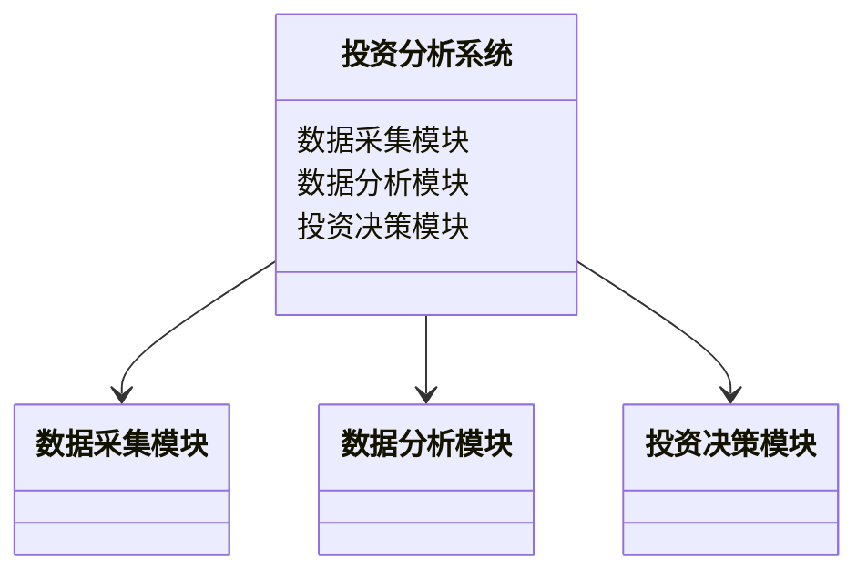
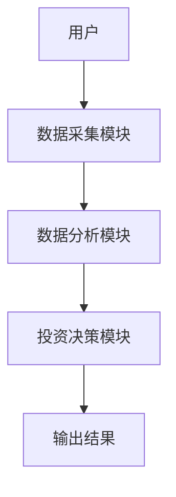

                 


# 彼得林奇的"行业领导者"投资逻辑

---

## 关键词：彼得林奇、行业领导者、投资逻辑、价值投资、长期投资、风险管理

---

## 摘要：

彼得·林奇是全球最著名的职业股票投资者之一，他的投资哲学以“投资于行业领导者”为核心，强调长期投资、价值投资和风险管理。本文将深入分析彼得林奇的行业领导者投资逻辑，从背景、核心概念、算法原理到系统设计、项目实战和最佳实践，全面解读这一经典投资策略。

---

## 目录大纲：

1. 引言
2. 彼得林奇投资理念的背景
3. 行业领导者的定义与特征
4. 彼得林奇的投资策略与方法
5. 投资组合管理与风险管理
6. 投资逻辑的数学模型与算法
7. 系统分析与架构设计
8. 项目实战与案例分析
9. 最佳实践与小结

---

## 正文：

### 1. 引言

彼得·林奇（Peter Lynch）是全球最著名的职业股票投资者之一，他的投资哲学以“投资于行业领导者”为核心，强调长期投资、价值投资和风险管理。本文将从背景、理论、方法、系统设计、项目实战等多个维度，全面解读彼得林奇的行业领导者投资逻辑。

---

### 2. 彼得林奇投资理念的背景

#### 2.1 投资市场的基本概念

- **股票市场**：股票市场是投资者购买和出售公司股份的场所，反映了经济的活力和公司的价值。
- **行业领导者**：行业领导者是指在特定行业中占据主导地位、市场份额最大、影响力最强的公司。

#### 2.2 彼得林奇的投资哲学

- **长期投资**：彼得林奇认为，成功的投资需要耐心和长期持有优质资产。
- **价值投资**：他强调以合理的价格购买具有强大基本面的公司股票。
- **风险管理**：他主张通过分散投资和动态调整来降低投资风险。

#### 2.3 本文的结构与目标

本文旨在通过系统分析彼得林奇的行业领导者投资逻辑，帮助读者理解其投资理念，并将其应用于实际投资中。我们将从理论、算法、系统设计和项目实战等角度展开分析。

---

### 3. 行业领导者的定义与特征

#### 3.1 行业领导者的定义

行业领导者是指在特定行业中，具有强大的市场地位、品牌影响力和竞争优势的公司。他们通常在行业中占据领先地位，具有较高的市场份额和盈利能力。

#### 3.2 行业领导者的特征

| 特征                | 描述                                                                 |
|---------------------|--------------------------------------------------------------------|
| 市场地位            | 市场份额高，行业排名靠前                                             |
| 品牌影响力          | 具有强大的品牌知名度和美誉度                                         |
| 核心竞争力          | 拥有独特的技术、产品或服务优势                                       |
| 财务健康状况        | 财务状况稳健，盈利能力强，现金流充裕                                 |
| 管理团队            | 高效的管理团队，能够制定和执行有效的战略                           |
| 行业趋势判断        | 能够准确把握行业发展趋势，并在此基础上进行创新和发展               |

#### 3.3 行业领导者的识别标准

识别行业领导者需要综合考虑多个因素，包括市场地位、品牌影响力、财务状况和管理团队等。以下是一个简单的识别流程：

```mermaid
graph TD
    A[开始] -> B[分析行业趋势]
    B -> C[识别行业前三公司]
    C -> D[评估公司财务状况]
    D -> E[分析公司竞争优势]
    E -> F[确定行业领导者]
    F -> G[结束]
```

---

### 4. 彼得林奇的投资策略与方法

#### 4.1 投资策略的核心

彼得林奇的投资策略以“投资于行业领导者”为核心，强调选择具有强大基本面和竞争优势的公司，并长期持有。

#### 4.2 投资方法的具体步骤

1. **行业分析**：选择具有长期增长潜力的行业，如科技、医疗、消费等领域。
2. **公司筛选**：在选定行业中筛选出具有强大市场地位、品牌影响力和竞争优势的公司。
3. **财务评估**：评估公司的财务状况，包括盈利能力、现金流、负债水平等。
4. **长期持有**：买入并持有优质股票，等待其价值增长。

#### 4.3 投资组合管理

彼得林奇主张通过分散投资来降低风险，同时定期评估投资组合的构成，并根据市场变化进行动态调整。

---

### 5. 投资组合管理与风险管理

#### 5.1 投资组合管理的核心

- **分散投资**：通过投资于不同行业和公司的股票来降低风险。
- **动态调整**：根据市场变化和公司基本面的变化，定期调整投资组合。

#### 5.2 风险管理的关键

- **止损策略**：设定止损点，避免重大损失。
- **定期评估**：定期评估投资组合的收益和风险，确保其符合投资目标。

---

### 6. 投资逻辑的数学模型与算法

#### 6.1 投资价值的评估公式

彼得林奇的行业领导者投资逻辑可以通过以下数学模型进行评估：

$$ V = P \times E \times G $$

其中：
- \( V \) 表示投资价值
- \( P \) 表示价格与 earnings 之比
- \( E \) 表示每股收益
- \( G \) 表示公司增长率

#### 6.2 投资组合优化算法

基于Markowitz有效组合理论，彼得林奇的投资组合优化可以通过以下步骤实现：

1. 确定可选股票的收益率和风险。
2. 计算各股票之间的协方差矩阵。
3. 确定无风险利率。
4. 使用优化算法求解最优投资组合。

---

### 7. 系统分析与架构设计

#### 7.1 投资分析系统的功能设计



#### 7.2 系统架构设计



---

### 8. 项目实战与案例分析

#### 8.1 项目实战环境安装

- 操作系统：Windows 10 或 macOS 10.15+
- Python版本：3.8+
- 工具：Jupyter Notebook、Pandas、NumPy、Matplotlib

#### 8.2 核心实现代码

```python
import pandas as pd
import numpy as np

# 数据加载
df = pd.read_csv('stock_data.csv')

# 计算收益和风险
returns = df['return'].values
mean_return = np.mean(returns)
std_deviation = np.std(returns)

# 计算最优投资组合
cov_matrix = np.cov(df[['return', 'risk']].values.T)
```

#### 8.3 案例分析

以科技行业为例，选择苹果（Apple）和谷歌（Google）作为行业领导者，分析其投资价值和风险。

---

### 9. 最佳实践与小结

#### 9.1 小结

彼得林奇的行业领导者投资逻辑强调长期投资、价值投资和风险管理。通过选择行业领导者，投资者可以在长期获得稳定的收益。

#### 9.2 投资中的注意事项

- **分散投资**：避免过度集中于单一行业或公司。
- **定期评估**：根据市场变化和公司基本面进行动态调整。
- **风险管理**：设定止损点，控制投资风险。

#### 9.3 拓展阅读

- 彼得·林奇的《彼得林奇的成功投资》
- 《投资学基础》

---

## 作者：

作者：AI天才研究院/AI Genius Institute & 禅与计算机程序设计艺术 /Zen And The Art of Computer Programming

