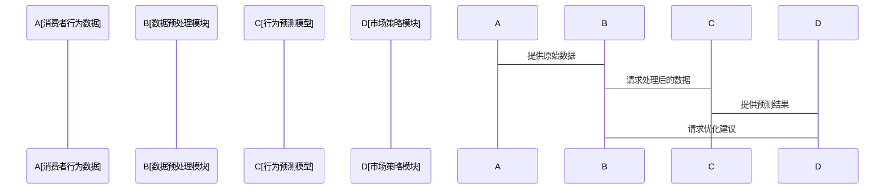

                 


# 彼得林奇的"街头智慧"在消费者行为分析中的应用

## 关键词
彼得林奇, 街头智慧, 消费者行为分析, 投资策略, 市场洞察, 数据分析, 行为预测

## 摘要
本文探讨了彼得·林奇的“街头智慧”在消费者行为分析中的应用，结合定量分析与定性观察，提供系统的分析框架。通过数学模型、算法实现和实际案例，展示了如何将街头智慧应用于消费者行为预测和市场策略制定，为企业提供新的洞察。

---

## 第一部分: 背景介绍

### 第1章: 彼得林奇的"街头智慧"概述

#### 1.1 彼得林奇的"街头智慧"简介
彼得·林奇是著名的基金经理，其“街头智慧”理念强调普通人也能通过观察和直觉做出明智决策。街头智慧的核心在于关注细节，捕捉市场趋势，强调简单问题复杂化与复杂问题简单化的平衡。

#### 1.2 街头智慧与消费者行为分析的结合
消费者行为分析旨在理解消费者决策过程，涉及动机、能力、触发和反馈。街头智慧通过观察和直觉提供独特的视角，帮助企业在复杂市场中制定有效策略。

---

## 第二部分: 核心概念与原理

### 第2章: 街头智慧的核心原理与消费者行为分析框架

#### 2.1 街头智慧的核心原理
- 观察与直觉的结合：通过细致观察市场和消费者行为，捕捉潜在趋势。
- 简单与复杂的平衡：将复杂问题简化，抓住关键因素。

#### 2.2 消费者行为分析框架
- 动机：消费者购买的内在驱动力。
- 能力：消费者实现购买目标的能力。
- 触发：引发购买行为的触发点。
- 反馈：消费者对购买结果的满意度。

---

## 第三部分: 算法原理

### 第3章: 街头智慧在消费者行为分析中的算法实现

#### 3.1 数学模型与公式
- 需求函数：$$ Q = aP^{-b} $$
- 消费者选择模型：$$ U = \sum \lambda_i X_i $$

#### 3.2 算法实现
使用Python代码实现需求预测：
```python
import numpy as np
import matplotlib.pyplot as plt

# 数据准备
prices = np.array([10, 20, 30, 40, 50])
quantity = np.array([100, 80, 60, 40, 20])

# 模型训练
def demand_model(prices, quantity):
    params = np.polyfit(prices, quantity, 1)
    return params

params = demand_model(prices, quantity)
a, b = params[0], -params[1]

# 可视化
plt.plot(prices, quantity, 'o')
plt.plot(prices, a + b*prices)
plt.xlabel('Price')
plt.ylabel('Quantity')
plt.show()
```

---

## 第四部分: 系统分析与架构设计

### 第4章: 系统分析与架构设计

#### 4.1 问题场景介绍
消费者行为分析系统需解决数据收集、行为预测和策略制定问题。

#### 4.2 系统功能设计
- 数据采集：收集消费者行为数据。
- 数据分析：应用数学模型进行预测。
- 策略制定：基于分析结果制定市场策略。

#### 4.3 系统架构图


#### 4.4 接口设计与交互图


---

## 第五部分: 项目实战

### 第5章: 项目实战

#### 5.1 环境安装
安装必要的Python库：numpy、pandas、scikit-learn、matplotlib。

#### 5.2 核心代码实现
实现需求预测模型：
```python
from sklearn.linear_model import LinearRegression
import pandas as pd

# 数据加载
data = pd.DataFrame({
    'Price': [10, 20, 30, 40, 50],
    'Quantity': [100, 80, 60, 40, 20]
})

# 模型训练
model = LinearRegression()
model.fit(data[['Price']], data['Quantity'])

# 预测
predicted = model.predict(data[['Price']])
print(predicted)
```

#### 5.3 案例分析
以电子产品市场为例，分析消费者价格敏感性和购买意愿，优化定价策略。

#### 5.4 项目总结
通过实战项目，验证了街头智慧在消费者行为分析中的有效性，为企业制定数据驱动的市场策略提供支持。

---

## 第六部分: 最佳实践与总结

### 第6章: 最佳实践与总结

#### 6.1 总结
彼得林奇的街头智慧结合消费者行为分析，提供了独特的方法论，帮助企业洞察市场趋势。

#### 6.2 应用建议
- 结合定性和定量分析。
- 持续优化模型和策略。

#### 6.3 未来展望
随着大数据和AI的发展，街头智慧的应用将更加广泛和精准。

---

## 作者
作者：AI天才研究院/AI Genius Institute  
联系邮箱：[contact@aicourse.com](mailto:contact@aicourse.com)  
个人网站：[www.aicourse.com](http://www.aicourse.com)

---

通过以上结构，文章详细探讨了彼得林奇的街头智慧在消费者行为分析中的应用，结合理论与实践，为企业提供有效的分析框架和策略制定方法。

