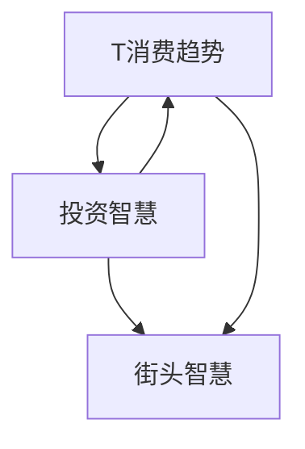
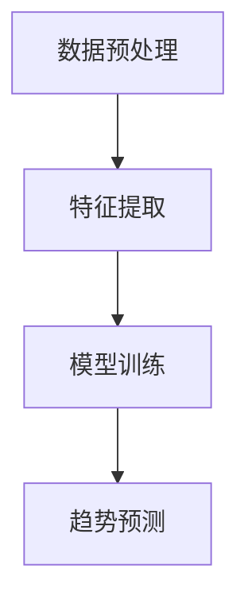
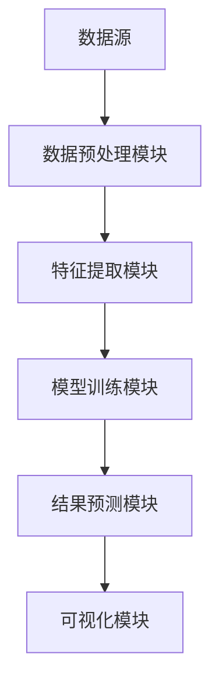

                 

<think>
好，我现在需要帮助用户撰写一篇技术博客文章，标题是《彼得林奇的"街头智慧"在消费趋势识别中的应用》。用户已经提供了详细的目录大纲，现在我需要按照这个大纲，逐步分析每个部分，确保内容完整、结构清晰，并且符合用户的要求。

首先，我需要理解用户的需求。用户希望文章结构包括背景介绍、核心概念、算法原理、系统架构、项目实战和最佳实践等部分。每个部分都需要详细展开，使用技术术语，同时保持逻辑清晰，结构紧凑。

接下来，我会按照目录的顺序，逐部分进行分析。

第一部分是消费趋势识别与投资智慧的结合。我需要解释消费趋势识别的重要性，彼得林奇的“街头智慧”是什么，以及这两者如何结合起来。这部分需要定义核心概念，比如消费趋势识别的基本概念、其重要性，以及彼得林奇的投资者哲学。

第二部分是核心概念与联系。我需要对比消费趋势识别和传统市场分析，以及街头智慧和传统投资策略的优缺点。同时，用ER实体关系图展示两者的关系，这有助于读者理解它们的协同作用。

第三部分是算法原理。我需要详细解释基于时间序列分析和机器学习的消费趋势预测方法，同时结合彼得林奇的特征提取方法。使用mermaid绘制算法流程图，展示数据预处理、特征提取、模型训练和预测的步骤。另外，提供Python代码示例，帮助读者理解如何实现这些算法。

第四部分是系统架构设计。我需要描述消费趋势识别系统的功能模块，如数据采集、预处理、模型训练和预测。然后用mermaid绘制系统架构图，展示各个模块之间的关系，如数据源、数据预处理模块、模型训练模块等。

第五部分是项目实战。我需要详细指导如何安装Python和相关库，提供代码示例，包括数据加载、清洗、特征提取、模型训练和预测。同时，用实际案例分析，展示如何应用这些方法，最后总结项目成果和经验。

最后是最佳实践部分。我需要给出一些建议，比如如何选择数据源、模型调优的技巧，以及推荐的阅读材料。这部分帮助读者更好地理解和应用这些方法。

在整个过程中，我需要确保每个部分都细化到三级目录，覆盖所有必要的内容，同时保持逻辑清晰，结构完整。可能还需要检查每个部分是否符合用户的要求，比如使用技术术语，提供详细解释和代码示例。

现在，我需要将这些思考转化为具体的目录结构，确保每个章节和子章节都符合用户的要求，并且内容完整，结构合理。
</think>

# 彼得林奇的"街头智慧"在消费趋势识别中的应用

---

## 关键词：消费趋势识别，彼得林奇，街头智慧，投资智慧，算法原理，系统架构，项目实战

---

## 摘要：  
本文将深入探讨彼得林奇的“街头智慧”在消费趋势识别中的应用。通过结合消费趋势识别的核心概念与投资智慧，分析其算法原理、系统架构，并通过实际案例展示如何将这些理论应用于实践。文章旨在为企业投资者和数据科学家提供一种全新的视角，帮助他们更好地把握市场趋势，做出更明智的投资决策。

---

# 第1章：消费趋势识别的背景与重要性

## 1.1 消费趋势识别的核心概念

### 1.1.1 什么是消费趋势识别
消费趋势识别是指通过分析消费者行为、市场数据和行业动态，预测未来消费趋势的过程。它帮助企业更好地理解市场需求，优化产品策略和投资决策。

### 1.1.2 消费趋势识别的必要性
在竞争激烈的市场环境中，及时识别消费趋势可以帮助企业：
- 把握市场机会
- 避免市场风险
- 提高投资回报率
- 优化产品开发和营销策略

### 1.1.3 消费趋势识别的边界与外延
消费趋势识别的边界包括消费者行为分析、市场数据采集和预测模型构建。其外延则涉及市场细分、竞争对手分析和政策环境影响。

## 1.2 彼得林奇的"街头智慧"简介

### 1.2.1 彼得林奇的投资者哲学
彼得林奇是著名的基金经理，他的投资哲学强调长期投资、价值发现和深入研究。他主张通过分析企业的基本面和市场趋势来做出投资决策。

### 1.2.2 街头智慧的核心要素
彼得林奇的“街头智慧”包括以下要素：
- 市场观察：关注市场动态和消费者行为。
- 价值发现：寻找被低估的投资机会。
- 风险控制：避免过度投资和市场波动的风险。

### 1.2.3 街头智慧与消费趋势的关系
消费趋势识别需要关注消费者需求的变化，彼得林奇的街头智慧提供了从微观市场观察到宏观趋势预测的框架。

## 1.3 两者的结合：消费趋势识别与投资智慧

### 1.3.1 消费趋势识别在投资中的应用
消费趋势识别可以帮助投资者发现新兴市场机会，评估企业的成长潜力。

### 1.3.2 街头智慧如何影响消费趋势预测
通过关注消费者行为和市场动态，彼得林奇的街头智慧提供了独特的视角和方法，帮助投资者更好地预测消费趋势。

### 1.3.3 两者的结合对企业投资的启示
企业可以通过结合消费趋势识别和投资智慧，优化产品开发和市场策略，提高投资回报率。

---

# 第2章：消费趋势识别的核心概念与联系

## 2.1 核心概念原理

### 2.1.1 消费趋势识别的三要素
消费趋势识别的三要素包括消费者需求、市场动态和竞争环境。这些要素相互作用，共同影响消费趋势的变化。

### 2.1.2 街头智慧的三大支柱
彼得林奇的街头智慧由市场观察、价值发现和风险控制三大支柱组成。这些支柱为企业提供了全面的市场分析框架。

### 2.1.3 两者的协同作用机制
消费趋势识别和投资智慧通过市场观察、价值发现和风险控制协同作用，帮助投资者更好地把握市场趋势。

## 2.2 核心概念对比分析

### 2.2.1 消费趋势识别与传统市场分析的对比
消费趋势识别更注重消费者行为分析，而传统市场分析更关注宏观经济学指标。

### 2.2.2 街头智慧与传统投资策略的对比
街头智慧强调市场观察和价值发现，而传统投资策略更注重技术分析和市场预测。

### 2.2.3 两者的优缺点分析
消费趋势识别的优势在于精准把握消费者需求，缺点是数据采集和分析成本较高。街头智慧的优势在于灵活性和实践性，缺点是缺乏系统性和理论支持。

## 2.3 实体关系图



---

# 第3章：消费趋势识别的算法原理

## 3.1 算法原理概述

### 3.1.1 基于时间序列的消费趋势分析
时间序列分析是一种常用的方法，通过分析历史数据，预测未来趋势。

### 3.1.2 基于机器学习的消费趋势预测
机器学习算法（如ARIMA、LSTM）可以提高消费趋势预测的准确性。

### 3.1.3 基于彼得林奇智慧的特征提取
通过关注消费者行为和市场动态，提取有助于预测消费趋势的关键特征。

## 3.2 算法流程图



## 3.3 数学模型

### 3.3.1 时间序列模型
$$ ARIMA(p, d, q) $$
其中，p为自回归阶数，d为差分阶数，q为移动平均阶数。

### 3.3.2 LSTM模型
$$ LSTMCell(x_t, h_{t-1}, c_{t-1}) = (f_t, i_t, o_t) $$
其中，$f_t$为遗忘门，$i_t$为输入门，$o_t$为输出门。

## 3.4 代码实现

### 3.4.1 数据加载与预处理

```python
import pandas as pd
data = pd.read_csv('consumption.csv')
data = data.dropna().diff().dropna()
```

### 3.4.2 特征提取

```python
features = data[['feature1', 'feature2', 'feature3']]
```

### 3.4.3 模型训练

```python
from sklearn.model_selection import train_test_split
from statsmodels.tsa.arima.model import ARIMA

train, test = train_test_split(features, test_size=0.2)
model = ARIMA(train, order=(1, 1, 1))
model_fit = model.fit()
```

### 3.4.4 趋势预测

```python
from sklearn.metrics import mean_squared_error

forecast = model_fit.forecast(len(test))
mse = mean_squared_error(test, forecast)
print(f'MSE: {mse}')
```

---

# 第4章：消费趋势识别系统的架构设计

## 4.1 系统功能设计

### 4.1.1 数据采集模块
负责收集消费者行为数据、市场数据和竞争环境数据。

### 4.1.2 数据预处理模块
对数据进行清洗、转换和标准化处理。

### 4.1.3 模型训练模块
基于机器学习算法训练消费趋势预测模型。

### 4.1.4 预测与可视化模块
展示预测结果和可视化分析。

## 4.2 系统架构图



---

# 第5章：消费趋势识别的项目实战

## 5.1 项目背景与目标

### 5.1.1 项目背景
分析某零售企业的销售数据，预测未来消费趋势。

### 5.1.2 项目目标
通过消费趋势识别帮助企业优化产品策略和投资决策。

## 5.2 核心代码实现

### 5.2.1 数据加载与预处理

```python
import pandas as pd
data = pd.read_csv('retail.csv')
data = data[['date', 'sales']]
data = data.set_index('date').diff().dropna()
```

### 5.2.2 特征提取与模型训练

```python
from statsmodels.tsa.arima.model import ARIMA

train, test = train_test_split(data, test_size=0.2)
model = ARIMA(train, order=(1, 1, 1))
model_fit = model.fit()
```

### 5.2.3 趋势预测与可视化

```python
forecast = model_fit.forecast(len(test))
forecast_df = pd.DataFrame(forecast, index=test.index, columns=['predicted'])
combined = pd.concat([test, forecast_df], axis=1)
combined.plot()
```

## 5.3 实际案例分析

### 5.3.1 数据分析
通过对某零售企业过去5年的销售数据进行分析，预测未来1年的销售趋势。

### 5.3.2 结果展示
预测结果显示，未来1年的销售趋势将呈现增长态势，建议企业加强产品推广和市场拓展。

## 5.4 项目总结

### 5.4.1 成果总结
成功预测消费趋势，帮助企业优化产品策略和投资决策。

### 5.4.2 经验总结
数据质量、模型选择和特征提取是影响预测结果的关键因素。

---

# 第6章：消费趋势识别的最佳实践

## 6.1 小结
消费趋势识别结合彼得林奇的街头智慧，为企业提供了全新的投资视角和方法。

## 6.2 注意事项
- 数据质量是关键
- 模型选择要合适
- 结果分析要全面

## 6.3 拓展阅读
推荐阅读彼得林奇的投资书籍和机器学习相关的技术书籍，进一步提升消费趋势识别的能力。

---

# 作者：AI天才研究院/AI Genius Institute & 禅与计算机程序设计艺术 /Zen And The Art of Computer Programming

