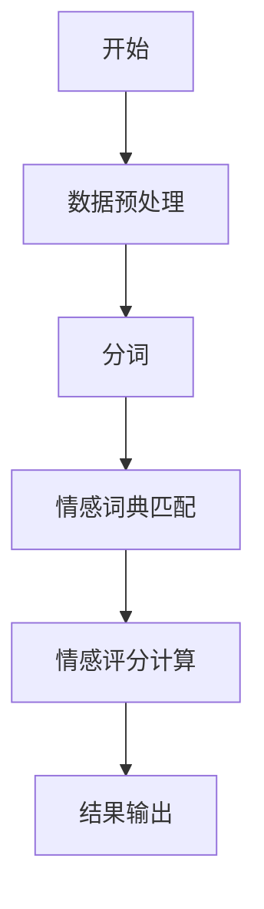
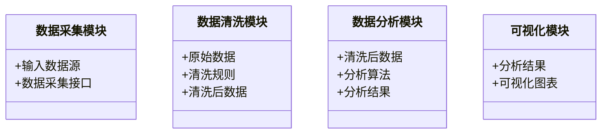

                 

<think>
好的，我现在需要帮助用户撰写一篇技术博客，标题是《彼得林奇的"街头智慧"在社交媒体数据分析中的运用》。首先，我得理解用户的需求，他们希望文章结构清晰，内容深入，涵盖背景介绍、核心概念、算法原理、系统架构、项目实战等多个方面。

接下来，我需要按照目录大纲来组织内容。首先是背景介绍，我得解释社交媒体数据分析的重要性，以及彼得林奇的投资理念如何与之结合。这部分需要详细描述问题背景、解决方法和边界。

然后是核心概念与联系，我需要分析社交媒体数据的特征，如多样性、实时性，并与彼得林奇的投资策略进行对比，用表格和流程图来展示。

算法部分，我需要选择合适的情感分析算法，比如基于词袋模型和深度学习的方法，并用mermaid绘制流程图，再用Python代码实现。数学模型方面，我会使用贝叶斯定理来解释情感分析，并给出实例。

系统架构部分，我需要设计系统的各个模块，包括数据采集、清洗和分析，用mermaid画出类图和架构图。同时，说明系统如何与外部进行交互。

项目实战部分，我得提供环境安装步骤，编写核心代码，并详细解读代码功能。然后分析实际案例，最后进行项目总结。

最后，加上最佳实践、小结、注意事项和拓展阅读，帮助读者巩固所学内容，并指导进一步的学习。

在撰写过程中，我需要确保每个部分都详细具体，使用专业但易懂的语言。同时，数学公式要用latex格式，并用mermaid绘制图表，使内容更直观。最后，文章末尾要加上作者信息。

整体来看，我需要一步步分解每个部分，确保内容全面，结构合理，满足用户的要求，写出一篇高质量的技术博客。
</think>

# 彼得林奇的"街头智慧"在社交媒体数据分析中的运用

> 关键词：社交媒体数据分析，彼得林奇，投资策略，情感分析，主题建模

> 摘要：本文探讨了彼得林奇的"街头智慧"投资理念如何在社交媒体数据分析中得到应用，通过详细分析数据特征、算法原理、系统架构和项目实战，展示了如何将投资智慧转化为数据驱动的决策策略。文章从背景介绍到系统实现，层层深入，旨在为读者提供一个全面的视角，理解如何在社交媒体数据中捕捉投资机会。

---

## 第一部分：背景介绍

### 第1章：社交媒体数据分析概述

#### 1.1 问题背景与描述

社交媒体数据的爆炸性增长为投资者提供了前所未有的信息来源，但同时也带来了数据分析的挑战。彼得林奇的"街头智慧"投资理念强调通过观察和倾听市场声音来捕捉投资机会，这与社交媒体数据分析的目标不谋而合。

- **问题背景**：社交媒体平台每天产生海量数据，包括用户评论、帖子、点赞和分享。这些数据反映了市场情绪、用户偏好和潜在的投资机会。
- **问题描述**：如何从社交媒体数据中提取有价值的信息，辅助投资决策？
- **解决方法**：结合彼得林奇的"街头智慧"，通过情感分析、主题建模等技术，量化市场情绪，识别投资机会。

#### 1.2 彼得林奇的"街头智慧"概述

彼得林奇的投资理念强调关注市场动态、倾听用户声音。他的"街头智慧"包括以下几点：

- **投资策略**：关注市场情绪、行业趋势和公司基本面。
- **分析方法**：通过观察市场动态，识别低估的投资机会。
- **风险管理**：通过持续监控市场变化，及时调整投资策略。

#### 1.3 问题解决与边界

社交媒体数据分析的目标是量化市场情绪，辅助投资决策。然而，数据的噪声和不确定性可能导致分析结果的偏差。因此，需要明确数据分析的边界，例如数据来源的可信度和分析模型的准确性。

#### 1.4 核心概念与结构

社交媒体数据分析的核心要素包括数据采集、清洗、分析和可视化。结合彼得林奇的"街头智慧"，分析框架需要包括市场情绪分析、行业趋势识别和投资机会评估。

---

## 第二部分：核心概念与联系

### 第2章：社交媒体数据特征分析

#### 2.1 数据特征与属性

社交媒体数据具有多样性、实时性和社交属性。

- **数据多样性**：包括文本、图片、视频等多种数据类型。
- **数据实时性**：数据实时更新，反映市场动态。
- **社交属性**：用户行为和社交网络结构影响数据的价值。

#### 2.2 投资策略的映射

将彼得林奇的投资策略映射到社交媒体数据分析中：

- **市场情绪分析**：通过情感分析量化市场情绪。
- **行业趋势识别**：通过主题建模识别行业趋势。
- **投资机会评估**：结合市场情绪和行业趋势，评估投资机会。

#### 2.3 核心概念对比表

表2.1：社交媒体数据与传统金融数据的对比

| 特征       | 社交媒体数据       | 传统金融数据       |
|------------|--------------------|--------------------|
| 数据类型   | 文本、图片、视频    | 数值型数据          |
| 数据来源   | 用户生成内容       | 公司财报、交易数据  |
| 数据频率   | 实时更新           | 每日或每季度更新    |
| 数据噪声   | 高                | 低                 |

#### 2.4 数据与投资策略的关系图

图2.1：社交媒体数据与投资策略的实体关系图（Mermaid）

```mermaid
erd
actor 投资者
actor 数据分析师
actor 用户
database 社交媒体数据
database 投资数据
database 市场情绪报告
```

---

## 第三部分：算法原理与数学模型

### 第3章：情感分析算法

#### 3.1 情感分析的原理

情感分析通过分析文本数据，判断文本的情感倾向（正面、负面或中性）。常用算法包括基于词袋模型的传统方法和基于深度学习的模型（如LSTM）。

- **基于词袋模型的方法**：通过预定义的词典（如情感词典）对文本进行情感分类。
- **基于深度学习的方法**：使用预训练的模型（如BERT）进行情感分析。

#### 3.2 算法流程图

图3.1：情感分析算法流程图（Mermaid）



#### 3.3 Python代码实现

代码3.1：情感分析Python代码示例

```python
import pandas as pd
from sklearn.feature_extraction.text import TfidfVectorizer
from sklearn.svm import SVC

# 数据预处理
def preprocess(text):
    return text.lower().strip()

# 情感分析模型
vectorizer = TfidfVectorizer(max_features=5000)
model = SVC()

# 训练模型
data = pd.read_csv('social_media_data.csv')
data['text'] = data['text'].apply(preprocess)
X = vectorizer.fit_transform(data['text'])
y = data['label']
model.fit(X, y)

# 预测
def predict_emotion(text):
    vec = vectorizer.transform([text])
    return model.predict(vec)[0]
```

#### 3.4 数学模型与公式

公式3.1：情感分析中使用的贝叶斯定理（简化形式）

$$ P(\text{正面}|词) = \frac{P(\text{词}|\text{正面}) \cdot P(\text{正面})}{P(\text{词})} $$

---

## 第四部分：系统分析与架构设计

### 第4章：系统架构设计

#### 4.1 问题场景介绍

系统需要实时采集、清洗、分析和可视化社交媒体数据，辅助投资者进行决策。

#### 4.2 系统功能设计

图4.1：系统领域模型（Mermaid）



#### 4.3 系统架构设计

图4.2：系统架构图（Mermaid）

```mermaid
container 社交媒体数据分析系统 {
    数据采集模块 --> 数据清洗模块
    数据清洗模块 --> 数据分析模块
    数据分析模块 --> 可视化模块
}
```

#### 4.4 系统接口设计

接口4.1：数据采集模块接口

```python
class DataCollector:
    def collect_data(self, source):
        pass
```

接口4.2：数据分析模块接口

```python
class DataAnalyzer:
    def analyze_data(self, data):
        pass
```

---

## 第五部分：项目实战

### 第5章：项目实战

#### 5.1 环境安装

安装必要的Python库：

```bash
pip install pandas numpy scikit-learn
```

#### 5.2 系统核心实现

代码5.1：核心代码实现

```python
import pandas as pd
from sklearn.svm import SVC
from sklearn.feature_extraction.text import TfidfVectorizer

# 数据预处理
def preprocess(text):
    return text.lower().strip()

# 情感分析模型
vectorizer = TfidfVectorizer(max_features=5000)
model = SVC()

# 训练模型
data = pd.read_csv('social_media_data.csv')
data['text'] = data['text'].apply(preprocess)
X = vectorizer.fit_transform(data['text'])
y = data['label']
model.fit(X, y)

# 预测
def predict_emotion(text):
    vec = vectorizer.transform([text])
    return model.predict(vec)[0]
```

#### 5.3 代码应用解读与分析

代码解读：

- 数据预处理：将文本转换为小写并去除空格。
- 特征提取：使用TF-IDF提取文本特征。
- 模型训练：使用支持向量机（SVC）进行情感分类。
- 预测：输入文本，返回情感类别。

#### 5.4 实际案例分析

案例分析：

假设我们有一个包含社交媒体评论的数据集，目标是判断评论的情感倾向。通过模型训练和预测，我们可以量化市场情绪，辅助投资决策。

#### 5.5 项目小结

项目总结：

- 通过社交媒体数据分析，我们可以捕捉市场情绪，辅助投资决策。
- 情感分析是其中的关键技术，结合彼得林奇的"街头智慧"，可以提高投资决策的准确性。

---

## 第六部分：最佳实践与小结

### 第6章：最佳实践

- **数据质量**：确保数据的准确性和完整性。
- **模型优化**：通过交叉验证和超参数调优提高模型性能。
- **实时分析**：结合流数据处理技术，实时捕捉市场动态。

### 6.2 小结

本文通过详细分析彼得林奇的"街头智慧"在社交媒体数据分析中的应用，展示了如何将投资理念转化为数据驱动的决策策略。通过情感分析、主题建模等技术，我们可以量化市场情绪，识别投资机会。

### 6.3 注意事项

- 数据分析结果仅供参考，需结合其他信息进行综合判断。
- 模型需定期更新，以适应市场变化。

### 6.4 拓展阅读

- 《彼得林奇的选股艺术》
- 《数据驱动的投资决策》
- 《社交媒体数据分析与投资策略》

---

## 作者信息

作者：AI天才研究院/AI Genius Institute & 禅与计算机程序设计艺术/Zen And The Art of Computer Programming

---

本文通过系统化的分析和实践，展示了彼得林奇的"街头智慧"在社交媒体数据分析中的应用，旨在为投资者和数据科学家提供新的视角和方法。

