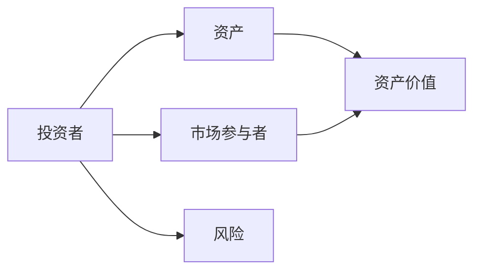
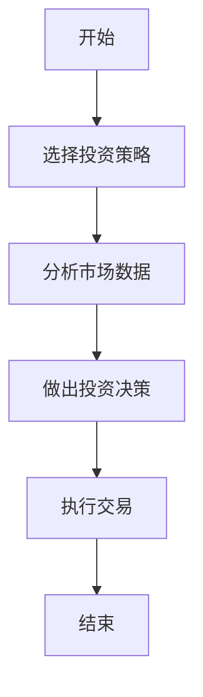

                 

<think>
嗯，用户希望我以《彼得林奇的"街头智慧"投资技巧》为标题，撰写一篇结构紧凑、逻辑清晰的技术博客。首先，我需要理解用户的具体要求。他们希望文章分为多个部分，包括背景介绍、核心概念、算法原理等，并且每个部分都要有详细的结构，甚至包括流程图和代码示例。

我意识到用户可能是一位对投资和技术分析感兴趣的技术人员或投资者，他们希望将彼得林奇的经验与技术方法结合起来。因此，我需要确保文章不仅介绍投资策略，还要展示如何用技术手段辅助这些策略。

接下来，我开始规划文章结构。首先是摘要，简明扼要地概括彼得林奇的投资理念和文章的主要内容。然后是关键词，确保搜索友好。在目录部分，我需要涵盖投资基本概念、林奇的投资策略、算法原理、系统设计、实战项目和最佳实践等部分。

在写作过程中，我可能会遇到如何将传统投资策略与现代技术方法结合的问题。例如，如何用Python代码实现林奇的分析方法，或者如何构建一个投资决策支持系统。为了解决这些，我需要详细解释每个步骤，并提供实际的代码示例和图表。

我还需要考虑读者的理解水平，确保技术术语和投资概念都解释清楚，避免过于晦涩。同时，使用图表和代码示例可以增强文章的可读性和实用性。

最后，我会检查整个结构，确保每个部分都符合用户的要求，内容详实且逻辑连贯。这样，读者不仅能理解彼得林奇的“街头智慧”，还能学习如何将这些理念应用到实际的投资分析中。
</think>

# 彼得林奇的"街头智慧"投资技巧

## 关键词：投资技巧，彼得林奇，街头智慧，投资策略，风险管理

## 摘要：彼得·林奇作为世界著名投资专家，他提出的"街头智慧"投资技巧是一种基于观察、分析和经验的投资方法。本文将从投资的基本概念、林奇的投资理念、"街头智慧"的核心要素、投资算法的数学模型、系统架构设计以及项目实战等方面，全面解析这一投资技巧，并结合实际案例，详细阐述如何在实际投资中应用这些策略。

---

## 第1章：投资的基本概念与背景

### 1.1 投资的基本定义

#### 1.1.1 投资的定义与分类
投资是指将资金投入到某个项目或资产中，以期望在未来获得超过初始投入的收益。根据投资对象的不同，可以将投资分为股票、债券、房地产等多种类型。

#### 1.1.2 投资的基本原则
投资的基本原则包括分散投资、长期持有、价值投资等。这些原则旨在降低风险并最大化收益。

#### 1.1.3 投资与投机的区别
投资是基于对资产长期价值的判断，而投机则是基于短期价格波动的预测。两者的核心区别在于时间和风险的承担程度。

### 1.2 彼得·林奇的生平简介

#### 1.2.1 彼得·林奇的早期经历
彼得·林奇出生于美国马萨诸塞州，毕业于宾夕法尼亚大学沃顿商学院。他的早期职业包括在富达投资公司工作，并逐渐崭露头角。

#### 1.2.2 林奇在富达投资的成就
林奇在富达投资担任基金经理期间，管理的基金取得了卓越的业绩，成为投资领域的传奇人物。

#### 1.2.3 林奇的投资哲学
林奇强调基本面分析和长期投资，认为市场的波动为投资者提供了低价买入优质资产的机会。

### 1.3 "街头智慧"的定义与核心要素

#### 1.3.1 "街头智慧"的定义
"街头智慧"是指通过观察市场参与者的实际行为和市场环境的变化，从而做出投资决策的一种方法。

#### 1.3.2 "街头智慧"的核心要素
包括对市场情绪的把握、对行业趋势的洞察以及对具体资产价值的评估。

#### 1.3.3 "街头智慧"与传统投资方法的区别
"街头智慧"更加注重实际操作和市场参与者的心理，而传统投资方法更依赖于数学模型和历史数据分析。

---

## 第2章：彼得·林奇的投资理念

### 2.1 林奇的"街头智慧"投资技巧

#### 2.1.1 基本面分析
林奇强调对上市公司基本面的深入研究，包括财务报表、行业地位、管理团队等因素。

#### 2.1.2 市场情绪分析
通过观察市场的参与者行为，林奇能够判断市场的过度反应或低估，从而找到投资机会。

#### 2.1.3 风险管理
林奇认为风险管理是投资成功的关键，通过分散投资和严格的风险控制来降低损失。

### 2.2 投资策略的对比与分析

#### 2.2.1 不同投资策略的对比
包括价值投资、成长投资、股息投资等策略的优缺点对比。

#### 2.2.2 不同市场环境下的投资策略
在牛市和熊市中，林奇的策略如何调整，如何应对市场的波动。

#### 2.2.3 不同投资者类型的投资策略
根据投资者的风险承受能力和投资目标，制定不同的投资策略。

---

## 第3章：投资的核心概念与联系

### 3.1 核心概念原理

#### 3.1.1 投资的核心要素
包括资产质量、市场流动性、经济周期等关键因素。

#### 3.1.2 投资决策的关键因素
投资者的财务状况、投资目标、风险偏好等。

#### 3.1.3 投资与经济周期的关系
经济周期对投资的影响，如何在不同周期中调整投资策略。

### 3.2 核心概念对比表格

#### 3.2.1 不同投资策略的对比
| 投资策略 | 优点 | 缺点 |
|----------|------|------|
| 价值投资 | 稳定收益 | 需要长期持有 |
| 成长投资 | 高增长潜力 | 风险较高 |

#### 3.2.2 不同市场环境下的投资策略对比
| 市场环境 | 策略选择 |
|----------|----------|
| 牛市     | 增加权益投资 |
| 熊市     | 增加防御性资产 |

#### 3.2.3 不同投资者类型的投资策略对比
| 投资者类型 | 投资策略 |
|------------|----------|
| 保守型     | 固定收益投资 |
| 激进型     | 高风险高收益投资 |

### 3.3 ER实体关系图



---

## 第4章：投资算法原理

### 4.1 投资算法的定义与分类

#### 4.1.1 基于基本面的算法
通过分析公司的财务数据来判断投资价值。

#### 4.1.2 基于技术分析的算法
通过分析历史价格和成交量来预测未来走势。

#### 4.1.3 基于情绪分析的算法
通过分析市场参与者的心理状态来判断市场走势。

### 4.2 投资算法的流程图



### 4.3 投资数学模型与公式

#### 4.3.1 投资回报率公式
$$ ROI = \frac{最终价值 - 初始价值}{初始价值} \times 100\% $$

#### 4.3.2 投资风险评估公式
$$ 风险 = 标准差 \times 标准差 $$

#### 4.3.3 投资组合优化公式
$$ max \sum_{i=1}^{n} w_i \times R_i - \lambda \sum_{i=1}^{n} w_i^2 \times V_i $$

---

## 第5章：系统分析与架构设计

### 5.1 投资决策支持系统的功能设计

#### 5.1.1 项目介绍
投资决策支持系统是一个基于彼得林奇的"街头智慧"理念，帮助投资者做出科学决策的系统。

#### 5.1.2 系统功能设计


#### 5.1.3 系统架构设计


---

## 第6章：项目实战

### 6.1 环境安装

#### 6.1.1 安装Python
安装Python 3.x版本，确保环境满足要求。

#### 6.1.2 安装必要的库
安装numpy、pandas、matplotlib等库。

### 6.2 核心代码实现

#### 6.2.1 基于基本面分析的代码

```python
import pandas as pd

def calculate_roe(company_financials):
    net_profit = company_financials['net_profit']
    equity = company_financials['equity']
    roe = net_profit / equity
    return roe
```

#### 6.2.2 基于技术分析的代码

```python
import matplotlib.pyplot as plt

def plot_stock_price(prices):
    plt.plot(prices)
    plt.xlabel('时间')
    plt.ylabel('价格')
    plt.title('股票价格走势')
    plt.show()
```

### 6.3 案例分析与解读

#### 6.3.1 案例分析
以某公司为例，分析其基本面和技术面，做出投资决策。

#### 6.3.2 实际操作步骤
从数据收集、分析到最终决策的完整流程。

---

## 第7章：最佳实践与小结

### 7.1 小结

彼得·林奇的"街头智慧"投资技巧是一种结合了基本面分析、市场情绪和风险管理的综合投资方法。通过实际案例和系统设计，我们可以更好地理解和应用这一策略。

### 7.2 注意事项

投资者在实际操作中需要注意市场波动、信息滞后以及自身风险承受能力等问题。

### 7.3 拓展阅读

建议读者阅读彼得·林奇的原著《彼得·林奇的选股术》以及相关的投资策略书籍。

---

## 作者：AI天才研究院 & 禅与计算机程序设计艺术

---

通过以上结构，您可以系统地学习和应用彼得·林奇的"街头智慧"投资技巧，结合技术方法和实际案例，做出更加科学和明智的投资决策。

