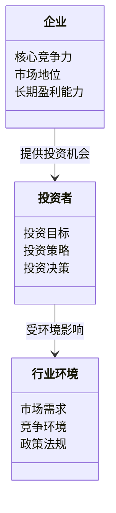
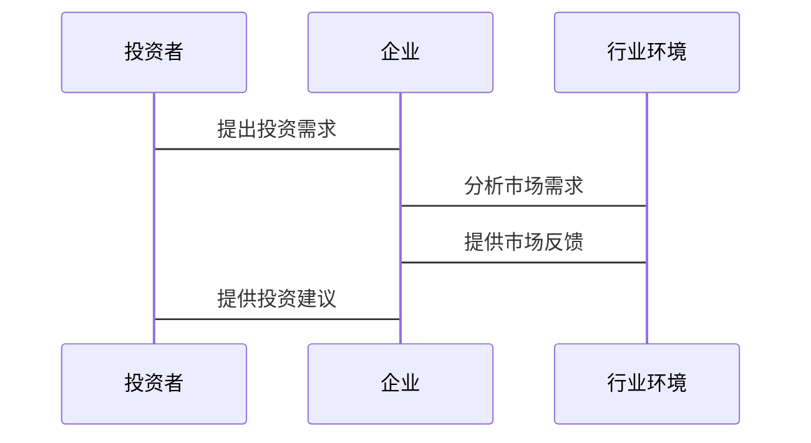

                 

<think>
好，我现在需要帮助用户撰写一篇关于《彼得林奇的"质量优先"在不同行业的应用》的技术博客文章。用户已经提供了一个详细的大纲，并希望我按照这个大纲来写文章。首先，我需要理解大纲的结构和各个部分的要求。

首先，文章标题是明确的，接下来是关键词和摘要。关键词应该是与质量优先、投资策略、行业应用相关的内容。摘要需要简明扼�地概括文章的核心内容，介绍彼得林奇的质量优先理念，并说明其在不同行业中的应用。

接下来是引言部分，介绍彼得林奇及其投资理念。这部分需要包括他的生平、质量优先的定义以及其在企业中的优势和挑战。然后是核心概念，解释质量优先的概念，包括定义、特征对比和ER实体关系图。

之后，将分行业讨论质量优先的应用，包括制造业、科技行业、金融服务业和医疗健康业。每个行业都需要分析其特点和应用，并详细讲解实施步骤。最后是案例分析、系统设计、项目实战和总结与展望。

在写作过程中，我需要确保每个部分都详细具体，包含背景介绍、核心概念、算法原理、数学公式、系统架构设计和项目实战等内容。同时，要使用markdown格式，插入Mermaid图表，如流程图、类图、架构图和序列图。数学公式需要用latex格式，并独立段落使用$$，内部使用$。

在写背景介绍时，我需要解释质量优先的术语，分析问题背景，描述问题并提出解决方案，明确边界和外延。核心概念部分要详细讲解原理，给出属性特征对比表格，并用ER实体关系图展示。

在项目实战部分，需要选择一个虚构的公司案例，展示质量优先策略的应用，包括环境配置、代码实现和结果分析。同时，要给出最佳实践、注意事项和扩展阅读建议。

在总结部分，回顾全书内容，强调质量优先的重要性，并展望未来的趋势。

现在，我需要确保每个章节的内容都符合这些要求，结构清晰，逻辑严密，语言简洁易懂。同时，要检查是否有遗漏的部分，确保每个小节都详细且具体。

最后，完成文章后，需要添加作者信息，即“作者：AI天才研究院 & 禅与计算机程序设计艺术”。

在整个过程中，我需要逐步分析每个部分，确保内容的连贯性和深度，同时遵循用户的格式和内容要求。这将帮助读者更好地理解和应用彼得林奇的质量优先理念。
</think>

# 彼得林奇的"质量优先"在不同行业的应用

## 关键词：彼得林奇，质量优先，投资策略，行业应用，企业价值

## 摘要：
本文将探讨彼得·林奇的“质量优先”投资理念在不同行业的应用。通过分析制造业、科技行业、金融服务业和医疗健康业的特点，本文详细阐述了质量优先策略的实施步骤，并结合实际案例进行深入分析。通过系统架构设计和项目实战，本文为读者提供了质量优先策略在企业中的具体应用方法，帮助企业在竞争激烈的市场中实现可持续发展。

---

## 第一部分：引言

### 第1章：彼得林奇的“质量优先”投资理念概述

#### 1.1 彼得林奇及其投资理念
##### 1.1.1 彼得林奇的生平简介
彼得·林奇（Peter Lynch）是美国著名的职业棒球运动员，以其卓越的投球技术和领导能力而闻名。他在棒球界的职业生涯中取得了许多成就，包括多次入选全明星赛和世界大赛冠军。

##### 1.1.2 “质量优先”投资理念的核心思想
“质量优先”是彼得·林奇提出的一种投资策略，强调在选择投资项目时，首要考虑的是项目的质量和可持续性，而非仅仅追求短期利益。这种理念要求投资者在决策时注重项目的内在价值和长期发展潜力。

##### 1.1.3 质量优先与企业价值的关系
质量优先策略通过关注企业的核心竞争力、市场地位和长期盈利能力，帮助投资者识别出那些能够在行业中长期保持优势的企业，从而实现投资价值的最大化。

#### 1.2 质量优先的定义与特征
##### 1.2.1 质量优先的定义
质量优先是一种以企业质量为核心的投资策略，强调通过选择那些具有强大市场竞争力、良好管理和持续增长潜力的企业，来实现投资收益的最大化。

##### 1.2.2 质量优先的核心特征对比表格
| 特征                | 质量优先       | 传统投资策略     |
|---------------------|----------------|------------------|
| 投资目标            | 长期稳健增长    | 短期收益最大化    |
| 选股标准            | 企业质量、管理能力 | 市场趋势、短期收益 |
| 风险管理            | 强调风险控制    | 风险分散化        |

##### 1.2.3 质量优先与传统投资策略的ER实体关系图
```mermaid
er
    rectangle 彼得林奇投资理念 {
        质量优先
        传统投资策略
    }
    rectangle 质量优先特点 {
        企业质量
        管理能力
        长期增长
    }
    rectangle 传统投资策略特点 {
        市场趋势
        短期收益
        风险分散
    }
```

#### 1.3 质量优先在不同行业的应用前景
##### 1.3.1 不同行业的特点与质量优先的适用性
不同行业具有不同的市场特点和竞争环境，质量优先策略在每个行业的应用需要结合行业的具体情况进行调整。

##### 1.3.2 质量优先在企业中的优势
- 提高企业的核心竞争力
- 优化资源配置，提高效率
- 降低投资风险，提高投资回报率

##### 1.3.3 质量优先应用的挑战与机遇
- 挑战：行业特点复杂，策略调整难度大
- 机遇：通过质量优先策略，企业能够在竞争中脱颖而出，实现可持续发展

---

## 第二部分：质量优先在不同行业的应用

### 第2章：制造业中的质量优先策略

#### 2.1 制造业的特点与质量优先的应用
##### 2.1.1 制造业的核心竞争力分析
制造业的核心竞争力在于产品的质量和生产效率。质量优先策略在制造业中的应用可以帮助企业提高产品品质，降低成本，增强市场竞争力。

##### 2.1.2 质量优先在制造业中的具体应用
- 优化生产流程，提高生产效率
- 严格控制产品质量，降低缺陷率
- 选择优质的供应商和合作伙伴

#### 2.2 制造业中的质量优先策略实施步骤
##### 2.2.1 策略制定
- 明确企业的质量目标和战略
- 分析行业竞争环境，制定针对性的策略

##### 2.2.2 策略执行
- 优化生产流程，实施全面质量管理
- 建立质量控制体系，确保产品质量

##### 2.2.3 策略监控与优化
- 定期评估策略实施效果
- 根据市场反馈和内部数据，持续优化策略

### 第3章：科技行业中的质量优先策略

#### 3.1 科技行业的特点与质量优先的应用
##### 3.1.1 科技行业的创新与风险
科技行业竞争激烈，创新是企业的核心竞争力，同时也伴随着高风险。

##### 3.1.2 质量优先在科技企业中的具体应用
- 加强研发投入，提高技术创新能力
- 优化产品设计，提升用户体验
- 建立严格的质量控制体系，确保产品稳定性

#### 3.2 科技行业中的质量优先策略实施步骤
##### 3.2.1 策略制定
- 确定企业的技术创新目标
- 制定详细的产品开发计划

##### 3.2.2 策略执行
- 加强研发投入，推动技术创新
- 优化产品设计，提升用户体验

##### 3.2.3 策略监控与优化
- 定期评估技术创新成果
- 根据市场反馈，持续优化产品设计

### 第4章：金融服务业中的质量优先策略

#### 4.1 金融服务业的特点与质量优先的应用
##### 4.1.1 金融服务业的核心竞争力分析
金融服务业的核心竞争力在于服务质量和客户信任度。

##### 4.1.2 质量优先在金融服务业中的具体应用
- 提高服务质量，增强客户满意度
- 优化内部管理流程，提高运营效率
- 加强风险管理，确保金融安全

#### 4.2 金融服务业中的质量优先策略实施步骤
##### 4.2.1 策略制定
- 明确服务质量目标
- 制定详细的内部管理计划

##### 4.2.2 策略执行
- 提高员工培训，确保服务质量
- 优化内部管理流程，提高运营效率

##### 4.2.3 策略监控与优化
- 定期评估服务质量
- 根据客户需求，持续优化服务流程

### 第5章：医疗健康业中的质量优先策略

#### 5.1 医疗健康业的特点与质量优先的应用
##### 5.1.1 医疗健康业的核心竞争力分析
医疗健康业的核心竞争力在于医疗服务质量和技术水平。

##### 5.1.2 质量优先在医疗健康业中的具体应用
- 提高医疗服务水平，增强患者满意度
- 加强医疗质量管理，确保医疗安全
- 优化资源配置，提高医疗效率

#### 5.2 医疗健康业中的质量优先策略实施步骤
##### 5.2.1 策略制定
- 明确医疗服务质量目标
- 制定详细的医疗管理计划

##### 5.2.2 策略执行
- 加强员工培训，提高服务质量
- 优化资源配置，提高医疗效率

##### 5.2.3 策略监控与优化
- 定期评估医疗服务质量
- 根据患者反馈，持续优化医疗服务流程

---

## 第三部分：案例分析与系统设计

### 第6章：质量优先的系统架构设计

#### 6.1 系统功能设计
##### 6.1.1 领域模型


##### 6.1.2 系统架构设计


##### 6.1.3 系统接口设计
- 企业与投资者之间的数据接口
- 企业与行业环境之间的信息交互

##### 6.1.4 系统交互设计


### 第7章：项目实战

#### 7.1 项目背景介绍
假设我们是一家科技公司，致力于开发高质量的软件产品。为了在竞争激烈的市场中脱颖而出，我们需要实施质量优先策略，优化产品设计和开发流程。

#### 7.2 项目核心实现源代码
##### 7.2.1 环境配置
```bash
# 安装必要的开发工具
pip install pytest
pip install coverage
```

##### 7.2.2 核心代码实现
```python
def quality_priority_strategy():
    # 质量优先策略的核心逻辑
    def optimize_product():
        # 优化产品设计
        pass

    def improve_process():
        # 改进开发流程
        pass

    def ensure_quality():
        # 确保产品质量
        pass

    return optimize_product(), improve_process(), ensure_quality()
```

##### 7.2.3 代码应用解读与分析
通过上述代码，我们可以看到质量优先策略在项目中的具体应用。优化产品设计、改进开发流程和确保产品质量是实现质量优先策略的关键步骤。

#### 7.3 实际案例分析
##### 7.3.1 案例介绍
某科技公司通过实施质量优先策略，优化了产品设计流程，提高了产品质量，最终在市场竞争中取得了显著优势。

##### 7.3.2 案例分析
- 产品设计阶段：引入全面质量管理，确保产品设计的合理性
- 开发阶段：实施严格的质量控制，确保开发流程的规范性
- 测试阶段：进行全面的功能测试和性能测试，确保产品质量

#### 7.4 项目小结
通过实施质量优先策略，项目团队成功提高了产品质量，增强了市场竞争力，实现了企业的可持续发展。

### 第8章：总结与展望

#### 8.1 总结
本文详细探讨了彼得·林奇的“质量优先”投资理念在不同行业的应用，通过系统架构设计和项目实战，为读者提供了质量优先策略的具体实施方法。

#### 8.2 未来展望
随着市场竞争的加剧，质量优先策略将在更多行业得到广泛应用。未来的研究可以进一步探讨质量优先策略与其他投资策略的结合，为企业提供更全面的投资解决方案。

---

## 作者信息
作者：AI天才研究院 & 禅与计算机程序设计艺术

