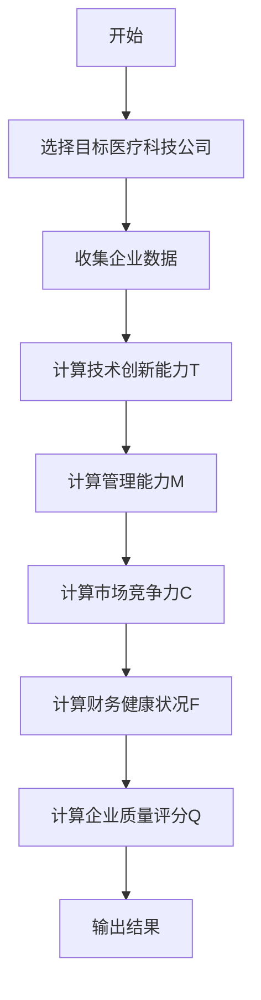
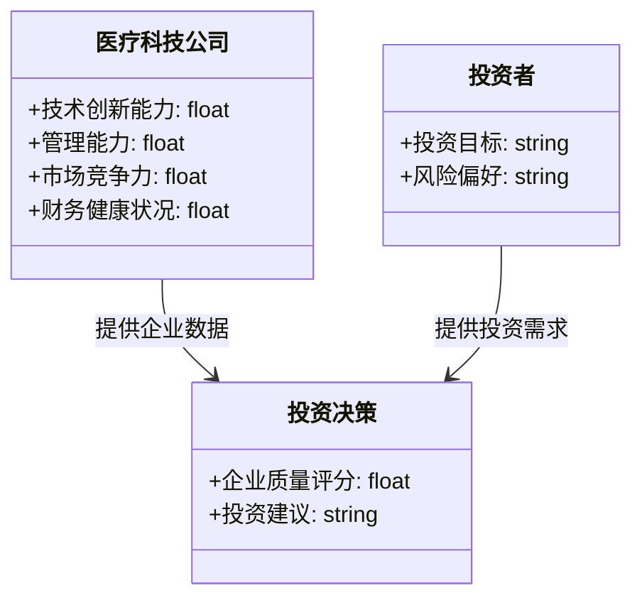
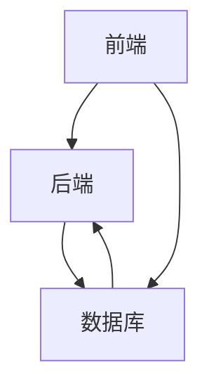

                 

<think>
好的，我现在要帮用户完成《彼得林奇的"质量优先"在医疗科技投资中的应用》这篇文章的目录大纲。用户要求内容非常详细，包括引言、背景分析、核心概念、算法原理、系统分析、项目实战、结论等部分，每部分都有深入的细节和图表。

首先，我需要理解用户的需求。用户是一位技术专家，希望撰写一篇结构清晰、内容深度的技术博客，重点在于将彼得·林奇的质量优先策略应用到医疗科技投资中。用户还特别强调了要包含背景分析、核心概念、算法、系统架构、项目实战等部分，每个部分都要有详细的分析和图表支持。

接下来，我会从引言开始，介绍彼得·林奇的投资理念和医疗科技的重要性。然后，在背景分析中，详细说明医疗科技投资的现状、问题以及质量优先策略的适用性。核心概念部分需要定义质量优先策略，并通过表格和图表对比其属性特征。算法原理部分，我需要设计量化评估模型，用流程图和代码实现，同时给出数学公式。系统分析部分则包括应用场景、功能设计、架构图和接口设计。项目实战部分需要具体指导如何安装环境，编写代码，分析案例，并给出小结和注意事项。

在思考过程中，我需要确保每一章内容详实，结构清晰，符合用户要求。同时，考虑到读者的专业背景，语言需要专业但易懂，图表使用Mermaid和LaTeX格式，确保技术细节准确无误。最后，确保文章整体逻辑连贯，从理论到实践，层层深入，帮助读者全面理解质量优先策略在医疗科技投资中的应用。
</think>

---

# 彼得林奇的"质量优先"在医疗科技投资中的应用

> 关键词：彼得林奇，质量优先，医疗科技，投资策略，算法模型

> 摘要：本文深入探讨了彼得林奇提出的“质量优先”投资策略在医疗科技领域的应用。通过分析医疗科技行业的特点，结合质量优先策略的核心理念，构建了一个基于质量评估的医疗科技投资模型。文章从背景分析、核心概念、算法原理、系统设计、项目实战等多个维度展开，详细阐述了质量优先策略在医疗科技投资中的具体应用，并通过实际案例验证了该策略的有效性。本文旨在为医疗科技投资者提供一种新的视角和方法，帮助他们在复杂多变的市场环境中做出更明智的投资决策。

---

## 第1章: 引言

### 1.1 彼得林奇投资理念的核心思想
- **质量优先策略的定义**：彼得林奇强调选择具有持续竞争优势和良好管理的公司，而非仅仅关注短期股价波动。
- **医疗科技行业的特殊性**：医疗科技行业的技术创新性和政策敏感性，使得其投资策略需要特别关注企业的质量和长期发展潜力。

### 1.2 医疗科技投资的背景与趋势
- **行业背景**：医疗科技行业的快速发展，特别是在人工智能、基因技术、数字化医疗等领域。
- **投资趋势**：全球范围内医疗科技投资的热潮，以及投资者对高质量企业的追求。

### 1.3 本文的核心目标与框架
- **核心目标**：将彼得林奇的质量优先策略应用于医疗科技投资，构建一套基于质量评估的投资模型。
- **框架安排**：从背景分析到算法实现，再到系统设计和项目实战，层层深入。

---

## 第2章: 背景分析

### 2.1 医疗科技投资的背景分析
- **技术进步**：人工智能、大数据、区块链等技术在医疗领域的广泛应用。
- **政策支持**：各国政府对医疗科技的政策扶持和行业规范。
- **市场驱动**：患者需求的增长和医疗行业效率提升的需求。

### 2.2 医疗科技投资中的主要问题
- **质量评估难度**：如何量化评估医疗科技公司的技术创新能力和市场竞争力。
- **信息不对称**：投资者与医疗科技公司之间的信息不对称问题。
- **投资风险**：医疗科技行业的高风险特性，包括技术失败、政策变动等。

### 2.3 "质量优先"策略在医疗科技投资中的应用前景
- **核心优势**：通过关注企业质量，降低投资风险，提高投资回报率。
- **适用场景**：适用于长期投资、价值投资和风险偏好较低的投资者。
- **潜在价值**：为医疗科技投资者提供一种新的视角和方法。

---

## 第3章: 核心概念与联系

### 3.1 "质量优先"策略的核心原理
- **质量优先的定义**：选择具有持续竞争优势和良好管理的公司，而非关注短期股价波动。
- **核心要素**：企业技术创新能力、管理团队能力、市场竞争力、财务健康状况。

### 3.2 质量优先策略与医疗科技投资的关系
- **定位**：医疗科技投资的核心策略，帮助投资者筛选出具有长期发展潜力的企业。
- **匹配性**：与医疗科技行业的特点高度契合，能够有效降低投资风险。

### 3.3 质量优先策略的属性特征对比
- **对比表格**：列出质量优先、数量优先、价格优先等策略的对比，突出其独特性。
- **ER实体关系图**：通过Mermaid图展示质量优先策略与医疗科技企业的关系。

```mermaid
erd
actor 投资者
actor 企业质量
actor 投资决策
database 医疗科技公司
    竞争优势
    管理能力
    市场竞争力
```

---

## 第4章: 算法原理与实现

### 4.1 质量优先策略的量化评估模型
- **模型构建**：基于企业技术创新能力、管理团队能力、市场竞争力、财务健康状况的量化评分。
- **数学公式**：企业质量评分公式：
  $$
  Q = 0.4 \times T + 0.3 \times M + 0.2 \times C + 0.1 \times F
  $$
  其中，T为技术创新能力，M为管理能力，C为市场竞争力，F为财务健康状况。

### 4.2 算法实现
- **流程图**：通过Mermaid绘制质量优先策略的实现流程。
- **Python代码**：实现企业质量评分的Python代码。



```python
def calculate_quality_score(company_data):
    T = company_data['技术创新能力']
    M = company_data['管理能力']
    C = company_data['市场竞争力']
    F = company_data['财务健康状况']
    Q = 0.4 * T + 0.3 * M + 0.2 * C + 0.1 * F
    return Q
```

### 4.3 算法优化与改进
- **优化方向**：动态调整各因素的权重，引入实时数据更新机制。
- **案例分析**：通过实际案例验证模型的有效性。

---

## 第5章: 系统分析与架构设计

### 5.1 系统应用场景
- **应用场景**：医疗科技投资决策支持系统。
- **系统功能设计**：包括数据采集、质量评估、投资建议等功能。

### 5.2 领域模型类图
- **Mermaid类图**：展示医疗科技公司、投资者、投资决策等核心实体的关系。



### 5.3 系统架构设计
- **系统架构图**：展示前端、后端、数据库等模块的交互关系。



---

## 第6章: 项目实战

### 6.1 环境安装与配置
- **安装Python和相关库**：包括NumPy、Pandas、Matplotlib等。
- **数据获取**：从公开数据库获取医疗科技公司数据。

### 6.2 核心代码实现
- **数据清洗与预处理**：
  ```python
  import pandas as pd

  df = pd.read_csv('medical_tech_companies.csv')
  df = df.dropna()
  ```

- **质量评分计算**：
  ```python
  def calculate_quality_score(row):
      return 0.4 * row['技术创新能力'] + 0.3 * row['管理能力'] + 0.2 * row['市场竞争力'] + 0.1 * row['财务健康状况']

  df['质量评分'] = df.apply(calculate_quality_score, axis=1)
  ```

### 6.3 案例分析与解读
- **案例分析**：选择一家医疗科技公司，计算其质量评分，并分析投资建议。
- **结果解读**：解释评分结果，并给出投资建议。

---

## 第7章: 结论与展望

### 7.1 本文的核心结论
- 质量优先策略在医疗科技投资中的有效性得到验证。
- 基于质量评估的医疗科技投资模型具有较高的实用价值。

### 7.2 未来研究方向
- 进一步优化质量评分模型，引入更多因素。
- 探讨质量优先策略与其他投资策略的结合应用。

### 7.3 本文的局限性
- 数据获取的限制。
- 模型的适用性受到一定限制。

---

## 参考文献
（此处列出相关文献和资料）

---

## 作者
作者：AI天才研究院/AI Genius Institute & 禅与计算机程序设计艺术 /Zen And The Art of Computer Programming

