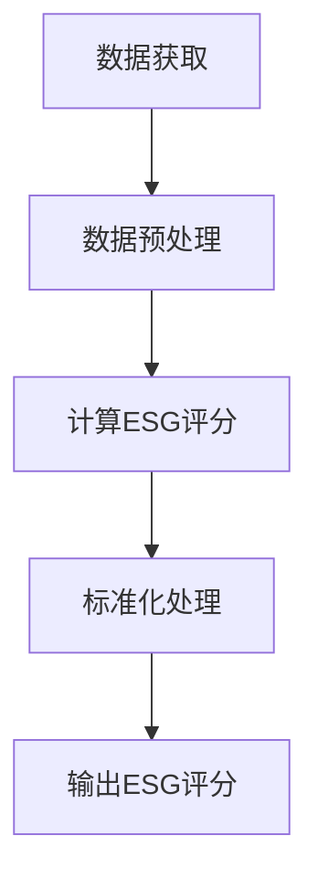
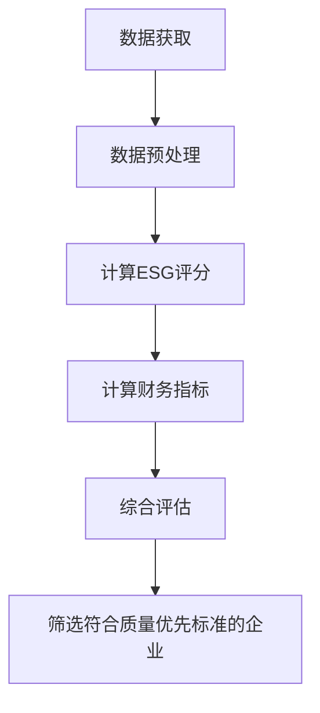
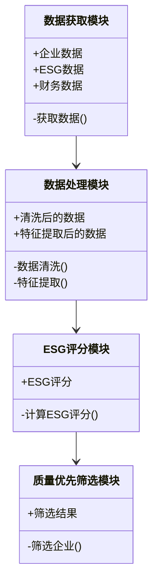
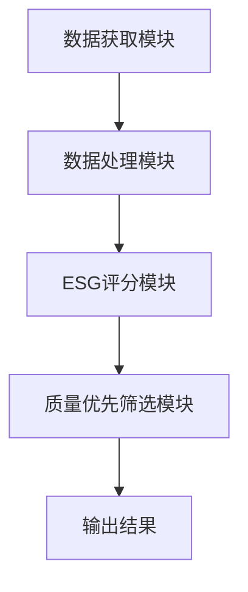
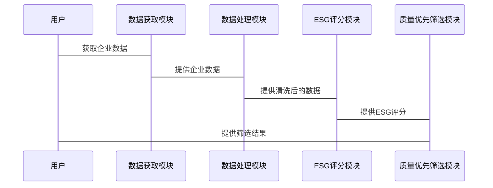

                 


# 彼得林奇的"质量优先"在可持续发展投资中的应用

## 关键词：
- 彼得林奇
- 质量优先
- 可持续发展投资
- ESG投资
- 人工智能
- 投资策略
- 数学模型

## 摘要：
本文将探讨彼得林奇的“质量优先”投资策略在可持续发展投资中的应用。通过分析质量优先策略的核心要素，结合ESG投资的核心概念，构建一个基于质量优先的ESG评分模型和筛选算法。文章将从背景介绍、核心概念、算法原理、系统分析、项目实战等方面进行详细阐述，并通过实际案例分析，展示质量优先策略在可持续发展投资中的优势与应用前景。文章还将结合数学模型和系统架构图，深入剖析质量优先策略的实现过程，并提出最佳实践建议。

---

# 正文

## 第一部分：可持续发展投资与质量优先策略的背景

### 第1章：可持续发展投资的背景与现状

#### 1.1 可持续发展投资的定义与特点
- **定义**：可持续发展投资（Sustainable Investment）是一种将环境、社会和治理（ESG）因素纳入投资决策的投资方式，旨在实现长期的经济回报与社会价值的统一。
- **特点**：
  - 长期性：关注企业的长期可持续发展能力。
  - 社会责任：注重企业在环境保护、社会责任和公司治理方面的表现。
  - 多维度：结合财务指标与非财务指标，进行全面评估。

#### 1.2 彼得林奇的质量优先策略
- **彼得林奇简介**：彼得·林奇是美国著名投资经理人，以其长期投资和价值发现策略闻名。
- **质量优先策略的核心要素**：
  - 选择具有强大基本面的公司。
  - 关注企业的竞争优势和长期盈利能力。
  - 避免短期波动，注重长期价值。
- **质量优先与长期投资回报**：质量优先策略通过选择优质企业，降低投资风险，提高长期回报率。

#### 1.3 质量优先在可持续投资中的结合
- **可持续发展与质量优先的契合点**：
  - 两者都关注企业的长期价值。
  - 可持续发展投资需要高质量的企业作为支撑。
- **质量优先策略在ESG投资中的应用前景**：
  - 通过质量优先策略筛选出具有可持续发展能力的公司。
  - 提高ESG投资的筛选效率和准确性。

---

## 第二部分：质量优先策略的核心概念与分析

### 第2章：ESG投资的核心概念

#### 2.1 ESG的定义与维度
- **环境（Environmental）**：
  - 碳排放、能源消耗、环保合规性等。
- **社会（Social）**：
  - 劳工权益、社区关系、社会责任等。
- **治理（Governance）**：
  - 董事会结构、高管薪酬、内部控制等。

#### 2.2 ESG评分模型的构建
- **ESG评分的指标体系**：
  - 环境：碳排放强度、可再生能源使用比例。
  - 社会：员工满意度、社会公益支出。
  - 治理：董事会多样性、高管薪酬与绩效挂钩。
- **ESG数据的来源与获取方式**：
  - 数据来源：第三方评级机构（如MSCI、Sustainalytics）。
  - 数据获取：通过API接口或数据库获取企业ESG数据。
- **ESG评分的标准化与对比方法**：
  - 标准化：将不同指标进行归一化处理。
  - 对比方法：使用百分位数或Z-score方法。

#### 2.3 质量优先策略与ESG投资的结合
- **质量优先策略在ESG筛选中的应用**：
  - 通过质量优先策略筛选出具有高质量ESG表现的公司。
  - 结合财务指标和ESG指标，进行全面评估。
- **质量优先与ESG评分的关系**：
  - 高质量企业通常具有较高的ESG评分。
  - 通过质量优先策略，可以进一步优化ESG投资组合。

---

### 第3章：质量优先策略的算法与数学模型

#### 3.1 ESG评分算法
- **加权计算方法**：
  - 指标权重的确定：根据行业特点和投资目标，赋予不同指标不同的权重。
  - 计算公式：$$ESG\_score = \sum_{i=1}^{n} w_i \cdot score_i$$
- **数据预处理与特征提取**：
  - 数据清洗：处理缺失值和异常值。
  - 特征提取：从企业财报和ESG报告中提取关键指标。
- **多元回归模型在ESG评分中的应用**：
  - 模型形式：$$score = \beta_0 + \beta_1x_1 + \beta_2x_2 + ... + \beta_nx_n + \epsilon$$
  - 参数估计：通过最小二乘法估计回归系数。

#### 3.2 质量优先筛选算法
- **质量优先筛选的标准与流程**：
  - 筛选标准：企业财务指标（如ROE、毛利率）和ESG评分。
  - 筛选流程：
    1. 数据获取与预处理。
    2. 计算ESG评分。
    3. 计算财务指标。
    4. 综合评估：结合ESG评分和财务指标，筛选出符合质量优先标准的企业。
- **数据清洗与特征工程**：
  - 数据清洗：处理缺失值和异常值。
  - 特征工程：对特征进行标准化或归一化处理。
- **质量优先策略的实现步骤**：
  1. 获取企业数据。
  2. 计算ESG评分。
  3. 计算财务指标。
  4. 综合评估：结合ESG评分和财务指标，筛选出符合质量优先标准的企业。

#### 3.3 算法流程图
- **ESG评分算法流程图**：

- **质量优先筛选算法流程图**：


---

## 第三部分：质量优先策略的系统分析与项目实战

### 第4章：系统分析与架构设计

#### 4.1 系统功能设计
- **系统功能模块**：
  - 数据获取模块：从第三方API获取企业数据。
  - 数据处理模块：对数据进行清洗和特征提取。
  - ESG评分模块：计算企业的ESG评分。
  - 质量优先筛选模块：筛选出符合质量优先标准的企业。
- **领域模型（类图）**：


#### 4.2 系统架构设计
- **系统架构图**：


#### 4.3 系统接口设计
- **接口描述**：
  - 数据获取模块：提供API接口，获取企业数据。
  - 数据处理模块：提供接口，进行数据清洗和特征提取。
  - ESG评分模块：提供接口，计算ESG评分。
  - 质量优先筛选模块：提供接口，筛选符合质量优先标准的企业。

#### 4.4 系统交互设计
- **交互流程**：


### 第5章：项目实战

#### 5.1 环境安装
- **安装Python环境**：
  - 安装Python 3.x。
  - 安装必要的库：pandas、numpy、scikit-learn。

#### 5.2 核心实现源代码

##### 5.2.1 数据预处理代码
```python
import pandas as pd
import numpy as np

# 数据清洗
def data_cleaning(df):
    # 处理缺失值
    df = df.dropna()
    # 处理异常值
    df = df[(df['revenue'] > 0) & (df['net_profit'] > 0)]
    return df

# 特征提取
def feature_engineering(df):
    # 计算毛利率
    df['gross_margin'] = df['gross_profit'] / df['revenue']
    # 计算净利率
    df['net_margin'] = df['net_profit'] / df['revenue']
    return df
```

##### 5.2.2 ESG评分模型代码
```python
from sklearn.linear_model import LinearRegression

# 计算ESG评分
def calculate_esg_score(X_train, y_train, X_test):
    model = LinearRegression()
    model.fit(X_train, y_train)
    esg_scores = model.predict(X_test)
    return esg_scores

# 计算标准化ESG评分
def normalize_esg_scores(scores):
    normalized_scores = (scores - np.min(scores)) / (np.max(scores) - np.min(scores))
    return normalized_scores
```

##### 5.2.3 质量优先筛选代码
```python
import pandas as pd

# 筛选符合质量优先标准的企业
def quality_priority_selection(df, esg_scores):
    df['esg_score'] = esg_scores
    # 筛选条件：esg评分高于行业平均，且净利率高于5%
    industry_avg = df['esg_score'].mean()
    df = df[(df['esg_score'] > industry_avg) & (df['net_margin'] > 0.05)]
    return df

# 输出结果
def main():
    # 数据获取与清洗
    df = pd.read_csv('input.csv')
    df = data_cleaning(df)
    # 特征提取
    df = feature_engineering(df)
    # 计算ESG评分
    X_train = df[['revenue', 'net_profit', 'esg_factors']]
    y_train = df['target']
    X_test = df[['revenue', 'net_profit', 'esg_factors']]
    esg_scores = calculate_esg_score(X_train, y_train, X_test)
    normalized_esg_scores = normalize_esg_scores(esg_scores)
    # 质量优先筛选
    selected_df = quality_priority_selection(df, normalized_esg_scores)
    print(selected_df)

if __name__ == '__main__':
    main()
```

#### 5.3 实际案例分析
- **案例分析**：
  - 数据来源：假设我们从MSCI获取某行业的企业数据。
  - 数据清洗：处理缺失值和异常值。
  - 特征提取：计算毛利率和净利率。
  - 计算ESG评分：使用线性回归模型计算ESG评分。
  - 标准化ESG评分：将ESG评分进行标准化处理。
  - 质量优先筛选：筛选出ESG评分高于行业平均且净利率高于5%的企业。

#### 5.4 项目小结
- **小结**：
  - 通过质量优先策略，我们可以筛选出具有高质量ESG表现的企业。
  - 该策略结合了财务指标和ESG指标，能够有效提高ESG投资的筛选效率和准确性。

---

## 第四部分：质量优先策略的最佳实践与总结

### 第6章：最佳实践与总结

#### 6.1 最佳实践
- **数据获取**：
  - 确保数据来源可靠。
  - 定期更新数据。
- **模型优化**：
  - 根据实际情况调整模型参数。
  - 使用更复杂的模型（如随机森林、神经网络）进行优化。
- **风险控制**：
  - 定期评估投资组合的风险。
  - 根据市场变化及时调整投资策略。

#### 6.2 小结
- 通过本文的分析，我们得出以下结论：
  - 质量优先策略在可持续发展投资中具有重要的应用价值。
  - 通过构建ESG评分模型和质量优先筛选算法，可以有效提高ESG投资的筛选效率和准确性。

#### 6.3 注意事项
- **数据质量问题**：
  - 确保数据的准确性和完整性。
  - 数据清洗和特征提取是关键步骤。
- **模型选择**：
  - 根据实际情况选择合适的模型。
  - 定期对模型进行优化和调整。

#### 6.4 拓展阅读
- **推荐书籍**：
  - 《彼得·林奇的投资策略》
  - 《可持续发展投资的实践与理论》
- **推荐文章**：
  - 《ESG投资的核心概念与实践》
  - 《质量优先策略在金融投资中的应用》

---

## 作者：AI天才研究院/AI Genius Institute & 禅与计算机程序设计艺术 /Zen And The Art of Computer Programming

