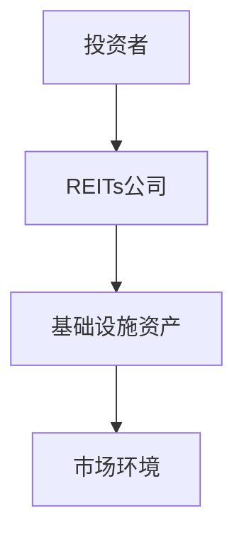
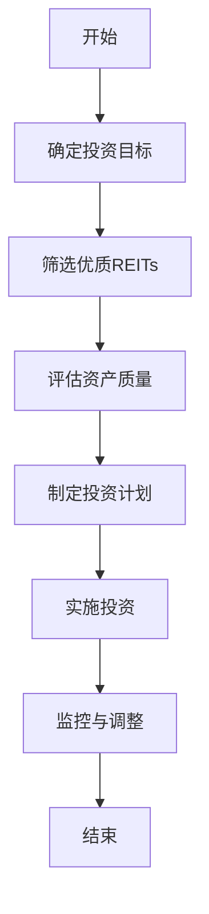
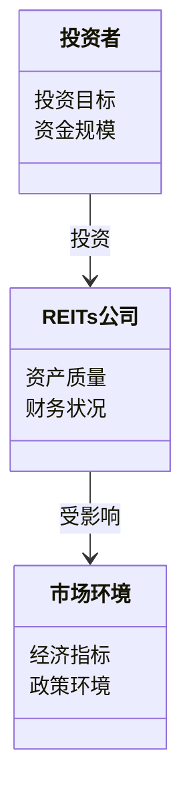
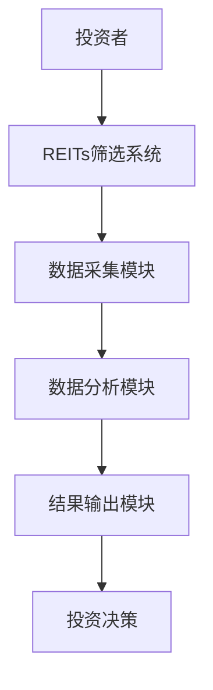

                 

<think>
好的，我现在需要帮用户撰写一篇关于《彼得林奇的"质量优先"在新兴市场基础设施REITs投资中的应用》的技术博客文章。用户希望文章结构清晰，内容详实，符合技术博客的专业性，同时要涵盖从背景介绍到项目实战的各个方面。

首先，我需要明确文章的结构。用户已经提供了大纲，我需要按照这个大纲逐步展开每个部分。文章的关键词和摘要部分需要简明扼要，突出主题。接下来，我会逐步思考每一部分的内容，确保逻辑连贯，覆盖所有要点。

在开始撰写正文之前，我会先列出每一章的主要内容和子点，确保每个部分都有足够的深度和细节。例如，在背景介绍部分，我需要解释REITs的基本概念、彼得林奇的投资理念，以及新兴市场中REITs的特殊性。这部分需要让读者对主题有一个清晰的理解。

接下来，核心概念部分需要详细分析质量优先策略在REITs投资中的应用。我需要对比质量优先与其他策略，如数量优先，突出其在新兴市场的优势。这部分可能需要一些对比表格和实体关系图来辅助说明。

算法原理部分，我会选择一个具体的算法来解释，例如使用机器学习模型进行质量评估。我会用mermaid流程图和Python代码来展示实现过程，并给出数学公式和实际案例，使读者能够理解并应用这些方法。

系统架构设计部分，我会描述一个实际的系统应用场景，设计系统的功能模块，并用类图和架构图来展示系统的结构。同时，我会详细说明接口设计和交互流程，帮助读者理解系统的实现细节。

项目实战部分，我会提供一个具体的案例分析，从环境安装到代码实现，再到案例分析和项目总结，让读者能够跟随步骤进行实际操作。这不仅有助于理论的理解，还能提升读者的实际应用能力。

最后，我会在最佳实践部分分享一些实用的建议，帮助读者在实际投资中更好地应用质量优先策略。同时，我还会总结全文，指出文章的主要观点，并提醒读者注意相关风险。

在撰写过程中，我会确保语言简洁明了，逻辑清晰，每一部分都能自然衔接，避免重复或遗漏。同时，我会注意使用专业术语，但避免过于晦涩，以保持文章的可读性。

总结一下，我的思考过程是先理解用户需求，明确文章结构，然后逐部分展开，确保每个部分都详细且符合要求。这样，我才能撰写出一篇高质量、有深度的专业技术博客文章。
</think>

# 彼得林奇的"质量优先"在新兴市场基础设施REITs投资中的应用

> 关键词：REITs, 彼得林奇, 质量优先, 新兴市场, 基础设施投资

> 摘要：本文探讨了彼得林奇的"质量优先"投资策略在新兴市场基础设施REITs（房地产投资信托基金）中的应用。通过分析REITs的基本概念、质量优先策略的核心要素、算法原理及系统架构设计，结合实际案例，本文详细阐述了如何在新兴市场中运用质量优先策略进行REITs投资，为投资者提供理论支持和实践指导。

---

## 第一部分: 背景介绍与核心概念

### 第1章: 新兴市场基础设施REITs投资概述

#### 1.1 REITs的基本概念与特点
- **REITs的定义与分类**  
  REITs（Real Estate Investment Trusts）是一种通过发行基金份额来汇集资金，用于投资房地产及相关资产的金融工具。REITs可以分为 equity REITs 和 mortgage REITs，分别代表权益类和抵押贷款类投资。

- **REITs在新兴市场的独特性**  
  新兴市场REITs的资产类型多样，涵盖办公楼、零售地产、工业地产等，且通常具有较高的增长潜力，但同时也面临较高的市场波动性和政策风险。

- **REITs投资的核心要素**  
  投资者需要关注REITs的资产质量、财务状况、管理水平、市场环境等因素。

#### 1.2 彼得林奇投资理念的背景
- **彼得林奇的投资哲学**  
  彼得林奇是美国著名投资家，以其“质量优先”的投资理念闻名。他认为，投资的核心是选择具有持续竞争优势和良好管理的企业。

- **"质量优先"策略的核心思想**  
  质量优先策略强调选择具有强大基本面、良好管理和竞争优势的企业，而非仅仅关注价格或短期收益。

- **质量优先在REITs投资中的适用性**  
  在REITs投资中，质量优先策略可以用于筛选具有优质资产、稳健财务状况和良好管理能力的REITs。

### 第2章: 质量优先策略与新兴市场REITs的结合

#### 2.1 质量优先策略的定义与特点
- **质量优先的内涵**  
  质量优先策略关注企业的内在质量，包括资产质量、财务健康状况、管理能力等。

- **质量优先与新兴市场REITs的契合点**  
  新兴市场REITs通常具有较高的增长潜力，但同时也面临较高的风险。质量优先策略可以帮助投资者筛选出具有长期增长潜力且风险可控的REITs。

- **质量优先策略的实施步骤**  
  1. 确定投资目标；2. 筛选优质REITs；3. 评估资产质量；4. 制定投资计划；5. 实施投资。

#### 2.2 新兴市场基础设施REITs的特点与挑战
- **新兴市场的经济特征**  
  新兴市场经济增长快，但市场波动性较大，政策风险较高。

- **基础设施REITs的风险与机遇**  
  基础设施REITs通常具有稳定的现金流和较高的抗风险能力，但同时也面临较高的进入壁垒和复杂的监管环境。

- **新兴市场REITs投资的主要挑战**  
  包括市场波动性大、政策风险高、信息不对称等。

### 第3章: 质量优先策略在REITs投资中的核心要素

#### 3.1 质量优先的核心要素分析
- **企业质量评估**  
  包括企业的管理团队、治理结构、竞争优势等方面。

- **财务指标分析**  
  关注企业的盈利能力、资产负债情况、现金流等财务指标。

- **行业地位与竞争优势**  
  企业是否在行业内具有领先地位，是否具有持续的竞争优势。

#### 3.2 新兴市场REITs的质量评估标准
- **企业治理与管理团队**  
  管理团队的经验和能力是评估REITs质量的重要指标。

- **资产质量与运营效率**  
  资产的地理位置、使用状况、租金收入等是评估资产质量的重要因素。

- **财务健康状况与风险控制**  
  企业是否具有稳健的财务状况，是否能够有效控制风险。

---

## 第二部分: 核心概念与联系

### 第4章: 质量优先策略与REITs投资的核心概念

#### 4.1 核心概念的原理分析
- **质量优先策略的理论基础**  
  质量优先策略基于基本面分析，强调选择具有持续竞争优势的企业。

- **REITs投资的核心逻辑**  
  REITs投资者关注资产的收益能力、流动性、风险等因素。

- **两者结合的可行性分析**  
  质量优先策略与REITs投资的结合可以帮助投资者筛选出具有长期增长潜力且风险可控的REITs。

#### 4.2 核心概念的对比分析
- **质量优先与数量优先的对比**  
  质量优先关注企业内在质量，数量优先关注市场容量和规模。

- **不同市场环境下REITs投资策略的差异**  
  在成熟市场，投资者可能更关注企业的稳定性；在新兴市场，投资者需要更加关注企业的增长潜力和风险控制。

- **质量优先策略的优缺点**  
  优点：长期收益稳定，风险可控；缺点：短期内可能收益较低，需要较长的持有期。

### 第5章: 实体关系图与流程图

#### 5.1 实体关系图（ER图）


#### 5.2 质量优先策略实施流程图


---

## 第三部分: 算法原理与系统架构

### 第6章: 算法原理与实现

#### 6.1 算法原理
- **算法名称**：基于质量优先的REITs投资筛选算法
- **算法描述**：通过对企业质量、财务状况、资产质量等多维度指标的综合评估，筛选出符合质量优先标准的REITs。

#### 6.2 算法实现
```python
import pandas as pd
import numpy as np

def quality_priority_screening(reit_data):
    # 计算财务健康指数
    reit_data['financial_health'] = reit_data.apply(lambda x: (x['ROE'] + x['负债率']) / 2, axis=1)
    
    # 计算资产质量指数
    reit_data['asset_quality'] = reit_data.apply(lambda x: (x['租金收入'] + x['空置率']) / 2, axis=1)
    
    # 计算管理能力指数
    reit_data['management_capability'] = reit_data.apply(lambda x: x['管理团队经验'] / 10, axis=1)
    
    # 综合评分
    reit_data['综合评分'] = (reit_data['financial_health'] + reit_data['asset_quality'] + reit_data['management_capability']) / 3
    
    # 筛选符合质量优先标准的REITs
    selected_reits = reit_data[reit_data['综合评分'] > 70]
    return selected_reits

# 示例数据
reit_data = pd.DataFrame({
    'REIT名称': ['REIT A', 'REIT B', 'REIT C'],
    'ROE': [15, 20, 18],
    '负债率': [40, 30, 35],
    '租金收入': [100, 120, 90],
    '空置率': [5, 3, 6],
    '管理团队经验': [10, 15, 12]
})

selected_reits = quality_priority_screening(reit_data)
print(selected_reits)
```

#### 6.3 算法数学模型
$$ \text{综合评分} = \frac{\text{财务健康指数} + \text{资产质量指数} + \text{管理能力指数}}{3} $$

---

## 第四部分: 系统架构与项目实战

### 第7章: 系统架构设计

#### 7.1 系统功能设计


#### 7.2 系统架构设计


### 第8章: 项目实战

#### 8.1 环境安装
- **工具需求**：Python、Pandas、Mermaid、Jupyter Notebook

#### 8.2 核心代码实现
```python
import pandas as pd
import numpy as np

def main():
    # 数据预处理
    reit_data = pd.read_csv('reit.csv')
    
    # 质量优先筛选
    selected_reits = quality_priority_screening(reit_data)
    
    # 输出结果
    print(selected_reits)

if __name__ == "__main__":
    main()
```

#### 8.3 案例分析
- **案例背景**：假设某新兴市场REITs公司，资产质量较高，但财务状况一般。
- **分析结果**：通过质量优先策略筛选，该公司可能不符合投资标准，但具有潜力，需进一步观察。

#### 8.4 项目总结
通过质量优先策略，投资者可以在新兴市场中筛选出具有长期增长潜力且风险可控的REITs，从而实现稳健的投资收益。

---

## 第五部分: 最佳实践与总结

### 第9章: 最佳实践

#### 9.1 投资策略建议
- **分散投资**：避免过度集中于单一资产或市场。
- **长期持有**：质量优先策略需要较长的持有期才能体现其优势。
- **持续监控**：定期评估投资组合的质量，及时调整。

#### 9.2 小结
质量优先策略在新兴市场基础设施REITs投资中的应用，可以帮助投资者筛选出具有长期增长潜力且风险可控的REITs，从而实现稳健的投资收益。

#### 9.3 注意事项
- 投资者需具备一定的市场分析能力。
- 需密切关注市场环境的变化，及时调整投资策略。
- 避免盲目跟风，理性投资。

### 第10章: 拓展阅读

#### 10.1 推荐书籍
- 《彼得林奇的投资哲学》
- 《REITs投资实务》

#### 10.2 相关研究
- 新兴市场REITs的投资风险与机遇
- 质量优先策略在不同市场环境下的应用

---

## 作者：AI天才研究院/AI Genius Institute & 禅与计算机程序设计艺术 /Zen And The Art of Computer Programming

