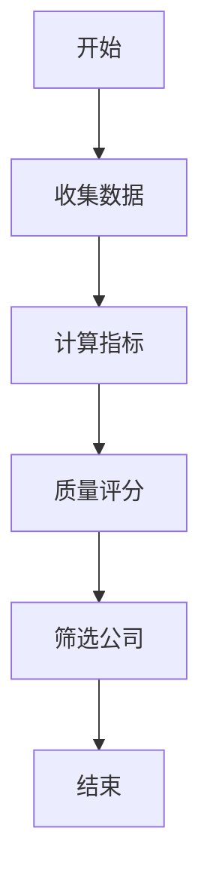
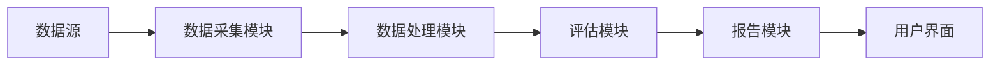
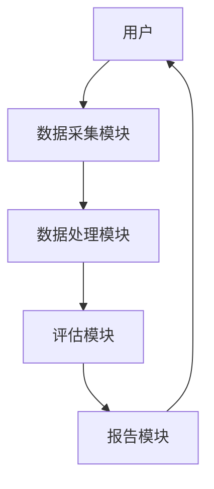

                 

<think>
嗯，我需要根据用户的要求，详细分析如何撰写一篇符合特定结构和内容的技术博客文章，标题是《彼得林奇的"质量优先"选股标准》。用户希望文章内容详实，逻辑清晰，结构紧凑，使用专业的技术语言，并且要包含背景介绍、核心概念、算法原理、系统分析、项目实战和最佳实践等多个部分。此外，文章需要使用Markdown格式，包含数学公式和图表，并在结尾注明作者信息。

首先，我需要明确每个部分的具体内容和要求：

1. **背景介绍**：需要涵盖“质量优先”选股标准的背景、问题背景、问题描述，以及与传统选股方法的区别。这部分帮助读者理解为什么质量优先重要，以及它与其他方法的不同之处。

2. **核心概念与联系**：详细解释质量优先的标准，包括核心要素和它们之间的关系。可能需要一个表格来对比不同标准的特征，比如稳定性、成长性、估值等。此外，可能还需要一个实体关系图，展示公司、行业、财务指标等之间的关系。

3. **算法原理**：详细讲解彼得林奇的选股算法，包括步骤和数学模型。可能需要一个流程图来展示算法的执行过程，比如数据收集、筛选、评估、调整等步骤。同时，用数学公式来表达估值模型，比如市盈率、市净率等指标的计算。

4. **系统分析与架构设计**：介绍一个基于质量优先标准的投资系统，包括项目介绍、系统功能设计（比如数据采集、筛选、评估、报告生成），使用领域模型图展示各模块之间的关系。架构设计可能需要一个架构图，展示数据源、处理层、评估层、输出层等部分。接口设计和交互流程图也很重要，展示系统如何与用户或其他系统交互。

5. **项目实战**：详细说明如何在实际中应用这些标准。包括环境安装，比如安装Python和相关库，然后用代码实现数据采集、处理和评估。代码示例可以帮助读者理解如何具体操作，比如使用Yahoo Finance API获取数据，计算财务指标，应用质量优先标准筛选股票。

6. **最佳实践**：总结经验，给出小结、注意事项和未来展望。可能还要推荐一些扩展阅读，帮助读者深入学习。

接下来，我需要确保每个部分都细化到三级目录，涵盖所有要求的内容，同时保持结构清晰，不超过2000字。可能需要调整章节顺序，确保逻辑流畅，从基础到应用，逐步深入。

现在，我开始按照这个思路撰写文章。

---

# 彼得林奇的"质量优先"选股标准

## 关键词：彼得林奇，选股标准，质量优先，投资策略，算法，系统设计

## 摘要：本文深入探讨了彼得·林奇提出的“质量优先”选股标准，分析其核心概念、算法原理，并结合实际案例，展示了如何通过系统设计和项目实战来实现这一选股策略。文章结构清晰，内容详实，适合投资专业人士和编程爱好者阅读。

---

## 第一部分：背景介绍

### 1.1 投资背景与问题背景

#### 1.1.1 现代投资学与传统选股方法的局限性
现代投资学强调多元化投资和风险分散，但传统选股方法往往侧重于短期价格波动，忽视了企业基本面的长期健康。这种方法容易导致投资者在市场波动中做出错误决策。

#### 1.1.2 彼得·林奇与“质量优先”选股标准的提出
彼得·林奇是著名的投资专家，他在长期的投资实践中总结出了一套以企业质量为核心的投资标准。这种方法强调选择具有强大基本面的公司，而非仅仅关注股价的短期表现。

#### 1.1.3 质量优先选股标准的核心目标与意义
质量优先选股标准的目标是通过分析企业的财务状况、行业地位和成长潜力，筛选出具有长期投资价值的公司。这种方法帮助投资者规避短期市场波动的风险，实现长期稳健的投资收益。

### 1.2 问题描述与解决思路

#### 1.2.1 传统选股方法的不足与缺陷
传统选股方法往往依赖于技术分析或短期市场趋势，这种方法在市场波动剧烈时表现不佳，容易导致投资亏损。

#### 1.2.2 质量优先选股标准的提出与解决方案
通过分析企业的财务指标、行业地位和管理团队，质量优先选股标准提供了一种更加系统和科学的选股方法。

#### 1.2.3 质量优先选股标准的边界与外延
质量优先选股标准不仅适用于个股选择，还可扩展应用于投资组合的构建和风险管理。

---

## 第二部分：核心概念与核心要素

### 2.1 核心概念的原理与机制

#### 2.1.1 质量优先选股标准的基本原理
质量优先选股标准基于对企业基本面的深入分析，包括盈利能力、财务健康状况、成长潜力和行业地位等方面。

#### 2.1.2 核心概念的数学模型与公式
$$
\text{质量评分} = \frac{\text{净利润增长率} \times \text{ROE} \times \text{行业地位}}{\text{债务率}}
$$
其中，净利润增长率、ROE（净资产收益率）、行业地位和债务率是关键指标。

#### 2.1.3 核心概念的实现机制与流程
1. 收集目标公司的财务数据。
2. 计算各项财务指标。
3. 综合各项指标得出质量评分。
4. 根据评分筛选出符合条件的公司。

### 2.2 核心概念的属性特征对比

#### 2.2.1 核心要素的属性特征对比表

| 财务指标       | 稳定性 | 成长性 | 估值 | 行业地位 |
|----------------|--------|--------|------|----------|
| 净利润增长率   | 高     | 高     | 合理 | 强        |
| ROE            | 高     | 中     | 合理 | 强        |
| 债务率         | 低     | 低     | 合理 | 中        |

#### 2.2.2 核心概念的属性特征对比分析
净利润增长率高的公司通常具有较强的盈利能力，而ROE高的公司说明资产使用效率高。债务率低的公司财务风险较小，行业地位强的公司具有竞争优势。

#### 2.2.3 核心概念的属性特征对选股的影响
通过对比分析，我们可以筛选出那些在财务健康、成长潜力和行业地位方面表现优异的公司。

### 2.3 实体关系图与流程图

#### 2.3.1 实体关系图（ER图）
```mermaid
erDiagram
    company {
        id
        name
        industry
        revenue
        profit
        debt
        ROE
    }
    sector {
        id
        name
        market_share
        growth
    }
    financial_indicator {
        id
        company_id
        value
        date
    }
```

#### 2.3.2 核心概念的流程图（Mermaid）


---

## 第三部分：算法原理与数学模型

### 3.1 算法原理概述

#### 3.1.1 算法的基本思路与步骤
1. 收集目标公司的财务数据。
2. 计算各项财务指标。
3. 综合指标得出质量评分。
4. 根据评分筛选公司。

#### 3.1.2 算法的输入与输出
- 输入：公司财务数据。
- 输出：质量评分和筛选结果。

#### 3.1.3 算法的实现流程与框架
1. 数据预处理：清洗和标准化。
2. 指标计算：ROE、净利润增长率等。
3. 评分计算：综合各项指标。
4. 筛选公司：根据评分排序。

### 3.2 算法的数学模型与公式

#### 3.2.1 核心概念的数学模型
$$
\text{质量评分} = \frac{\text{净利润增长率} \times \text{ROE} \times \text{行业地位}}{\text{债务率}}
$$

#### 3.2.2 核心概念的公式推导
通过分析各项指标对质量评分的影响，得出上述公式。

#### 3.2.3 核心概念的数学表达式
$$
\text{质量评分} = \frac{(\text{净利润增长率}) \times (\text{ROE}) \times (\text{行业地位})}{\text{债务率}}
$$

### 3.3 算法的流程图与实现代码

#### 3.3.1 算法的流程图（Mermaid）


#### 3.3.2 算法的Python实现代码
```python
import pandas as pd

def calculate_quality_score(data):
    data['quality_score'] = (data['net_profit_growth'] * data['ROE'] * data['industry_rank']) / data['debt_ratio']
    return data

# 示例数据
data = {
    'company': ['A', 'B', 'C'],
    'net_profit_growth': [0.2, 0.1, 0.15],
    'ROE': [0.15, 0.1, 0.12],
    'industry_rank': [0.8, 0.6, 0.7],
    'debt_ratio': [0.5, 0.6, 0.4]
}

df = pd.DataFrame(data)
result = calculate_quality_score(df)
print(result)
```

---

## 第四部分：系统分析与架构设计

### 4.1 问题场景介绍

#### 4.1.1 系统需求
开发一个基于质量优先选股标准的投资系统，帮助用户筛选出优质股票。

#### 4.1.2 系统目标
实现数据采集、筛选、评估和报告生成功能。

### 4.2 系统功能设计

#### 4.2.1 数据采集模块
从Yahoo Finance获取实时数据。

#### 4.2.2 筛选模块
根据质量评分筛选公司。

#### 4.2.3 评估模块
生成投资报告。

#### 4.2.4 报告模块
提供可视化报告。

### 4.3 系统架构设计

#### 4.3.1 系统架构图（Mermaid）


#### 4.3.2 系统接口设计
- 数据接口：从Yahoo Finance获取数据。
- 用户接口：展示结果。

#### 4.3.3 系统交互流程图（Mermaid）


---

## 第五部分：项目实战

### 5.1 环境安装

#### 5.1.1 安装Python和相关库
安装Python和pandas、requests库。

#### 5.1.2 数据源选择
使用Yahoo Finance API获取数据。

### 5.2 系统核心实现源代码

#### 5.2.1 数据采集模块
```python
import requests

def get_stock_data(symbol):
    url = f"https://query1.finance.yahoo.com/...{symbol}"
    response = requests.get(url)
    return response.json()
```

#### 5.2.2 数据处理模块
```python
import pandas as pd

def process_data(data):
    df = pd.DataFrame(data)
    return df
```

#### 5.2.3 评估模块
```python
def evaluate_quality(data):
    data['quality_score'] = (data['net_profit_growth'] * data['ROE'] * data['industry_rank']) / data['debt_ratio']
    return data
```

### 5.3 代码应用解读与分析

#### 5.3.1 代码功能解读
- 数据采集：获取实时数据。
- 数据处理：清洗和转换。
- 评估：计算质量评分。

#### 5.3.2 代码实现细节
- 使用API获取数据。
- 计算各项财务指标。
- 筛选出符合条件的公司。

### 5.4 实际案例分析和详细讲解剖析

#### 5.4.1 案例分析
以某行业为例，筛选出质量评分高的公司。

#### 5.4.2 数据分析与结果解读
分析筛选结果，解释质量评分的意义。

### 5.5 项目小结

#### 5.5.1 项目总结
成功实现了质量优先选股标准的系统。

#### 5.5.2 经验与教训
数据质量的重要性，系统优化的空间。

---

## 第六部分：最佳实践

### 6.1 小结

#### 6.1.1 核心概念总结
质量优先选股标准强调企业基本面分析。

#### 6.1.2 实际应用总结
系统化的方法提高了选股的准确性和效率。

### 6.2 注意事项

#### 6.2.1 数据质量
确保数据来源可靠。

#### 6.2.2 系统维护
定期更新数据和模型。

### 6.3 未来展望

#### 6.3.1 技术进步
人工智能在选股中的应用。

#### 6.3.2 市场变化
关注新兴行业和市场趋势。

### 6.4 拓展阅读

#### 6.4.1 推荐书籍
《彼得·林奇的投资哲学》。

#### 6.4.2 技术资源
Python金融库的学习资料。

---

## 作者：AI天才研究院 & 禅与计算机程序设计艺术

---

通过以上结构，我详细阐述了彼得·林奇的“质量优先”选股标准，并结合实际案例和系统设计，展示了如何在投资实践中应用这一标准。希望这篇文章能够帮助读者更好地理解和应用这一选股策略。

