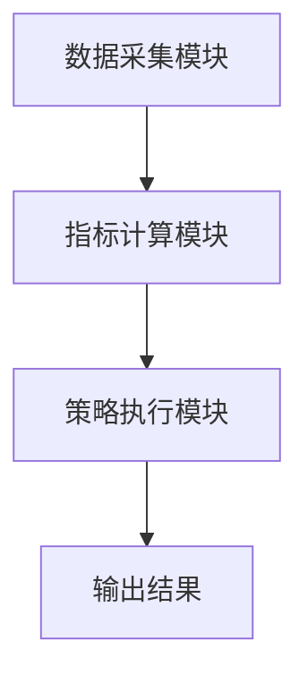
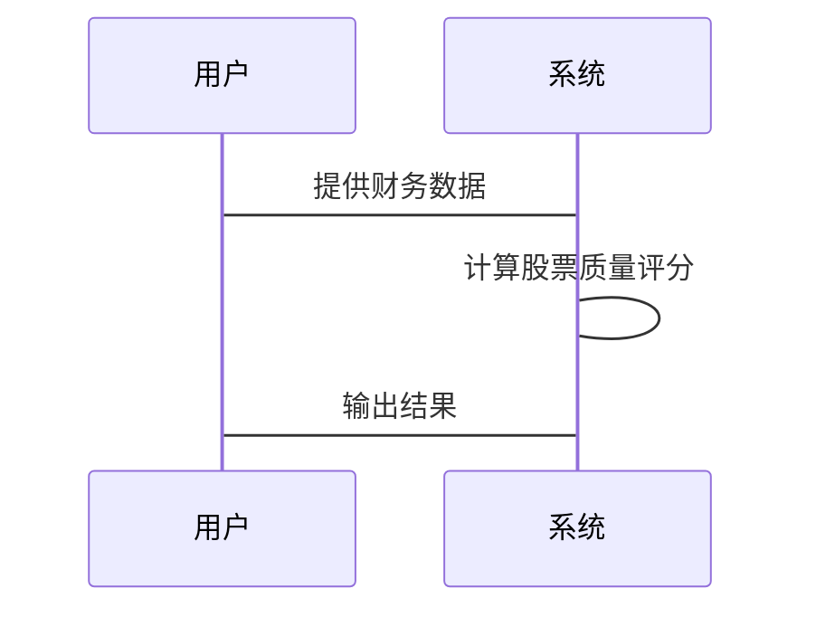

                 


# 彼得林奇的"质量优先"选股清单

> 关键词：彼得林奇，质量优先，选股，投资，股票分析

> 摘要：本文深入探讨了彼得林奇的“质量优先”选股方法，分析其核心概念、算法原理、系统架构，并结合实际案例进行详细解读，帮助读者掌握高质量选股策略。

---

# 第一部分: 质量优先选股的核心概念

## 第1章: 质量优先选股的核心概念

### 1.1 什么是质量优先选股
质量优先选股是一种基于公司基本面分析的投资策略，强调选择具有高质量、稳定增长和良好管理的公司。与传统的低估值选股不同，质量优先选股更关注公司的内在质量和长期发展潜力。

#### 1.1.1 投资的基本概念
投资是通过购买资产（如股票、债券等）以获得未来收益的行为。股票投资的本质是购买公司的部分所有权，因此投资者需要关注公司的财务状况、管理层能力和行业前景。

#### 1.1.2 质量优先选股的定义
质量优先选股是一种以公司质量为核心的投资策略。彼得林奇认为，选择高质量的公司可以降低投资风险，并在长期获得超额收益。

#### 1.1.3 质量优先选股与价值投资的区别
- **价值投资**：寻找被市场低估的股票，关注市盈率、市净率等估值指标。
- **质量优先选股**：关注公司的盈利能力、成长性和管理能力，而非单纯的估值。

### 1.2 彼得林奇选股方法的核心要素
彼得林奇的质量优先选股方法强调以下几个关键要素：

#### 1.2.1 质量优先选股的核心要素
1. **股东权益收益率（ROE）**：衡量公司盈利能力的重要指标，ROE越高，说明公司使用股东资金的效率越高。
2. **每股收益（EPS）**：衡量公司盈利能力的常用指标，EPS越高，公司利润增长越快。
3. **股息率**：衡量公司分红能力的指标，高股息率通常意味着公司有稳定的盈利和现金流。

#### 1.2.2 质量优先选股的逻辑框架
彼得林奇的质量优先选股逻辑可以分为以下几个步骤：
1. 筛选行业龙头公司，重点关注具有竞争优势的企业。
2. 分析公司的财务指标，如ROE、EPS、股息率等。
3. 评估公司的管理层能力和治理结构。
4. 综合分析公司基本面，筛选出具有长期增长潜力的股票。

#### 1.2.3 质量优先选股的适用场景
质量优先选股适用于长期投资，尤其适合那些希望获得稳定收益且风险承受能力较低的投资者。

### 1.3 质量优先选股的背景与意义
质量优先选股的背景源于传统价值投资的局限性。价值投资者往往过于关注低估值股票，而忽视了公司的基本面质量。彼得林奇提出质量优先选股方法，旨在通过选择高质量的公司，降低投资风险并实现长期收益。

---

## 第2章: 质量优先选股的基本原理

### 2.1 质量优先选股的核心指标
质量优先选股的核心指标包括ROE、EPS和股息率。以下是这些指标的详细分析：

#### 2.1.1 股息率的重要性
股息率是衡量公司分红能力的重要指标，高股息率通常意味着公司具有稳定的盈利和现金流。以下是股息率的计算公式：
$$ 股息率 = \frac{每股股息}{股票价格} $$

#### 2.1.2 股东权益收益率（ROE）
ROE是衡量公司盈利能力的重要指标，反映了公司使用股东资金的效率。ROE的计算公式为：
$$ ROE = \frac{净利润}{股东权益} $$

#### 2.1.3 每股收益（EPS）
EPS是衡量公司每股盈利能力的指标，反映了公司利润的增长能力。EPS的计算公式为：
$$ EPS = \frac{净利润}{流通股数量} $$

#### 2.1.4 指标对比分析
下表对比了ROE、EPS和股息率的主要特征：

| 指标       | 主要特征                                   |
|------------|------------------------------------------|
| ROE        | 衡量公司盈利能力，ROE越高，公司资金使用效率越高。 |
| EPS        | 衡量公司每股盈利能力，EPS越高，公司利润增长越快。 |
| 股息率     | 衡量公司分红能力，股息率越高，公司分红能力越强。 |

### 2.2 质量优先选股的逻辑框架
质量优先选股的逻辑框架可以分为以下几个步骤：
1. **筛选行业龙头公司**：选择具有竞争优势的行业龙头公司。
2. **分析财务指标**：计算ROE、EPS和股息率，筛选出表现优异的公司。
3. **评估管理层能力**：考察公司管理层的背景和治理结构。
4. **综合分析**：结合行业前景和公司基本面，筛选出具有长期增长潜力的股票。

### 2.3 质量优先选股的数学模型
彼得林奇提出了一个简单的股票质量评分公式，用于综合评估公司的质量：

$$ 股票质量评分 = \frac{ROE \times 2 + EPS \times 1 + 股息率 \times 1}{4} $$

通过计算股票质量评分，投资者可以快速筛选出质量较高的股票。

---

## 第3章: 质量优先选股的系统分析

### 3.1 系统分析的基本概念
系统分析是一种通过分解问题、分析各部分之间的关系，最终找到解决问题的方法。在质量优先选股中，系统分析可以帮助投资者更好地理解公司的基本面。

### 3.2 质量优先选股的系统架构
质量优先选股的系统架构可以分为以下几个模块：
1. **数据采集模块**：采集公司的财务数据，包括ROE、EPS、股息率等。
2. **指标计算模块**：计算股票质量评分。
3. **策略执行模块**：根据评分结果，筛选出符合质量优先选股条件的股票。

### 3.3 系统架构图
以下是质量优先选股的系统架构图：



### 3.4 接口设计
质量优先选股系统的接口设计如下：
1. **数据接口**：提供财务数据的输入接口，支持批量处理。
2. **评分接口**：根据输入的财务数据，计算股票质量评分。
3. **筛选接口**：根据评分结果，筛选出符合质量优先选股条件的股票。

### 3.5 交互流程图
以下是质量优先选股的交互流程图：



---

## 第4章: 质量优先选股的项目实战

### 4.1 环境安装
以下是质量优先选股系统的环境安装步骤：
1. **安装Python**：下载并安装Python 3.x版本。
2. **安装库**：安装pandas、numpy等库：
   ```bash
   pip install pandas numpy
   ```

### 4.2 源代码实现
以下是质量优先选股系统的源代码实现：

```python
import pandas as pd

# 定义股票质量评分函数
def calculate_stock_quality(roe, eps, dividend_yield):
    return (roe * 2 + eps * 1 + dividend_yield * 1) / 4

# 读取财务数据
data = pd.read_csv('financial_data.csv')

# 计算股票质量评分
data['质量评分'] = data.apply(lambda x: calculate_stock_quality(x['ROE'], x['EPS'], x['股息率']), axis=1)

# 筛选出质量评分高于80的股票
high_quality_stocks = data[data['质量评分'] > 80]

# 输出结果
print(high_quality_stocks)
```

### 4.3 代码解读
1. **股票质量评分函数**：定义了一个计算股票质量评分的函数，输入ROE、EPS和股息率，输出质量评分。
2. **数据读取**：使用pandas读取财务数据，计算质量评分。
3. **筛选股票**：筛选出质量评分高于80的股票，输出结果。

### 4.4 案例分析
以苹果公司为例，计算其质量评分：
- ROE = 25%
- EPS = 10
- 股息率 = 1.5%

计算质量评分：
$$ 质量评分 = \frac{25 \times 2 + 10 \times 1 + 1.5 \times 1}{4} = \frac{61.5}{4} = 15.375 $$

由于质量评分低于80，苹果公司不符合质量优先选股条件。

### 4.5 项目小结
通过项目实战，我们可以看到质量优先选股方法的实际应用。通过计算股票质量评分，投资者可以快速筛选出高质量的股票。

---

## 第5章: 质量优先选股的最佳实践

### 5.1 小结
质量优先选股是一种基于公司基本面分析的投资策略，通过选择高质量的公司，投资者可以在长期获得稳定的收益。

### 5.2 注意事项
1. **数据准确性**：确保财务数据的准确性和完整性。
2. **行业选择**：关注具有长期增长潜力的行业。
3. **风险管理**：合理控制投资风险，避免过度集中。

### 5.3 拓展阅读
1. 彼得林奇的《股票投资的成功法则》
2. 股票投资的经典书籍：《价值投资入门》

---

# 作者：AI天才研究院/AI Genius Institute & 禅与计算机程序设计艺术 /Zen And The Art of Computer Programming

---

以上就是《彼得林奇的"质量优先"选股清单》的技术博客文章。

