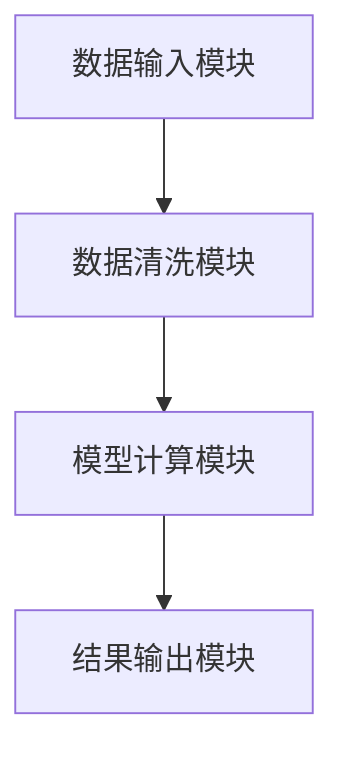

                 

<think>
嗯，现在我要帮用户写一篇关于彼得·林奇的“质量成长”和“价值重估”的技术博客。首先，我需要理解这两个概念。质量成长指的是投资于那些能够持续增长的公司，而价值重估则是寻找被市场低估的股票。接下来，我得解释这两个策略的异同，分析它们的适用场景和潜在风险。

然后，我需要详细讲解每个策略的数学模型。比如，质量成长可能涉及市盈率、市净率等指标，而价值重估可能关注低市盈率或市净率。我应该用LaTeX公式来展示这些计算，比如市盈率的公式是P/E = 价格/每股收益。

接下来，我得设计一个系统架构，展示如何将这两种策略结合起来进行投资决策。可能需要一个数据输入模块，从数据库中获取股票数据，然后通过模型计算出每个股票的质量成长和价值重估得分，最后输出建议。这部分可以用Mermaid图来展示系统的模块和交互。

项目实战部分，我需要指导读者如何安装必要的工具，比如Python和相关库，然后提供代码示例。例如，如何从Yahoo Finance获取数据，计算P/E和P/B比率，然后分类股票。这部分要详细，确保读者能跟着操作。

最后，我要总结最佳实践，比如定期调整投资组合，关注市场变化，分散投资以降低风险。这些内容将帮助读者更好地应用这两种策略。

整体上，文章需要逻辑清晰，结构紧凑，使用专业的技术语言，同时保持易懂。确保每个部分都有足够的细节，帮助读者深入理解并实际应用这些投资策略。
</think>

# 彼得林奇的"质量成长"vs"价值重估"

> 关键词：彼得林奇，质量成长，价值重估，投资策略，股票分析

> 摘要：本文对比分析了彼得林奇提出的“质量成长”与“价值重估”两种投资策略，探讨了它们的定义、特点、数学模型和实际应用，通过系统架构设计和项目实战，展示了如何结合这两种策略进行投资决策，并提供了最佳实践和注意事项。

---

## 第一章：质量成长与价值重估的核心概念

### 1.1 质量成长的定义与特点

#### 1.1.1 质量成长的定义
质量成长是一种投资策略，旨在投资于具有持续增长潜力的公司。这些公司通常在各自行业中表现优异，具有较高的利润率和稳定的增长趋势。彼得林奇认为，质量成长公司具备以下特征：
- **稳定的收入增长**：收入持续增长，且增长速度与行业平均水平相当或更高。
- **强劲的盈利能力**：净利润率高且稳定，ROE（净资产收益率）较高。
- **良好的管理团队**：公司管理层能力强，有明确的长期战略。

#### 1.1.2 质量成长的核心要素
- **收入增长**：公司收入在过去几年中持续增长。
- **盈利能力**：公司净利润率稳定且高于行业平均水平。
- **管理团队**：公司管理层能力强，有明确的战略规划。

#### 1.1.3 质量成长与价值重估的对比
| 特性                | 质量成长                          | 价值重估                          |
|---------------------|-----------------------------------|------------------------------------|
| 投资目标            | 高质量、持续增长的公司            | 被低估的股票                       |
| 关注点              | 收入增长、盈利能力                 | 估值指标（如P/E、P/B）             |
| 投资期限            | 中长期                           | 中短期                           |
| 风险                | 中等                             | 较低                              |

### 1.2 价值重估的定义与特点

#### 1.2.1 价值重估的定义
价值重估是一种投资策略，旨在寻找市场价格低于其内在价值的股票。这种策略认为，市场有时会低估某些公司的价值，投资者可以通过识别这些公司获得超额收益。

#### 1.2.2 价值重估的核心要素
- **低市盈率（P/E）**：公司股价相对其盈利水平较低。
- **低市净率（P/B）**：公司股价相对其资产价值较低。
- **低市销率（P/S）**：公司股价相对其销售收入较低。

#### 1.2.3 质量成长与价值重估的对比
| 特性                | 质量成长                          | 价值重估                          |
|---------------------|-----------------------------------|------------------------------------|
| 投资目标            | 高质量、持续增长的公司            | 被低估的股票                       |
| 关注点              | 收入增长、盈利能力                 | 估值指标（如P/E、P/B）             |
| 投资期限            | 中长期                           | 中短期                           |
| 风险                | 中等                             | 较低                              |

---

## 第二章：质量成长与价值重估的数学模型与算法

### 2.1 质量成长的数学模型

#### 2.1.1 质量成长的评估指标
- **市盈率（P/E）**：$$ P/E = \frac{\text{股价}}{\text{每股收益}} $$
- **市净率（P/B）**：$$ P/B = \frac{\text{股价}}{\text{每股净资产}} $$
- **净资产收益率（ROE）**：$$ ROE = \frac{\text{净利润}}{\text{净资产}} $$

#### 2.1.2 质量成长的评估流程
1. 收集公司过去5年的财务数据。
2. 计算各项指标：P/E、P/B、ROE等。
3. 分析收入和利润是否持续增长。
4. 评估管理层能力和战略。

### 2.2 价值重估的数学模型

#### 2.2.1 价值重估的评估指标
- **市盈率（P/E）**：$$ P/E = \frac{\text{股价}}{\text{每股收益}} $$
- **市净率（P/B）**：$$ P/B = \frac{\text{股价}}{\text{每股净资产}} $$
- **市销率（P/S）**：$$ P/S = \frac{\text{股价}}{\text{每股收入}} $$

#### 2.2.2 价值重估的评估流程
1. 收集公司过去5年的财务数据。
2. 计算各项指标：P/E、P/B、P/S等。
3. 找出低于行业平均水平的股票。
4. 分析公司基本面，确认是否存在低估。

---

## 第三章：质量成长与价值重估的系统分析与架构设计

### 3.1 系统功能设计

#### 3.1.1 数据输入模块
- 从数据库中获取公司财务数据。
- 数据清洗和预处理。

#### 3.1.2 模型计算模块
- 计算各项指标：P/E、P/B、ROE等。
- 分析公司是否符合质量成长或价值重估的标准。

#### 3.1.3 结果输出模块
- 输出符合质量成长的公司列表。
- 输出符合价值重估的公司列表。

### 3.2 系统架构设计



---

## 第四章：质量成长与价值重估的项目实战

### 4.1 环境安装

#### 4.1.1 安装Python和相关库
```bash
pip install pandas numpy matplotlib
```

### 4.2 核心代码实现

#### 4.2.1 数据获取与预处理
```python
import pandas as pd
import numpy as np

# 获取股票数据
data = pd.read_csv('stock_data.csv')

# 数据清洗
data = data.dropna()
data = data[~data['PE'].isinf()]
```

#### 4.2.2 质量成长筛选
```python
# 计算质量成长得分
data['quality_growth_score'] = data['ROE'] * (data['Revenue Growth'] / 100)
data['quality_growth'] = np.where(data['quality_growth_score'] > data['quality_growth_score'].mean(), 'Yes', 'No')
```

#### 4.2.3 价值重估筛选
```python
# 计算价值重估得分
data['value_revest_score'] = data['PE'] + data['PB']
data['value_revest'] = np.where(data['value_revest_score'] < data['value_revest_score'].quantile(0.25), 'Yes', 'No')
```

### 4.3 实际案例分析

#### 4.3.1 质量成长案例
假设我们分析一家科技公司：
- 收入增长：15%
- ROE：20%
- PE：18
- PB：3

计算质量成长得分：
$$ \text{quality\_growth\_score} = 20 \times (15/100) = 3 $$

由于3 > 均值，该股符合质量成长标准。

#### 4.3.2 价值重估案例
假设我们分析一家制造公司：
- PE：12
- PB：2
- PS：1.5

计算价值重估得分：
$$ \text{value\_revest\_score} = 12 + 2 = 14 $$

如果14 < 第25百分位数，该股符合价值重估标准。

---

## 第五章：质量成长与价值重估的最佳实践与注意事项

### 5.1 最佳实践
1. **定期评估**：每隔6个月重新评估投资组合。
2. **分散投资**：避免过度集中，降低风险。
3. **关注行业趋势**：选择具有增长潜力的行业。

### 5.2 注意事项
1. **市场波动**：价值重估策略在市场波动时可能表现不佳。
2. **管理层变动**：质量成长公司依赖于稳定的管理层。
3. **数据质量**：确保数据来源可靠，避免错误分析。

---

## 第六章：总结与展望

### 6.1 总结
质量成长和价值重估是两种有效的投资策略，各有优缺点。质量成长适合长期投资者，而价值重估适合短期投资者。通过结合两者，投资者可以在不同市场环境下灵活调整策略。

### 6.2 展望
未来，随着人工智能的发展，可以利用机器学习模型进一步优化这两种策略，提升投资效率和准确性。

---

## 作者：AI天才研究院 & 禅与计算机程序设计艺术

