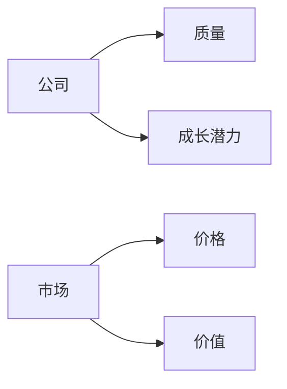
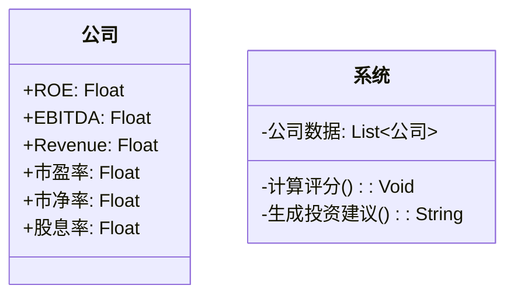
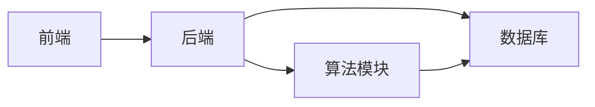

                 


# 彼得林奇的"质量成长"vs"价值重估"在不同市值公司中的应用

## 关键词：彼得林奇，质量成长，价值重估，投资策略，市值公司，投资分析

## 摘要：本文通过分析彼得林奇提出的“质量成长”和“价值重估”两种投资策略，探讨这两种策略在不同市值公司中的应用。通过详细阐述两种策略的核心概念、数学模型、系统架构以及实际案例分析，帮助读者理解如何在实际投资中灵活运用这两种策略，实现投资组合的优化和收益最大化。

---

## 第一部分：质量成长与价值重估的背景介绍

### 第1章：投资学基础

#### 1.1 投资学的基本概念
投资是将资金投入到资产中，以期获得未来收益的行为。投资学研究如何通过科学的方法选择和管理资产，以实现财富的保值和增值。投资的基本原则包括分散投资、长期持有、风险与收益的平衡等。

#### 1.2 彼得林奇与他的投资理念
彼得·林奇是美国著名的投资经理人，曾管理富达麦哲伦基金，创造了卓越的投资业绩。他提倡“买好公司，长期持有”的投资理念，强调通过深入研究公司基本面，选择具有持续成长潜力的优秀企业。

---

### 第2章：质量成长与价值重估的定义与区别

#### 2.1 质量成长的定义与特点
质量成长是指选择那些具有强大竞争优势、持续盈利能力和良好管理的公司进行投资。其核心在于公司的内在质量和成长潜力，而非市场价格。

**特点：**
- **高ROE（净资产收益率）**：公司盈利能力强。
- **稳定的收入和利润增长**：公司收入和利润持续增长。
- **强大的竞争优势**：公司在行业中具有竞争优势。

#### 2.2 价值重估的定义与特点
价值重估是指寻找那些市场价格低于其内在价值的公司进行投资。其核心在于发现市场低估的公司，通过价值回归获得收益。

**特点：**
- **低市盈率或市净率**：公司市场价格低于其实际价值。
- **高股息率**：公司股息收益率较高。
- **暂时的市场低估**：公司可能因市场情绪或行业周期而被低估。

#### 2.3 质量成长与价值重估的对比分析

**核心概念对比表：**

| **属性**       | **质量成长**                     | **价值重估**                     |
|----------------|----------------------------------|----------------------------------|
| 核心关注点     | 公司质量和成长潜力               | 市场价格与内在价值的差异         |
| 投资目标       | 寻找具有持续成长潜力的公司       | 寻找市场价格低估的公司             |
| 风险承受能力   | 较高                            | 较低                            |
| 适用场景       | 高增长行业、新兴行业             | 周期性行业、市场低迷时             |

**ER实体关系图：**


---

## 第二部分：质量成长与价值重估的数学模型与算法原理

### 第3章：质量成长的评估模型

#### 3.1 质量成长评分公式
质量成长评分公式结合了公司的盈利能力、收入增长和竞争优势等因素，用于评估公司的质量成长潜力。

$$ QG = \frac{ROE \times EBITDA \times Revenue}{3} $$

其中：
- ROE：净资产收益率，反映公司的盈利能力。
- EBITDA：息税折旧及摊销前利润，反映公司的经营效率。
- Revenue：收入，反映公司的市场规模和增长潜力。

#### 3.2 质量成长评分算法


### 第4章：价值重估的评估模型

#### 4.1 价值重估评分公式
价值重估评分公式结合了市盈率、市净率和股息率等因素，用于评估公司的市场价格与内在价值的差异。

$$ VV = \frac{市盈率 \times 市净率 \times 股息率}{3} $$

其中：
- 市盈率：市价与每股收益的比率，反映市场对公司的估值。
- 市净率：市价与每股净资产的比率，反映公司的资产价值。
- 股息率：股息与股价的比率，反映公司的分红能力。

#### 4.2 价值重估评分算法


---

## 第三部分：系统分析与架构设计

### 第5章：投资决策支持系统

#### 5.1 系统功能设计
投资决策支持系统用于帮助投资者根据质量成长和价值重估策略选择合适的公司。

**功能模块：**
- 数据采集：获取公司财务数据和市场数据。
- 数据分析：计算质量成长评分和价值重估评分。
- 投资决策：根据评分结果生成投资建议。

**领域模型：**


#### 5.2 系统架构设计


#### 5.3 接口设计
- 数据接口：公司数据接口、市场数据接口。
- 评分接口：质量成长评分接口、价值重估评分接口。

#### 5.4 交互流程


---

## 第四部分：项目实战

### 第6章：质量成长与价值重估的案例分析

#### 6.1 环境安装
安装必要的工具和库，如Python、Pandas、Matplotlib等。

#### 6.2 核心代码实现
```python
import pandas as pd

def calculate_qg(ro

