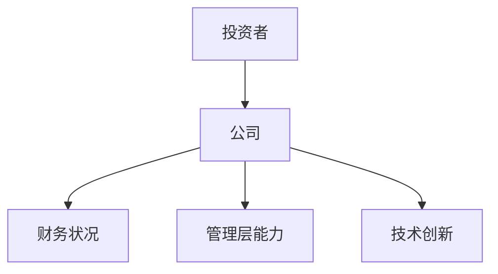

                 

<think>
嗯，我现在需要帮用户设计一本名为《彼得林奇的"质量成长"在生物科技初创公司中的应用》的目录大纲。首先，我得理解这本书的核心主题。彼得林奇是著名的投资家，他强调“质量成长”投资策略，即投资那些有持续增长潜力的公司。这本书的重点是将这种投资理念应用到生物科技初创公司中。

接下来，我要考虑目录的结构。通常，书籍的目录会分为几个主要部分，每个部分下有若干章节。用户给的示例有七章，所以我需要确保我的大纲也至少有七章，并且内容完整。

首先，我应该从背景介绍开始。第一章可能介绍彼得林奇的质量成长投资理念，包括他的投资哲学、方法论，以及在生物科技领域的应用。然后，第二章可以详细讲解质量成长投资的核心概念，比如定义、关键要素，与其他投资策略的对比，以及理论基础。

接下来，我需要深入分析生物科技初创公司的特点。第三章可以讨论这些公司的创新机制、商业模式和风险特征。然后，第四章可以探讨质量成长投资在这些公司中的具体应用，包括筛选标准和成功案例。

然后，我应该涵盖投资策略和风险管理。第五章可以介绍如何制定策略，第六章讨论风险管理。之后，加入实际案例分析，第七章通过具体案例来说明策略的应用。最后，第八章总结全书，并给出未来展望。

在每个章节中，我需要确保涵盖核心概念、理论分析、实际应用和案例研究。同时，要包括必要的图表，如概念对比表、流程图、类图等，以增强内容的可视化和理解性。

现在，我需要检查每个部分是否覆盖了用户提到的所有要求：背景介绍、核心概念、算法原理、数学模型、系统架构、项目实战、最佳实践等。看起来，我的大纲涵盖了这些方面，每个章节都涉及了相关的分析和实例。

最后，我需要确保整个大纲结构清晰，逻辑连贯，字数控制在2000字以内。现在，我可以开始按照这个思路来构建目录大纲了。
</think>

# 彼得林奇的"质量成长"在生物科技初创公司中的应用

**关键词**：彼得林奇，质量成长投资，生物科技，初创公司，投资策略，风险管理，成功案例

**摘要**：本文深入探讨了彼得林奇的质量成长投资理念在生物科技初创公司中的应用。通过分析生物科技行业的特点和质量成长投资的核心要素，结合实际案例，本文详细阐述了如何在生物科技初创公司中筛选高质量成长机会，制定投资策略，进行风险管理，并总结了成功投资的关键因素。

---

# 第一章：彼得林奇的质量成长投资理念

## 1.1 质量成长投资的定义与内涵

- **1.1.1 质量成长的定义**：质量成长投资是指投资于那些具有强大竞争优势、持续增长潜力和良好管理的公司。
- **1.1.2 质量成长的核心要素**：包括高ROE（净资产收益率）、强大的护城河、优秀的管理层、稳定的财务状况和持续的创新能力。
- **1.1.3 质量成长与价值投资的区别**：价值投资关注低估值，而质量成长投资关注高成长性和稳定性。

## 1.2 生物科技领域的投资机会

- **1.2.1 生物科技行业的特点**：技术创新快、研发投入大、市场潜力大。
- **1.2.2 初创公司在生物科技中的角色**：作为创新的源泉，具有高增长潜力。
- **1.2.3 质量成长投资在生物科技中的适用性**：适合那些具有强大研发能力和良好商业模式的初创公司。

## 1.3 本章小结

---

# 第二章：质量成长投资的核心概念与理论基础

## 2.1 质量成长投资的核心要素

- **2.1.1 高ROE**：ROE是衡量公司盈利能力的重要指标。
- **2.1.2 护城河**：公司是否具有独特的竞争优势。
- **2.1.3 管理层能力**：优秀的管理层是公司成功的关键。

## 2.2 质量成长投资的理论基础

- **2.2.1 投资学理论**：基于现代投资组合理论和资本资产定价模型（CAPM）。
- **2.2.2 经济学基础**：供需关系、市场结构和竞争分析。
- **2.2.3 心理学因素**：投资者行为和情绪对市场的影响。

## 2.3 核心要素对比分析

- **2.3.1 质量成长与价值投资对比表**
  | **维度**       | **质量成长**          | **价值投资**          |
  |----------------|----------------------|----------------------|
  | 核心目标       | 寻找高成长公司        | 寻找低估值公司        |
  | 关注点         | 收益率、成长性        | 估值、资产净值        |
  | 投资策略       | 长期持有             | 买入并持有            |
  
- **2.3.2 质量成长与成长股投资对比表**
  | **维度**       | **质量成长**          | **成长股**            |
  |----------------|----------------------|----------------------|
  | 关注点         | 收益率、护城河        | 未来增长潜力          |
  | 投资风险       | 中高                 | 高                   |
  | 适用公司类型   | 具有稳定增长的公司    | 处于高速成长期的公司  |

## 2.4 质量成长投资的ER实体关系图



---

# 第三章：生物科技初创公司的特点与创新机制

## 3.1 生物科技行业的创新机制

- **3.1.1 研发特点**：高投入、长周期、高风险。
- **3.1.2 商业模式**：可能涉及专利授权、产品销售、技术转让等。
- **3.1.3 市场潜力**：随着人口老龄化和医疗需求增加，生物科技行业前景广阔。

## 3.2 生物科技初创公司的核心竞争力分析

- **3.2.1 技术创新**：是否有独特的技术专利或突破性产品。
- **3.2.2 团队能力**：创始团队的经验和能力。
- **3.2.3 资金链**：融资能力与资金管理效率。

## 3.3 生物科技初创公司的风险特征

- **3.3.1 技术风险**：技术失败或被替代的风险。
- **3.3.2 市场风险**：市场需求不确定或竞争激烈的风险。
- **3.3.3 政策风险**：法规变化对行业的影响。

---

# 第四章：质量成长投资在生物科技初创公司的应用策略

## 4.1 投资目标的筛选标准

- **4.1.1 技术创新性**：是否有独特的技术或专利。
- **4.1.2 市场潜力**：目标市场是否足够大且增长快。
- **4.1.3 团队能力**：管理团队的经验和能力。
- **4.1.4 财务健康状况**：是否有稳定的现金流和合理的财务结构。

## 4.2 投资策略的制定与实施

- **4.2.1 长期持有策略**：选择优质公司长期持有。
- **4.2.2 分批投资策略**：分散投资降低风险。
- **4.2.3 价值发现策略**：挖掘被市场低估的潜力公司。

## 4.3 成功案例分析

- **案例一**：某生物科技初创公司通过技术创新和优秀团队管理，实现了快速增长。
- **案例二**：另一家公司通过独特的商业模式迅速占领市场。

---

# 第五章：质量成长投资的系统分析与架构设计

## 5.1 系统功能设计

- **领域模型**：包括投资者、公司、市场、技术等多个模块。


## 5.2 系统架构设计


---

# 第六章：风险管理与策略调整

## 6.1 风险管理策略

- **6.1.1 风险评估**：定期评估投资组合的风险。
- **6.1.2 风险分散**：通过多样化投资降低风险。
- **6.1.3 风险监控**：实时监控市场动态和公司状况。

## 6.2 策略调整

- **6.2.1 定期审查**：每年至少审查一次投资组合。
- **6.2.2 及时止损**：当公司基本面恶化时及时退出。
- **6.2.3 抓住机会**：当市场低估时增加投资。

---

# 第七章：项目实战与案例分析

## 7.1 环境安装

- **7.1.1 数据收集**：收集生物科技初创公司的财务数据、技术信息、团队背景等。
- **7.1.2 工具选择**：使用Excel或数据分析软件进行数据处理。

## 7.2 核心实现源代码

```python
import pandas as pd

# 假设我们有一个包含公司信息的DataFrame df
df = pd.DataFrame({
    '公司名称': ['A', 'B', 'C'],
    'ROE': [15, 20, 18],
    '护城河': ['强', '中', '弱'],
    '管理层能力': ['优秀', '一般', '优秀']
})

# 筛选高ROE且管理层能力强的公司
selected = df[(df['ROE'] > 15) & (df['管理层能力'] == '优秀')]
print(selected)
```

## 7.3 案例分析

- **案例一**：公司A通过技术创新和优秀管理，ROE持续增长，成为优质投资标的。
- **案例二**：公司B因技术失败导致股价大跌，及时止损避免了更大的损失。

---

# 第八章：总结与未来展望

## 8.1 本章总结

- 彼得林奇的质量成长投资理念在生物科技初创公司中具有重要的应用价值。
- 通过筛选高质量成长公司、制定合理的投资策略和有效的风险管理，可以实现长期稳定的收益。

## 8.2 未来展望

- 随着生物科技行业的快速发展，质量成长投资将有更广阔的应用前景。
- 投资者需要不断学习和适应市场变化，以抓住更多投资机会。

---

**作者**：AI天才研究院 & 禅与计算机程序设计艺术

