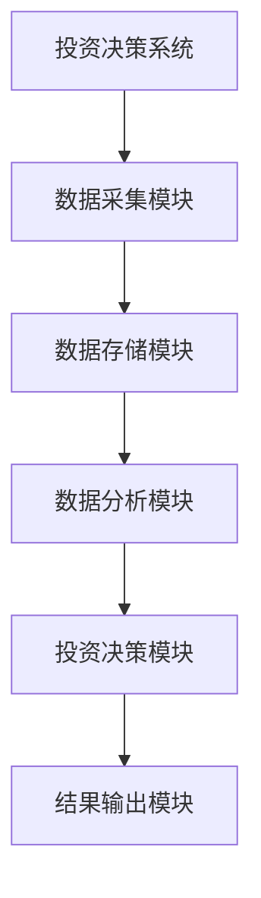
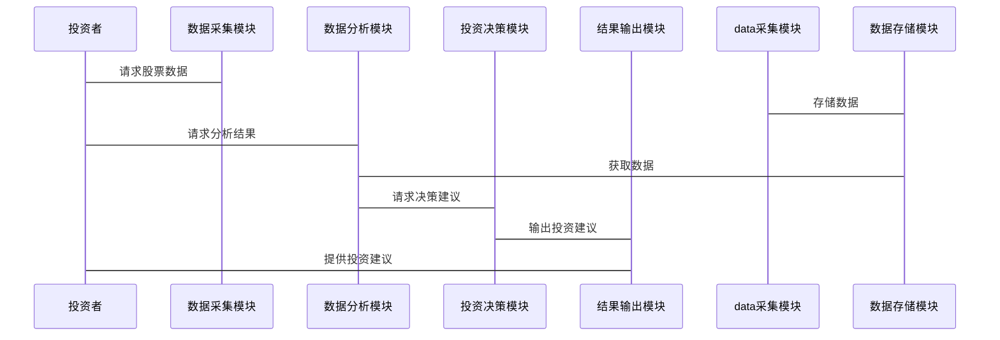

                 

<think>
嗯，用户让我详细分析彼得·林奇的“质量成长”投资方法论，并撰写一篇专业的技术博客。首先，我需要明确用户的需求，他们希望有一个结构清晰、内容详实的文章，涵盖投资的基本概念、彼得林奇的背景、质量成长法的核心理论、策略与实践、系统分析以及项目实战。

我应该从背景介绍开始，解释什么是投资，然后介绍彼得林奇及其投资理念。接下来，详细阐述质量成长法的定义、特点和与其他投资方法的区别。这部分需要包括数学公式，比如市盈率、市净率和ROE的计算，帮助读者理解评估公司质量的方法。

然后，我需要分析投资的理论基础，包括基本面分析和成长性评估，可能需要使用财务报表的关键指标，如收入、利润和现金流。这部分要详细讲解，确保读者能够理解如何评估公司的财务健康状况。

在策略与实践部分，我应该探讨如何筛选优质成长股，制定投资组合，以及风险管理。这部分需要实际案例，比如苹果公司的分析，帮助读者理解如何应用质量成长法。

接下来，系统分析与架构设计部分，我需要构建一个投资决策系统，包括数据采集、分析和决策模块，并用Mermaid图展示系统架构和流程，确保结构清晰。

项目实战部分，我需要提供一个完整的投资案例，从筛选到分析，再到决策，一步步展示。同时，给出Python代码示例，计算市盈率，让读者可以实际操作。

最后，总结与启示部分，回顾整个方法论，强调长期投资和风险管理的重要性，并给出最佳实践的建议。

整个过程中，我需要确保内容逻辑严谨，结构紧凑，语言专业且易懂，满足用户对深度和详细分析的要求。
</think>

# 彼得林奇的"质量成长"投资方法论

> 关键词：投资方法论，彼得林奇，质量成长，投资策略，风险管理，财务分析，投资组合

> 摘要：本文深入分析了彼得林奇的"质量成长"投资方法论，从投资的基本概念、质量成长法的核心理论、策略与实践、系统分析与架构设计，到项目实战案例，全面解析了这一投资方法的原理与应用。文章结合数学公式、系统架构图和实际案例，详细阐述了如何通过基本面分析、财务指标评估、成长性预测等方法，构建优质成长股的投资组合，并通过系统化的投资决策过程实现长期稳健的投资收益。

---

## 第一部分: 投资的基本概念与背景

### 第1章: 投资的基本概念与背景

#### 1.1 投资的基本概念

- **投资的定义**：投资是指将资金投入到某个领域或资产中，以期望在未来获得超过初始投入的价值或收益的过程。
- **投资的分类**：根据投资对象的不同，可以分为股票、债券、房地产、基金等多种类型。股票投资是最常见的形式之一，也是本文的重点。
- **股票市场的基本运作原理**：股票市场是一个交易公司股份的市场，投资者通过买卖股票实现资本增值。股票价格受多种因素影响，包括公司业绩、市场情绪、宏观经济环境等。

#### 1.2 彼得林奇的生平与投资理念

- **彼得林奇的个人经历**：彼得·林奇（Peter Lynch）是美国著名的职业基金经理人，曾管理富达麦哲伦基金（Fidelity Magellan Fund）长达13年，取得了卓越的投资业绩。
- **"质量成长"投资方法的形成背景**：20世纪80年代，美国经济经历了快速增长期，许多优质公司实现了持续的业绩增长。彼得林奇通过长期观察和实践，总结出一套以公司质量与成长性为核心的投资方法。
- **投资哲学**：彼得林奇认为，投资的本质是寻找那些具有持续竞争优势、管理优秀、财务健康且估值合理的公司。他强调长期投资，避免短期波动的干扰。

---

## 第二部分: "质量成长"投资方法论的核心理论

### 第2章: 质量成长投资法的核心概念

#### 2.1 "质量成长"投资法的定义

- **质量成长法的定义**：质量成长投资法是一种以公司质量与成长性为核心的投资策略。它不仅关注公司的当前财务状况，还关注公司未来增长的潜力。
- **质量成长法的核心要素**：
  1. **公司质量**：公司具有强大的竞争优势、良好的管理团队、健康的财务状况。
  2. **成长性**：公司具有持续增长的潜力，体现在收入、利润和市场份额的增长上。
  3. **估值合理**：公司股票的市场价格与其内在价值相符，避免过高或过低的估值。

#### 2.2 质量成长投资法的理论基础

- **基本面分析**：基本面分析是质量成长投资法的核心方法之一。通过分析公司的财务报表，评估其盈利能力、资产负债情况和现金流状况。
- **成长性评估**：成长性评估是通过分析公司的收入增长率、净利润增长率和市场份额扩张潜力，判断公司未来是否具有持续增长的可能。
- **市场情绪与投资决策**：市场情绪往往会影响短期股价波动，但长期来看，优质公司的股价会反映其内在价值。因此，在投资决策中，需要结合市场情绪与基本面分析。

#### 2.3 质量成长投资法的数学模型

- **市盈率（P/E）**：市盈率是衡量股票估值的重要指标，计算公式为：
  $$ P/E = \frac{\text{市场价格}}{\text{每股收益}} $$
  如果P/E过高，说明市场可能对公司的未来增长预期过高，存在泡沫风险；如果P/E过低，可能意味着公司被市场低估。

- **市净率（P/B）**：市净率是股票的市场价格与每股净资产的比率，计算公式为：
  $$ P/B = \frac{\text{市场价格}}{\text{每股净资产}} $$
  该指标常用于评估银行、房地产等资产密集型行业的公司。

- **净资产收益率（ROE）**：ROE是衡量公司盈利能力的重要指标，计算公式为：
  $$ ROE = \frac{\text{净利润}}{\text{净资产}} $$
  ROE越高，说明公司利用股东资产创造利润的能力越强。

---

## 第三部分: 质量成长投资法的策略与实践

### 第3章: 质量成长投资法的策略与实践

#### 3.1 选股策略

- **优质公司的筛选标准**：
  1. 公司具有强大的竞争优势，如专利技术、品牌影响力或成本优势。
  2. 公司管理团队稳定且具有卓越的领导能力。
  3. 公司财务状况健康，收入和利润持续增长。
  4. 公司估值合理，市场价格与内在价值相符。

- **如何评估公司的成长性**：
  - 分析公司的收入增长率和净利润增长率。
  - 评估公司所在行业的增长潜力。
  - 考察公司的研发投入和创新能力。

#### 3.2 投资组合的构建与管理

- **资产配置原则**：质量成长投资法建议投资者将大部分资金投入到优质成长股中，同时配置少量防御性资产（如债券或现金）以分散风险。
- **定期调整投资组合**：定期审视投资组合中的个股表现，剔除不符合质量成长标准的股票，加入新的优质成长股。

#### 3.3 风险管理与心理控制

- **风险管理的核心原则**：
  - 设置止损点，避免单只股票的大幅亏损。
  - 分散投资，避免过度集中于某一只股票或行业。
  - 长期持有，避免频繁交易带来的交易成本和心理压力。

---

## 第四部分: 系统分析与架构设计

### 第4章: 系统分析与架构设计

#### 4.1 投资决策系统的构建

- **系统目标**：构建一个能够自动筛选优质成长股、评估投资风险并生成投资建议的决策支持系统。
- **功能需求**：
  1. 数据采集模块：实时采集股票市场数据，包括股价、财务报表等。
  2. 数据分析模块：对采集到的数据进行清洗、建模和分析，评估每只股票的质量和成长性。
  3. 投资决策模块：根据分析结果生成投资建议，包括买入、持有或卖出的信号。

#### 4.2 系统架构设计



#### 4.3 系统交互流程



---

## 第五部分: 项目实战

### 第5章: 项目实战

#### 5.1 环境安装与数据采集

- **环境安装**：安装Python、Pandas、Matplotlib等数据分析工具。
- **数据采集**：使用API接口获取股票市场数据，包括股价、财务报表等。

#### 5.2 核心代码实现

```python
import pandas as pd
import numpy as np

def calculate_pe_ratio(price, eps):
    return price / eps

def calculate_roe(net_income, total_equity):
    return net_income / total_equity

# 示例数据
prices = [100, 120, 90, 110]
eps_values = [10, 12, 8, 11]
roe_values = [0.2, 0.25, 0.15, 0.2]

# 计算市盈率和ROE
pe_ratios = [calculate_pe_ratio(p, e) for p, e in zip(prices, eps_values)]
roes = [calculate_roe(r, e) for r, e in zip(roes_values, eps_values)]
```

#### 5.3 案例分析

- **案例：苹果公司（AAPL）的投资分析**
  - **基本面分析**：苹果公司具有强大的品牌影响力、持续增长的收入和利润，ROE保持在较高水平。
  - **成长性评估**：苹果公司在科技领域不断创新，具有较大的市场增长潜力。
  - **估值分析**：根据市盈率和市净率评估，苹果公司的股价处于合理区间。

---

## 第六部分: 总结与启示

### 第6章: 总结与启示

#### 6.1 总结

- 彼得林奇的"质量成长"投资方法论强调长期投资、精选优质成长股。
- 通过基本面分析、成长性评估和估值分析，可以有效筛选出具有长期增长潜力的公司。
- 投资决策系统的构建为投资者提供了一个科学的投资工具，帮助实现更高效的投资决策。

#### 6.2 启示

- **长期投资的重要性**：短期市场波动难以预测，但优质公司的长期价值终将体现。
- **风险管理的必要性**：通过分散投资和心理控制，可以降低投资风险。
- **持续学习的价值**：投资是一个不断学习和进化的过程，需要关注市场变化和公司动态。

---

## 作者：AI天才研究院/AI Genius Institute & 禅与计算机程序设计艺术 /Zen And The Art of Computer Programming

