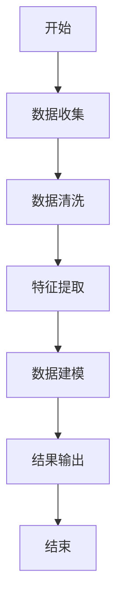
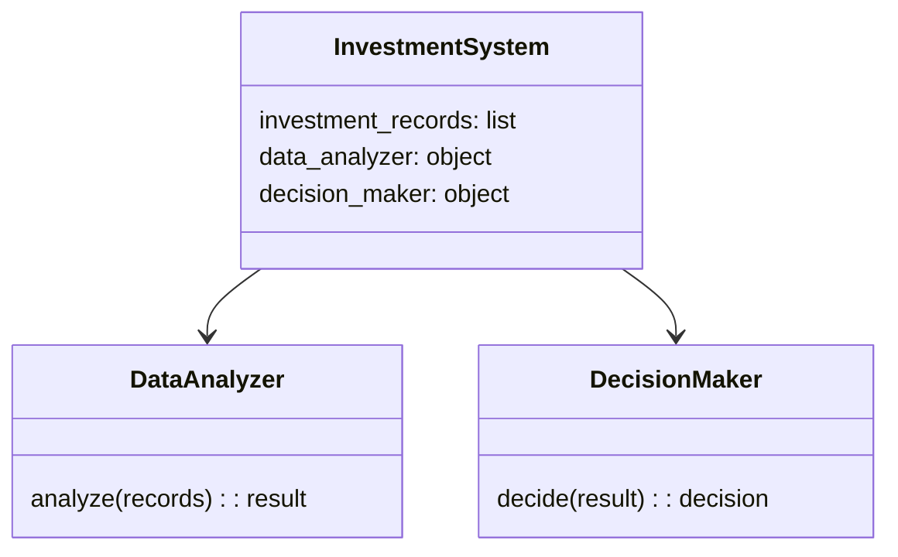
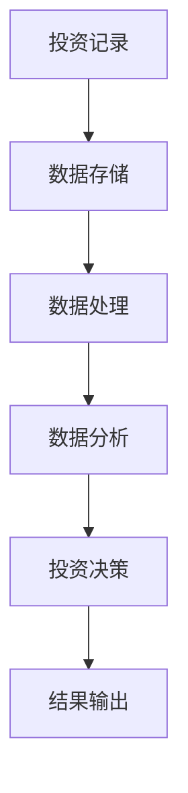

                 

<think>
好的，我需要帮助用户生成一篇关于彼得林奇“跟踪记录”投资法的技术博客。首先，我得理解用户的需求。他是一位技术专家，想要一篇结构清晰、逻辑严谨的专业博客，关键词包括彼得林奇、投资法、跟踪记录、投资组合优化、风险管理等。

用户希望文章有摘要，然后按照目录大纲详细展开，每个章节都要有具体的内容，包括背景介绍、核心概念、算法实现、系统架构、项目实战等。同时，文章需要使用技术语言，有图表和代码示例，确保内容专业且易懂。

首先，我得确定文章的结构是否符合要求。用户已经提供了目录，我需要确保每个部分都详细展开。比如，第一部分是背景介绍，需要包括彼得林奇的投资理念和“跟踪记录”法的起源。

接下来，核心概念部分需要详细解释跟踪记录法的定义、属性对比和与传统方法的区别，可能需要用表格或图表来展示。

然后，算法实现部分需要用流程图和代码来说明，确保读者能理解如何将投资理念转化为具体步骤。

系统架构部分可能需要描述如何构建投资系统，包括功能模块、类图和架构图，帮助读者理解整体结构。

项目实战部分要提供一个案例，用Python代码模拟投资组合的构建和分析过程，让读者能够实际操作。

最后，加上小结、注意事项和拓展阅读，帮助读者巩固知识并进一步学习。

在撰写过程中，我要确保每个部分都覆盖了用户的要求，比如使用正确的技术术语、详细的解释和实际案例。同时，语言要专业但清晰，避免过于复杂的术语，确保读者能够轻松理解。

现在，我需要检查每个章节是否都符合要求，是否有遗漏的部分，确保文章结构完整，内容详实。特别是数学公式和代码示例，需要准确无误，避免错误影响读者的理解。

总的来说，我需要一步步按照用户的指导，确保每部分内容都到位，最终生成一篇高质量的技术博客，满足用户的需求。
</think>

# 彼得林奇的"跟踪记录"投资法

> 关键词：彼得林奇，投资法，跟踪记录，投资组合优化，风险管理

> 摘要：彼得·林奇作为投资界的传奇人物，他的“跟踪记录”投资法是一种通过持续记录和分析投资行为来优化投资决策的方法。本文详细介绍了该方法的核心理念、实现步骤、算法模型、系统架构以及实际案例，帮助读者理解并应用这一投资策略。

---

## 第一部分: 背景介绍

### 第1章: 投资法的背景与核心概念

#### 1.1 投资法的背景介绍

- **彼得·林奇的投资理念**  
  彼得·林奇是美国著名投资专家，以其在富达投资集团的任职期间创造了卓越的投资业绩而闻名。他的投资理念强调长期投资、价值发现和风险管理。

- **"跟踪记录"投资法的起源与演变**  
  彼得·林奇在长期的投资实践中，逐渐形成了“跟踪记录”投资法。这种方法的核心在于通过持续记录和分析投资行为，发现投资中的问题并及时调整策略。

- **该方法在现代投资中的地位与作用**  
  在现代投资学中，“跟踪记录”投资法作为一种实践性极强的方法，能够帮助投资者更直观地分析投资行为，优化投资组合，降低风险。

#### 1.2 核心概念与定义

- **"跟踪记录"的定义与内涵**  
  “跟踪记录”是指投资者对每次投资行为进行详细记录，并对这些记录进行系统分析的过程。通过记录和分析，投资者可以发现投资中的规律，优化投资策略。

- **投资记录的核心要素与属性对比表**  
  下表对比了传统投资方法与“跟踪记录”投资法的核心要素：

| 方法 | 核心要素 | 详细描述 |
|------|----------|----------|
| 传统投资 | 投资决策 | 基于市场分析和财务指标 |
| 跟踪记录 | 记录行为 | 记录每次投资的时间、金额、资产类型等 |

- **"跟踪记录"与传统投资方法的对比（Mermaid表格）**  
  以下是两种方法的对比表格：

```mermaid
table
传统投资方法 | 跟踪记录方法
------------|--------------
基于市场分析 | 基于投资行为记录
依赖财务指标 | 依赖投资记录分析
注重市场趋势 | 注重投资行为规律
```

---

## 第二部分: 核心原理

### 第2章: "跟踪记录"投资法的核心原理

#### 2.1 投资法的原理与机制

- **投资记录的形成过程**  
  投资者需要记录每次投资的具体信息，包括投资时间、金额、资产类型、市场状况等。

- **数据收集与分析的逻辑**  
  通过收集投资记录，投资者可以分析投资行为中的规律，发现潜在的问题，优化投资策略。

- **投资决策的动态调整机制**  
  通过持续跟踪记录，投资者可以根据市场变化和自身投资行为的分析结果，动态调整投资策略。

#### 2.2 投资法的数学模型与公式

- **投资组合的数学表达式**  
  $$投资组合价值 = \sum_{i=1}^{n} w_i \cdot P_i$$  
  其中，$w_i$ 是第 $i$ 项资产的投资权重，$P_i$ 是第 $i$ 项资产的价格。

- **风险与收益的平衡公式**  
  $$风险调整后收益 = R_i - R_f$$  
  其中，$R_i$ 是投资收益，$R_f$ 是无风险收益率。

---

## 第三部分: 算法实现

### 第3章: 投资法的算法实现

#### 3.1 算法原理与流程

- **数据收集与预处理流程（Mermaid流程图）**  
  下图展示了“跟踪记录”投资法的数据处理流程：



- **算法实现代码示例**

  ```python
  import pandas as pd

  # 数据加载与清洗
  data = pd.read_csv('investment_records.csv')
  data = data.dropna().reset_index(drop=True)
  ```

  ```python
  def investment_decision(data):
      # 计算平均收益率
      avg_return = data['return'].mean()
      # 计算波动率
      volatility = data['return'].std()
      # 决策逻辑
      if avg_return > 0.05 and volatility < 0.1:
          return "买入"
      else:
          return "观望"
  ```

---

## 第四部分: 系统架构与设计

### 第4章: 投资法的系统架构与设计

#### 4.1 系统功能设计

- **系统功能模块**  
  下图展示了“跟踪记录”投资法的系统功能模块：



- **系统架构设计（Mermaid架构图）**  
  下图展示了系统的整体架构：



---

## 第五部分: 项目实战

### 第5章: 项目实战与案例分析

#### 5.1 项目环境安装

- **所需工具与库**  
  本项目需要以下工具和库：
  - Python
  - Pandas
  - Matplotlib

#### 5.2 系统核心实现源代码

  ```python
  import pandas as pd
  import matplotlib.pyplot as plt

  # 数据加载与清洗
  data = pd.read_csv('investment_records.csv')
  data = data.dropna().reset_index(drop=True)

  # 数据可视化
  data['return'].plot.hist(bins=20)
  plt.show()
  ```

#### 5.3 代码应用解读与分析

- **代码解读**  
  上述代码首先加载数据，然后进行数据清洗，最后对投资收益进行可视化分析。通过分析收益分布，投资者可以发现收益的波动性，从而优化投资策略。

---

## 第六部分: 最佳实践与小结

### 第6章: 最佳实践与小结

#### 6.1 最佳实践 tips

- **持续记录投资行为**  
  投资者应坚持记录每次投资行为，包括投资金额、时间、资产类型等。

- **定期分析与调整**  
  投资者应定期分析投资记录，发现投资中的问题并及时调整策略。

#### 6.2 小结

“跟踪记录”投资法是一种实践性极强的投资方法，通过持续记录和分析投资行为，投资者可以优化投资策略，降低投资风险。

#### 6.3 注意事项

- **数据准确性**  
  投资记录的数据必须准确，否则分析结果将失去意义。

- **及时性**  
  投资记录的分析应尽量及时，以便及时发现和调整问题。

#### 6.4 拓展阅读

- **推荐书籍**  
  《彼得·林奇的投资心理分析》

---

## 结语

彼得·林奇的“跟踪记录”投资法是一种简单而有效的投资方法。通过持续记录和分析投资行为，投资者可以发现投资中的规律，优化投资策略，降低投资风险。

---

**作者：AI天才研究院/AI Genius Institute & 禅与计算机程序设计艺术 /Zen And The Art of Computer Programming**

