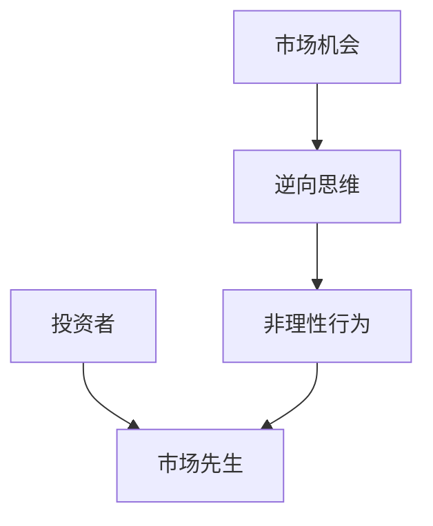
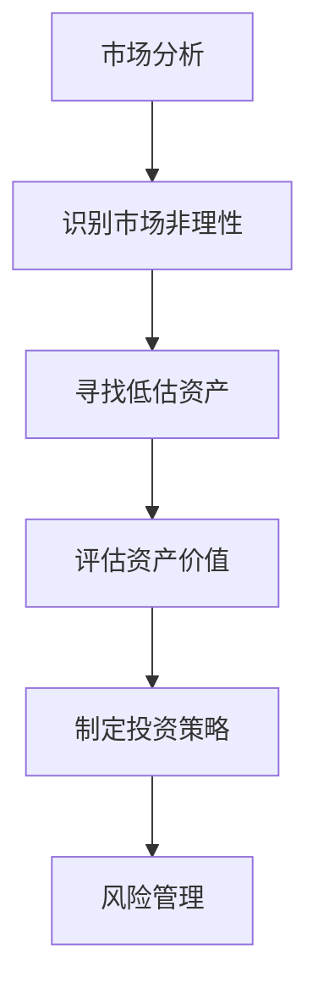
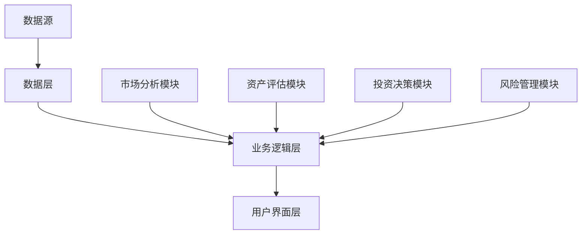
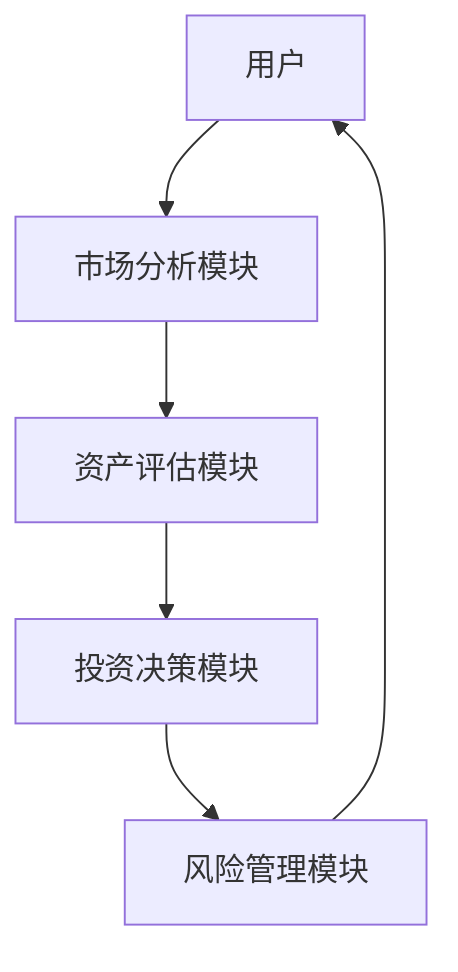

                 

<think>
嗯，我现在需要写一篇关于彼得·林奇逆向思维投资技巧的博客文章。首先，我得弄清楚什么是逆向思维投资。彼得·林奇是著名的基金经理，他主张在市场恐慌时买入，市场狂热时卖出。这种逆向思维跟一般的顺势投资相反。

我应该先从介绍彼得·林奇的背景开始。他管理过麦哲伦基金，取得了非常不错的成绩，这和他的投资理念密切相关。然后，解释逆向思维的核心概念，比如市场先生理论。这部分需要详细讲解，可能还要举一些实际的例子，让读者更容易理解。

接下来，我得讲讲逆向思维的五个关键步骤。这包括确定市场趋势、识别非理性行为、寻找低估资产、把握时机以及风险管理。每个步骤都需要详细展开，最好能配上实际的案例，说明在实际操作中如何应用这些步骤。

数学模型方面，我需要提到价值评估的基本公式，比如市盈率、市净率等。这些指标在彼得·林奇的选股过程中非常重要，可以用来判断一个公司是否被低估。可能还需要写一些简单的计算公式，比如市盈率=股价/每股收益，这样读者可以更直观地理解。

在系统分析部分，我应该设计一个投资决策框架。这个框架可能包括数据收集、分析、决策三个模块。用mermaid画个流程图，展示各个模块之间的关系。同时，给出系统架构设计，比如分层架构，展示数据层、业务逻辑层和用户界面层。

项目实战部分，我需要选择一个具体的案例，比如如何应用逆向思维策略在2008年金融危机后的市场中寻找被低估的股票。详细描述整个过程，包括市场分析、公司基本面分析、财务指标评估等，然后解释如何通过逆向思维找到合适的投资标的。

最后，给出一些最佳实践的建议，比如如何管理投资组合，如何应对市场波动，以及持续学习的重要性。这些内容可以帮助读者更好地应用逆向思维策略。

现在，我需要把这些内容组织成一个结构清晰的文章，确保每一部分都详细且有深度。同时，使用专业但易懂的语言，让读者能够逐步理解和掌握逆向思维投资的精髓。

可能还需要检查一下，是否所有章节都覆盖了必要的内容，是否有遗漏的关键点。比如，在系统架构部分，是否详细描述了各个模块的功能，是否有足够的图表支持。另外，案例分析是否具体，能否帮助读者理解逆向思维的实际应用。

总之，我需要一步步地构建这篇文章，确保每一部分都详尽且逻辑清晰，最终为读者提供一篇有价值的技术博客，帮助他们掌握彼得·林奇的逆向思维投资技巧。
</think>

# 彼得林奇的"逆向思维"投资技巧

> 关键词：逆向思维，彼得·林奇，投资策略，价值评估，市场分析，风险管理

> 摘要：本文深入探讨了彼得·林奇的逆向思维投资技巧，分析了其核心概念、数学模型、系统架构及项目实战。通过案例分析和最佳实践，详细讲解了如何在市场非理性时反向操作，寻找被低估的资产，实现长期稳定的收益。

---

## 第1章: 逆向思维投资概述

### 1.1 逆向思维投资的定义与特点
逆向思维投资是一种不同于传统顺势投资的策略，强调在市场非理性时反向操作。其核心在于利用市场的短期波动，寻找长期低估的资产。

- **逆向思维的定义**：在市场恐慌或狂热时，采取与市场情绪相反的行动。
- **逆向思维在投资中的独特优势**：能够在市场底部买入，在顶部卖出，实现超额收益。
- **彼得·林奇与逆向思维投资的结合**：林奇通过逆向思维成功管理麦哲伦基金，创造了长期稳定的收益。

### 1.2 彼得·林奇的背景与投资理念
彼得·林奇是美国著名的基金经理，管理麦哲伦基金期间取得了卓越成绩。他的投资理念以逆向思维为核心，强调价值投资和长期持有。

- **彼得·林奇的生平简介**：出生于1949年，曾在富达投资管理麦哲伦基金，创造了年化13%的回报率。
- **林奇的投资哲学**：坚持价值投资，寻找基本面良好的公司，避免短期市场波动的影响。
- **林奇逆向思维的核心思想**：在市场恐慌时买入，在市场狂热时卖出，关注长期价值而非短期价格波动。

### 1.3 逆向思维投资的适用场景
逆向思维投资适用于市场恐慌和狂热的极端情况，尤其在市场非理性时能够创造投资机会。

- **市场恐慌时期的逆向思维**：利用市场的恐慌情绪，寻找被低估的资产。
- **市场狂热时期的逆向思维**：当市场狂热时，寻找高估的资产，准备卖出。
- **逆向思维在选股中的应用**：通过分析公司基本面，寻找被市场忽视的优质公司。

### 1.4 逆向思维投资的边界与外延
逆向思维投资并非万能策略，其应用需要考虑市场环境和公司基本面。

- **逆向思维的边界条件**：市场波动过大时，逆向思维可能失效。
- **逆向思维与其他投资策略的对比**：相比顺势投资，逆向思维更注重长期价值。
- **逆向思维的局限性与注意事项**：避免在市场稳定时过度逆向操作。

## 第2章: 逆向思维的核心概念

### 2.1 市场先生理论
市场先生理论是逆向思维的重要基础，认为市场情绪波动会影响资产价格。

- **市场先生的概念**：市场情绪的化身，代表市场的波动性。
- **市场先生的波动性**：市场情绪的波动会导致资产价格的短期偏离。
- **市场先生与逆向思维的关系**：在市场先生情绪低落时，逆向思维投资者可以买入；在市场先生情绪高涨时，逆向思维投资者可以卖出。

### 2.2 非理性行为与市场机会
投资者的非理性行为是逆向思维投资的机会来源。

- **投资者心理偏差的分析**：认知偏差、过度自信、从众心理等。
- **非理性行为的典型案例**：2008年金融危机期间，投资者恐慌性抛售，导致优质资产价格被低估。
- **非理性行为如何创造投资机会**：通过识别市场非理性行为，寻找低估资产。

### 2.3 逆向思维的五个关键步骤
逆向思维投资需要系统性的步骤，以确保在不同市场环境下做出正确决策。

- **确定市场趋势**：分析市场整体趋势，判断当前市场处于牛市还是熊市。
- **寻找市场非理性**：识别市场中的恐慌或狂热情绪，寻找偏离长期价值的资产。
- **识别低估资产**：通过基本面分析，寻找被市场低估的优质公司。
- **把握投资时机**：在市场恐慌时买入，在市场狂热时卖出。
- **风险管理与仓位控制**：合理控制投资仓位，避免过度集中风险。

### 2.4 核心概念对比表
| 概念 | 描述 | 对比分析 |
|------|------|----------|
| 逆向思维 | 在市场非理性时反向操作 | 与顺势思维相反 |
| 市场先生 | 市场情绪的化身 | 投资者决策的关键影响因素 |
| 非理性行为 | 投资者心理偏差 | 市场机会的来源 |

### 2.5 实体关系图


## 第3章: 逆向思维的数学模型与算法

### 3.1 逆向思维的数学模型
逆向思维投资需要借助数学模型来评估资产的价值。

- **价值评估模型**：通过基本面分析，计算公司的真实价值。
  - 市盈率（P/E）= 股价 / 每股收益
  - 市净率（P/B）= 股价 / 每股净资产
  - 股息率 = 每股股息 / 股价
- **估值偏差模型**：比较市场价格与内在价值的差异，判断资产是否被低估。

### 3.2 逆向思维的算法流程
逆向思维投资的算法流程如下：



### 3.3 逆向思维的Python实现
以下是逆向思维投资策略的Python实现示例：

```python
import pandas as pd
import numpy as np

# 数据获取
data = pd.read_csv('stock_data.csv')

# 计算市盈率和市净率
data['PE'] = data['Price'] / data['EPS']
data['PB'] = data['Price'] / data['BVPS']

# 识别低估资产
低估资产 = data[(data['PE'] < data['PE'].mean()) & (data['PB'] < data['PB'].mean())]

# 输出结果
print(低估资产)
```

## 第4章: 逆向思维的系统架构设计

### 4.1 系统功能设计
逆向思维投资系统需要具备以下功能：

- 数据收集与处理：获取市场数据，包括价格、成交量等。
- 市场分析：识别市场趋势和非理性行为。
- 资产评估：计算资产的内在价值，判断是否低估。
- 投资决策：根据分析结果，制定买入或卖出策略。
- 风险管理：控制投资风险，优化投资组合。

### 4.2 系统架构设计
逆向思维投资系统的架构设计如下：



### 4.3 系统接口设计
系统接口设计包括：

- 数据接口：获取市场数据，如股票价格、财务指标。
- 分析接口：调用市场分析模块，识别市场非理性。
- 决策接口：根据分析结果，制定投资策略。

### 4.4 系统交互流程
系统交互流程如下：



## 第5章: 逆向思维投资的项目实战

### 5.1 项目背景
以2008年金融危机为例，逆向思维投资能够在市场恐慌时找到被低估的资产。

### 5.2 项目目标
通过逆向思维策略，寻找被市场低估的优质公司，实现长期收益。

### 5.3 项目实施
1. **市场分析**：识别市场的恐慌情绪，判断是否存在非理性下跌。
2. **资产筛选**：通过市盈率、市净率等指标，筛选出被低估的资产。
3. **投资决策**：在市场恐慌时买入被低估的资产，在市场狂热时卖出高估的资产。
4. **风险管理**：合理控制仓位，分散投资风险。

### 5.4 项目成果
通过逆向思维投资策略，能够在市场底部买入，在市场顶部卖出，实现超额收益。

## 第6章: 逆向思维投资的最佳实践

### 6.1 小结
逆向思维投资是一种有效的投资策略，能够在市场非理性时创造价值。

### 6.2 注意事项
- **避免过度逆向操作**：在市场稳定时，应避免过度逆向操作。
- **控制风险**：合理控制投资风险，避免因市场波动导致的损失。
- **持续学习**：不断学习市场知识，提升自己的分析能力。

### 6.3 拓展阅读
- 彼得·林奇的书籍：《彼得·林奇的投资哲学》、《彼得·林奇的成功投资》。
- 相关理论：行为金融学、市场情绪分析。

## 第7章: 结语

逆向思维投资是一种需要耐心和纪律的投资策略，能够在市场非理性时创造价值。通过系统化的分析和合理的风险管理，投资者可以在长期实现稳定的收益。

---

作者：AI天才研究院/AI Genius Institute & 禅与计算机程序设计艺术 /Zen And The Art of Computer Programming

