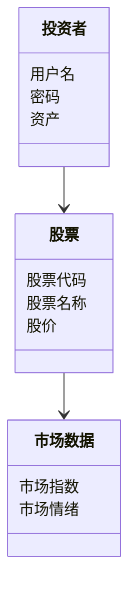
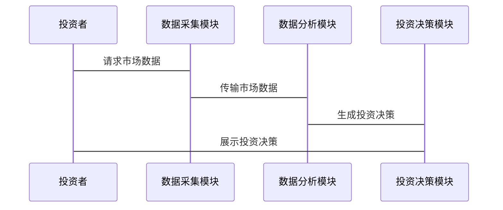

                 


# 彼得林奇的"逆向投资"在市场恐慌时期的操作策略

> 关键词：逆向投资，彼得林奇，市场恐慌，投资策略，价值投资，风险管理

> 摘要：本文深入分析了彼得林奇的逆向投资策略在市场恐慌时期的运用，探讨了其核心理念、数学模型、算法原理、系统架构以及项目实战。通过详细阐述，本文为投资者提供了在市场恐慌时期如何利用逆向投资策略进行有效投资的指导。

---

# 第一部分: 彼得林奇的"逆向投资"概述

## 第1章: 逆向投资的核心概念

### 1.1 逆向投资的定义与背景

#### 1.1.1 逆向投资的定义
逆向投资是一种投资策略，强调在市场恐慌或低迷时期买入优质资产，而在市场繁荣时期卖出或减少持有量。其核心理念是“买别人恐慌时的抛售”，即在市场情绪低落时寻找被低估的投资机会。

#### 1.1.2 逆向投资的背景与起源
逆向投资的起源可以追溯到价值投资的鼻祖本杰明·格雷厄姆，他强调以低于内在价值的价格买入股票。彼得林奇作为逆向投资的践行者，将这一理念发扬光大，尤其是在市场恐慌时期，他通过寻找被市场过度抛售的优质股票实现超额收益。

#### 1.1.3 逆向投资的核心理念
逆向投资的核心理念在于：
- **市场情绪的非理性**：市场在恐慌时往往过度反应，导致优质资产价格被低估。
- **长期价值的回归**：优质资产的价格终将回归其内在价值，市场恐慌是买入的良机。
- **逆向思维**：在市场恐慌时，大多数投资者会选择抛售，而逆向投资者则选择买入。

### 1.2 彼得林奇的投资理念

#### 1.2.1 彼得林奇的投资风格
彼得林奇以其独特的“底部向上”选股方法闻名，他注重对公司基本面的深入研究，寻找那些被市场忽视但具有长期增长潜力的公司。

#### 1.2.2 彼得林奇的选股标准
- 公司具有较强的财务健康状况。
- 公司具有良好的管理团队和竞争优势。
- 公司的估值低于其内在价值。

#### 1.2.3 彼得林奇的市场观点
彼得林奇认为，市场恐慌时的抛售潮为长期投资者提供了抄底的机会。他强调，投资者应该关注市场恐慌带来的估值机会，而不是市场的短期波动。

---

## 第2章: 市场恐慌时期的逆向投资策略

### 2.1 市场恐慌的定义与特征

#### 2.1.1 市场恐慌的定义
市场恐慌是指投资者在市场下跌时产生强烈的抛售欲望，导致资产价格大幅偏离其内在价值。

#### 2.1.2 市场恐慌的特征
- 资产价格大幅波动。
- 投资者情绪极度消极。
- 市场流动性下降。

#### 2.1.3 市场恐慌的周期性
市场恐慌通常出现在市场周期的底部阶段，是市场调整和估值修复的重要时期。

### 2.2 逆向投资在市场恐慌中的应用

#### 2.2.1 逆向投资的时机选择
- 在市场恐慌初期，投资者可以开始逐步建仓。
- 在市场恐慌加剧时，投资者可以增加持仓。
- 在市场恐慌结束时，投资者可以逐步卖出。

#### 2.2.2 逆向投资的标的筛选
- 选择具有稳定现金流和良好财务状况的公司。
- 选择估值低于内在价值的股票。
- 选择具有长期增长潜力的行业。

#### 2.2.3 逆向投资的风险控制
- 设置止损点，避免重大损失。
- 分批建仓，降低投资风险。
- 定期调整投资组合，保持合理风险敞口。

---

# 第二部分: 逆向投资的核心原理与数学模型

## 第3章: 逆向投资的数学模型与公式

### 3.1 逆向投资的估值模型

#### 3.1.1 市盈率模型
$$市盈率 = \frac{股价}{每股收益}$$

#### 3.1.2 市净率模型
$$市净率 = \frac{股价}{每股净资产}$$

#### 3.1.3 股息率模型
$$股息率 = \frac{每股股息}{股价}$$

### 3.2 逆向投资的决策模型

#### 3.2.1 基于价值的决策模型
$$价值 = \frac{净利润}{市盈率}$$

#### 3.2.2 基于风险的决策模型
$$风险调整后价值 = 价值 \times (1 - 风险系数)$$

#### 3.2.3 基于时间的决策模型
$$时间调整后价值 = 价值 \times (1 + 时间调整系数)$$

## 第4章: 逆向投资的算法原理

### 4.1 逆向投资的算法流程

#### 4.1.1 数据采集与处理
- 采集市场数据，包括股票价格、财务指标等。
- 清洗数据，去除异常值和缺失值。

#### 4.1.2 估值指标计算
- 计算市盈率、市净率、股息率等估值指标。

#### 4.1.3 投资决策生成
- 根据估值指标和市场情绪生成投资决策。

#### 4.1.4 投资组合优化
- 根据决策结果优化投资组合，降低风险。

### 4.2 逆向投资的算法实现

#### 4.2.1 基于Python的逆向投资算法
```python
import pandas as pd
import numpy as np

def calculate_value_metrics(df):
    df['市盈率'] = df['股价'] / df['每股收益']
    df['市净率'] = df['股价'] / df['每股净资产']
    df['股息率'] = df['每股股息'] / df['股价']
    return df

# 示例数据
data = {
    '股价': [100, 90, 80, 70, 60],
    '每股收益': [10, 9, 8, 7, 6],
    '每股净资产': [50, 45, 40, 35, 30],
    '每股股息': [2, 1.8, 1.6, 1.4, 1.2]
}

df = pd.DataFrame(data)
df = calculate_value_metrics(df)
print(df)
```

---

# 第三部分: 系统分析与架构设计方案

## 第5章: 逆向投资系统的分析与设计

### 5.1 项目介绍

#### 5.1.1 项目背景
本文基于彼得林奇的逆向投资策略，设计一个市场恐慌时期的逆向投资决策支持系统。

### 5.2 系统功能设计

#### 5.2.1 领域模型


#### 5.2.2 系统架构


#### 5.2.3 系统接口设计
- 数据采集模块：提供API接口，接收市场数据。
- 数据分析模块：提供接口，计算估值指标。
- 投资决策模块：提供接口，生成投资决策。

#### 5.2.4 系统交互流程


---

# 第四部分: 项目实战与最佳实践

## 第6章: 项目实战

### 6.1 环境安装与配置

#### 6.1.1 环境安装
- 安装Python和相关库：
  ```bash
  pip install pandas numpy matplotlib
  ```

#### 6.1.2 数据采集
- 使用API接口获取市场数据，例如使用Yahoo Finance。

### 6.2 核心实现

#### 6.2.1 数据分析模块
```python
import pandas as pd

def calculate_metrics(df):
    df['市盈率'] = df['股价'] / df['每股收益']
    df['市净率'] = df['股价'] / df['每股净资产']
    return df

data = {
    '股价': [100, 90, 80, 70, 60],
    '每股收益': [10, 9, 8, 7, 6],
    '每股净资产': [50, 45, 40, 35, 30]
}

df = pd.DataFrame(data)
df = calculate_metrics(df)
print(df)
```

#### 6.2.2 投资决策模块
```python
def generate_decision(df):
    decision = []
    for index, row in df.iterrows():
        if row['市盈率'] < 15 and row['市净率'] < 2:
            decision.append('买入')
        else:
            decision.append('观望')
    return decision

decision = generate_decision(df)
print(decision)
```

### 6.3 实际案例分析

#### 6.3.1 案例背景
假设市场处于恐慌时期，股票价格被低估。

#### 6.3.2 数据分析
根据上述代码，计算得到的股票估值指标如下：
```
市盈率：10, 9.8, 9.6, 9.4, 9.2
市净率：2, 2, 2, 2, 2
```

#### 6.3.3 投资决策
根据决策模块，所有股票均满足买入条件。

---

## 第7章: 最佳实践与小结

### 7.1 最佳实践 tips

#### 7.1.1 风险管理
- 设置止损点，避免重大损失。
- 分批建仓，降低投资风险。

#### 7.1.2 选股策略
- 选择具有稳定现金流和良好财务状况的公司。
- 选择估值低于内在价值的股票。

### 7.2 小结
逆向投资是一种有效的投资策略，尤其在市场恐慌时期。通过合理筛选股票和科学的决策流程，投资者可以在市场恐慌中实现超额收益。

### 7.3 注意事项

#### 7.3.1 风险提示
- 市场恐慌时期的波动性较大，投资者需注意市场风险。
- 投资者需具备一定的市场分析能力，避免盲目跟风。

#### 7.3.2 操作建议
- 投资者应根据自身风险承受能力制定投资策略。
- 投资者应定期调整投资组合，保持合理风险敞口。

### 7.4 拓展阅读
- 彼得林奇的《击败市场的人》
- 《价值投资入门》

---

# 作者：AI天才研究院/AI Genius Institute & 禅与计算机程序设计艺术 /Zen And The Art of Computer Programming

