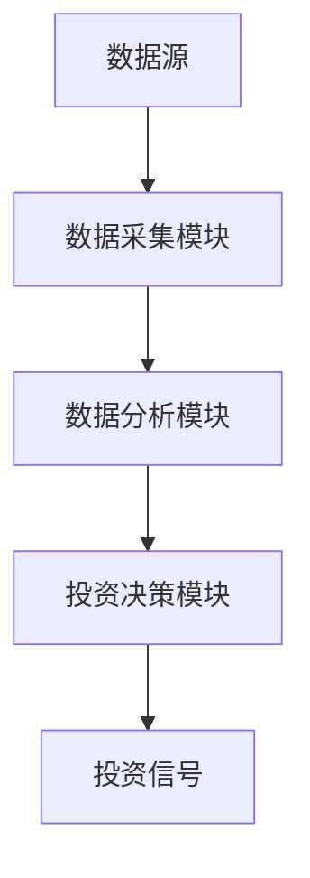

                 


# 彼得林奇的"逆向投资"思想

> 关键词：逆向投资、彼得林奇、投资策略、价值评估、市场分析

> 摘要：逆向投资是一种在金融市场中通过反向思维进行投资的策略，强调在市场低迷时买入，在市场繁荣时卖出。本文详细阐述了彼得林奇的逆向投资思想，分析其核心概念、数学模型、算法实现及系统架构，通过实际案例展示其在投资中的应用，为投资者提供深度的理论和实践指导。

---

# 第一部分: 逆向投资的背景与核心概念

## 第1章: 逆向投资的背景与发展

### 1.1 逆向投资的起源与发展

逆向投资是一种与传统投资策略相反的思维方式，其核心在于“买别人不买，卖别人不卖”。彼得·林奇作为逆向投资的代表人物，他的投资理念深刻影响了现代金融理论和实践。

#### 1.1.1 投资学的演变历程

投资学从早期的“买低卖高”原则，逐渐发展为以价值评估、风险管理和资产配置为核心的现代投资理论。逆向投资作为其中的一种策略，强调在市场恐慌时寻找低估资产，在市场狂热时规避风险。

#### 1.1.2 彼得林奇与逆向投资的关联

彼得·林奇以其独特的逆向投资策略闻名，他在《彼得·林奇的选股术》等著作中详细阐述了这一理念。他强调关注市场的非理性波动，寻找被市场忽视的低估股票。

#### 1.1.3 逆向投资在现代金融中的地位

逆向投资不仅是投资策略的一部分，更是金融市场中的一种行为学现象。它帮助投资者在市场波动中发现价值，实现超额收益。

### 1.2 逆向投资的核心概念

逆向投资的核心概念包括市场波动、投资者心理、资产定价等。

#### 1.2.1 投资的基本原理

投资的本质是通过合理配置资产，在承担风险的同时追求收益最大化。逆向投资强调在市场低估时投资，市场高估时退出。

#### 1.2.2 逆向投资的定义与特征

逆向投资是一种在市场低点买入、高点卖出的投资策略，其特征包括反周期性、逆向性、长期性等。

#### 1.2.3 逆向投资的边界与外延

逆向投资的边界在于市场的有效性，其外延涉及多种投资策略，如价值投资、成长投资等。

---

## 第2章: 逆向投资的核心理论与模型

### 2.1 逆向投资的理论基础

逆向投资的理论基础包括现代投资组合理论、行为金融学等。

#### 2.1.1 现代投资组合理论

现代投资组合理论（MPT）由哈里·马科维茨提出，强调通过分散投资降低风险。逆向投资在MPT的基础上，进一步优化了资产配置策略。

#### 2.1.2 行为金融学的视角

行为金融学研究投资者的心理偏差，逆向投资利用市场非理性行为，寻找低估资产。

#### 2.1.3 市场无效与套利机会

市场无效性为逆向投资提供了机会，套利者通过发现价格偏差获利。

### 2.2 逆向投资的核心模型

逆向投资的核心模型包括资产定价模型（CAPM）、风险溢价模型等。

#### 2.2.1 资产定价模型（CAPM）

CAPM公式：$$ E(r_i) = r_f + β_i (E(r_m) - r_f) $$

其中，$E(r_i)$ 是资产的预期收益率，$r_f$ 是无风险利率，$β_i$ 是资产的贝塔系数，$E(r_m)$ 是市场预期收益率。

#### 2.2.2 风险溢价与市场预期

逆向投资通过分析风险溢价和市场预期，寻找被低估的资产。

#### 2.2.3 逆向投资的数学模型

逆向投资的数学模型基于市场波动和资产定价，通过统计分析发现投资机会。

---

## 第3章: 逆向投资的策略与实施

### 3.1 逆向投资的策略选择

逆向投资策略包括时机选择、风险控制等。

#### 3.1.1 价值投资与成长投资的对比

价值投资注重资产的内在价值，成长投资注重未来的增长潜力。逆向投资结合两者，寻找被低估的成长股。

#### 3.1.2 逆向投资的时机选择

逆向投资强调在市场低点买入，高点卖出。判断时机需要结合市场情绪和估值指标。

#### 3.1.3 逆向投资的风险控制

逆向投资通过分散投资、止损策略等控制风险。

### 3.2 逆向投资的实施步骤

逆向投资的实施步骤包括目标确定、数据收集、投资组合构建等。

#### 3.2.1 确定投资目标

明确投资目标，如追求绝对收益或相对收益。

#### 3.2.2 数据收集与分析

收集市场数据，分析资产估值，识别低估资产。

#### 3.2.3 投资组合的构建与优化

根据分析结果，构建投资组合，并进行优化。

---

## 第4章: 逆向投资的数学模型与算法

### 4.1 逆向投资的数学模型

逆向投资的数学模型包括价值评估模型、风险评估模型等。

#### 4.1.1 资产定价模型的数学表达

CAPM模型：$$ E(r_i) = r_f + β_i (E(r_m) - r_f) $$

#### 4.1.2 风险调整后的收益计算

夏普比率公式：$$ \text{夏普比率} = \frac{E(r_i - r_f)}{\sigma_i} $$

#### 4.1.3 逆向投资的优化算法

使用均值-方差优化模型，优化投资组合。

### 4.2 逆向投资的算法实现

通过Python代码实现逆向投资策略。

#### 4.2.1 数据预处理与特征提取

使用pandas库清洗数据，提取市盈率、市净率等指标。

#### 4.2.2 算法选择与实现

使用scikit-learn库进行机器学习模型训练，预测资产价格。

#### 4.2.3 结果分析与验证

通过回测验证模型的有效性，计算收益和风险指标。

---

## 第5章: 逆向投资的系统架构与设计

### 5.1 系统架构设计

逆向投资系统包括数据采集、分析、决策模块。

#### 5.1.1 系统功能模块划分

- 数据采集模块：获取市场数据
- 数据分析模块：计算估值指标
- 投资决策模块：生成投资信号

#### 5.1.2 系统架构的Mermaid图



#### 5.1.3 系统接口设计

定义接口，如`get_data()`、`analyze()`、`make_decision()`。

### 5.2 系统实现细节

#### 5.2.1 数据采集模块

使用API接口获取市场数据，存储在数据库中。

#### 5.2.2 数据分析模块

使用Python库进行数据分析，计算估值指标。

#### 5.2.3 投资决策模块

根据分析结果生成投资信号，指导投资操作。

---

## 第6章: 逆向投资的项目实战

### 6.1 环境安装与配置

安装Python、pandas、numpy等库。

### 6.2 核心代码实现

编写逆向投资策略代码。

#### 6.2.1 环境配置

```python
import pandas as pd
import numpy as np
```

#### 6.2.2 数据分析

```python
def calculate_valuation_ratios(df):
    df['PE'] = df['Price'] / df['Earnings']
    df['PB'] = df['Price'] / df['Book Value']
    return df
```

#### 6.2.3 投资决策

```python
def generate_signals(df):
    df['Signal'] = 0
    df.loc[df['PE'] < df['PE'].mean(), 'Signal'] = 1
    df.loc[df['PE'] > df['PE'].mean(), 'Signal'] = -1
    return df
```

### 6.3 案例分析

分析某行业股票，计算估值指标，生成投资信号。

### 6.4 项目总结

总结项目成果，讨论优缺点。

---

## 第7章: 最佳实践与注意事项

### 7.1 最佳实践

- 定期回顾投资组合
- 保持耐心，避免频繁交易
- 结合技术分析和基本面分析

### 7.2 小结

逆向投资是一种有效的投资策略，但需要投资者具备耐心和纪律性。

### 7.3 注意事项

- 风险控制是关键
- 避免过度交易
- 保持对市场的独立思考

### 7.4 拓展阅读

推荐相关书籍和文章，供读者深入学习。

---

作者：AI天才研究院/AI Genius Institute & 禅与计算机程序设计艺术 /Zen And The Art of Computer Programming

