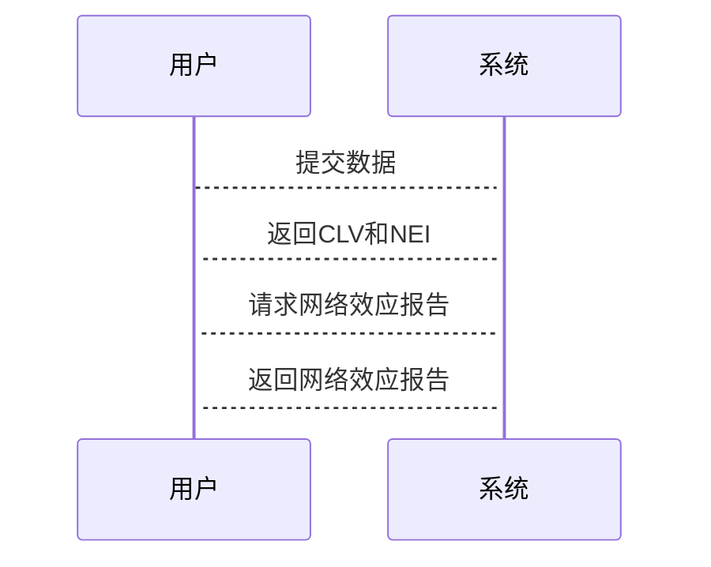

                 


# 彼得林奇的"长期价值创造"在网络效应企业中的新指标

---

## 关键词：  
彼得林奇，长期价值创造，网络效应，企业估值，用户生命周期价值，网络效应强度指数

---

## 摘要：  
本文深入探讨了彼得林奇的“长期价值创造”理念在网络效应企业中的应用，提出了基于网络效应的新估值指标。文章首先分析了长期价值创造的核心概念及其在网络效应企业中的表现，然后结合彼得林奇的投资理念，提出了一套适用于网络效应企业的新估值指标体系，包括用户生命周期价值（CLV）和网络效应强度指数（NEI）。通过具体的案例分析和系统架构设计，本文为网络效应企业的长期价值评估提供了新的思路和方法。

---

# 第一部分：彼得林奇的“长期价值创造”概述

## 第1章：长期价值创造的核心概念

### 1.1 长期价值创造的定义与特征

#### 1.1.1 什么是长期价值创造  
长期价值创造是指企业在较长的时间跨度内，通过优化产品、服务、用户体验和商业模式，不断提升其市场地位和盈利能力的过程。彼得林奇强调，长期价值创造是投资成功的核心，企业只有在长期为股东创造价值的情况下，才能实现可持续发展。

#### 1.1.2 长期价值创造的核心特征  
- **持续性**：长期价值创造不是短期行为，而是通过持续优化和创新实现的。  
- **用户价值**：企业必须为客户创造价值，才能获得长期成功。  
- **竞争优势**：长期价值创造往往依赖于企业的竞争优势，例如网络效应、品牌影响力等。  

#### 1.1.3 长期价值创造与短期收益的关系  
长期价值创造并不排斥短期收益，但强调在追求短期收益的同时，必须注重企业的长期发展。彼得林奇认为，过度关注短期收益可能导致企业忽视长期价值的积累。

### 1.2 网络效应企业的定义与特点

#### 1.2.1 网络效应的定义  
网络效应是指随着用户数量的增加，企业的产品或服务的价值也随之增加。例如，社交媒体平台的价值随着用户数量的增加而指数级增长。

#### 1.2.2 网络效应企业的典型特征  
- **用户依赖性**：用户数量是网络效应企业价值的核心驱动力。  
- **正反馈机制**：用户数量的增加会进一步吸引更多用户加入，形成正反馈循环。  
- **边际成本递减**：随着用户数量的增加，单位用户的边际成本逐渐降低。  

#### 1.2.3 网络效应对企业价值的影响  
网络效应使得企业在用户增长阶段能够快速扩大规模，但同时也带来了竞争壁垒的提升。彼得林奇认为，具有强大网络效应的企业往往具有长期竞争优势。

### 1.3 彼得林奇投资理念的核心要素

#### 1.3.1 彼得林奇的长期投资策略  
彼得林奇主张投资那些具有强大竞争优势和长期增长潜力的企业，而不是盲目追求短期收益。

#### 1.3.2 价值投资与成长投资的结合  
彼得林奇将价值投资和成长投资相结合，认为企业只有在具有成长潜力的同时，具备一定的安全边际，才能成为优质的投资标的。

#### 1.3.3 彼得林奇对企业长期价值的评估标准  
- **企业竞争优势**：企业是否具有独特的竞争优势，例如网络效应、品牌影响力等。  
- **管理团队**：管理团队的能力和战略眼光是企业长期发展的关键。  
- **财务健康状况**：企业的财务状况是否健康，能否支持长期发展。  

---

## 第2章：长期价值创造在网络效应企业中的应用

### 2.1 网络效应与企业价值的关系

#### 2.1.1 网络效应如何影响企业价值  
网络效应能够显著提升企业的市场价值，尤其是在用户增长的早期阶段。随着用户数量的增加，企业的边际成本递减，收益增长的速度往往快于线性增长。

#### 2.1.2 网络效应的正反馈机制  
用户数量的增加会吸引更多用户加入，形成正反馈循环。例如，社交媒体平台的用户数量增长会吸引更多广告商加入，从而进一步增加平台的收入。

#### 2.1.3 网络效应的边界与局限  
尽管网络效应能够显著提升企业价值，但其作用并非无限制。当用户数量达到一定规模后，边际收益可能会逐渐递减，甚至可能出现用户增长的瓶颈。

### 2.2 彼得林奇理念与网络效应企业的契合点

#### 2.2.1 网络效应企业的长期价值创造  
网络效应企业通过不断吸引新用户和优化用户体验，实现长期价值的积累。彼得林奇认为，这种模式非常适合长期价值创造。

#### 2.2.2 彼得林奇对企业护城河的重视  
彼得林奇强调企业必须具备竞争优势，而网络效应正是企业构建护城河的重要手段之一。

#### 2.2.3 彼得林奇对企业长期价值的评估标准  
彼得林奇的长期价值评估标准与网络效应企业的特点高度契合，例如对用户增长潜力、竞争优势和管理团队能力的重视。

### 2.3 长期价值创造在网络效应企业的实现路径

#### 2.3.1 提升用户参与度  
通过优化用户体验和增加用户粘性，网络效应企业可以进一步放大网络效应。

#### 2.3.2 加强网络效应的正反馈机制  
通过吸引更多用户和合作伙伴，网络效应企业可以实现价值的快速积累。

#### 2.3.3 建立强大的竞争优势  
网络效应企业需要通过技术创新和差异化竞争，进一步巩固其市场地位。

---

## 第3章：长期价值创造的新指标体系

### 3.1 网络效应企业的传统估值指标

#### 3.1.1 市盈率（P/E）  
市盈率是衡量企业股票价格与每股收益的比率，适用于传统企业，但在网络效应企业中可能不够准确。

#### 3.1.2 市净率（P/B）  
市净率是衡量企业股票价格与每股净资产的比率，适用于重资产行业，但在网络效应企业中可能不适用。

#### 3.1.3 市销率（P/S）  
市销率是衡量企业股票价格与每股销售收入的比率，适用于收入驱动型企业，但网络效应企业的收入增长可能与用户数量高度相关。

### 3.2 新指标的提出与理论基础

#### 3.2.1 用户生命周期价值（CLV）  
用户生命周期价值是指一个用户在其生命周期内为企业带来的总收益。CLV可以帮助企业更好地评估用户的价值，从而优化用户获取和留存策略。

#### 3.2.2 网络效应强度指数（NEI）  
网络效应强度指数是衡量企业网络效应强弱的指标，可以通过用户增长速度、用户参与度和用户粘性等多个维度进行综合评估。

### 3.3 新指标的具体构成与计算方法

#### 3.3.1 用户生命周期价值（CLV）的计算公式  
$$ CLV = \text{平均用户收入} \times \text{用户生命周期长度} \times \text{用户留存率} $$  

#### 3.3.2 网络效应强度指数（NEI）的计算公式  
$$ NEI = \frac{\text{用户增长速度} \times \text{用户参与度} \times \text{用户粘性}}{\text{用户获取成本}} $$  

---

## 第4章：系统架构与实现

### 4.1 系统功能设计

#### 4.1.1 用户数据采集模块  
- 用于采集用户行为数据，例如用户的登录频率、活跃度等。  

#### 4.1.2 用户价值评估模块  
- 基于用户数据，计算用户的生命周期价值（CLV）。  

#### 4.1.3 网络效应分析模块  
- 计算网络效应强度指数（NEI），并生成网络效应分析报告。  

### 4.2 系统架构设计


### 4.3 接口设计与交互流程



---

## 第5章：项目实战

### 5.1 环境安装与配置

```bash
pip install numpy pandas matplotlib
```

### 5.2 核心代码实现

```python
import numpy as np
import pandas as pd

def calculate_clv(revenue_per_user, user_lifetime, retention_rate):
    return revenue_per_user * user_lifetime * retention_rate

def calculate_nei(user_growth_rate, user_engagement, user_retention, cpc):
    return (user_growth_rate * user_engagement * user_retention) / cpc
```

### 5.3 案例分析

#### 5.3.1 案例背景  
假设我们有一个社交媒体平台，用户数量在过去一年中增长了30%，用户参与度为80%，用户留存率为70%，用户获取成本为$5。

#### 5.3.2 计算CLV  
$$ CLV = \$100 \times 5 \times 0.7 = \$350 $$  

#### 5.3.3 计算NEI  
$$ NEI = \frac{0.3 \times 0.8 \times 0.7}{\$5} = 0.224 $$  

---

## 第6章：最佳实践与总结

### 6.1 最佳实践

#### 6.1.1 定期更新指标  
企业应定期更新用户数据和市场环境，确保指标的准确性。

#### 6.1.2 结合多种指标  
企业应结合CLV和NEI等多种指标，全面评估网络效应企业的长期价值。

#### 6.1.3 优化用户体验  
用户参与度和留存率的提升是网络效应企业长期价值创造的关键。

### 6.2 小结

彼得林奇的“长期价值创造”理念在网络效应企业中具有重要的指导意义。通过引入用户生命周期价值（CLV）和网络效应强度指数（NEI）等新指标，企业可以更好地评估其长期价值，制定更有效的战略。

### 6.3 注意事项

- 网络效应企业的估值需要结合具体业务特点，避免单一指标的误用。  
- 企业应注重数据的准确性和实时性，确保指标的计算结果具有实际意义。  

### 6.4 拓展阅读

- 彼得林奇的《投资最重要的事情》  
- 网络效应与企业估值的相关文献  

---

## 作者：AI天才研究院/AI Genius Institute & 禅与计算机程序设计艺术 /Zen And The Art of Computer Programming

