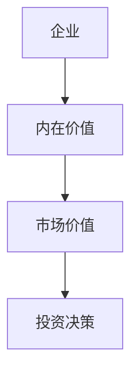
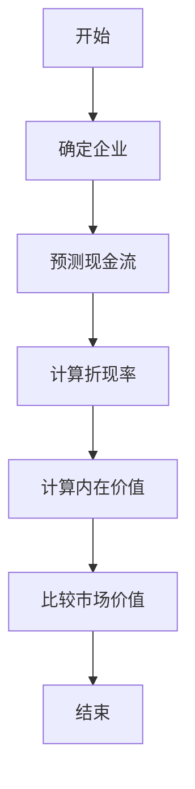
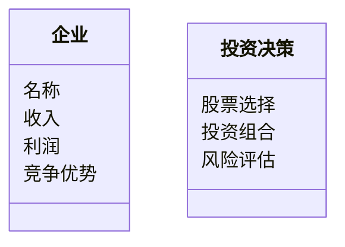
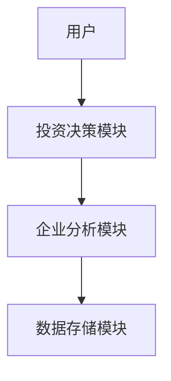
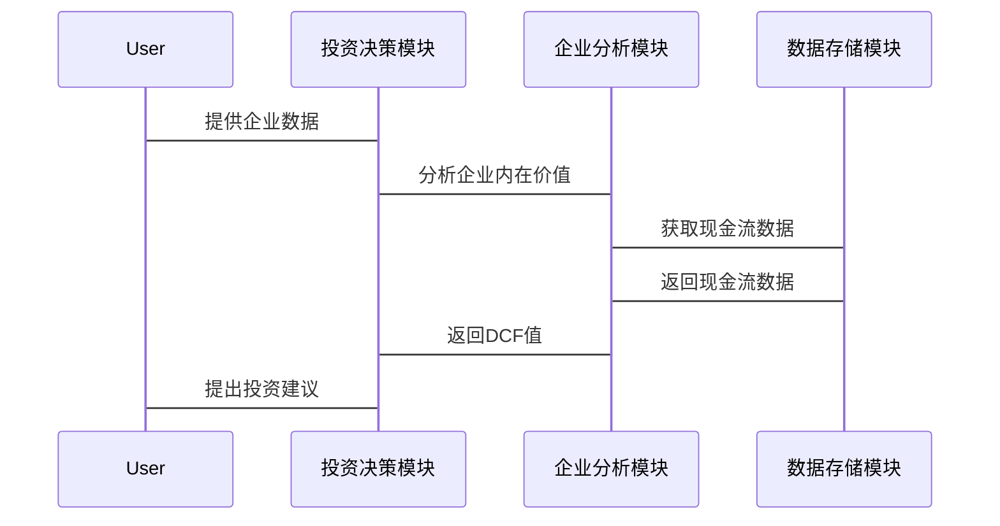

                 


# 彼得林奇的"长期价值创造"评估体系

## 关键词：
长期价值创造，彼得林奇，投资评估体系，价值评估模型，企业估值，投资决策

## 摘要：
本文深入分析了彼得·林奇的“长期价值创造”评估体系，探讨其核心概念、算法原理、系统架构及实际应用。通过详细阐述企业内在价值与市场价值的关系，结合DCF模型和系统设计，为投资者提供了科学的评估方法和系统实现方案，帮助实现长期稳健的投资收益。

---

## 第一部分：彼得林奇的"长期价值创造"评估体系概述

### 第1章：彼得林奇与长期价值创造概述

#### 1.1 彼得林奇及其投资理念
##### 1.1.1 彼得林奇的生平简介
彼得·林奇（Peter Lynch）是美国著名投资经理，曾管理富达麦哲伦基金（Fidelity Magellan Fund），创造了年均29%的惊人回报率。他强调长期投资和基本面分析，提倡买入并持有优质股票。

##### 1.1.2 长期价值投资的核心理念
林奇的核心理念是寻找那些具有持续增长潜力的公司，并长期持有。他认为，市场的短期波动应被忽视，投资者应关注企业的内在价值。

##### 1.1.3 彼得林奇的投资风格与成功案例
林奇善于挖掘那些被市场低估的企业，如星巴克和网件公司。他的成功源于对企业基本面的深入研究和对长期价值的坚持。

#### 1.2 长期价值创造的定义与目标
##### 1.2.1 长期价值创造的定义
长期价值创造是指通过投资于具备持续增长能力的企业，实现资产的长期增值。

##### 1.2.2 长期价值创造的目标
目标是通过投资优质企业，获得超越市场的长期回报，同时降低短期波动的影响。

##### 1.2.3 长期价值创造与短期收益的关系
长期价值创造注重企业的内在增长，而非短期价格波动。通过长期持有优质股票，投资者可以在市场波动中实现稳健收益。

#### 1.3 长期价值创造的评估体系背景
##### 1.3.1 传统投资评估体系的局限性
传统评估体系往往关注短期市场表现，忽视企业的基本面和长期增长潜力。

##### 1.3.2 长期价值创造评估体系的提出
为克服传统方法的局限，林奇提出了基于企业内在价值的评估体系，强调长期增长潜力。

##### 1.3.3 体系在投资决策中的应用价值
该体系帮助投资者识别具备长期增长潜力的企业，降低短期市场波动对投资决策的影响。

---

## 第二部分：长期价值创造的核心概念与联系

### 第2章：长期价值创造的核心概念与联系

#### 2.1 核心概念原理
##### 2.1.1 企业内在价值的定义
企业内在价值是其未来现金流的现值，反映其真实价值，与市场波动无关。

##### 2.1.2 市场价值与内在价值的关系
市场价值受情绪和短期因素影响，内在价值则是企业的真实价值。

##### 2.1.3 长期价值创造的关键要素
关键要素包括企业的盈利能力、成长潜力和竞争优势。

#### 2.2 核心概念属性对比表格
| 概念        | 属性               |
|-------------|--------------------|
| 内在价值    | 稳定性、可持续性    |
| 市场价值    | 波动性、短期性      |

#### 2.3 ER实体关系图


---

## 第三部分：长期价值创造评估体系的算法原理

### 第3章：算法原理

#### 3.1 算法原理概述
##### 3.1.1 企业内在价值计算模型
现金流折现法（DCF）用于计算企业内在价值。

##### 3.1.2 现金流折现法（DCF模型）
DCF模型将未来现金流折现为现值，计算企业的真实价值。

##### 3.1.3 市场价值与内在价值对比
通过比较市场价值和内在价值，投资者可以判断企业是否被低估或高估。

#### 3.2 算法流程图


#### 3.3 算法数学模型
$$DCF = \sum_{t=1}^{n} \frac{CF_t}{(1 + r)^t}$$

#### 3.4 算法实现代码
```python
def calculateDCF(cash_flows, discount_rate):
    dcf = 0
    for i, cf in enumerate(cash_flows):
        dcf += cf / (1 + discount_rate) ** i
    return dcf
```

---

## 第四部分：系统分析与架构设计方案

### 第4章：系统分析与架构设计

#### 4.1 问题场景介绍
##### 4.1.1 投资决策中的问题
传统评估体系忽视企业长期价值，导致投资决策失误。

#### 4.2 项目介绍
开发一个基于彼得林奇评估体系的投资决策支持系统。

#### 4.3 系统功能设计
##### 4.3.1 领域模型


##### 4.3.2 系统架构设计


#### 4.4 系统接口设计
##### 4.4.1 系统功能接口
- 输入：企业财务数据
- 输出：投资建议

##### 4.4.2 系统交互


---

## 第五部分：项目实战

### 第5章：项目实战

#### 5.1 环境安装
##### 5.1.1 系统环境
Python 3.8及以上版本，安装必要的库（如numpy、pandas）。

#### 5.2 系统核心实现源代码
##### 5.2.1 DCF模型实现
```python
import numpy as np

def calculateDCF(cash_flows, discount_rate, periods):
    dcf = 0
    for t in range(periods):
        dcf += cash_flows[t] / (1 + discount_rate) ** t
    return dcf

# 示例数据
cash_flows = [100, 150, 200, 250]
discount_rate = 0.1
periods = 4

print(f"DCF Value: {calculateDCF(cash_flows, discount_rate, periods)}")
```

#### 5.3 代码应用解读与分析
通过代码实现DCF模型，计算企业内在价值，对比市场价值，给出投资建议。

#### 5.4 实际案例分析
以苹果公司为例，分析其现金流和DCF值，评估其投资价值。

#### 5.5 项目小结
通过实战项目，验证了彼得林奇评估体系的有效性，并展示了其在实际投资中的应用。

---

## 第六部分：最佳实践与小结

### 第6章：最佳实践与小结

#### 6.1 最佳实践
##### 6.1.1 投资者注意事项
- 长期持有优质股票
- 定期评估企业基本面
- 保持分散投资

#### 6.2 小结
彼得林奇的评估体系为投资者提供了科学的长期价值评估方法，帮助实现稳健投资回报。

#### 6.3 拓展阅读
推荐书籍：《彼得·林奇的成功投资》。

---

## 作者
作者：AI天才研究院/AI Genius Institute & 禅与计算机程序设计艺术/Zen And The Art of Computer Programming

