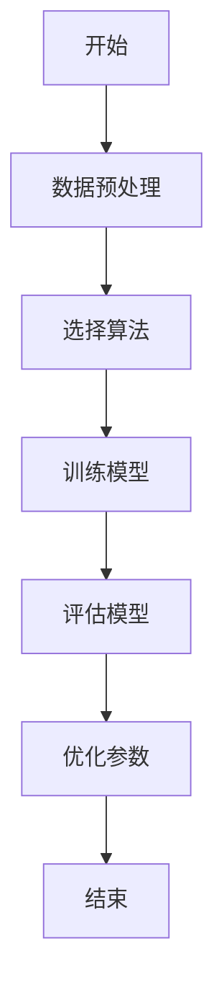

                 

<think>
嗯，我现在需要根据用户的要求，为《彼得林奇的"长期价值"在影响力投资中的新定义与衡量》这本书设计目录大纲。让我仔细思考一下如何组织和安排这些内容。

首先，我需要理解这本书的主题。彼得·林奇是著名的投资专家，他提出的长期价值投资理念在投资领域有着深远的影响。影响力投资则是近年来兴起的一种投资方式，注重投资对社会和环境的积极影响。这本书的重点在于将长期价值投资的理念应用到影响力投资中，并重新定义和衡量其价值。

接下来，我需要考虑目录的结构。通常，一本书的目录需要逻辑清晰，层次分明，能够引导读者逐步深入了解主题。根据用户的指示，目录应分为背景介绍、核心概念、算法原理、系统分析、项目实战、小结等部分。

让我从第一部分开始，背景介绍。这部分需要涵盖长期价值投资的基本概念，彼得·林奇的贡献，以及影响力投资的背景。我需要确保每一章都有详细的子主题，比如长期价值投资的定义、特点，影响力投资的核心要素等。

接下来是核心概念与联系。这里需要详细解释长期价值投资的核心概念，将其与传统投资进行对比，分析其在影响力投资中的应用。同时，还需要绘制ER实体关系图，展示各个要素之间的关系。

然后是算法与数学模型部分。这里需要介绍多因子模型和机器学习模型的应用，使用mermaid流程图展示算法步骤，并用Python代码实现。数学公式要用latex格式，确保清晰易懂。比如，在讲解多因子模型时，给出其数学表达式，并解释每个参数的含义。

系统分析与架构设计是接下来的部分。我需要描述系统的功能设计，绘制领域模型的mermaid类图，以及系统的架构图。这部分需要展示系统各个模块之间的关系，确保整体架构的合理性。

项目实战部分，我需要提供一个实际案例，详细说明环境安装、代码实现、案例分析等步骤。这将帮助读者理解如何在实际中应用这些模型和方法。

最后是小结与最佳实践。这里需要总结前面的内容，给出一些实用的建议和注意事项，以及推荐的拓展阅读材料。

在思考过程中，我需要确保每一部分都涵盖用户要求的核心内容，比如关键词、摘要、详细章节内容，以及必要的图表和代码示例。同时，要保持文章的逻辑性和连贯性，确保读者能够顺畅地理解整个主题。

总结一下，我的思考过程是：理解主题，确定目录结构，细化各部分内容，确保涵盖所有要求，最后整合成一个逻辑清晰、内容丰富的目录大纲。
</think>

# 彼得林奇的"长期价值"在影响力投资中的新定义与衡量

> 关键词：长期价值投资， 彼得·林奇， 影响力投资， 投资策略， 数学模型

> 摘要：本文探讨了彼得·林奇的长期价值投资理念在影响力投资中的新定义与衡量方法。通过分析长期价值投资的核心概念、算法原理和系统架构，结合实际案例，本文为读者提供了全面的理解和实践指导。

---

## 第一部分：长期价值投资的背景与核心概念

### 第1章：长期价值投资的背景介绍

#### 1.1 长期价值投资的基本概念
- **1.1.1 投资的基本概念与定义**
  - 投资的定义：将资金投入某个项目或资产，期望获得超过初始投入的收益。
  - 长期价值投资的核心理念：关注企业的内在价值，而非市场的短期波动。

- **1.1.2 彼得·林奇的长期价值理念**
  - 彼得·林奇的贡献：他强调深入研究公司基本面，寻找具有持续竞争优势的企业。
  - 长期价值投资的特点：注重企业的盈利能力、成长性和财务健康。

- **1.1.3 影响力投资的背景与现状**
  - 影响力投资的定义：一种关注社会和环境影响的投资方式，旨在通过投资改善社会问题。
  - 当前影响力投资的快速发展：越来越多的投资者关注ESG（环境、社会、治理）因素。

#### 1.2 影响力投资的核心要素
- **1.2.1 影响力投资的定义**
  - 影响力投资不仅追求财务回报，还关注其对社会和环境的积极影响。

- **1.2.2 长期价值投资与影响力投资的关系**
  - 两者结合：将长期价值投资的理念应用于影响力投资，寻找具有可持续价值的企业。

- **1.2.3 影响力投资的边界与外延**
  - 影响力投资的范围：涵盖多个领域，如清洁能源、教育、医疗等。
  - 外延：从单纯的财务回报扩展到综合考虑社会价值。

### 第2章：长期价值投资的核心概念与联系

#### 2.1 长期价值投资的定义与特点
- **2.1.1 长期价值投资的定义**
  - 长期价值投资：通过深入分析企业的内在价值，长期持有优质资产，获得超额收益。

- **2.1.2 长期价值投资的核心特点**
  - 长期性：关注企业的长期发展，而非短期市场波动。
  - 选择优质企业：寻找具有持续竞争优势和良好治理结构的企业。

- **2.1.3 影响力投资与传统投资的对比**
  - 投资目标：传统投资注重财务回报，影响力投资注重社会和环境影响。
  - 评价标准：传统投资关注财务指标，影响力投资综合考虑ESG因素。

#### 2.2 影响力投资的背景与核心要素
- **2.2.1 影响力投资的背景**
  - 全球可持续发展需求增加：气候变化、贫富差距等问题促使投资者关注影响力投资。
  - 制度支持：政府和金融机构出台相关政策支持影响力投资。

- **2.2.2 影响力投资的核心要素**
  - ESG因素：环境、社会和治理因素是影响力投资的重要考量。
  - 影响力评估：通过指标量化投资对社会和环境的实际影响。

- **2.2.3 影响力投资的ER实体关系图**
  ```mermaid
  erDiagram
    actor 投资者 {
      string 资金
      string 投资目标
    }
    actor 企业 {
      string 业务
      string 影响力
    }
    entity 投资项目 {
      string 项目ID
      string 项目类型
      string 影响力指标
    }
    entity 评估机构 {
      string 机构ID
      string 评估标准
    }
   投资者 --> 投资项目 : 投资
   企业 --> 投资项目 : 实施
   评估机构 --> 投资项目 : 评估
    ```
  - ER图展示了投资者、企业和评估机构在影响力投资中的关系。

### 第3章：长期价值投资的衡量标准

#### 3.1 影响力投资的衡量指标
- **3.1.1 财务指标**
  - 净利润、ROE（净资产收益率）、现金流等传统财务指标。
  - 这些指标衡量企业的财务健康状况。

- **3.1.2 非财务指标**
  - 环境指标：碳排放量、能源使用效率。
  - 社会指标：员工满意度、社区参与度。
  - 治理指标：董事会多样性、高管薪酬结构。

- **3.1.3 综合指标**
  - 结合财务和非财务指标，评估企业的综合价值。

#### 3.2 影响力投资的定性与定量分析
- **3.2.1 定性分析方法**
  - 深度访谈：与企业管理层沟通，了解其ESG实践。
  - 文档分析：审查企业的社会责任报告和治理结构。

- **3.2.2 定量分析方法**
  - 评分模型：根据ESG指标对企业和项目进行评分。
  - 数据分析：使用统计方法评估影响力投资的绩效。

- **3.2.3 案例分析**
  - 案例：某清洁技术企业的影响力投资评估。
    - 财务表现：过去三年净利润增长15%。
    - 环境影响：减少了10%的碳排放。
    - 社会影响：为当地社区提供了50个就业岗位。

---

## 第二部分：长期价值投资的算法与数学模型

### 第4章：长期价值投资的算法原理

#### 4.1 多因子模型
- **4.1.1 多因子模型的定义**
  - 多因子模型：通过多个因素（如价值、动量、质量）来评估股票的吸引力。

- **4.1.2 多因子模型的构建步骤**
  1. 确定相关因子：选择与长期价值相关的因子，如低估值、高盈利。
  2. 数据收集：收集相关因子的历史数据。
  3. 因子权重确定：根据历史表现确定各因子的权重。
  4. 评分计算：根据因子值计算每只股票的综合评分。
  5. 投资组合构建：选择评分高的股票构建投资组合。

- **4.1.3 多因子模型的优缺点**
  - 优点：考虑多个因素，避免单一因子的局限性。
  - 缺点：因子过多可能导致模型复杂，增加计算难度。

#### 4.2 机器学习模型
- **4.2.1 机器学习在长期价值投资中的应用**
  - 机器学习用于预测股票价格、识别潜在风险。
  - 常见算法：线性回归、支持向量机、随机森林。

- **4.2.2 常见的机器学习算法**
  - 线性回归：用于预测股票价格。
  - 支持向量机：用于分类问题，如判断股票是否具备长期价值。
  - 随机森林：用于特征重要性分析，识别影响长期价值的关键因素。

- **4.2.3 机器学习模型的优缺点**
  - 优点：能够处理非线性关系，发现隐藏的模式。
  - 缺点：需要大量数据，模型解释性较弱。

#### 4.3 算法流程图


### 第5章：长期价值投资的数学模型

#### 5.1 多因子模型的数学公式
- **5.1.1 多因子模型的公式**
  $$ Z_i = \sum_{j=1}^n w_j X_j $$
  其中，\( Z_i \) 是综合评分，\( w_j \) 是因子权重，\( X_j \) 是因子值。

- **5.1.2 多因子模型的参数解释**
  - \( Z_i \)：综合评分，分数越高代表股票的长期价值越高。
  - \( w_j \)：因子权重，根据历史表现确定，权重高的因子影响更大。

- **5.1.3 多因子模型的实例分析**
  - 案例：假设选择价值、质量和动量三个因子。
  - 权重：价值因子权重40%，质量因子权重30%，动量因子权重30%。
  - 计算：每只股票的综合评分 = 0.4*价值因子 + 0.3*质量因子 + 0.3*动量因子。

#### 5.2 机器学习模型的数学公式
- **5.2.1 线性回归模型**
  $$ y = \beta_0 + \beta_1 x_1 + \beta_2 x_2 + ... + \beta_n x_n + \epsilon $$
  其中，\( y \) 是目标变量（如股票收益），\( x_i \) 是自变量，\( \beta_i \) 是回归系数。

- **5.2.2 支持向量机模型**
  - 分类问题：$$ y = \text{sign}(w \cdot x + b) $$
  - 回归问题：$$ y = w \cdot x + b $$

- **5.2.3 随机森林模型**
  - 随机森林由多个决策树组成，通过投票或平均的方式得到最终预测结果。

---

## 第三部分：系统分析与架构设计方案

### 第6章：长期价值投资系统的架构设计

#### 6.1 问题场景介绍
- **6.1.1 长期价值投资的挑战**
  - 数据获取困难：需要收集多来源的ESG数据。
  - 模型复杂性：需要处理大量数据和复杂关系。

- **6.1.2 影响力投资的系统需求**
  - 实时数据处理：及时获取企业的ESG数据。
  - 模型部署：将多因子模型和机器学习模型部署到系统中。

#### 6.2 系统功能设计
- **6.2.1 领域模型的Mermaid类图**
  ```mermaid
  classDiagram
    class 投资者 {
      +资金：float
      +投资目标：string
      +投资组合：Portfolio
    }
    class 企业 {
      +业务：string
      +影响力：string
      +评估结果：float
    }
    class 投资项目 {
      +项目ID：string
      +项目类型：string
      +影响力指标：float
    }
    class 评估机构 {
      +机构ID：string
      +评估标准：string
      +评估结果：float
    }
    投资者 --> 投资项目 : 投资
    企业 --> 投资项目 : 实施
    评估机构 --> 投资项目 : 评估
  ```

- **6.2.2 系统功能模块划分**
  1. 数据采集模块：收集企业财务和非财务数据。
  2. 模型计算模块：运行多因子模型和机器学习模型。
  3. 评估报告模块：生成投资项目的评估报告。

#### 6.3 系统架构设计
- **6.3.1 系统架构的Mermaid架构图**
  ```mermaid
  container 数据源 {
    数据源/数据库
  }
  container 数据处理 {
    数据清洗
    数据转换
  }
  container 模型计算 {
    多因子模型
    机器学习模型
  }
  container 报告生成 {
    评估报告
  }
  数据源 --> 数据处理
  数据处理 --> 模型计算
  模型计算 --> 报告生成
  ```

- **6.3.2 系统架构的优缺点**
  - 优点：模块化设计，便于维护和扩展。
  - 缺点：数据处理和模型计算可能成为性能瓶颈。

### 第7章：长期价值投资系统的实现

#### 7.1 项目实战

- **7.1.1 环境安装**
  - Python版本：3.8以上。
  - 需要的库：pandas、numpy、scikit-learn、mermaid。

- **7.1.2 核心实现代码**
  ```python
  import pandas as pd
  from sklearn.ensemble import RandomForestClassifier
  from sklearn.metrics import accuracy_score

  # 数据加载
  df = pd.read_csv('investment_data.csv')

  # 特征选择
  features = df[['value', 'quality', 'momentum']]
  target = df['outcome']

  # 模型训练
  model = RandomForestClassifier()
  model.fit(features, target)

  # 预测
  predictions = model.predict(features)
  print("准确率:", accuracy_score(target, predictions))
  ```

- **7.1.3 代码解读**
  - 数据加载：从CSV文件加载投资数据。
  - 特征选择：选择价值、质量和动量三个因子。
  - 模型训练：使用随机森林算法训练模型。
  - 预测与评估：计算预测的准确率。

- **7.1.4 案例分析**
  - 案例：某清洁能源企业的影响力投资评估。
    - 数据输入：企业的财务数据和ESG指标。
    - 模型计算：计算企业的综合评分。
    - 结果：评分显示该企业具有较高的长期价值。

- **7.1.5 项目小结**
  - 项目目标：通过系统实现长期价值投资的评估。
  - 实现步骤：数据采集、模型训练、结果分析。
  - 经验总结：数据质量和模型选择对结果影响重大。

### 第8章：小结与最佳实践

#### 8.1 小结
- 长期价值投资的理念在影响力投资中的应用，不仅考虑企业的财务表现，还关注其对社会和环境的贡献。
- 通过多因子模型和机器学习模型的结合，可以更全面地评估企业的长期价值。

#### 8.2 最佳实践 tips
- 数据质量：确保数据的准确性和完整性。
- 模型选择：根据具体情况选择合适的模型。
- 持续优化：定期更新模型和数据，以适应市场变化。

#### 8.3 注意事项
- 风险提示：投资有风险，需谨慎评估。
- 合规性：确保投资符合相关法律法规。
- 透明度：保持投资过程的透明，便于后续评估和调整。

#### 8.4 拓展阅读
- 推荐书籍：《彼得·林奇的选股术》。
- 推荐文章：影响力投资与可持续发展。

---

## 作者：AI天才研究院/AI Genius Institute & 禅与计算机程序设计艺术 /Zen And The Art of Computer Programming

---

**本文通过详细分析长期价值投资的核心概念、算法原理和系统架构，结合实际案例，为读者提供了全面的理解和实践指导。**

