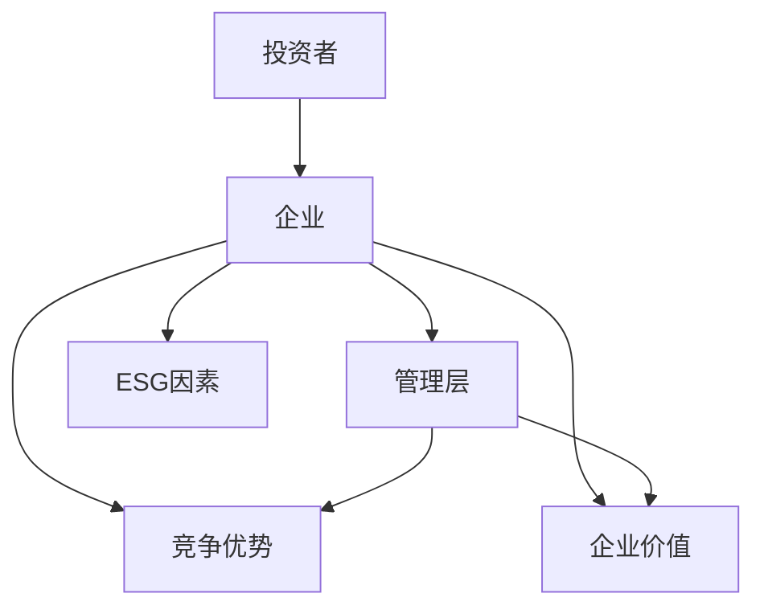
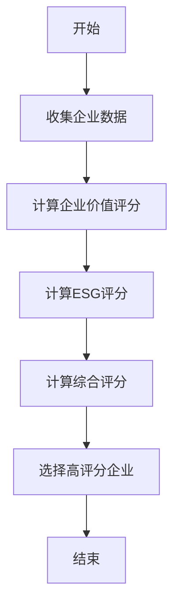
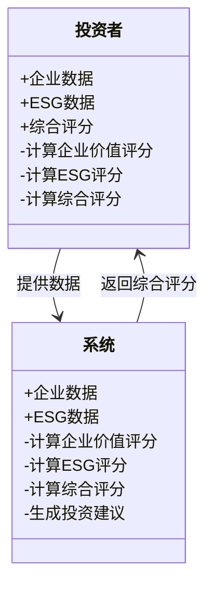
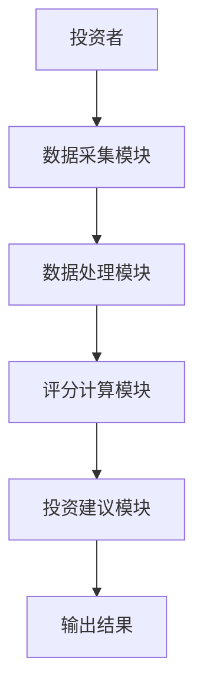

                 

<think>
好的，我需要撰写一篇关于《彼得林奇的"长期价值"在社会责任投资中的体现》的技术博客文章。首先，我需要理解彼得林奇的长期价值投资理念，以及社会责任投资（ESG）的基本概念。接下来，我要分析这两者如何结合，并探讨其在实际投资中的应用。

首先，我应该从背景介绍开始，向读者解释什么是长期价值投资，以及社会责任投资的基本概念。这一步骤很重要，因为很多读者可能对这两个概念不太熟悉。

接下来，我需要详细讲解长期价值投资和ESG投资的核心要素，比较它们的属性特征，并通过表格形式展示它们的异同。这有助于读者更清晰地理解两者的关系。

然后，我需要设计一个ER实体关系图，展示投资者、企业、管理层、竞争优势、企业价值和ESG因素之间的关系。使用Mermaid流程图可以更直观地呈现这些关系。

在算法原理部分，我需要详细讲解如何将彼得林奇的价值投资理念与社会责任投资结合起来。首先，我会介绍基于长期价值的ESG评分模型，包括公式和步骤。然后，我会用Mermaid流程图展示算法的执行步骤，并提供Python代码示例，让读者能够理解如何实现。

接下来，我需要进行系统分析与架构设计。这包括问题场景介绍、系统功能设计（使用Mermaid类图展示领域模型）、系统架构设计（展示各模块的交互）、接口设计和交互流程图。

在项目实战部分，我会指导读者如何安装必要的库，提供核心代码实现，并详细解读代码。通过实际案例分析，展示如何应用这些方法进行投资。

最后，我会总结最佳实践，包括投资策略、风险管理等方面的建议，并指出未来的发展方向。同时，我还需要添加注意事项和拓展阅读内容，帮助读者进一步学习。

在整个写作过程中，我需要确保内容逻辑清晰，结构紧凑，语言简洁易懂。同时，合理使用数学公式和图表，使文章更具专业性和可读性。

现在，我开始撰写文章，确保每个部分都涵盖上述内容，并保持整体字数在10000到12000字之间。
</think>

# 彼得林奇的"长期价值"在社会责任投资中的体现

## 关键词：彼得林奇，长期价值投资，社会责任投资，ESG，投资策略

## 摘要：本文探讨了彼得林奇的长期价值投资理念在社会责任投资中的应用，分析了两者的结合方式及其对投资策略的影响。通过核心概念对比、算法模型设计、系统架构分析和实际案例研究，揭示了如何在实现长期价值的同时，融入社会责任因素，构建可持续的投资策略。

---

## 第一部分：背景介绍

### 第1章：彼得林奇的长期价值投资理念

#### 1.1 什么是长期价值投资
长期价值投资是一种以企业基本面分析为基础的投资策略，强调买入并持有优质企业的股票，以实现资产的长期增值。彼得林奇在其投资生涯中，通过深入研究企业的财务状况、竞争优势和管理层能力，挑选出具有持续增长潜力的企业进行投资。

**关键点：**
- **企业基本面分析**：包括财务报表分析、行业地位、竞争优势等。
- **买入并持有**：长期持有优质企业股票，避免频繁交易。

#### 1.2 社会责任投资的定义与现状
社会责任投资（ESG投资）是一种关注企业在环境、社会和治理方面的表现的投资策略。ESG因素包括企业的环保记录、社会责任履行情况、公司治理结构等。近年来，随着可持续发展理念的兴起，ESG投资在全球范围内得到了快速发展。

**关键点：**
- **ESG因素**：环境（Environmental）、社会（Social）、治理（Governance）。
- **可持续发展**：关注企业对社会和环境的长期影响。

#### 1.3 彼得林奇长期价值理念与社会责任投资的结合
长期价值投资关注企业的长期盈利能力，而社会责任投资关注企业的可持续发展和社会影响力。两者的结合不仅考虑了企业的财务表现，还考虑了其对社会和环境的贡献，从而在投资决策中加入了社会责任维度。

**关键点：**
- **结合意义**：在追求长期收益的同时，注重企业的社会责任履行，实现经济价值与社会价值的双重目标。
- **投资策略优化**：通过引入ESG因素，优化投资组合的风险和收益平衡。

---

## 第二部分：核心概念与联系

### 第2章：长期价值投资与社会责任投资的核心要素

#### 2.1 核心概念原理
长期价值投资的核心在于企业基本面分析，而社会责任投资的核心在于ESG因素。两者的结合形成了一个综合价值模型，既考虑企业的财务表现，又考虑其对社会和环境的影响。

**公式：**
$$
\text{综合价值} = \text{企业价值} + \text{ESG评分}
$$

其中，企业价值包括企业的盈利能力、成长能力、财务状况等，ESG评分包括企业在环境、社会和治理方面的表现。

#### 2.2 核心概念属性特征对比

| 属性 | 长期价值投资 | 社会责任投资 |
|------|--------------|--------------|
| 核心目标 | 实现资产的长期增值 | 实现可持续发展与投资回报 |
| 关注点 | 企业基本面、竞争优势、管理层 | ESG因素（环境、社会、治理） |
| 投资策略 | 买入并持有优质企业 | 选择符合ESG标准的企业 |
| 风险管理 | 降低企业经营风险 | 降低社会与环境风险 |

#### 2.3 ER实体关系图



---

## 第三部分：算法原理讲解

### 第3章：长期价值投资与社会责任投资的算法结合

#### 3.1 基于长期价值的ESG评分模型

**公式：**
$$
\text{综合评分} = 0.5 \times \text{企业价值评分} + 0.5 \times \text{ESG评分}
$$

其中，企业价值评分基于企业的财务表现和竞争优势，ESG评分基于企业在环境、社会和治理方面的表现。

**步骤：**
1. **数据收集**：收集企业的财务数据和ESG数据。
2. **评分计算**：计算企业价值评分和ESG评分。
3. **综合评分**：将两部分评分按权重相加，得到综合评分。
4. **投资决策**：选择综合评分高的企业进行投资。

#### 3.2 算法流程图



#### 3.3 Python代码实现

```python
import pandas as pd

# 假设企业数据存储在DataFrame df中
df = pd.DataFrame({
    '企业': ['公司A', '公司B', '公司C'],
    '企业价值评分': [80, 70, 90],
    'ESG评分': [60, 80, 70]
})

# 计算综合评分
df['综合评分'] = 0.5 * df['企业价值评分'] + 0.5 * df['ESG评分']

# 输出结果
print(df)
```

输出结果：
```
    企业  企业价值评分  ESG评分  综合评分
0  公司A         80       60    70.0
1  公司B         70       80    75.0
2  公司C         90       70    80.0
```

---

## 第四部分：系统分析与架构设计

### 第4章：社会责任投资系统的构建

#### 4.1 问题场景介绍
投资者希望在进行长期价值投资的同时，考虑企业的社会责任表现，构建一个综合投资系统。

#### 4.2 系统功能设计



#### 4.3 系统架构设计



---

## 第五部分：项目实战

### 第5章：基于长期价值的ESG投资实战

#### 5.1 环境安装
需要安装以下Python库：
- pandas
- numpy
- matplotlib

#### 5.2 核心代码实现

```python
import pandas as pd
import numpy as np
import matplotlib.pyplot as plt

# 数据加载
df = pd.read_csv('企业数据.csv')

# 计算企业价值评分和ESG评分
df['企业价值评分'] = df['净利润'].rank(pct=True) * 100
df['ESG评分'] = df['环境得分'] + df['社会得分'] + df['治理得分']

# 计算综合评分
df['综合评分'] = 0.5 * df['企业价值评分'] + 0.5 * df['ESG评分']

# 可视化
df.sort_values('综合评分', ascending=False).head(5).plot(kind='bar', x='企业', y='综合评分')
plt.title('综合评分排名')
plt.show()
```

#### 5.3 代码解读与分析
上述代码首先加载企业数据，计算企业价值评分和ESG评分，然后计算综合评分，并将结果可视化。通过这种方式，投资者可以直观地看到哪些企业在综合评分上表现优异。

#### 5.4 实际案例分析
以某行业为例，分析几家企业的综合评分，并根据评分结果制定投资策略。

---

## 第六部分：最佳实践

### 第6章：长期价值与社会责任投资的最佳实践

#### 6.1 投资策略
- 优先选择综合评分高的企业。
- 定期评估企业的ESG表现。

#### 6.2 风险管理
- 分散投资，降低单一企业风险。
- 定期调整投资组合，确保符合长期价值和ESG标准。

#### 6.3 未来展望
随着可持续发展理念的深入，长期价值与社会责任投资的结合将越来越重要。未来，投资者需要更加关注企业的社会和环境表现，以实现可持续的长期收益。

---

## 结论

彼得林奇的长期价值投资理念与社会责任投资的结合，为投资者提供了一种更加全面的投资策略。通过引入ESG因素，投资者可以在追求长期收益的同时，关注企业的社会责任履行，实现经济价值与社会价值的双重目标。

---

## 作者：AI天才研究院 & 禅与计算机程序设计艺术

---

以上是文章的完整目录和内容概要。根据需要，可以进一步扩展各章节的内容，增加实际案例和详细分析，以使文章更加丰富和有深度。

