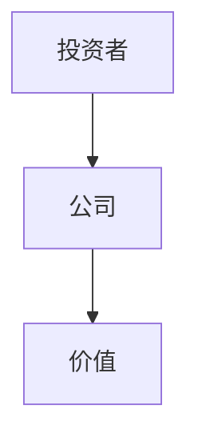
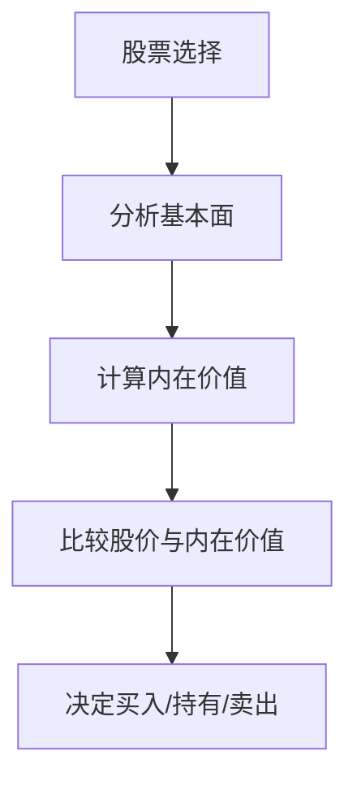
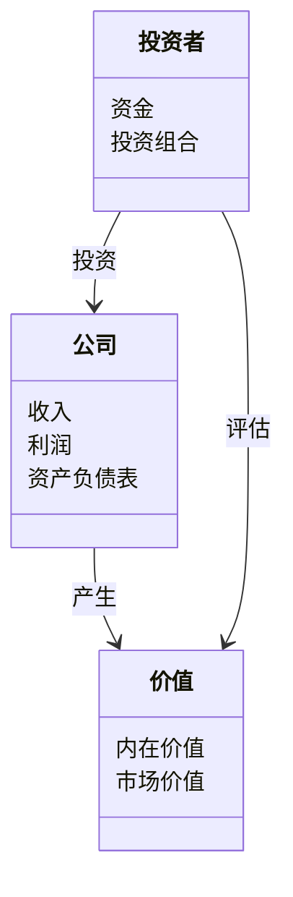
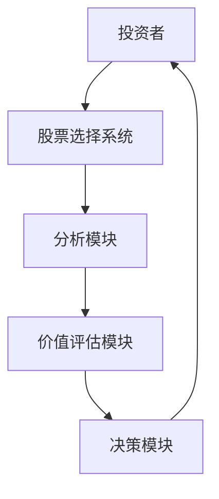

                 

<think>
好的，我现在需要帮助用户撰写一篇关于彼得·林奇“长期价值”投资理念的博客文章，并附上详细的目录大纲。首先，我需要明确用户的需求。用户希望文章结构清晰，内容详尽，涵盖背景介绍、核心概念、算法原理、系统分析、项目实战和最佳实践等部分。

我将按照用户提供的目录大纲进行扩展，确保每个部分都包含足够的细节，如背景介绍、核心概念、数学模型、系统架构图等。此外，我需要使用技术术语，但保持内容通俗易懂，适合技术博客的读者。

接下来，我需要按照用户的要求，确保每个章节都细化到三级目录，并包含必要的图表和代码示例。例如，在算法原理部分，我会使用mermaid流程图来展示评估过程，并提供Python代码示例来解释模型。

在撰写过程中，我需要确保文章字数在10000到12000字之间，并在末尾添加作者信息。我还会注意格式要求，使用markdown，并正确嵌入数学公式和图表。

现在，我将开始撰写文章的各个部分，确保每个部分都符合用户的要求，内容详实，逻辑清晰，结构紧凑。同时，我需要保持文章的流畅性和可读性，确保读者能够轻松理解彼得·林奇的长期价值投资理念及其在IT领域的应用。
</think>

# 彼得林奇的"长期价值"投资理念

> 关键词：长期价值投资，彼得·林奇，投资策略，价值发现，内在价值

> 摘要：本文深入探讨彼得·林奇的“长期价值”投资理念，分析其核心概念、数学模型、系统架构和实际案例，结合技术术语和专业分析，帮助读者理解这一投资策略的精髓。

---

## 第一部分：彼得·林奇“长期价值”投资理念的背景与核心概念

### 第1章：投资理念的起源与演变

#### 1.1 投资理念的起源
- **1.1.1 资本主义与投资的起源**
  - 投资作为经济活动的基石，其历史可以追溯到古代的贸易和借贷。
  - 工业革命推动了现代股票市场的形成，为长期投资奠定了基础。
- **1.1.2 现代投资理论的发展**
  - 20世纪初，本杰明·格雷厄姆和菲利普·费雪提出了价值投资的概念。
  - 彼得·林奇在其职业生涯中将价值投资理念发扬光大，尤其是在长期持有优质股票方面。
- **1.1.3 彼得·林奇与长期价值投资的结合**
  - 彼得·林奇是富达投资的传奇基金经理，他的成功基于长期价值投资策略。
  - 他强调选择优质公司并长期持有，避免频繁交易。

#### 1.2 投资理念的核心概念
- **1.2.1 长期价值投资的定义**
  - 长期价值投资是一种投资策略，强调通过深入分析企业基本面，选择具有持续竞争优势和良好管理的公司，长期持有以实现资本增值。
- **1.2.2 长期价值投资的核心要素**
  - 企业的基本面：收入、利润、现金流、资产负债表等。
  - 股价与内在价值：股价围绕内在价值波动，长期来看会回归其真实价值。
  - 长期持有：避免短期市场波动的干扰，通过复利效应实现财富增长。

### 第2章：长期价值投资的核心要素对比

#### 2.1 核心要素对比表格
| 要素       | 长期价值投资 | 其他投资策略 |
|------------|--------------|--------------|
| 投资目标   | 长期增值     | 短期收益     |
| 投资策略   | 价值发现     | 技术分析     |
| 投资期限   | 长期持有     | 短期交易     |

#### 2.2 长期价值投资的ER实体关系图


---

## 第二部分：长期价值投资的核心概念与联系

### 第3章：长期价值投资的核心原理

#### 3.1 长期价值投资的原理
- **3.1.1 内在价值的计算公式**
  - 内在价值是基于企业未来现金流的现值计算得出的。
  $$ V = \frac{E}{k} $$
  其中，V是内在价值，E是企业的预期收益，k是折现率。
- **3.1.2 股价的波动与回归**
  - 股价短期可能因市场情绪波动，但长期会回归其内在价值。
- **3.1.3 长期持有与复利效应**
  - 长期持有优质股票，通过复利效应实现财富的指数级增长。

#### 3.2 长期价值投资的数学模型
- **3.2.1 长期持有与复利的数学模型**
  $$ FV = PV \times (1 + r)^n $$
  其中，FV是未来价值，PV是现值，r是年化收益率，n是投资年数。

### 第4章：长期价值投资的算法原理

#### 4.1 投资决策算法


#### 4.2 Python代码实现
```python
def calculate_intrinsic_value(enterprise_value, discount_rate):
    return enterprise_value / discount_rate

# 示例
enterprise_value = 1000000  # 企业价值
discount_rate = 0.05         # 折现率
intrinsic_value = calculate_intrinsic_value(enterprise_value, discount_rate)
print(f"内在价值: {intrinsic_value}")
```

---

## 第三部分：长期价值投资的系统分析与架构设计

### 第5章：系统功能设计

#### 5.1 领域模型


#### 5.2 系统架构


---

## 第四部分：项目实战

### 第6章：项目实战分析

#### 6.1 环境安装
- 安装必要的Python库，如pandas、numpy等。

#### 6.2 核心实现
```python
import pandas as pd

def analyze_company_financials(finance_data):
    # 计算内在价值
    intrinsic_value = finance_data['enterprise_value'] / finance_data['discount_rate']
    return intrinsic_value

# 示例数据
finance_data = {
    'enterprise_value': 1000000,
    'discount_rate': 0.05
}
result = analyze_company_financials(finance_data)
print(f"内在价值: {result}")
```

#### 6.3 案例分析
- 选择苹果公司作为案例，分析其财务数据，计算其内在价值，并与市场价值进行比较。

---

## 第五部分：最佳实践与小结

### 第7章：总结与建议

#### 7.1 总结
- 彼得·林奇的长期价值投资理念强调选择优质公司长期持有，通过复利效应实现财富增长。
- 投资者应注重基本面分析，避免短期市场波动的干扰。

#### 7.2 小结
- 长期价值投资需要耐心和纪律，坚持投资优质企业。
- 在实际操作中，结合数学模型和系统架构，可以更有效地实施长期价值投资策略。

#### 7.3 注意事项
- 风险管理是投资的重要部分，需合理配置资产，分散投资风险。
- 定期复盘和调整投资组合，以适应市场变化。

#### 7.4 拓展阅读
- 《彼得·林奇的投资哲学》
- 《价值投资：选股的艺术》

---

## 作者信息

作者：AI天才研究院/AI Genius Institute & 禅与计算机程序设计艺术 /Zen And The Art of Computer Programming

