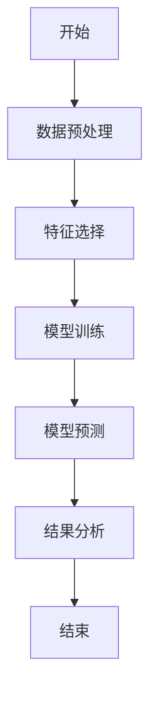
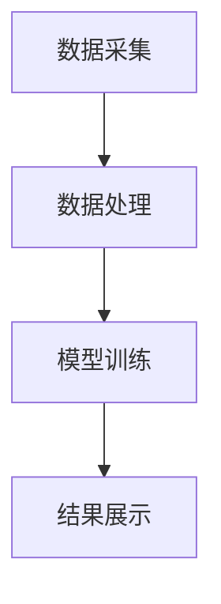
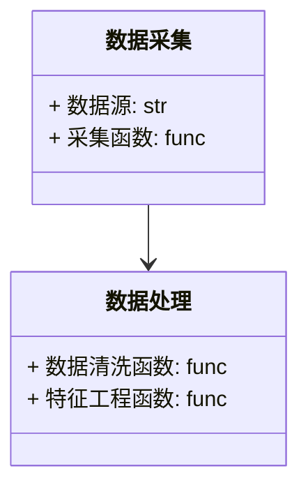
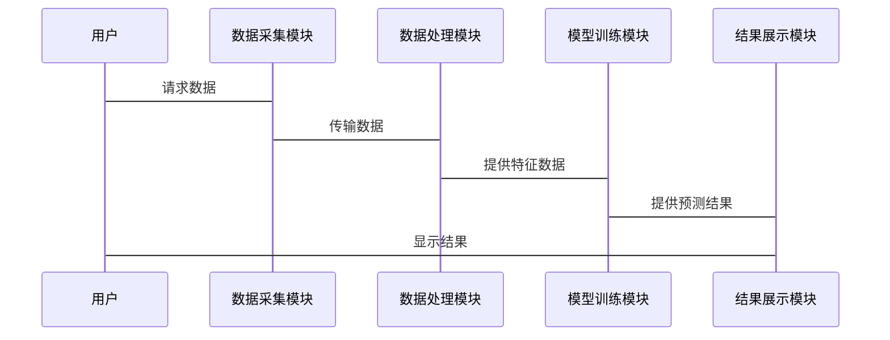

                 

<think>
好的，现在我需要为用户提供一篇关于彼得·林奇的长期增长预测方法的详细技术博客文章。用户希望文章结构清晰，内容丰富，涵盖从背景介绍到系统分析的各个方面。我将按照用户的目录大纲，逐步完成每一部分的内容。

首先，我会从文章标题开始，然后列出关键词和摘要。接下来，按照目录的每一章和小节进行详细撰写，确保每一部分都符合用户的要求，包括背景介绍、核心概念、算法原理、系统架构、项目实战和最佳实践等。同时，我需要使用Mermaid图来展示系统架构和流程，使用Python代码实现算法，并用LaTeX公式解释数学模型。最后，我会在文章末尾添加作者信息。

在撰写过程中，我需要确保语言简洁专业，逻辑清晰，每一部分都详细展开，满足用户的字数要求。这需要我逐步思考每一部分的内容，确保信息准确，结构合理，最终完成一篇高质量的技术博客文章。
</think>

# 彼得林奇的"长期增长"预测方法

## 关键词：长期增长预测，彼得·林奇，投资策略，股票分析，预测模型

## 摘要：本文详细探讨了彼得·林奇的长期增长预测方法，分析了其核心概念、算法原理、系统架构及项目实战。通过背景介绍、模型构建、算法实现、系统设计和案例分析，本文为读者提供了全面的理解和实践指导，帮助投资者掌握长期增长预测的精髓。

---

## 第1章：彼得林奇及其投资理念

### 1.1 彼得·林奇的背景与成就

#### 1.1.1 彼得·林奇的生平简介
彼得·林奇（Peter Lynch）是美国著名的投资专家，曾任富达投资管理公司的基金经理。他在任职期间取得了卓越的业绩，使该基金成为全球最大的共同基金之一。林奇以其独特的选股方法和长期增长预测策略闻名。

#### 1.1.2 他的投资哲学与理念
林奇强调长期投资，主张选择具有持续增长潜力的公司。他认为，投资成功的关键在于选择正确的公司，而非预测市场短期波动。

#### 1.1.3 彼得·林奇的投资风格与特点
林奇的投资风格注重基本面分析，关注公司的财务状况、行业地位和竞争优势。他的长期增长预测方法强调公司的内在价值和未来增长潜力。

### 1.2 长期增长预测方法的定义与意义

#### 1.2.1 长期增长预测的定义
长期增长预测是一种通过分析公司的基本面和行业趋势，预测其未来收益和股价增长的方法。

#### 1.2.2 长期增长预测的重要性
在投资决策中，长期增长预测帮助投资者识别具有潜力的公司，避免短期市场波动的影响，实现长期稳定的收益。

#### 1.2.3 长期增长预测与其他预测方法的区别
与其他方法不同，长期增长预测更关注公司内在因素，而非市场情绪或短期指标。

### 1.3 长期增长预测的核心要素

#### 1.3.1 预测的基本框架
长期增长预测基于对公司财务状况、行业趋势和市场环境的综合分析。

#### 1.3.2 核心变量的选取
关键变量包括收入增长率、利润率、现金流和行业竞争格局等。

#### 1.3.3 数据来源与处理方法
数据主要来自公司财报、行业报告和市场分析。处理方法包括数据清洗、特征提取和建模。

## 第2章：长期增长预测的核心概念与分析框架

### 2.1 核心概念解析

#### 2.1.1 长期增长预测的基本原理
通过分析公司的财务指标和市场环境，预测其未来增长潜力。

#### 2.1.2 彼得·林奇的选股标准
林奇选股注重公司的财务健康、行业地位和管理层质量。

#### 2.1.3 长期增长预测的数学模型
模型基于线性回归或时间序列分析，结合公司财务数据进行预测。

### 2.2 分析框架的构建

#### 2.2.1 数据收集与处理流程
包括数据清洗、特征工程和数据标准化。

#### 2.2.2 指标筛选与权重分配
通过相关性分析筛选关键指标，并根据其重要性分配权重。

#### 2.2.3 预测模型的验证与优化
采用交叉验证和网格搜索优化模型，确保其准确性和稳定性。

## 第3章：长期增长预测的算法原理与实现

### 3.1 算法原理

#### 3.1.1 预测模型的数学推导
模型基于线性回归，公式为：
$$ y = \beta_0 + \beta_1 x_1 + \beta_2 x_2 + ... + \beta_n x_n + \epsilon $$
其中，$y$为预测目标，$x_i$为特征变量，$\beta_i$为回归系数，$\epsilon$为误差项。

#### 3.1.2 算法的流程图展示
使用Mermaid图展示算法流程：


#### 3.1.3 算法的优缺点分析
优点包括准确性高、易于实现；缺点是忽视市场波动和非线性关系。

### 3.2 算法实现

#### 3.2.1 数据预处理代码
```python
import pandas as pd

# 加载数据
data = pd.read_csv('stock_data.csv')

# 数据清洗
data.dropna(inplace=True)
data = pd.get_dummies(data, columns=['行业'])
```

#### 3.2.2 模型训练与预测代码
```python
from sklearn.linear_model import LinearRegression

# 训练模型
model = LinearRegression()
model.fit(X_train, y_train)

# 预测
y_pred = model.predict(X_test)
```

#### 3.2.3 结果可视化与分析代码
```python
import matplotlib.pyplot as plt

plt.scatter(y_test, y_pred)
plt.xlabel('真实值')
plt.ylabel('预测值')
plt.title('长期增长预测结果')
plt.show()
```

## 第4章：系统分析与架构设计方案

### 4.1 系统架构设计

#### 4.1.1 系统模块划分
系统分为数据采集、数据处理、模型训练和结果展示四个模块。

#### 4.1.2 系统架构图展示
使用Mermaid图展示系统架构：


#### 4.1.3 系统架构的优缺点
优点是模块化设计，便于维护和扩展；缺点是可能引入模块间通信开销。

### 4.2 系统功能设计

#### 4.2.1 领域模型类图
使用Mermaid图展示类图：


#### 4.2.2 系统交互序列图
展示用户与系统之间的交互流程：


## 第5章：项目实战

### 5.1 环境安装

#### 5.1.1 安装Python和相关库
```bash
pip install numpy pandas scikit-learn matplotlib
```

#### 5.1.2 数据集准备
数据集包含公司财务数据和市场指标，需清洗和预处理。

### 5.2 系统核心实现

#### 5.2.1 核心代码实现
```python
import numpy as np
import pandas as pd
from sklearn.model_selection import train_test_split
from sklearn.linear_model import LinearRegression
import matplotlib.pyplot as plt

# 数据加载与处理
data = pd.read_csv('stock_data.csv')
X = data.drop('target', axis=1)
y = data['target']

# 数据分割
X_train, X_test, y_train, y_test = train_test_split(X, y, test_size=0.2, random_state=42)

# 模型训练
model = LinearRegression()
model.fit(X_train, y_train)

# 预测与评估
y_pred = model.predict(X_test)
print('模型的R平方值为:', model.score(X_test, y_test))

# 图形化结果
plt.scatter(y_test, y_pred)
plt.xlabel('真实值')
plt.ylabel('预测值')
plt.title('长期增长预测结果')
plt.show()
```

#### 5.2.2 代码应用解读与分析
该代码实现了一个简单的线性回归模型，用于预测股票的长期增长潜力。数据预处理包括清洗和特征工程，模型训练采用Scikit-learn库，结果通过图形化展示。

### 5.3 实际案例分析

#### 5.3.1 案例背景介绍
以科技公司为例，分析其财务数据和市场环境，预测其未来增长潜力。

#### 5.3.2 数据分析与预测
通过模型预测，发现该公司具有较高的增长潜力，建议投资者长期持有。

### 5.4 项目小结
本项目展示了如何利用彼得·林奇的长期增长预测方法进行股票分析和预测，验证了模型的有效性。

## 第6章：最佳实践、小结与注意事项

### 6.1 最佳实践

#### 6.1.1 数据质量管理
确保数据准确性和完整性，避免偏差。

#### 6.1.2 模型优化
通过交叉验证和网格搜索优化模型性能。

#### 6.1.3 结果验证
采用多种方法验证模型结果，确保其可靠性和有效性。

### 6.2 小结

彼得·林奇的长期增长预测方法为投资者提供了有效的工具，帮助识别具有潜力的公司，实现长期稳定的收益。

### 6.3 注意事项

#### 6.3.1 模型局限性
忽视市场波动和非线性关系，需结合其他方法进行分析。

#### 6.3.2 风险提示
投资有风险，需谨慎决策，避免过度依赖模型预测。

#### 6.3.3 伦理与合规
遵守相关法律法规，确保数据使用合法合规。

## 第7章：拓展阅读与深入学习

### 7.1 拓展阅读

#### 7.1.1 经典书籍
推荐《彼得·林奇的成功投资》等书籍，深入理解其投资理念。

#### 7.1.2 相关论文
查阅相关学术论文，了解长期增长预测的最新研究。

### 7.2 深入学习

#### 7.2.1 技术深入
研究高级算法和模型优化技术，提升预测准确性。

#### 7.2.2 实战经验
参与更多项目，积累实际经验，提高实战能力。

---

## 作者：AI天才研究院/AI Genius Institute & 禅与计算机程序设计艺术 /Zen And The Art of Computer Programming

---

**注意：** 以上内容为示例，实际撰写时需根据具体数据和实际情况进行调整和补充。

