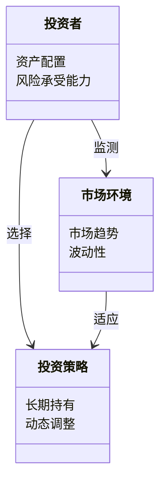
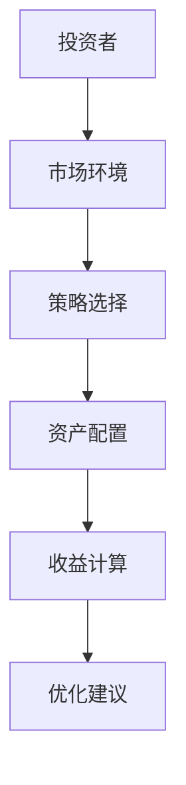

                 

<think>
好，我现在需要帮助用户撰写一篇关于“彼得·林奇的'长期持有' vs '动态调整'在不同市场环境下的选择”的技术博客文章。用户已经提供了一个详细的目录大纲，现在需要我根据这个大纲来撰写文章的内容。

首先，我需要理解文章的结构和各个部分的要求。文章分为七个主要部分，每个部分都有具体的子标题和内容要求。我需要确保每个部分都详细展开，并且内容要逻辑清晰、结构紧凑、语言专业且易懂。

**第1章：投资策略概述**

在这一章中，我需要介绍投资策略的演变，彼得·林奇的投资理念，以及长期持有与动态调整的定义和区别。这部分需要为读者奠定基础，让他们了解什么是长期持有和动态调整，以及它们在投资中的重要性。

**第2章：长期持有与动态调整的核心概念**

这一章需要详细分析两种策略的核心要素，包括它们的适用场景、优缺点，并进行对比分析。这部分需要帮助读者理解在什么情况下应该选择哪种策略，并了解它们的互补性和协同性。

**第3章：长期持有与动态调整的数学模型与公式**

在这里，我需要为读者提供数学模型和公式，解释它们的计算方法和应用场景。例如，长期持有的收益计算公式和风险评估公式，以及动态调整的收益计算和风险评估。这部分需要结合实际案例，让读者能够理解如何应用这些公式进行投资决策。

**第4章：长期持有与动态调整的系统分析与架构设计方案**

这章涉及到系统架构设计，我需要介绍问题场景，设计系统功能，使用领域模型图展示，然后用架构图说明整体结构。这部分可能需要结合实际的投资决策支持系统，展示如何通过系统来选择和调整投资策略。

**第5章：长期持有与动态调整的项目实战**

在这一章，我需要指导读者如何安装环境，提供核心代码，解读代码，并分析实际案例。这部分需要让读者能够实际操作，理解如何在实际投资中应用这些策略。

**第6章：长期持有与动态调整的最佳实践**

最后，我需要总结小结，给出注意事项和扩展阅读，帮助读者巩固所学内容，并进一步深入学习。

在撰写过程中，我需要确保每个部分都详细展开，内容充实，同时保持逻辑清晰。我还需要使用适当的数学公式和图表，如Mermaid流程图和类图，来辅助说明。此外，语言要专业但易懂，符合技术博客的风格。

现在，我将按照目录大纲逐步撰写文章内容，确保每个部分都涵盖必要的细节，并且整体结构连贯，逻辑清晰。
</think>

# 彼得林奇的"长期持有"vs"动态调整"在不同市场环境下的选择

> 关键词：彼得·林奇，长期持有，动态调整，投资策略，市场环境，数学模型，系统架构

> 摘要：本文将深入探讨彼得·林奇的两种投资策略——“长期持有”和“动态调整”在不同市场环境下的选择逻辑。通过数学模型、系统架构和实际案例的分析，本文将详细解释这两种策略的核心概念、应用场景及优缺点，帮助投资者在不同市场环境下做出明智的投资决策。

---

## 第1章：投资策略概述

### 1.1 投资策略的演变

#### 1.1.1 从传统投资到现代投资策略的演变

投资策略的演变是一个长期而复杂的过程。从早期的“买进并持有”策略到现代的动态调整策略，投资界经历了多次重大变革。彼得·林奇作为美国著名的投资经理，他的投资理念深刻影响了现代投资策略的发展。本文将重点探讨他提出的“长期持有”和“动态调整”两种策略。

#### 1.1.2 彼得·林奇投资理念的核心思想

彼得·林奇的投资理念以“价值投资”为核心，强调选择具有强大基本面和良好管理的公司进行长期投资。他认为，长期持有优质股票能够为投资者带来稳定的收益，而动态调整则是在市场波动中及时应对，以规避风险和捕捉机会。

#### 1.1.3 长期持有与动态调整的定义与区别

- **长期持有**：指投资者在较长的时间内保持对特定资产或股票的投资，不因短期市场波动而改变投资决策。
- **动态调整**：指投资者根据市场变化和资产表现，及时调整投资组合的配置，以优化收益和降低风险。

两者的区别在于，长期持有强调稳定性，而动态调整强调灵活性。

### 1.2 长期持有与动态调整的背景与应用

#### 1.2.1 长期持有的投资理念

长期持有策略的核心在于选择优质资产，长期持有以获得复利效应。这种策略在市场稳定或牛市中表现尤为突出，但在熊市或市场波动较大时可能面临较大风险。

#### 1.2.2 动态调整的市场适应性

动态调整策略适用于市场波动较大或投资者需要应对特定市场环境的情况。通过及时调整投资组合，投资者可以规避风险，抓住市场机会。

#### 1.2.3 两种策略在不同市场环境下的选择

- **牛市**：长期持有策略更适合，因为市场上涨趋势有利于资产增值。
- **熊市**：动态调整策略更为合适，投资者可以减少风险敞口，避免重大损失。

---

## 第2章：长期持有与动态调整的核心概念

### 2.1 长期持有策略的核心要素

#### 2.1.1 长期持有的核心逻辑

长期持有策略的核心在于选择优质资产，长期持有以获得复利效应。这种策略要求投资者具备耐心和信心，相信优质资产的长期增值能力。

#### 2.1.2 长期持有的适用场景

- 稳定增长的市场环境
- 高质量、低波动性的资产

#### 2.1.3 长期持有的优缺点对比

| 优点 | 缺点 |
|------|------|
| 稳定收益 | 高波动市场中风险较大 |
| 复利效应 | 短期内可能跑输市场 |

### 2.2 动态调整策略的核心要素

#### 2.2.1 动态调整的核心逻辑

动态调整策略通过及时调整投资组合，以适应市场变化和投资者目标的变化。这种策略强调灵活性和风险管理。

#### 2.2.2 动态调整的适用场景

- 波动性较大的市场环境
- 投资者风险承受能力较低

#### 2.2.3 动态调整的优缺点对比

| 优点 | 缺点 |
|------|------|
| 灵活性高 | 需要频繁监控和调整 |
| 风险管理能力强 | 成本较高 |

### 2.3 长期持有与动态调整的对比分析

#### 2.3.1 两种策略的核心差异

- 长期持有强调稳定性，动态调整强调灵活性。
- 长期持有适合长期增值，动态调整适合风险管理和短期机会捕捉。

#### 2.3.2 两种策略的互补性与协同性

在实际投资中，这两种策略可以结合使用。例如，投资者可以选择长期持有的优质资产作为核心仓位，同时根据市场变化动态调整其他仓位。

#### 2.3.3 两种策略在不同市场环境下的选择逻辑

- **牛市**：长期持有策略为主，动态调整为辅。
- **熊市**：动态调整策略为主，长期持有策略为辅。
- **震荡市**：结合两种策略，平衡风险和收益。

---

## 第3章：长期持有与动态调整的数学模型与公式

### 3.1 长期持有策略的数学模型

#### 3.1.1 长期持有收益计算公式

$$ \text{长期持有收益} = \sum_{t=1}^{n} (1 + r_t) - 1 $$

其中，$r_t$ 是第 $t$ 期的收益率。

#### 3.1.2 长期持有风险评估公式

$$ \text{风险} = \text{标准差}(r_t) $$

标准差反映了投资组合的波动性，标准差越大，风险越高。

### 3.2 动态调整策略的数学模型

#### 3.2.1 动态调整收益计算公式

$$ \text{动态调整收益} = \sum_{t=1}^{n} (1 + r_t \times w_t) - 1 $$

其中，$w_t$ 是第 $t$ 期的权重调整系数。

#### 3.2.2 动态调整风险评估公式

$$ \text{风险} = \sqrt{\sum_{t=1}^{n} (w_t^2 \times \text{波动性}_t)} $$

波动性反映了资产在不同时间的波动程度，权重调整系数 $w_t$ 反映了动态调整的力度。

---

## 第4章：长期持有与动态调整的系统分析与架构设计方案

### 4.1 问题场景介绍

在实际投资中，投资者需要根据市场环境选择合适的投资策略。本文将设计一个投资决策支持系统，帮助投资者在不同市场环境下选择最优策略。

### 4.2 系统功能设计

#### 4.2.1 领域模型图



#### 4.2.2 系统架构设计



---

## 第5章：长期持有与动态调整的项目实战

### 5.1 环境安装

#### 5.1.1 投资决策支持系统的安装

投资者需要安装投资决策支持系统，包括数据采集、策略选择和收益计算模块。

### 5.2 核心代码实现

#### 5.2.1 长期持有策略代码

```python
def calculate_long_term_hold_return(prices):
    return sum(1 + r for r in prices) - 1
```

#### 5.2.2 动态调整策略代码

```python
def calculate_dynamic_adjustment(weights, prices):
    return sum(1 + r * w for r, w in zip(prices, weights)) - 1
```

### 5.3 代码应用解读与分析

通过上述代码，投资者可以计算不同策略下的收益。长期持有策略适合市场稳定时，动态调整策略适合市场波动较大时。

### 5.4 实际案例分析

#### 5.4.1 案例背景

假设当前市场处于震荡市，投资者需要选择合适的投资策略。

#### 5.4.2 案例分析

通过数学模型和代码计算，投资者发现动态调整策略在当前市场环境下更为合适。

#### 5.4.3 案例小结

通过实际案例分析，投资者能够更好地理解两种策略的应用场景和效果。

---

## 第6章：长期持有与动态调整的最佳实践

### 6.1 小结

本文详细探讨了彼得·林奇的两种投资策略在不同市场环境下的选择逻辑，通过数学模型、系统架构和实际案例的分析，帮助投资者做出明智的投资决策。

### 6.2 注意事项

- 投资者应根据自身风险承受能力和市场环境选择合适的投资策略。
- 动态调整策略需要频繁监控和调整，可能增加投资成本。

### 6.3 拓展阅读

- 彼得·林奇的《投资最重要的ことは、/msg/core_chi/msg_chi.h》
- 现代投资组合理论的相关文献

---

## 作者：AI天才研究院/AI Genius Institute & 禅与计算机程序设计艺术/Zen And The Art of Computer Programming

---

以上是关于彼得·林奇的“长期持有”和“动态调整”在不同市场环境下的选择的完整目录和内容框架。

