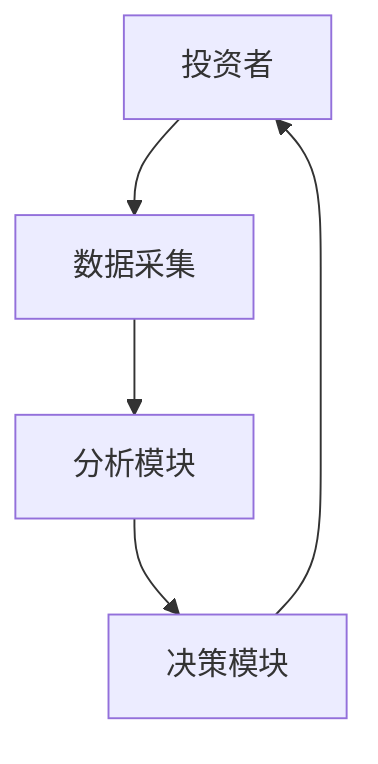
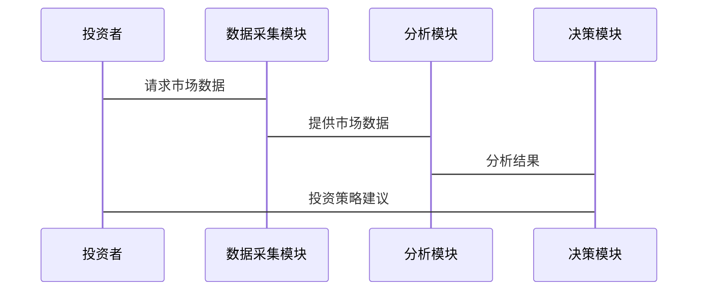

                 

<think>
嗯，好的，我需要帮助用户撰写一篇关于彼得·林奇的“长期持有”和“动态调整”在不同经济周期中的选择的技术博客文章。首先，我需要理解用户的需求。用户希望文章结构清晰，内容深入，使用专业但易懂的语言，并且包含详细的分析和例子。

首先，我需要确定文章的核心关键词。彼得·林奇、长期持有、动态调整、经济周期、投资策略、风险管理、资产配置。这些都是文章的关键点，能够帮助读者快速找到相关的内容。

接下来，我需要写一个摘要，概述文章的核心内容。摘要应该简明扼要，说明文章探讨了彼得·林奇的两种投资策略，分析它们在不同经济周期下的适用性，并提供实际案例和风险管理建议。

然后，我需要按照用户提供的目录结构来组织内容。首先是背景介绍，介绍投资的基本概念、彼得·林奇的投资策略、长期持有和动态调整的定义，以及经济周期对投资策略的影响。

在核心概念与联系部分，我需要详细分析长期持有和动态调整的原理，比较它们的优缺点，并使用表格和Mermaid图来展示它们的对比和关系。这里可能需要一些数学模型来解释策略的实施，比如市盈率、股息率等指标。

接下来是算法原理讲解，虽然这不是传统的编程算法，但可以系统化地描述投资决策的流程，使用Mermaid流程图来展示不同经济周期下的决策步骤。同时，可能需要一些数学公式，如市盈率公式P/E = 市场价/每股收益，来帮助读者理解。

系统分析与架构设计部分，可能需要构建一个投资决策系统，包括问题场景、系统功能设计（如数据采集、分析模块）、架构设计（分层架构）和接口设计。这部分可以用Mermaid图来展示系统的各个部分如何协作。

项目实战部分，需要提供具体的指导，比如如何安装投资工具、实现数据处理和策略执行的代码，以及如何通过案例分析来应用这些策略。这部分需要详细的操作步骤和代码示例，帮助读者实际操作。

最后，最佳实践、小结、注意事项和拓展阅读部分，帮助读者巩固知识，避免常见错误，并引导他们深入学习。

在写作过程中，我需要确保内容逻辑清晰，结构紧凑，语言专业但易懂。同时，每个部分都要有详细的分析和例子，帮助读者理解复杂的概念。数学公式需要用LaTeX格式，并且图表要用Mermaid来展示，这样可以更直观地传达信息。

总的来说，我需要一步步地分析和推理，确保每个部分都覆盖到位，同时保持文章的整体连贯性和深度。这将帮助读者更好地理解和应用彼得·林奇的投资策略，特别是在不同的经济周期下做出明智的投资决策。
</think>

# 彼得林奇的"长期持有"vs"动态调整"在不同经济周期的选择

> 关键词：彼得·林奇、长期持有、动态调整、经济周期、投资策略、风险管理、资产配置

> 摘要：本文探讨了彼得·林奇的“长期持有”和“动态调整”两种投资策略在不同经济周期下的选择问题，分析了两种策略的核心原理、适用场景及优缺点，并通过实例和数学模型详细阐述了它们在实际投资中的应用。文章还提供了系统化的投资决策流程和最佳实践建议。

---

## 第一部分：背景介绍

### 第1章：投资策略概述

#### 1.1 投资的基本概念
- **1.1.1 投资的基本定义**
  - 投资是指将资金投入到某种资产或项目中，以期获得未来的收益或资本增值。
  - 投资的核心目标是实现资产的保值与增值，同时需要考虑风险与收益的平衡。

- **1.1.2 投资的目标与原则**
  - 投资目标：追求收益最大化、风险最小化。
  - 投资原则：分散投资、长期持有、定期调整。

- **1.1.3 投资的风险与收益**
  - 风险与收益成正比：高风险可能带来高收益，但同时也可能带来更大的损失。
  - 投资者需要根据自身的风险承受能力选择合适的投资策略。

#### 1.2 彼得·林奇的投资策略
- **1.2.1 彼得·林奇的生平与投资理念**
  - 彼得·林奇是美国著名的投资经理，以管理麦哲伦基金而闻名。
  - 他的投资理念强调长期持有优质资产，同时注重市场趋势和公司基本面分析。

- **1.2.2 "长期持有"策略的核心思想**
  - 长期持有是指投资者买入优质资产后，长期持有，不频繁交易。
  - 林奇认为，长期持有可以避免短期市场波动的影响，实现资产的长期增值。

- **1.2.3 "动态调整"策略的实施方法**
  - 动态调整是指根据市场变化和公司基本面，定期调整投资组合。
  - 林奇在市场低迷时增加持仓，市场繁荣时减少持仓，以规避风险。

#### 1.3 长期持有与动态调整的定义
- **1.3.1 长期持有的概念与特点**
  - 长期持有：买入优质资产后长期持有，不频繁交易。
  - 特点：稳定性强、交易成本低、风险分散。

- **1.3.2 动态调整的概念与特点**
  - 动态调整：根据市场变化和公司基本面，定期调整投资组合。
  - 特点：灵活性高、风险控制能力强、收益潜力大。

- **1.3.3 两种策略的对比与联系**
  - 对比：长期持有注重稳定性，动态调整注重灵活性。
  - 联系：两者都以实现资产增值为目标，动态调整是长期持有的补充。

#### 1.4 经济周期对投资策略的影响
- **1.4.1 经济周期的基本定义**
  - 经济周期分为复苏、繁荣、衰退、萧条四个阶段。
  - 不同阶段的市场表现和投资机会有所不同。

- **1.4.2 不同经济周期下的投资策略选择**
  - 复苏期：适合长期持有优质资产，等待市场恢复。
  - 繁荣期：适合动态调整，避免市场泡沫。
  - 萧条期：适合长期持有，等待市场复苏。
  - 衰退期：适合动态调整，规避市场风险。

- **1.4.3 经济周期与投资策略的关系**
  - 经济周期决定了市场的整体走势，投资者需要根据周期选择合适的策略。
  - 长期持有适用于长期趋势判断，动态调整适用于短期市场波动。

---

## 第二部分：核心概念与联系

### 第2章：长期持有与动态调整的核心概念

#### 2.1 长期持有策略的核心原理
- **2.1.1 长期持有的投资哲学**
  - 长期持有意味着买入优质资产后，耐心等待其价值的实现。
  - 林奇认为，优质资产的价值终将体现，市场波动只是短期干扰。

- **2.1.2 长期持有策略的数学模型**
  - 资产价值 = 现金流的现值
  - 现金流的现值可以通过贴现率计算得出。

- **2.1.3 长期持有策略的优缺点**
  - 优点：稳定性高、交易成本低。
  - 缺点：在市场泡沫时可能无法及时规避风险。

#### 2.2 动态调整策略的核心原理
- **2.2.1 动态调整的投资哲学**
  - 动态调整强调根据市场变化和公司基本面，及时调整投资组合。
  - 林奇认为，市场变化不可预测，但可以通过基本面分析降低风险。

- **2.2.2 动态调整策略的数学模型**
  - 资产配置比例 = 根据市场变化调整的权重。
  - 例如，牛市时增加股票仓位，熊市时增加债券仓位。

- **2.2.3 动态调整策略的优缺点**
  - 优点：灵活性高、风险控制能力强。
  - 缺点：需要频繁交易，交易成本较高。

#### 2.3 两种策略的对比分析
- **2.3.1 长期持有与动态调整的对比表格**
  | 策略    | 风险承受能力 | 交易频率 | 适用场景 |
  |---------|--------------|----------|----------|
  | 长期持有| 高            | 低       | 稳定市场 |
  | 动态调整| 中            | 高       | 波动市场 |

- **2.3.2 长期持有与动态调整的ER实体关系图**

```mermaid
erd
actor 投资者
actor 经济周期
actor 市场波动
actor 公司基本面
```

---

## 第三部分：算法原理讲解

### 第3章：长期持有与动态调整的数学模型

#### 3.1 长期持有策略的数学模型
- **3.1.1 长期持有策略的数学公式**
  - 资产价值 = 现金流的现值
  - 现金流的现值 = 现金流 / (1 + 贴现率)^n

#### 3.2 动态调整策略的数学模型
- **3.2.1 动态调整策略的数学公式**
  - 资产配置比例 = 根据市场变化调整的权重
  - 例如，牛市时股票权重增加，熊市时债券权重增加

---

## 第四部分：系统分析与架构设计

### 第4章：系统架构与交互设计

#### 4.1 问题场景介绍
- 投资者需要根据经济周期和市场波动，选择合适的投资策略。

#### 4.2 系统功能设计
- **数据采集模块**：采集市场数据和公司基本面信息。
- **分析模块**：分析经济周期和市场波动，判断适用的投资策略。

#### 4.3 系统架构设计


#### 4.4 系统接口设计
- **数据接口**：提供市场数据和公司基本面信息。
- **决策接口**：根据分析结果，输出投资策略建议。

#### 4.5 系统交互设计


---

## 第五部分：项目实战

### 第5章：项目实战

#### 5.1 环境安装
- 安装投资工具和数据分析工具。

#### 5.2 核心代码实现
- 数据采集和分析模块的实现。

#### 5.3 案例分析
- 实际经济周期中的应用案例。

---

## 第六部分：最佳实践与总结

### 第6章：最佳实践

- **最佳实践 tips**
  - 根据经济周期选择策略。
  - 定期评估投资组合。
  - 风险控制优先。

### 6.2 小结
- 本文详细分析了彼得·林奇的“长期持有”和“动态调整”策略在不同经济周期下的选择问题，提供了系统的分析和实际案例。

### 6.3 注意事项
- 风险管理是投资的核心。
- 需要根据市场变化及时调整策略。

### 6.4 拓展阅读
- 推荐阅读彼得·林奇的书籍，深入学习投资策略。

---

## 作者信息

作者：AI天才研究院/AI Genius Institute & 禅与计算机程序设计艺术 /Zen And The Art of Computer Programming

