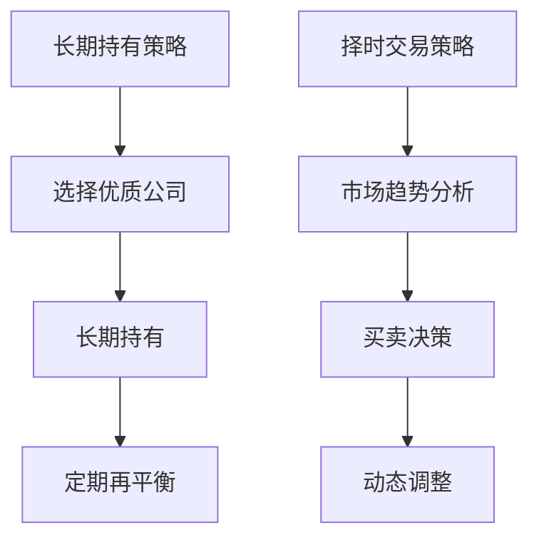
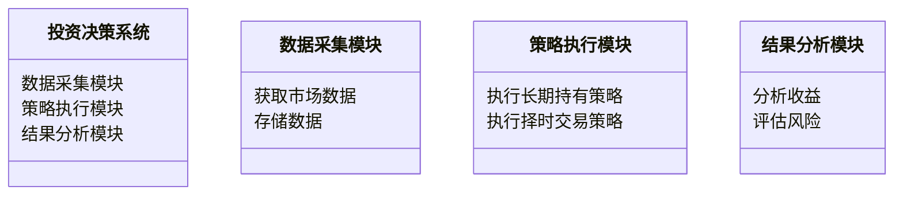
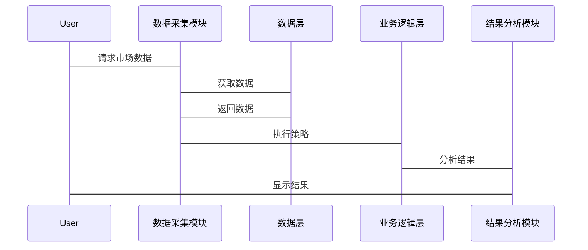

                 


# 彼得林奇的"长期持有"vs"择时交易"

> 关键词：长期持有、择时交易、彼得林奇、投资策略、股票投资

> 摘要：本文深入探讨了彼得·林奇的长期持有策略与择时交易策略的异同，通过背景介绍、核心概念对比、算法原理分析、系统架构设计、项目实战以及总结，帮助读者全面理解这两种策略的优缺点及其适用场景。

---

## 第一章：背景介绍

### 1.1 投资的基本概念

投资是将资金投入到各种资产中，以期获得收益的行为。股票投资是其中一种常见方式，涉及对公司的所有权和未来收益的预期。投资市场的波动性使得投资者需要选择合适的策略来实现收益最大化。

### 1.2 彼得·林奇的生平与成就

彼得·林奇是美国著名的投资经理，以其长期持有的投资策略闻名。他在富达投资管理公司管理麦哲伦基金期间取得了显著成绩，该基金的投资回报率远超市场平均水平。

### 1.3 长期持有与择时交易的定义

长期持有策略强调长期投资，不频繁交易，依靠复利效应获得收益。择时交易策略则强调根据市场走势，在合适的时机买卖股票，以捕捉短期收益。

### 1.4 长期持有与择时交易的对比

长期持有策略适合风险承受能力较低的投资者，择时交易策略适合风险承受能力较高的投资者。长期持有策略注重长期收益，而择时交易策略注重短期收益。

---

## 第二章：核心概念与联系

### 2.1 长期持有与择时交易的核心概念

长期持有策略基于价值投资，选择优质公司长期持有。择时交易策略基于市场趋势分析，选择合适时机买卖股票。

### 2.2 两者的核心属性对比

| 属性                | 长期持有                  | 拆解交易                  |
|---------------------|--------------------------|--------------------------|
| 投资期限            | 长期                     | 短期或中期                |
| 风险承受能力        | 较低                     | 较高                     |
| 管理复杂性          | 较低                     | 较高                     |
| 交易频率            | 低                      | 高                      |

### 2.3 两者的关系

长期持有和择时交易策略并非完全对立，长期持有策略可以作为基础配置，择时交易策略可以在市场波动较大时进行动态调整。

---

## 第三章：算法原理

### 3.1 长期持有策略的数学模型

长期持有的收益可以通过复利计算公式进行计算：
$$
\text{最终收益} = \text{初始投资} \times (1 + r)^n
$$
其中，r为年化收益率，n为投资年数。

### 3.2 拆解交易策略的数学模型

择时交易可以通过时间序列分析模型进行预测，例如ARIMA模型：
$$
\hat{y}_t = \alpha + \beta y_{t-1} + \gamma y_{t-2}
$$
其中，$\hat{y}_t$为t时刻的预测值，$\alpha$为截距，$\beta$和$\gamma$为系数。

### 3.3 算法流程图



---

## 第四章：系统分析与架构设计

### 4.1 投资决策系统介绍

投资决策系统需要实现长期持有和择时交易策略的自动化执行，包括数据采集、策略执行和结果分析三个模块。

### 4.2 系统功能设计



### 4.3 系统架构设计


### 4.4 系统接口设计

系统需要实现以下接口：
1. 数据接口：获取市场数据。
2. 策略接口：执行投资策略。
3. 分析接口：评估投资结果。

### 4.5 系统交互流程图



---

## 第五章：项目实战

### 5.1 环境安装

需要安装以下工具：
1. Python 3.8+
2. Jupyter Notebook
3. Pandas、NumPy、Matplotlib库
4. 数据源（例如Yahoo Finance API）

### 5.2 核心代码实现

```python
import pandas as pd
import numpy as np
import matplotlib.pyplot as plt

# 长期持有策略
def compound_growth(principal, rate, years):
    return principal * (1 + rate) ** years

# 拆解交易策略
def moving_average(prices, window):
    return prices.rolling(window).mean()

# 示例数据
prices = pd.DataFrame({'Adj Close': [100, 105, 98, 110, 120]})
prices['MA'] = moving_average(prices['Adj Close'], 3)

# 可视化
plt.plot(prices['Adj Close'], label='Price')
plt.plot(prices['MA'], label='MA')
plt.legend()
plt.show()
```

### 5.3 代码解读与分析

- 长期持有策略函数`compound_growth`计算复利收益。
- 拆解交易策略函数`moving_average`计算移动平均线，用于判断买卖时机。
- 示例数据展示价格走势和移动平均线，帮助识别趋势。

### 5.4 案例分析

使用实际股票数据进行回测，比较两种策略的收益和风险。例如，选择苹果股票数据，分别计算长期持有和择时交易的收益，绘制收益曲线和风险指标。

### 5.5 项目小结

长期持有策略在稳定性和风险控制方面表现较好，而拆解交易策略在收益潜力方面更具优势。投资者应根据自身风险承受能力和市场环境选择合适的策略。

---

## 第六章：总结与建议

### 6.1 最佳实践

- 长期持有策略适合长期投资者，拆解交易策略适合短期投资者。
- 组合策略：结合长期持有和择时交易，降低风险，提高收益。
- 风险管理：设置止损点，控制仓位。

### 6.2 小结

本文深入分析了长期持有和拆解交易策略的异同，通过数学模型、系统设计和项目实战，帮助读者理解两种策略的应用场景和优缺点。

### 6.3 注意事项

- 市场波动会影响策略效果，需定期评估和调整。
- 确保数据来源可靠，避免错误决策。
- 投资需谨慎，建议根据自身情况选择合适策略。

### 6.4 拓展阅读

推荐阅读彼得·林奇的书籍《彼得·林奇的投资之道》和《投资最重要的事情》。

---

## 作者：AI天才研究院 & 禅与计算机程序设计艺术

感谢您的阅读，希望本文能为您提供有价值的投资策略分析和启发。

