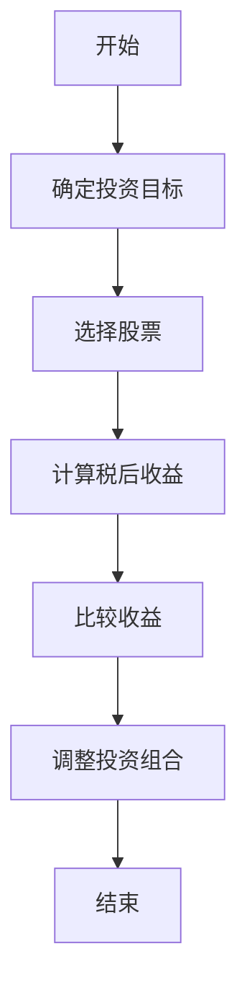
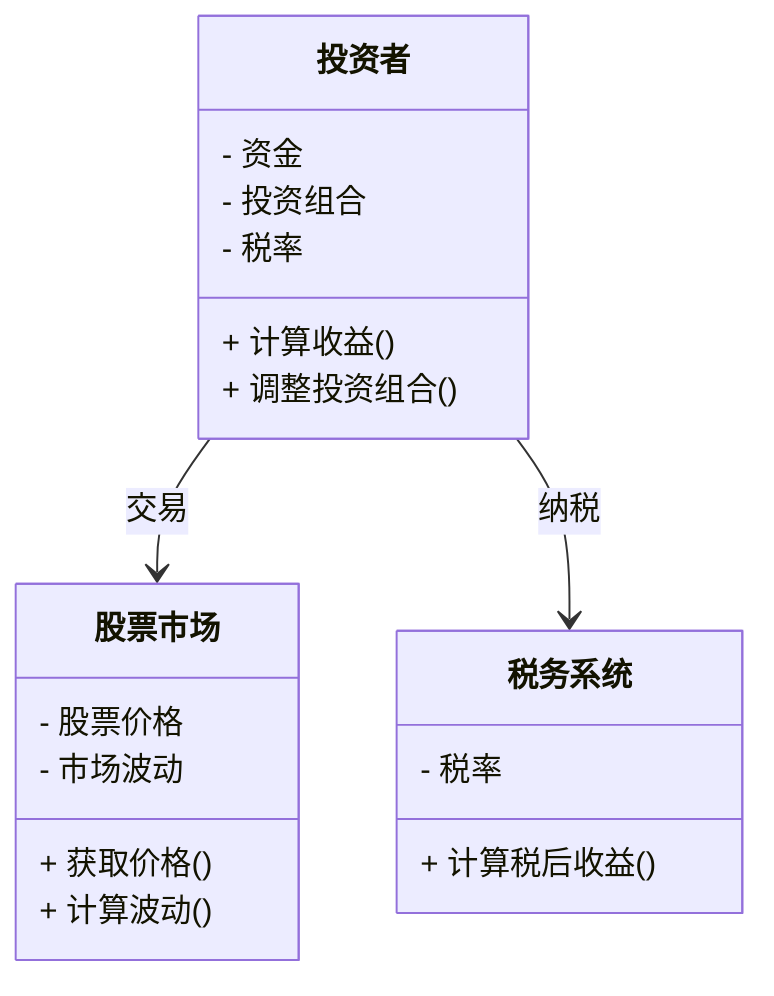
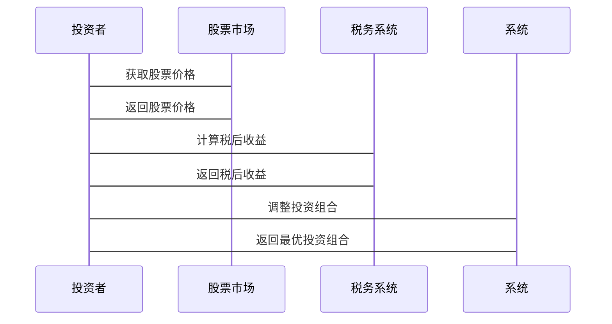

                 


# 彼得林奇的"长期持股"在不同税收政策下的优化模型

## 关键词：  
彼得林奇, 长期持股, 税收政策, 投资优化模型, 股票投资

## 摘要：  
本文深入分析了彼得林奇的长期持股策略，并结合不同税收政策下的优化模型，探讨如何在不同税收环境下优化长期持股的投资策略。通过构建数学模型和算法，本文提出了一个基于税收政策的长期持股优化方案，为投资者在复杂税收环境中制定有效的投资策略提供了理论依据和实践指导。

---

# 目录

1. [长期持股策略的背景与核心理念](#长期持股策略的背景与核心理念)
2. [长期持股与税收政策的结合](#长期持股与税收政策的结合)
3. [优化模型的数学基础](#优化模型的数学基础)
4. [系统分析与架构设计](#系统分析与架构设计)
5. [项目实战：基于Python的优化模型实现](#项目实战基于Python的优化模型实现)
6. [总结与展望](#总结与展望)

---

## 第1章：长期持股策略的背景与核心理念

### 1.1 长期持股的定义与特点

#### 1.1.1 长期持股的定义  
长期持股是一种投资策略，指投资者在较长的时间内持有股票，以获取资本增值和股息收入。这种策略强调长期价值，而非短期价格波动。

#### 1.1.2 长期持股的核心特点  
- **稳定性**：长期持股注重资产的长期稳定性，避免频繁交易带来的交易成本和市场波动风险。  
- **复利效应**：通过长期持有，投资者可以享受复利效应，实现资产的指数级增长。  
- **分散风险**：长期持股通常采用分散投资策略，降低单一投资的风险。  

#### 1.1.3 长期持股与短期投资的区别  
- **时间跨度**：长期持股通常以数年为单位，而短期投资以月或季度为单位。  
- **目标**：长期持股注重资产增值，短期投资注重短期收益。  
- **风险承受能力**：长期投资者能够承受更大的短期波动风险，而短期投资者对波动更为敏感。  

### 1.2 彼得·林奇的投资理念

#### 1.2.1 彼得·林奇的生平简介  
彼得·林奇是美国著名投资经理人，以其成功的投资业绩和长期持股策略闻名。他强调长期投资的价值，并通过深入研究企业基本面来选择投资标的。

#### 1.2.2 林奇的长期持股策略  
林奇认为，成功的投资需要耐心和长期持有优质资产。他主张选择具有强大竞争优势和良好管理的公司，并长期持有这些股票，以获取稳定的收益。

#### 1.2.3 林奇投资理念的核心思想  
- **价值投资**：寻找具有低估价值的公司。  
- **长期持有**：避免频繁交易，减少成本。  
- **分散投资**：通过投资多个优质企业降低风险。  

### 1.3 税收政策对投资的影响

#### 1.3.1 税收政策的基本概念  
税收政策是指政府对投资收益（如股息、资本增值）征税的相关规定。不同国家和地区的税收政策差异较大，影响投资者的净收益。

#### 1.3.2 税收政策对投资收益的影响  
- **资本利得税**：对股票买卖的收益征税，影响投资者的净收益。  
- **股息税**：对股息收入征税，影响分红收益。  
- **税率差异**：不同税收政策下的税率差异直接影响投资决策。  

#### 1.3.3 不同税收政策下的投资策略调整  
- **高税率环境**：投资者可能选择持有期限更长的股票，以减少资本利得税的缴纳。  
- **低税率环境**：投资者可以更灵活地进行短期交易，追求更高收益。  

---

## 第2章：长期持股与税收政策的结合

### 2.1 长期持股在不同税收政策下的优化模型

#### 2.1.1 税收政策对长期持股的影响  
不同税收政策下，长期持股的收益和成本会有所不同。例如，资本利得税税率的高低直接影响投资的净收益。  

#### 2.1.2 构建优化模型的基本思路  
- **目标函数**：最大化净收益。  
- **约束条件**：考虑税收政策、市场波动、投资期限等因素。  
- **变量**：股票价格、税率、持有时间等。  

#### 2.1.3 模型的目标与约束条件  
- **目标**：在不同税收政策下，找到最优的持股时间和投资组合，实现收益最大化。  
- **约束条件**：  
  1. 投资期限大于等于1年。  
  2. 税率范围在0%到30%之间。  
  3. 股票价格符合市场波动规律。  

### 2.2 长期持股与税收政策的关系

#### 2.2.1 长期持股与税率的关系  
税率越高，投资收益的净收益越低，投资者可能需要调整持股时间和投资组合。  

#### 2.2.2 税收优惠政策对长期持股的影响  
税收优惠政策（如税收减免）可以降低投资成本，提高净收益，吸引更多投资者长期持有股票。  

#### 2.2.3 不同税收政策下的长期持股策略  
- **高税率地区**：选择低税率的股票或行业，延长持股时间，减少资本利得税。  
- **低税率地区**：灵活调整持股时间，追求更高收益。  

### 2.3 优化模型的构建与应用

#### 2.3.1 模型的构建过程  
1. 确定目标函数：最大化净收益。  
2. 确定变量：股票价格、税率、持有时间。  
3. 确定约束条件：投资期限、税率范围、市场波动。  

#### 2.3.2 模型的应用场景  
- 投资者在不同税收政策下的投资决策支持。  
- 企业制定税收政策时的参考依据。  

---

## 第3章：优化模型的数学基础

### 3.1 算法原理讲解

#### 3.1.1 算法流程图  


#### 3.1.2 Python代码实现  
```python
import numpy as np
import pandas as pd

def calculate_net_profit(tax_rate, holding_period):
    # 假设股票收益为10%，税率为 tax_rate，持有时间为 holding_period 年
    capital_gain = 1.10 ** holding_period - 1
    tax = capital_gain * tax_rate
    net_profit = capital_gain - tax
    return net_profit

# 示例计算
tax_rate = 0.2  # 20%的资本利得税
holding_period = 5  # 5年
net_profit = calculate_net_profit(tax_rate, holding_period)
print(f"税后净收益为：{net_profit}")
```

#### 3.1.3 数学模型与公式  
资本利得税公式：  
$$ \text{税后收益} = \text{资本收益} \times (1 - \text{税率}) $$  

复利计算公式：  
$$ \text{最终收益} = \text{初始投资} \times (1 + r)^n $$  

#### 3.1.4 详细讲解与案例分析  
以持有5年、资本收益10%、税率20%为例，计算税后收益：  
$$ \text{税后收益} = 1.10^5 - 1 = 1.6105 - 1 = 0.6105 $$  
$$ \text{税后净收益} = 0.6105 \times (1 - 0.20) = 0.6105 \times 0.80 = 0.4884 $$  

---

## 第4章：系统分析与架构设计

### 4.1 系统功能设计

#### 4.1.1 领域模型  


#### 4.1.2 系统架构设计  


#### 4.1.3 系统接口设计  
- **输入接口**：税率、持有时间、初始投资金额。  
- **输出接口**：税后收益、最优投资组合、投资建议。  

#### 4.1.4 系统交互流程图  


---

## 第5章：项目实战：基于Python的优化模型实现

### 5.1 环境安装

#### 5.1.1 安装Python与相关库  
- Python 3.8+  
- NumPy、Pandas、Matplotlib  

### 5.2 核心代码实现

#### 5.2.1 计算税后收益  
```python
def calculate_tax后收益(tax_rate, holding_period):
    capital_gain = (1 + 0.10) ** holding_period - 1
    tax = capital_gain * tax_rate
    return capital_gain - tax

# 示例计算
tax_rate = 0.2
holding_period = 5
net_profit = calculate_tax后收益(tax_rate, holding_period)
print(f"税后净收益为：{net_profit}")
```

#### 5.2.2 优化模型实现  
```python
import numpy as np
import matplotlib.pyplot as plt

def optimize_holding_period(tax_rate):
    holding_periods = np.arange(1, 11)
    profits = []
    for hp in holding_periods:
        capital_gain = (1 + 0.10) ** hp - 1
        tax = capital_gain * tax_rate
        profits.append(capital_gain - tax)
    return holding_periods, profits

# 示例计算
tax_rate = 0.2
hp, profits = optimize_holding_period(tax_rate)
plt.plot(hp, profits)
plt.xlabel('持有时间（年）')
plt.ylabel('净收益')
plt.title('不同持有时间下的净收益')
plt.show()
```

### 5.3 案例分析

#### 5.3.1 税率对投资收益的影响  
以20%的资本利得税为例，计算不同持有时间下的净收益：  

- 持股1年：净收益 = 0.10 × (1 - 0.20) = 0.08  
- 持股5年：净收益 = 0.6105 × (1 - 0.20) = 0.4884  

#### 5.3.2 税收政策优化  
通过调整税率，找到最优的持有时间和投资组合，实现收益最大化。  

---

## 第6章：总结与展望

### 6.1 总结  
本文通过构建优化模型，探讨了彼得林奇的长期持股策略在不同税收政策下的应用。通过数学建模和算法实现，提出了一个基于税收政策的长期持股优化方案，为投资者提供了理论依据和实践指导。

### 6.2 最佳实践 tips  
- **长期投资**：耐心持有优质资产，避免频繁交易。  
- **税率考虑**：根据不同税收政策，调整持股时间和投资组合。  
- **分散投资**：降低单一投资的风险。  

### 6.3 展望  
未来的研究可以进一步考虑更多变量，如通货膨胀、市场波动等，构建更复杂的优化模型。同时，可以结合人工智能技术，实现更加智能化的投资决策支持。

---

## 作者：  
AI天才研究院/AI Genius Institute & 禅与计算机程序设计艺术/Zen And The Art of Computer Programming

