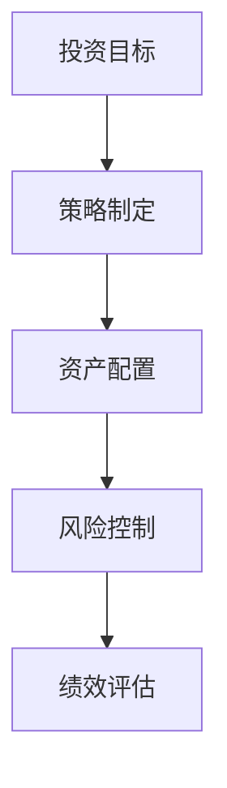

                 


# 彼得林奇的"长期持股"心理准备

> 关键词：长期持股、彼得林奇、投资心理、心理模型、数学分析、系统架构

> 摘要：本文深入探讨了彼得·林奇的长期持股策略及其背后的心理准备。通过分析投资心理、构建心理模型、数学分析、系统架构设计等多方面，揭示了长期持股成功的关键因素。文章从背景介绍、核心概念、算法原理、系统分析、项目实战、总结等部分展开，结合实际案例和最佳实践，为读者提供了全面的指导。

---

## 第1章: 长期持股的背景与核心理念

### 1.1 长期持股的核心理念

#### 1.1.1 长期持股的定义与特点
长期持股是一种投资策略，强调长期持有优质资产，不因短期市场波动而频繁交易。其特点包括：
- **长期性**：注重资产的长期价值，而非短期收益。
- **选择性**：精选优质企业，避免短期市场波动的干扰。
- **纪律性**：坚持投资策略，避免情绪化决策。

#### 1.1.2 长期持股与短期投资的对比
- **时间跨度**：长期持股关注数年甚至数十年的回报，而短期投资关注数周或数月的收益。
- **决策因素**：长期持股基于企业的基本面，短期投资基于市场情绪。
- **风险承受**：长期持股能够分散短期波动的风险，短期投资则容易受到市场波动的冲击。

#### 1.1.3 彼得·林奇的投资哲学
彼得·林奇是长期持股策略的倡导者，他强调：
- **优质企业的重要性**：选择具有持续竞争优势的企业。
- **价值投资**：以合理价格买入并长期持有优质资产。
- **分散投资**：通过投资不同行业的优质企业降低风险。

### 1.2 投资者心理与市场行为

#### 1.2.1 投资者的常见心理误区
- **过度自信**：认为自己能够准确预测市场走势。
- **从众心理**：跟随市场潮流，忽视独立思考。
- **损失厌恶**：对潜在损失的恐惧导致决策失误。

#### 1.2.2 市场情绪对投资决策的影响
市场情绪（贪婪与恐慌）往往会导致非理性决策，投资者需要：
- **避免追涨杀跌**：不因市场情绪盲目买卖。
- **保持冷静**：在市场波动中坚持长期策略。

#### 1.2.3 理性与非理性决策的对比
理性决策基于事实和数据，而非理性决策基于情绪和直觉。长期持股需要投资者具备理性思维，避免被市场情绪左右。

### 1.3 长期持股的心理挑战

#### 1.3.1 短期波动对心理的冲击
市场波动可能导致投资者焦虑，尤其是当持有的资产价格下跌时。长期持股需要投资者具备耐心，相信时间会带来回报。

#### 1.3.2 市场恐慌与贪婪的应对策略
- **市场恐慌时**：利用低价买入优质资产。
- **市场贪婪时**：警惕高估的资产，避免高位入场。

#### 1.3.3 长期持有中的耐心与纪律
耐心是长期持股的关键，投资者需要：
- **坚持投资计划**：不因市场波动改变策略。
- **定期复盘**：评估投资组合，调整不合理部分。

## 第2章: 彼得·林奇的投资策略与心理准备

### 2.1 彼得·林奇的选股标准

#### 2.1.1 优质企业的定义与特征
优质企业具备以下特征：
- **持续盈利能力**：企业能够在不同经济周期中保持盈利。
- **竞争优势明显**：企业具有独特的竞争优势，如品牌、技术等。
- **管理团队优秀**：管理团队具备经验和能力，能够带领企业持续发展。

#### 2.1.2 财务指标的分析与应用
关键财务指标包括：
- **市盈率（P/E）**：评估股票的估值是否合理。
- **市净率（P/B）**：衡量股票价格相对于账面价值的高低。
- **ROE（净资产收益率）**：评估企业的盈利能力。

#### 2.1.3 行业选择与竞争优势
选择行业时，应考虑：
- **行业前景**：行业是否具有增长潜力。
- **竞争格局**：企业是否在行业内具有竞争优势。

### 2.2 长期持股中的风险管理

#### 2.2.1 风险的定义与分类
风险可以分为：
- **市场风险**：整个市场的波动对资产价值的影响。
- **流动性风险**：资产难以快速变现的风险。
- **信用风险**：债券或贷款的违约风险。

#### 2.2.2 风险评估与心理准备
投资者应：
- **评估自身风险承受能力**：根据自身财务状况和心理承受能力选择合适的投资策略。
- **分散投资**：通过投资不同资产类别和行业降低风险。

#### 2.2.3 风险控制的策略与技巧
- **设置止损点**：在投资组合中设定止损点，避免重大损失。
- **定期调整**：根据市场变化和个人情况调整投资组合。

### 2.3 投资决策中的心理因素

#### 2.3.1 投资动机与目标设定
明确的投资目标有助于：
- **制定合理的投资策略**。
- **避免偏离目标**。

#### 2.3.2 自我认知与决策偏差
投资者应：
- **了解自身认知偏差**：如过度自信、确认偏差等。
- **避免情绪化决策**：保持理性思考，避免被情绪左右。

#### 2.3.3 信息处理与决策质量
有效的信息处理：
- **多渠道获取信息**：通过多种渠道获取信息，避免片面决策。
- **分析信息的可靠性**：评估信息来源的可信度。

## 第3章: 长期持股的心理模型与数学分析

### 3.1 投资心理模型的构建

#### 3.1.1 心理模型的定义与作用
心理模型是投资者对市场的理解和认知框架，帮助投资者做出决策。

#### 3.1.2 彼得·林奇心理模型的特点
- **基于价值**：关注企业的内在价值。
- **长期视角**：注重资产的长期表现。
- **风险管理**：注重分散投资和风险控制。

### 3.2 投资决策的数学模型

#### 3.2.1 投资回报的计算公式
$$ ROI = \frac{最终价值 - 初始价值}{初始价值} \times 100\% $$

#### 3.2.2 风险与收益的平衡模型
$$ R = \frac{E(r) - r_f}{\sigma^2} $$

#### 3.2.3 投资组合优化的数学公式
$$ \text{最优组合} = \arg\min_w \left( w^T \Sigma w - \lambda (w^T \mu - \mu_0) \right) $$

### 3.3 心理因素对数学模型的影响
- **心理预期**：投资者对市场的预期会影响模型的参数设置。
- **情绪波动**：情绪波动可能导致模型参数的调整不合理。

## 第4章: 长期持股中的系统性分析与架构设计

### 4.1 投资系统的构成与功能

#### 4.1.1 投资目标的设定与分解
明确投资目标是投资系统设计的第一步，需要将总体目标分解为具体可执行的子目标。

#### 4.1.2 投资策略的制定与实施
制定策略时需要考虑市场环境、资产配置等因素，并定期评估和调整。

#### 4.1.3 投资监控与反馈机制
建立有效的监控机制，及时发现和解决问题，确保投资策略的实施。

### 4.2 投资系统的架构设计

#### 4.2.1 系统功能模块划分
- **目标设定模块**：明确投资目标和风险承受能力。
- **资产配置模块**：根据目标制定资产配置方案。
- **风险控制模块**：监控和管理投资风险。
- **绩效评估模块**：定期评估投资绩效。

#### 4.2.2 系统流程的Mermaid图


## 第5章: 项目实战与案例分析

### 5.1 项目环境与工具安装
- **环境**：选择合适的金融分析工具，如Excel、Python等。
- **工具**：安装必要的数据分析库，如Pandas、Matplotlib等。

### 5.2 核心实现源代码

#### 5.2.1 数据获取与处理
```python
import pandas as pd
import numpy as np
import matplotlib.pyplot as plt

# 获取数据
data = pd.read_csv('stock_data.csv')
# 数据清洗
data = data.dropna()
```

#### 5.2.2 模型实现
```python
def calculate_ROI(initial, final):
    return (final - initial) / initial * 100

roi = calculate_ROI(100, 150)
print(f"ROI: {roi}%")
```

### 5.3 案例分析与解读
通过具体案例分析，验证长期持股策略的有效性，评估心理模型和数学模型的应用效果。

### 5.4 小结
总结项目实战的经验和教训，提出改进建议。

## 第6章: 总结与注意事项

### 6.1 本章总结
总结长期持股策略的心理准备、投资策略、风险管理等方面的内容。

### 6.2 注意事项
- **避免过度自信**：认识到市场不确定性。
- **保持耐心**：长期持股需要时间和耐心。
- **持续学习**：关注市场变化，不断优化投资策略。

### 6.3 最佳实践 Tips
- **定期复盘**：评估投资组合的表现。
- **分散投资**：降低风险。
- **保持纪律**：坚持长期策略。

## 第7章: 拓展阅读与深入思考

### 7.1 拓展阅读推荐
推荐相关的书籍和资源，供读者深入学习。

### 7.2 深入思考与自我反思
鼓励读者进行深入思考，结合自身实际情况优化投资策略。

---

## 作者信息

作者：AI天才研究院/AI Genius Institute & 禅与计算机程序设计艺术 /Zen And The Art of Computer Programming

---

本文通过系统的分析和实践，深入探讨了彼得·林奇长期持股策略的心理准备，从理论到实践，为读者提供了全面的指导。希望读者能够通过本文，更好地理解和应用长期持股策略，实现投资目标。

