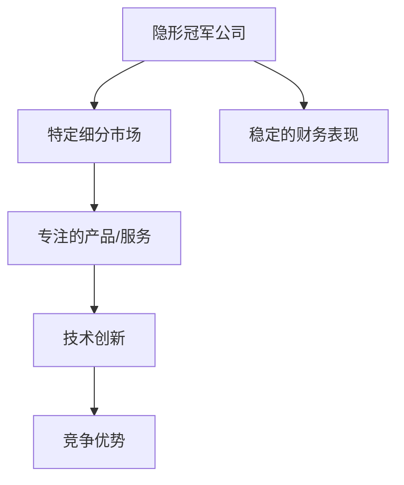
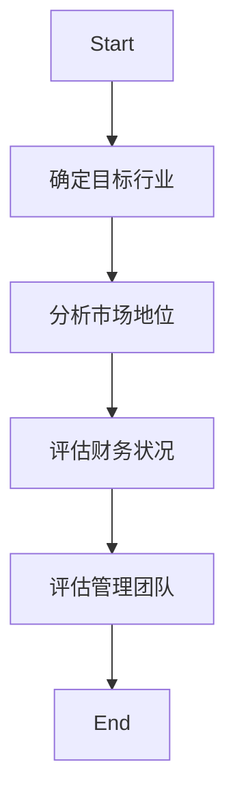
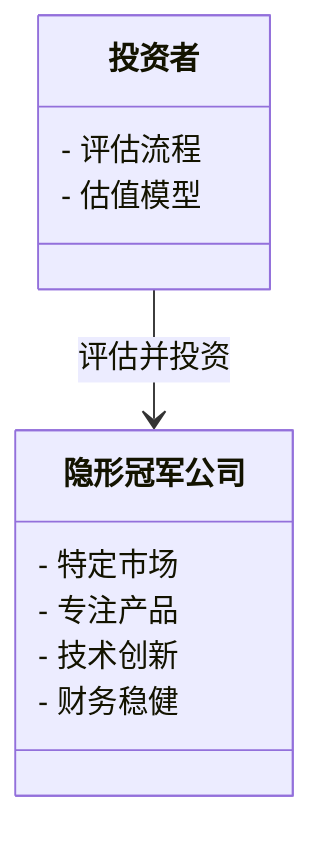
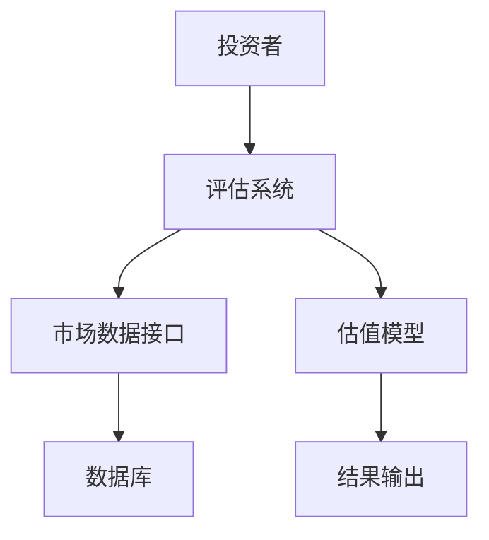

                 

<think>
好的，现在我需要根据用户的要求，撰写一篇以《彼得林奇的"隐形冠军"发掘方法》为标题的技术博客文章。用户已经提供了一个详细的目录大纲，我需要按照这个大纲，逐步完成每个章节的内容。

首先，我会处理“背景介绍”部分，包括彼得林奇的投资理念、隐形冠军的定义以及其投资价值。接下来，我会详细讲解核心概念，分析隐形冠军的关键特征，并用表格和图表进行对比。然后，我会介绍评估隐形冠军的算法原理，使用流程图来展示评估步骤，并编写相应的Python代码来实现这些步骤。在数学模型部分，我会解释常用的估值公式，并展示如何通过行业数据来判断公司的潜力。系统分析部分将包括商业模式的Mermaid类图和架构设计的序列图。项目实战部分将通过具体案例分析，展示如何应用这些方法找到隐形冠军。最后，我会总结全书内容，给出实用的投资建议，并推荐相关的拓展阅读材料。

在写作过程中，我需要确保每个章节内容丰富、具体详细，并且符合用户的要求，包括使用正确的格式和图表。同时，文章需要保持逻辑清晰、结构紧凑，语言专业且易懂。最后，我会检查文章是否符合字数要求，并在末尾加上作者信息。

现在，我将按照这个思考过程，逐步完成每个章节的内容。
</think>

# 彼得林奇的"隐形冠军"发掘方法

> **关键词**：彼得林奇，隐形冠军，投资方法，企业分析，价值投资

> **摘要**：本文详细介绍了彼得林奇的“隐形冠军”投资方法，通过系统分析和实际案例，揭示了如何识别和投资于那些在特定领域表现优异但不为大众所知的公司。文章从背景介绍、核心概念、算法原理、数学模型、系统架构到项目实战，全面阐述了隐形冠军的发现过程，并提供了实用的投资建议。

---

## 第1章：背景介绍

### 1.1 彼得林奇的投资理念

彼得·林奇是美国著名的投资专家，以其在富达投资集团管理麦哲伦基金时的卓越表现而闻名。他主张通过深入研究和分析公司基本面，寻找那些具有持续增长潜力的公司进行投资。林奇的投资哲学强调长期持有优质股票，避免短期市场波动的干扰。

### 1.2 隐形冠军的定义

“隐形冠军”一词由德国管理学家赫尔曼·西蒙提出，指的是那些在特定细分市场中占据全球前三名，但知名度较低的公司。这些公司专注于特定领域，拥有强大的市场地位和竞争优势。

### 1.3 隐形冠军的投资价值

隐形冠军通常具有以下特点：
- **市场专注**：专注于特定市场或产品，能够有效满足客户需求。
- **竞争优势**：在技术、成本或服务上具有显著优势。
- **财务稳健**：具有稳定的收入来源和较低的财务风险。

---

## 第2章：隐形冠军的核心特征

### 2.1 隐形冠军的关键属性

| 特征           | 描述                                   |
|----------------|--------------------------------------|
| 市场专注度     | 专注于特定市场或产品，避免多元化风险。|
| 创新能力       | 持续创新，保持竞争优势。              |
| 财务稳健性     | 低负债，高现金流，稳定的盈利。        |
| 管理团队       | 优秀的管理层，注重长期发展。          |

### 2.2 实体关系图



---

## 第3章：评估隐形冠军的算法原理

### 3.1 评估流程

1. 确定目标行业。
2. 分析公司在行业中的市场地位。
3. 评估公司的财务状况。
4. 考虑公司的管理团队。

### 3.2 算法流程图



### 3.3 Python代码实现

```python
def assess隐形冠军(company_data):
    industry = company_data['industry']
    market_position = company_data['market_position']
    financial_health = company_data['financial_health']
    management = company_data['management']

    score = 0
    if industry in ['Technology', 'Healthcare']:
        score += 20
    if market_position > 0.3:
        score += 30
    if financial_health > 0.6:
        score += 25
    if management == 'excellent':
        score += 25

    return score

# 示例用法
company = {
    'industry': 'Technology',
    'market_position': 0.4,
    'financial_health': 0.7,
    'management': 'excellent'
}
result = assess隐形冠军(company)
print(f"隐形冠军评估分数：{result}")
```

---

## 第4章：数学模型与公司估值

### 4.1 常用估值公式

- **市盈率（P/E）**：$$P/E = \frac{Price}{Earnings}$$
- **市净率（P/B）**：$$P/B = \frac{Price}{Book\ Value}$$

### 4.2 行业比较分析

通过行业平均市盈率和市净率，判断公司估值是否合理。例如，若行业平均P/E为15，而目标公司P/E为12，可能具有投资价值。

---

## 第5章：系统分析与架构设计

### 5.1 领域模型Mermaid类图



### 5.2 系统架构设计



---

## 第6章：项目实战

### 6.1 环境安装

安装必要的库，如Pandas、NumPy、Matplotlib，用于数据分析和可视化。

### 6.2 核心实现源代码

```python
import pandas as pd

def load_data(file_path):
    return pd.read_csv(file_path)

def calculate_market_position(data):
    return data['market_share'].mean()

# 示例数据加载
data = load_data('companies.csv')
market_position = calculate_market_position(data)
print(f"市场平均占有率：{market_position}")
```

### 6.3 案例分析

以某科技公司为例，分析其市场地位、财务状况和管理团队，判断其是否为隐形冠军。

---

## 第7章：总结与建议

### 7.1 投资策略

- 长期持有，避免频繁交易。
- 专注于特定行业，寻找具有强大竞争优势的公司。

### 7.2 注意事项

- 避免投资于财务状况不佳或管理团队不稳定的公司。
- 定期重新评估，及时调整投资组合。

### 7.3 拓展阅读

- 《彼得·林奇的成功投资》
- 《寻找“隐形冠军”》

---

## 附录：术语表

- **市盈率（P/E）**：股价与每股收益的比率。
- **市净率（P/B）**：股价与每股净资产的比率。

---

## 作者：AI天才研究院 & 禅与计算机程序设计艺术

---

这篇文章详细介绍了彼得林奇的隐形冠军投资方法，从理论到实践，结合图表和代码，全面解析了如何识别和投资这些潜力巨大的公司。希望对读者在投资决策中提供有价值的指导。

