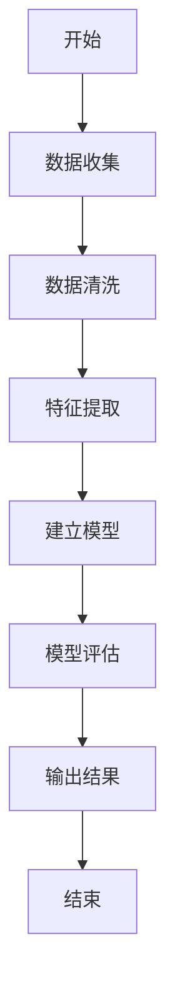
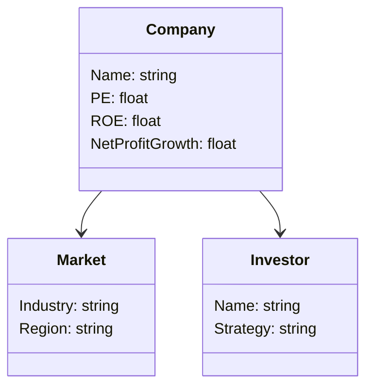
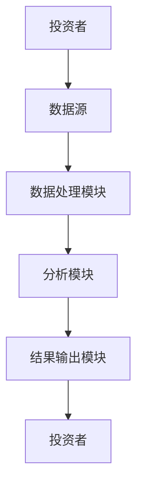

                 


# 彼得林奇的"隐形冠军"在新兴市场中的发掘技巧

> 关键词：隐形冠军，彼得林奇，新兴市场，投资策略，数据分析，系统架构，投资组合

> 摘要：本文深入探讨了彼得·林奇提出的“隐形冠军”概念，并分析了如何在新兴市场中发掘这些潜在的高增长企业。文章从理论背景、核心概念、数据分析方法、系统架构设计到实际案例分析，全面阐述了在新兴市场中发现和评估隐形冠军的技巧，为投资者提供了实用的策略和方法。

---

## 第一部分：彼得·林奇的“隐形冠军”理论概述

### 第1章：彼得·林奇与“隐形冠军”理论

#### 1.1 彼得·林奇投资理论的背景

##### 1.1.1 彼得·林奇的投资者身份与风格
彼得·林奇是全球最著名的职业基金经理之一，他的投资哲学以基本面分析和深入研究著称。他强调长期投资和寻找那些具有强大竞争优势、良好管理团队和合理估值的企业。林奇认为，投资者应该关注企业的基本面，而不是市场的短期波动。

##### 1.1.2 “隐形冠军”概念的提出
“隐形冠军”一词由德国管理学家赫尔曼·西蒙（Hermann Simon）首次提出，指的是那些在某个细分市场中占据领先地位，但并未广为人知的企业。彼得·林奇将这一概念引入投资领域，认为这些“隐形冠军”企业往往具有较高的成长性和投资价值。

##### 1.1.3 理论的核心思想与投资哲学
林奇的核心思想是：寻找那些在特定行业中具有领先地位，但市值较小、市场关注度低的公司。这些公司通常具有强大的竞争优势、稳定的财务表现和持续的增长潜力。他的投资哲学强调长期持有和价值发现，而不是短期的市场炒作。

#### 1.2 新兴市场的特点与投资机会

##### 1.2.1 新兴市场的定义与特征
新兴市场通常指的是那些经济发展迅速、市场规模较大、但尚未完全成熟的国家或地区的市场。这些市场具有较高的增长潜力，但也伴随着较高的风险和不确定性。

##### 1.2.2 新兴市场的投资机遇
新兴市场中的企业往往具有较高的增长潜力，尤其是在技术进步和消费升级的驱动下，许多新兴企业有望成为行业领导者。此外，新兴市场的估值通常较低，为投资者提供了较高的安全边际。

##### 1.2.3 新兴市场与传统市场的对比
与传统市场相比，新兴市场具有更高的增长潜力，但也面临更多的不确定性和风险。新兴市场的公司通常规模较小，但在特定细分市场中具有强大的竞争力。此外，新兴市场的投资者结构通常以散户为主，市场流动性较低。

#### 1.3 “隐形冠军”在新兴市场的独特性

##### 1.3.1 “隐形冠军”的定义与特征
在新兴市场中，“隐形冠军”通常是指那些在特定细分市场中占据领先地位，但尚未被广泛认知的企业。这些企业往往具有以下特征：
- 在某个细分市场中占据领先地位。
- 具有强大的竞争优势和较高的利润率。
- 管理团队稳定且具有较强的执行力。
- 估值相对较低，具有较高的成长潜力。

##### 1.3.2 新兴市场中“隐形冠军”的典型表现
在新兴市场中，“隐形冠军”企业通常表现出以下典型特征：
- 在本地市场中具有较高的市场份额。
- 专注于某个细分领域，具有较高的技术门槛。
- 具有较强的盈利能力，且财务表现稳定。
- 管理团队具有丰富的行业经验和较强的企业管理能力。

##### 1.3.3 “隐形冠军”与行业龙头的对比分析
与行业龙头相比，“隐形冠军”企业在规模、知名度和市场影响力上可能稍逊一筹，但它们在特定细分市场中的竞争力更强。此外，“隐形冠军”企业通常具有更高的成长潜力和较低的估值，这使得它们成为投资者的理想目标。

---

### 第2章：“隐形冠军”的核心概念与分析框架

#### 2.1 核心概念与属性特征

##### 2.1.1 “隐形冠军”的核心要素
- **市场定位**：在特定细分市场中占据领先地位。
- **竞争优势**：具有独特的技术、商业模式或成本优势。
- **财务表现**：具有稳定的盈利能力和健康的财务状况。
- **管理团队**：管理团队具有丰富的行业经验和较强的执行力。

##### 2.1.2 “隐形冠军”的属性特征对比表格
以下是“隐形冠军”与非隐形冠军企业的对比表格：

| 特征                | 隐形冠军                  | 非隐形冠军                |
|---------------------|--------------------------|--------------------------|
| 市场定位            | 特定细分市场中领先       | 整个市场中无明显优势     |
| 竞争优势            | 技术、成本或商业模式独特 | 竞争优势不明显或同质化   |
| 财务表现            | 盈利能力稳定，估值较低   | 盈利能力不稳定，估值较高 |
| 管理团队            | 团队经验丰富，执行力强   | 团队经验不足或管理混乱   |

##### 2.1.3 实体关系图（ER图）架构
以下是“隐形冠军”企业的ER图架构：

```mermaid
erDiagram
    customer[客户]
    company[公司]
    market[市场]
    competition[竞争]
    advantage[竞争优势]
    financial[财务表现]
    management[管理团队]

    customer -|{many} market
    company -|{many} market
    competition -|{many} market
    advantage -|{many} company
    financial -|{many} company
    management -|{many} company
```

---

#### 2.2 “隐形冠军”的竞争优势分析

##### 2.2.1 核心竞争力的来源
“隐形冠军”企业的核心竞争力通常来源于以下几个方面：
- **技术优势**：拥有独特的技术或专利。
- **成本优势**：通过技术创新或规模效应降低成本。
- **商业模式**：采用独特的商业模式，如订阅制、服务制等。

##### 2.2.2 市场定位与细分领域的优势
“隐形冠军”企业通常专注于某个细分市场，通过精准的市场定位和细分领域的优势，建立起强大的市场竞争力。

##### 2.2.3 财务表现与成长性分析
“隐形冠军”企业的财务表现通常较为稳定，具有较高的净利润率和较低的资产负债率。此外，它们的成长性也较好，营业收入和净利润通常保持稳定增长。

---

### 第3章：“隐形冠军”的筛选与评估方法

#### 3.1 数据挖掘与分析方法

##### 3.1.1 数据收集与预处理
- 数据来源：公司财务报表、行业报告、市场数据等。
- 数据清洗：去除缺失值、异常值和重复数据。
- 数据转换：对数据进行标准化或归一化处理。

##### 3.1.2 数据分析与特征提取
- 使用统计分析方法提取关键特征，如市盈率（P/E）、市净率（P/B）、ROE（净资产收益率）等。
- 通过聚类分析或回归分析等方法，识别出具有潜在投资价值的企业。

##### 3.1.3 数据可视化与趋势分析
- 使用折线图、柱状图等工具，可视化企业的财务表现和市场趋势。
- 通过趋势分析，识别企业的成长性和周期性。

#### 3.2 筛选模型与评估标准

##### 3.2.1 筛选模型的设计与实现
以下是筛选“隐形冠军”的流程图：



##### 3.2.2 评估标准的制定与应用
- 评估标准：市盈率（P/E）≤20，ROE≥10%，净利润率≥5%。
- 应用：通过筛选符合条件的企业，识别出具有投资价值的“隐形冠军”。

##### 3.2.3 模型优化与性能提升
- 通过交叉验证和网格搜索等方法，优化模型的参数。
- 使用机器学习算法，如随机森林、支持向量机等，提高模型的预测精度。

#### 3.3 数学模型与公式

##### 3.3.1 市盈率（P/E）计算公式
$$ P/E = \frac{Stock Price}{Earnings Per Share} $$

##### 3.3.2 净利润增长率计算公式
$$ Net\ Profit\ Growth\ Rate = \frac{Net\ Profit\ This\ Year - Net\ Profit\ Last\ Year}{Net\ Profit\ Last\ Year} \times 100\% $$

##### 3.3.3 ROE计算公式
$$ ROE = \frac{Net\ Profit}{Total\ Equity} \times 100\% $$

---

### 第4章：“隐形冠军”投资策略的数学模型

#### 4.1 数学模型与公式
以下是“隐形冠军”投资策略的数学模型：

$$ Investment\ Decision = \begin{cases}
1 & \text{如果 } P/E \leq 20 \text{ 且 } ROE \geq 10\% \text{ 且 } Net\ Profit\ Growth\ Rate \geq 5\% \\
0 & \text{其他情况}
\end{cases} $$

#### 4.2 算法实现

##### 4.2.1 数据预处理
```python
import pandas as pd

# 读取数据
df = pd.read_csv('companies.csv')

# 删除缺失值
df.dropna(inplace=True)

# 转换为数值型数据
df['PE'] = df['PE'].astype(float)
df['ROE'] = df['ROE'].astype(float)
df['NetProfitGrowth'] = df['NetProfitGrowth'].astype(float)
```

##### 4.2.2 建立筛选条件
```python
# 筛选“隐形冠军”
df隐形冠军 = df[(df['PE'] <= 20) & (df['ROE'] >= 10) & (df['NetProfitGrowth'] >= 5)]
```

##### 4.2.3 输出结果
```python
# 输出符合条件的企业名单
print("隐形冠军企业名单：")
print(df[df['PE'] <= 20 & df['ROE'] >= 10 & df['NetProfitGrowth'] >= 5]['Company Name'])
```

---

### 第5章：系统分析与架构设计

#### 5.1 系统功能设计

##### 5.1.1 领域模型
以下是领域模型的类图：



##### 5.1.2 系统架构设计
以下是系统架构图：



#### 5.2 系统接口设计

##### 5.2.1 API接口
- 输入：公司名称、行业、地区。
- 输出：是否符合“隐形冠军”标准。

##### 5.2.2 数据接口
- 数据源：公司财务报表、行业报告、市场数据。
- 数据接口：REST API。

---

## 第六章：项目实战

### 6.1 环境安装与配置

#### 6.1.1 安装Python
```bash
python --version
pip install numpy pandas matplotlib
```

#### 6.1.2 安装Jupyter Notebook
```bash
pip install jupyter
jupyter notebook
```

### 6.2 核心代码实现

#### 6.2.1 数据预处理
```python
import pandas as pd

# 读取数据
df = pd.read_csv('companies.csv')

# 删除缺失值
df.dropna(inplace=True)

# 转换为数值型数据
df['PE'] = df['PE'].astype(float)
df['ROE'] = df['ROE'].astype(float)
df['NetProfitGrowth'] = df['NetProfitGrowth'].astype(float)
```

#### 6.2.2 建立筛选条件
```python
# 筛选“隐形冠军”
df_隐形冠军 = df[(df['PE'] <= 20) & (df['ROE'] >= 10) & (df['NetProfitGrowth'] >= 5)]
```

#### 6.2.3 输出结果
```python
# 输出符合条件的企业名单
print("隐形冠军企业名单：")
print(df[df['PE'] <= 20 & df['ROE'] >= 10 & df['NetProfitGrowth'] >= 5]['Company Name'])
```

### 6.3 实际案例分析

#### 6.3.1 东南亚市场分析
以东南亚市场为例，分析该地区的“隐形冠军”企业。

##### 6.3.1.1 行业分析
- 重点关注行业：科技、消费、金融等。

##### 6.3.1.2 企业筛选
- 筛选出在东南亚市场中具有领先地位的“隐形冠军”企业。

##### 6.3.1.3 投资组合构建
- 根据筛选结果，构建投资组合。

### 6.4 项目总结

#### 6.4.1 项目成果
- 成功筛选出一批具有投资价值的“隐形冠军”企业。
- 构建了一个可行的投资策略。

#### 6.4.2 项目经验与教训
- 数据的准确性对结果影响较大。
- 模型的优化可以进一步提高筛选精度。

---

## 第七章：总结与展望

### 7.1 总结

#### 7.1.1 核心观点回顾
- 彼得·林奇的“隐形冠军”理论为投资者提供了寻找高增长企业的有效方法。
- 新兴市场中“隐形冠军”企业的特征与传统市场中的企业有所不同。

#### 7.1.2 投资策略总结
- 通过数据分析和模型筛选，识别出具有投资价值的“隐形冠军”企业。
- 长期持有，耐心等待企业的成长。

### 7.2 展望

#### 7.2.1 拓展研究
- 研究更多新兴市场中的“隐形冠军”企业。
- 探索更多数据分析方法，提高筛选精度。

#### 7.2.2 实际应用
- 将理论应用于实际投资中，验证模型的有效性。
- 不断优化投资策略，提高投资收益。

---

## 作者

作者：AI天才研究院/AI Genius Institute & 禅与计算机程序设计艺术 /Zen And The Art of Computer Programming

---

这篇文章详细介绍了彼得·林奇的“隐形冠军”理论，并结合新兴市场的特点，探讨了如何在新兴市场中发掘这些潜在的高增长企业。文章从理论背景、核心概念、数据分析方法、系统架构设计到实际案例分析，全面阐述了在新兴市场中发现和评估隐形冠军的技巧，为投资者提供了实用的策略和方法。

