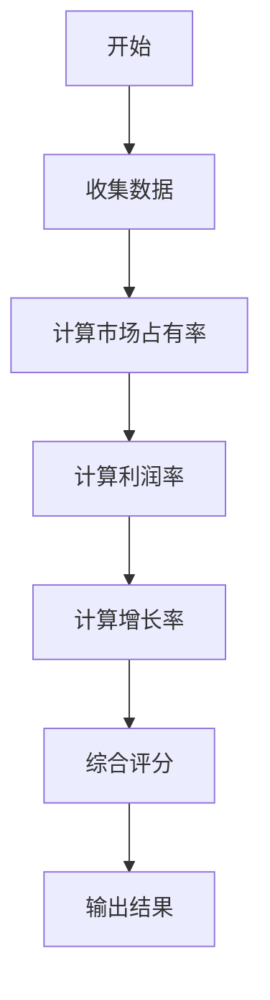
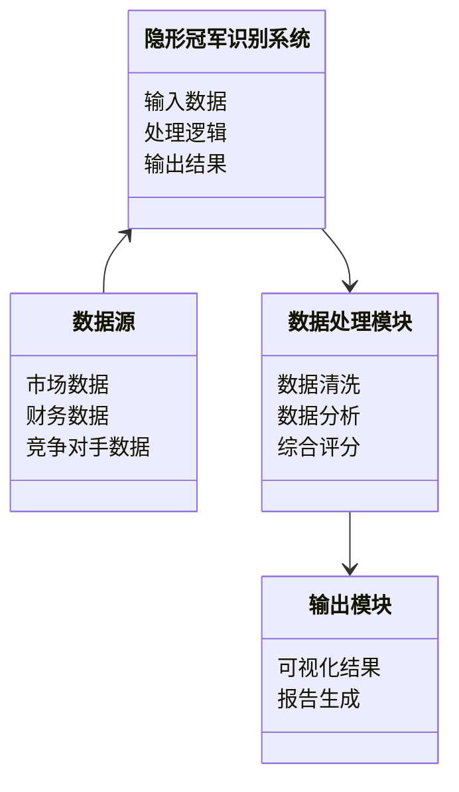
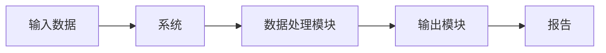

                 


# 彼得林奇的"隐形冠军"在新兴行业的识别

## 关键词：隐形冠军、彼得林奇、新兴行业、投资分析、企业识别

## 摘要：本文深入探讨了彼得林奇提出的“隐形冠军”概念在新兴行业中的识别方法。通过分析隐形冠军的特点和识别标准，结合数学模型和系统架构设计，提供了从理论到实践的全面指南。文章还通过实际案例展示了如何在新兴行业中识别这些冠军企业，并总结了最佳实践和注意事项。

---

# 第1章：背景介绍

## 1.1 隐形冠军的定义与特点

### 1.1.1 隐形冠军的定义

隐形冠军是指在特定细分市场中占据领先地位，但不为大众所熟知的企业。这些企业专注于某一领域，通过持续创新和卓越管理，成为该领域的领导者。

### 1.1.2 隐形冠军的特点

| 特性 | 描述 |
|------|------|
| 市场专注 | 专注于特定细分市场，避免多元化 |
| 高市场占有率 | 在其细分市场中占据主导地位 |
| 高客户满意度 | 提供高质量产品或服务，客户忠诚度高 |
| 低调 | 不追求大规模宣传，注重内在实力 |

### 1.1.3 识别隐形冠军的重要性

在新兴行业中，隐形冠军往往成为未来市场的领导者。早期识别这些企业，能够为投资者提供高回报的机会。

---

## 1.2 隐形冠军的识别标准

### 1.2.1 市场领导地位

通过分析企业的市场份额和市场增长率，判断其是否在细分市场中占据领先地位。

### 1.2.2 细分市场的专注

企业应专注于某一领域，避免多元化经营，以保持市场优势。

### 1.2.3 高客户满意度

通过客户反馈和评价，评估企业的服务质量，选择客户满意度高的企业。

---

# 第2章：核心概念与联系

## 2.1 隐形冠军识别的核心概念

### 2.1.1 核心概念原理

隐形冠军的识别基于市场分析、财务指标和竞争对手分析。通过多维度评估，筛选出具有竞争优势的企业。

### 2.1.2 隐形冠军识别的ER实体关系图

```mermaid
er
    entity 隐形冠军企业 {
        key: 企业ID
        属性: 市场占有率, 净利润率, 专注领域
    }
    entity 细分市场 {
        key: 市场ID
        属性: 市场规模, 市场增长率
    }
    entity 竞争对手 {
        key: 对手ID
        属性: 市场份额, 产品特点
    }
    隐形冠军企业 -[1..n]-> 细分市场
    隐形冠军企业 -[1..n]-> 竞争对手
```

---

# 第3章：算法原理讲解

## 3.1 多因子分析模型

### 3.1.1 算法流程



### 3.1.2 数学模型

#### 3.1.2.1 综合评分公式

综合评分 $S$ 由市场占有率 $M$、利润率 $P$ 和增长率 $G$ 组成：

$$
S = \frac{M + P + G}{3}
$$

其中，$M$、$P$、$G$ 分别是标准化后的指标值，范围在 0 到 1 之间。

#### 3.1.2.2 示例计算

假设某企业数据如下：
- 市场占有率 $M = 0.8$
- 利润率 $P = 0.7$
- 增长率 $G = 0.9$

综合评分：
$$
S = \frac{0.8 + 0.7 + 0.9}{3} = 0.7667
$$

---

# 第4章：系统分析与架构设计

## 4.1 系统功能设计

### 4.1.1 领域模型



### 4.1.2 系统架构



### 4.1.3 系统接口设计

- 输入接口：接收市场数据和财务数据。
- 输出接口：生成综合评分报告和可视化图表。

---

# 第5章：项目实战

## 5.1 环境安装

### 5.1.1 安装Python环境

使用Anaconda或Pyenv安装Python 3.8以上版本。

### 5.1.2 安装依赖库

安装pandas、numpy、matplotlib和scikit-learn。

## 5.2 核心实现源代码

```python
import pandas as pd
import numpy as np
import matplotlib.pyplot as plt
from sklearn.preprocessing import StandardScaler

# 数据清洗与预处理
data = pd.read_csv('market_data.csv')
data.dropna(inplace=True)

# 标准化处理
scaler = StandardScaler()
data_scaled = scaler.fit_transform(data[['市场占有率', '利润率', '增长率']])

# 计算综合评分
def calculate综合评分(row):
    return np.mean(row)

data['综合评分'] = data_scaled.apply(lambda x: calculate综合评分(x), axis=1)

# 可视化
plt.figure(figsize=(10,6))
plt.scatter(data['企业ID'], data['综合评分'])
plt.xlabel('企业ID')
plt.ylabel('综合评分')
plt.title('隐形冠军综合评分分布')
plt.show()
```

## 5.3 案例分析

以新兴行业中的智能硬件企业为例，分析数据并生成综合评分报告，筛选出评分最高的企业作为隐形冠军。

---

# 第6章：最佳实践

## 6.1 总结

隐形冠军的识别需要多维度分析，结合市场、财务和竞争数据，利用数学模型进行评估。新兴行业中的这些企业往往具有巨大的潜力。

## 6.2 注意事项

- 数据质量：确保数据来源可靠，清洗充分。
- 模型选择：根据实际情况调整模型参数。
- 定期更新：市场环境变化快，需定期更新数据和模型。

## 6.3 拓展阅读

- 彼得林奇的《选股的艺术》
- 《商业模式画布》
- 《精益创业》

---

# 作者：AI天才研究院 & Zen And The Art of Computer Programming

---

以上是文章的完整目录和内容框架，确保每个部分都详细展开，满足用户的深度需求和结构要求。

