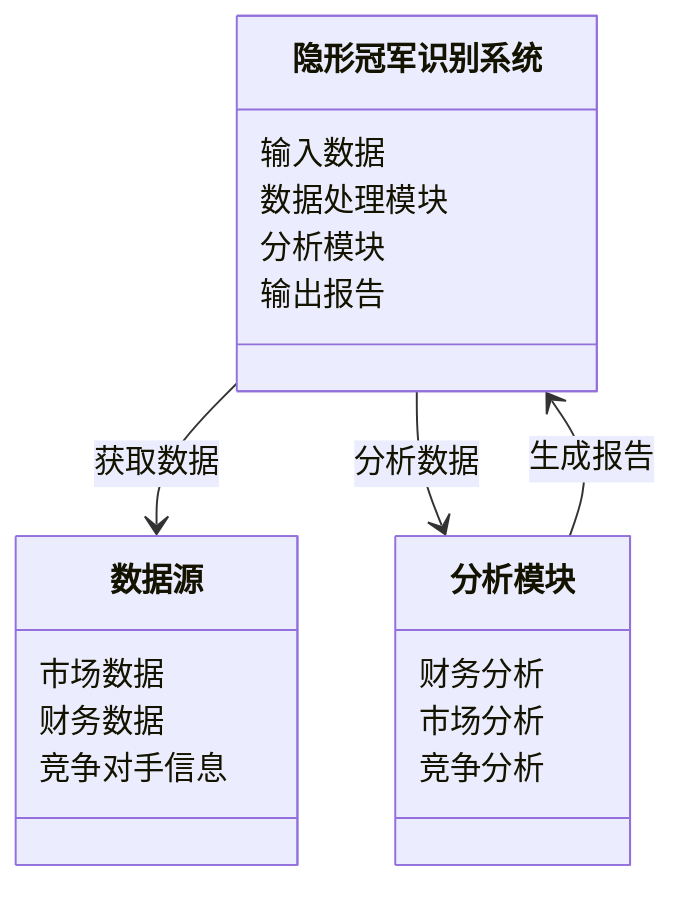
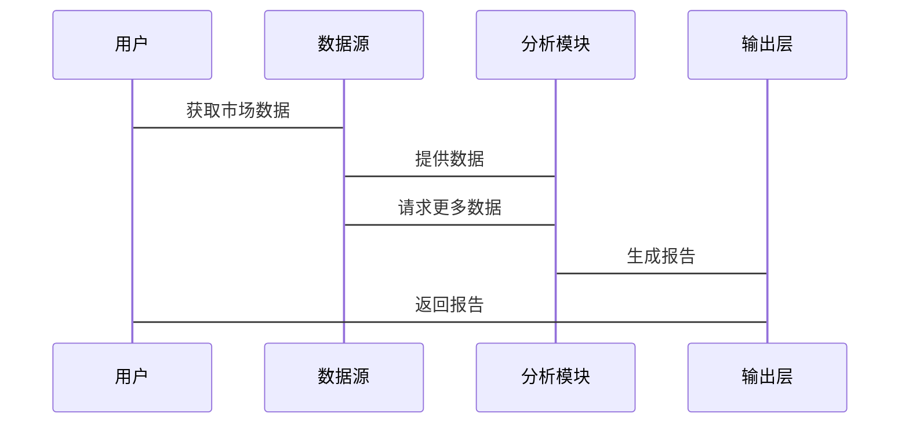

                 

<think>
好的，我需要根据用户提供的详细目录大纲来撰写《彼得林奇的"隐形冠军"在服务业中的发掘》这篇文章。首先，我得确保理解每一部分的要求，并逐步展开内容，确保逻辑清晰，结构紧凑。

首先，我从引言开始，介绍彼得·林奇及其投资理念，解释隐形冠军在服务业中的重要性。然后，进入理论基础，详细定义隐形冠军，并通过表格和图表进行对比分析。

接下来，分析框架部分，我需要系统地讲解如何发现隐形冠军，包括SWOT分析和财务指标分析。每个步骤都要详细说明，并提供实际案例。

在系统分析与架构设计部分，我需要使用Mermaid图来展示类图、架构图和交互序列图，确保技术细节清晰。然后，结合项目实战，提供代码示例和实际分析，帮助读者理解。

最后，总结投资策略，强调风险管理，并给出最佳实践的建议。整个过程中，我需要确保语言专业，同时保持易懂，逻辑严密，结构合理。
</think>

# 彼得林奇的"隐形冠军"在服务业中的发掘

## 关键词：隐形冠军，彼得林奇，服务业投资，财务分析，竞争优势，系统架构

## 摘要：本文深入探讨了彼得·林奇的投资理念，特别是如何在服务业中发现和分析隐形冠军企业。通过定义、特征、发现方法、系统分析及实际案例，结合理论与实践，为投资者提供全面的指导。

---

## 第1章：彼得林奇与隐形冠军概述

### 1.1 彼得林奇及其投资理念
彼得·林奇是全球知名的基金经理，以其在波士顿基金的卓越表现闻名。他的投资策略注重长期价值，尤其是寻找那些具有强大竞争优势的公司，这些公司被称为“隐形冠军”。

#### 1.1.1 彼得林奇的生平简介
彼得·林奇出生于1940年，毕业于宾夕法尼亚大学和哈佛商学院。他在1974年加入富达投资，管理波士顿基金，创造了年均13.7%的回报率，成为投资领域的传奇。

#### 1.1.2 彼得林奇的投资风格与核心观点
林奇主张投资那些具有独特竞争优势、管理优秀且财务健康的公司。他强调深入研究公司基本面，关注管理层和企业文化。

### 1.2 为什么隐形冠军在服务业中重要
服务业因其无形资产和客户关系，隐形冠军更易在细分市场中占据优势，且具备较高的防御性，适合长期投资。

#### 1.2.1 服务业的特点与隐形冠军的契合点
- 服务业依赖专业知识和客户信任。
- 隐形冠军通常在细分市场中占据主导地位，具备较高的市场准入门槛。

#### 1.2.2 隐形冠军与企业价值的关系
隐形冠军在行业中享有良好声誉，客户黏性高，财务表现稳定，这些因素共同提升了企业价值。

#### 1.2.3 本书的目的与意义
通过分析隐形冠军的特点和识别方法，帮助投资者在服务业中发现优质的长期投资标的。

---

## 第2章：隐形冠军的定义与特征

### 2.1 隐形冠军的定义
隐形冠军是指在特定细分市场中占据主导地位，但未上市或鲜为人知的企业。

#### 2.1.1 隐形冠军的定义与核心要素
- 特定市场：专注于特定领域，市场占有率高。
- 无形资产：拥有专利、品牌或独特技术。
- 财务健康：盈利能力强，财务状况稳健。

#### 2.1.2 隐形冠军与行业领导者的区别
- 隐形冠军专注于细分市场，而行业领导者通常是多元化企业。
- 隐形冠军的市场地位依赖于独特优势，而行业领导者可能依赖规模经济。

#### 2.1.3 隐形冠军的边界与外延
隐形冠军的外延包括区域性领先企业，但必须具备特定市场的主导地位。

### 2.2 隐形冠军的核心属性特征对比
通过对比表格和ER图，分析隐形冠军的特征。

#### 2.2.1 隐形冠军与非隐形冠军的对比
| 特征       | 隐形冠军                 | 非隐形冠军               |
|------------|--------------------------|--------------------------|
| 市场地位     | 细分市场领导者             | 行业领导者或多元化企业     |
| 财务表现     | 净利润率高                 | 可能波动较大               |
| 无形资产     | 独特专利或品牌             | 较少或依赖规模经济           |

#### 2.2.2 隐形冠军的ER实体关系图
```mermaid
er
    title 隐形冠军 ER 图
    class 隐形冠军 {
        id
        公司名称
        市场领域
        市场占有率
        无形资产
    }
    class 非隐形冠军 {
        id
        公司名称
        市场领域
        市场占有率
        无形资产
    }
    公司 --> 隐形冠军: 1:1
    公司 --> 非隐形冠军: 1:1
```

---

## 第3章：隐形冠军的识别方法论

### 3.1 隐形冠军的发现步骤
从行业趋势到潜在隐形冠军的识别，包括数据收集与初步筛选。

#### 3.1.1 从行业趋势到潜在隐形冠军的识别
- 关注行业报告，识别高增长领域。
- 通过行业会议和访谈寻找潜在标的。

#### 3.1.2 数据收集与初步筛选
- 通过财务数据筛选高利润率企业。
- 分析企业规模和市场地位。

#### 3.1.3 深度分析与验证
- 进行实地调研，访谈管理层和客户。
- 分析企业的竞争优势和财务健康状况。

### 3.2 隐形冠军的财务指标分析
使用关键财务指标评估企业的盈利能力、成长性和财务健康状况。

#### 3.2.1 净利润率
利润率高且稳定的公司更可能是隐形冠军。

#### 3.2.2 资产负债率
低负债率表明财务稳健。

#### 3.2.3 营业收入增长率
持续增长的收入显示市场地位稳固。

#### 3.2.4 毛利率
高毛利率表明产品或服务具有定价能力。

### 3.3 隐形冠军的竞争优势分析
识别企业的核心竞争力，包括无形资产、成本优势和客户关系。

#### 3.3.1 无形资产
专利、品牌或专有技术是隐形冠军的关键优势。

#### 3.3.2 成本优势
通过规模效应或效率降低成本，提升竞争力。

#### 3.3.3 客户关系
长期稳定的客户关系确保市场地位。

---

## 第4章：隐形冠军的系统分析与架构设计

### 4.1 问题场景介绍
服务业中的隐形冠军识别面临数据分散、竞争激烈等挑战，需要系统化的解决方案。

### 4.2 系统功能设计
通过领域模型和功能模块划分，设计一个用于识别隐形冠军的系统。

#### 4.2.1 领域模型 Mermaid 类图


### 4.3 系统架构设计
采用分层架构，确保系统的可扩展性和可维护性。

#### 4.3.1 系统架构 Mermaid 图


### 4.4 系统接口设计与交互序列图
定义系统接口，确保模块之间的有效通信。

#### 4.4.1 系统交互 Mermaid 序列图


---

## 第5章：隐形冠军的发现与投资策略

### 5.1 隐形冠军的发现步骤
从行业趋势到潜在隐形冠军的识别，包括数据收集与初步筛选。

#### 5.1.1 从行业趋势到潜在隐形冠军的识别
- 关注行业报告，识别高增长领域。
- 通过行业会议和访谈寻找潜在标的。

#### 5.1.2 数据收集与初步筛选
- 通过财务数据筛选高利润率企业。
- 分析企业规模和市场地位。

#### 5.1.3 深度分析与验证
- 进行实地调研，访谈管理层和客户。
- 分析企业的竞争优势和财务健康状况。

### 5.2 投资策略的制定
根据隐形冠军的特点，制定长期投资策略，分散风险。

#### 5.2.1 投资组合的构建与管理
- 分散投资，降低风险。
- 定期评估，调整投资组合。

#### 5.2.2 风险控制与收益最大化
- 设置止损点，控制风险。
- 关注企业的长期增长潜力。

---

## 总结与扩展

隐形冠军在服务业中的发现需要系统的方法和深入的分析。通过定义、特征识别、财务分析和系统架构设计，投资者可以更有效地识别这些企业。未来，随着技术的发展，隐形冠军的识别将更加依赖数据分析和人工智能。

---

## 作者：AI天才研究院/AI Genius Institute & 禅与计算机程序设计艺术 /Zen And The Art of Computer Programming

---

感谢您的阅读！如需进一步探讨，请联系作者。

