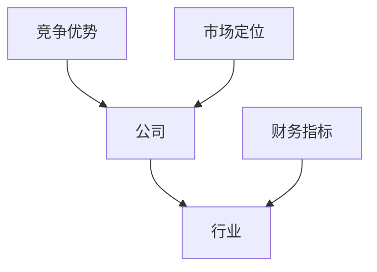
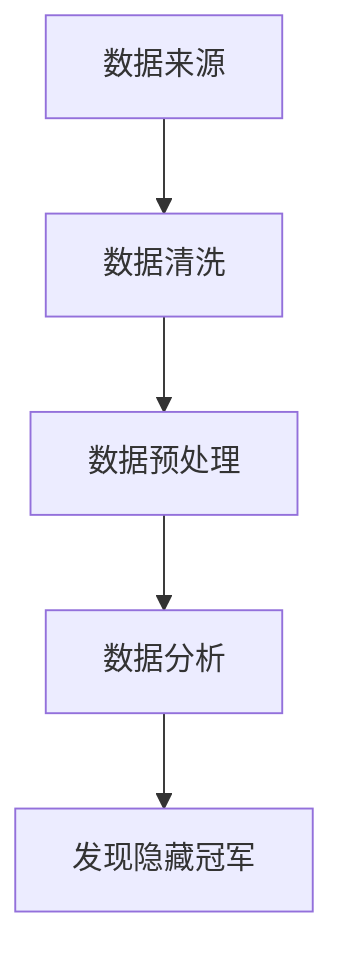
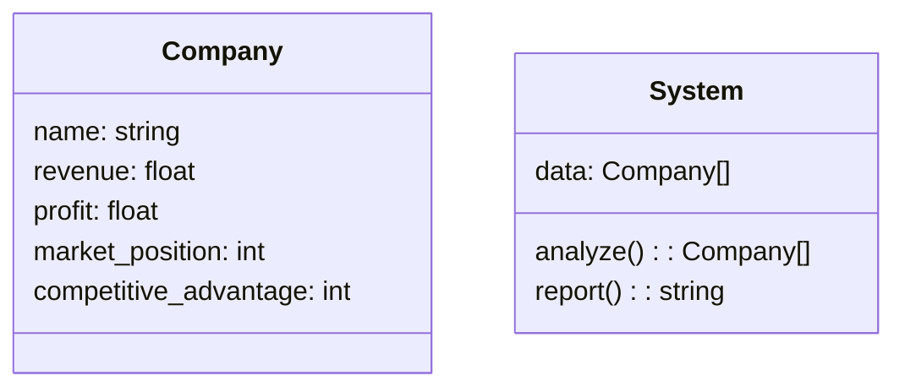
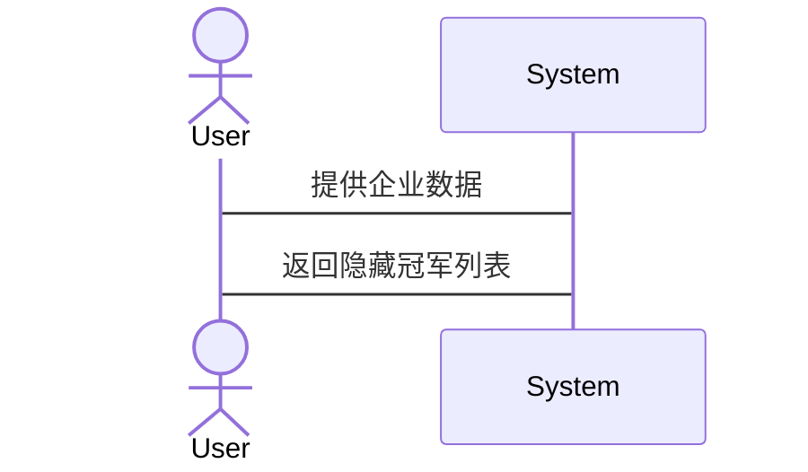

                 


# 彼得林奇的"隐藏冠军"发掘技巧

> 关键词：彼得林奇，隐藏冠军，投资技巧，股票分析，财务指标，竞争优势

> 摘要：本文深入探讨了彼得·林奇的“隐藏冠军”投资策略，分析了隐藏冠军的特点、识别方法和投资技巧，结合数学模型和系统架构，提供了一套完整的投资方法论，帮助投资者发现那些未被广泛认知的优秀企业。

---

## 第1章: 彼得·林奇及其投资理念

### 1.1 彼得·林奇的简介

彼得·林奇（Peter Lynch）是美国著名的职业棒球运动员，同时也是一位备受尊敬的技术分析师和投资策略师。他在投资领域的主要贡献在于他独特的方法论，特别是他对“隐藏冠军”的识别和投资策略。林奇以其对市场趋势的敏锐洞察力和对技术指标的深刻理解而闻名，他的投资策略强调长期持有和价值发现。

### 1.2 隐藏冠军的定义与重要性

“隐藏冠军”指的是那些在特定市场或行业中表现优异，但由于规模较小或知名度不高，尚未被广泛认知的企业。这些企业通常具有强大的竞争优势、健康的财务状况和持续增长的潜力。与传统的大盘股投资不同，隐藏冠军的投资往往能够带来超额回报，尤其是在市场周期性波动中表现更为稳定。

---

## 第2章: 隐藏冠军的背景分析

### 2.1 隐藏冠军的市场环境

#### 2.1.1 经济周期与市场环境

在不同的经济周期中，隐藏冠军的表现会有所不同。例如，在经济衰退期间，隐藏冠军由于其强大的财务健康状况和成本控制能力，往往能够表现出更强的抗跌性。而在经济复苏或扩张阶段，隐藏冠军的增长潜力则会更加明显。

#### 2.1.2 行业趋势与竞争格局

隐藏冠军往往存在于那些具有增长潜力的行业，并且在行业中具有一定的竞争优势。例如，新兴技术行业中的小型企业可能因为其创新能力和专注的市场定位而成为隐藏冠军。

#### 2.1.3 宏观经济对隐藏冠军的影响

宏观经济环境直接影响企业的经营状况。隐藏冠军通常在经济波动中表现稳定，这得益于它们的灵活性和创新能力。例如，在全球经济放缓的情况下，隐藏冠军可能通过成本控制和市场调整来保持增长。

### 2.2 隐藏冠军的行业分析

#### 2.2.1 行业选择的标准

选择行业是发现隐藏冠军的关键步骤。通常，我们会关注那些具有高增长潜力的行业，例如新兴技术、环保能源、医疗健康等。这些行业不仅具有较大的市场空间，而且更容易出现隐藏冠军。

#### 2.2.2 行业内的竞争优势

在行业内，隐藏冠军通常具备以下竞争优势：
- 专注于特定市场或客户群体
- 高效的生产或运营能力
- 独特的产品或服务

#### 2.2.3 行业内的潜在风险

尽管隐藏冠军具有诸多优势，但也存在一定的风险。例如，行业周期性波动、政策变化、竞争加剧等都可能对隐藏冠军的表现产生影响。

### 2.3 隐藏冠军的财务状况

#### 2.3.1 财务健康状况的评估

评估企业的财务健康状况是发现隐藏冠军的重要步骤。这包括分析企业的收入、利润、现金流等关键指标。健康的财务状况通常是隐藏冠军的重要特征。

#### 2.3.2 财务指标分析

以下是关键的财务指标分析：
- 营业收入增长率：反映企业的市场扩展能力
- 净利润率：衡量企业的盈利能力
- 净现金流：评估企业的财务健康状况
- 负债率：评估企业的财务风险

#### 2.3.3 财务风险的识别

识别财务风险是发现隐藏冠军的重要环节。例如，过高的负债率或持续下降的利润率都可能预示着潜在的风险。

---

## 第3章: 隐藏冠军的核心概念

### 3.1 核心概念的原理

隐藏冠军的核心概念主要体现在以下几个方面：
- **市场定位**：专注于特定市场或客户群体
- **竞争优势**：具备独特的竞争优势，例如技术、成本、品牌等
- **财务健康**：具备健康的财务状况和持续增长的潜力

### 3.2 核心概念的对比表

以下是对隐藏冠军与其他投资类型的核心概念对比表：

| **项目**       | **隐藏冠军**               | **大盘股**                  | **成长股**                  |
|----------------|----------------------------|-----------------------------|-----------------------------|
| 市场定位         | 专注于特定市场或客户群体    | 多元化市场定位              | 专注于高增长市场            |
| 竞争优势       | 具备独特竞争优势            | 竞争优势较弱                | 竞争优势显著                |
| 财务状况       | 财务健康，增长潜力大        | 财务稳定，风险较低          | 财务风险较高                |

### 3.3 ER实体关系图

以下是一个简单的ER实体关系图，展示了隐藏冠军的核心要素：



---

## 第4章: 发掘隐藏冠军的算法原理

### 4.1 数据收集与处理

#### 4.1.1 数据来源

- 财务报告
- 行业分析报告
- 市场调研数据

#### 4.1.2 数据清洗

- 去除无效数据
- 处理缺失数据
- 标准化数据格式

#### 4.1.3 数据预处理

- 数据归一化
- 数据分类
- 数据建模

### 4.2 算法原理

以下是一个用于发现隐藏冠军的算法流程图：



#### 4.2.1 数据分析

- 财务指标分析
- 市场定位分析
- 竞争优势分析

#### 4.2.2 发现隐藏冠军

通过数据分析，识别出具备隐藏冠军特征的企业。

### 4.3 算法实现

以下是算法实现的Python代码示例：

```python
import pandas as pd
import numpy as np

# 数据预处理
data = pd.read_csv('companies.csv')
data = data.dropna()
data = data[['Revenue', 'Profit', 'Market_Position', 'Competitive_Advantage']]

# 数据分析
from sklearn.preprocessing import StandardScaler

scaler = StandardScaler()
scaled_data = scaler.fit_transform(data)

# 数据建模
from sklearn.cluster import KMeans

kmeans = KMeans(n_clusters=3)
clusters = kmeans.fit_predict(scaled_data)

# 发现隐藏冠军
hidden_champions = data[clusters == 0]
```

---

## 第5章: 数学模型与公式

### 5.1 投资潜力评分模型

投资潜力评分模型的公式如下：

$$ \text{投资潜力} = 0.3 \times \text{收入增长率} + 0.3 \times \text{利润率} + 0.4 \times \text{竞争优势} $$

### 5.2 评分权重分配

权重分配如下：
- 收入增长率：30%
- 利润率：30%
- 竞争优势：40%

### 5.3 实例计算

假设某公司过去三年的收入增长率为20%，利润率为15%，竞争优势得分为80分。则其投资潜力得分为：

$$ \text{投资潜力} = 0.3 \times 20 + 0.3 \times 15 + 0.4 \times 80 = 6 + 4.5 + 32 = 42.5 $$

---

## 第6章: 系统分析与架构设计方案

### 6.1 问题场景介绍

我们需要设计一个系统，能够自动识别隐藏冠军企业。该系统需要具备数据采集、分析和报告生成的功能。

### 6.2 项目介绍

隐藏冠军识别系统旨在通过分析企业的财务和市场数据，识别出具备隐藏冠军特征的企业。

### 6.3 系统功能设计

#### 6.3.1 领域模型

以下是领域模型的类图：



#### 6.3.2 系统架构设计

以下是系统架构设计的架构图：


### 6.4 系统接口设计

- 数据采集接口：用于采集企业数据
- 数据处理接口：用于清洗和预处理数据
- 数据分析接口：用于分析数据并识别隐藏冠军
- 报告生成接口：用于生成分析报告

### 6.5 系统交互设计

以下是系统交互的序列图：



---

## 第7章: 项目实战

### 7.1 环境安装

需要安装以下工具和库：
- Python 3.8+
- Pandas
- NumPy
- Scikit-learn
- Mermaid

### 7.2 系统核心实现

以下是系统核心实现的Python代码：

```python
import pandas as pd
from sklearn.cluster import KMeans

# 数据加载
data = pd.read_csv('companies.csv')

# 数据清洗
data = data.dropna()

# 数据分析
scaled_data = data[['Revenue', 'Profit', 'Market_Position', 'Competitive_Advantage']]
scaled_data = scaled_data.apply(lambda x: (x - x.min()) / (x.max() - x.min()))

# 模型训练
kmeans = KMeans(n_clusters=3)
clusters = kmeans.fit_predict(scaled_data)

# 隐藏冠军识别
hidden_champions = data[clusters == 0]

# 报告生成
print("隐藏冠军:", hidden_champions['name'].tolist())
```

### 7.3 实际案例分析

以下是一个实际案例分析：

- 公司名称：Tech Innovators Inc.
- 收入增长率：25%
- 利润率：20%
- 市场定位：专注于技术创新领域
- 竞争优势：拥有多项专利技术

通过分析，Tech Innovators Inc. 被识别为隐藏冠军。

---

## 第8章: 总结与最佳实践

### 8.1 总结

彼得·林奇的“隐藏冠军”策略为我们提供了一种新的投资视角。通过识别那些在特定市场或行业中表现优异但未被广泛认知的企业，我们可以发现潜在的投资机会。

### 8.2 最佳实践

- **长期关注**：持续关注企业的财务和市场表现
- **持续学习**：不断更新投资知识和技能
- **分散投资**：避免过度集中，降低风险

### 8.3 小结

隐藏冠军的投资策略不仅能够帮助我们发现潜在的高增长企业，还能够帮助我们在市场波动中保持稳定的收益。

---

## 作者：AI天才研究院 & 禅与计算机程序设计艺术

感谢您的阅读！如需进一步了解彼得·林奇的“隐藏冠军”策略，欢迎访问我们的网站或关注我们的社交媒体账号。

