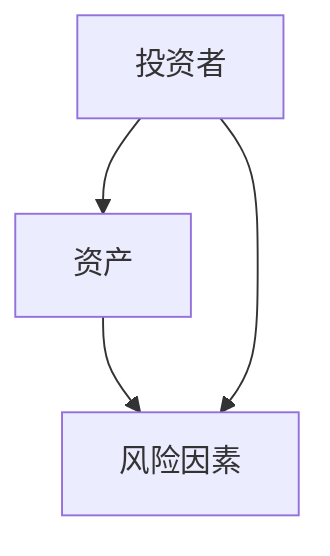
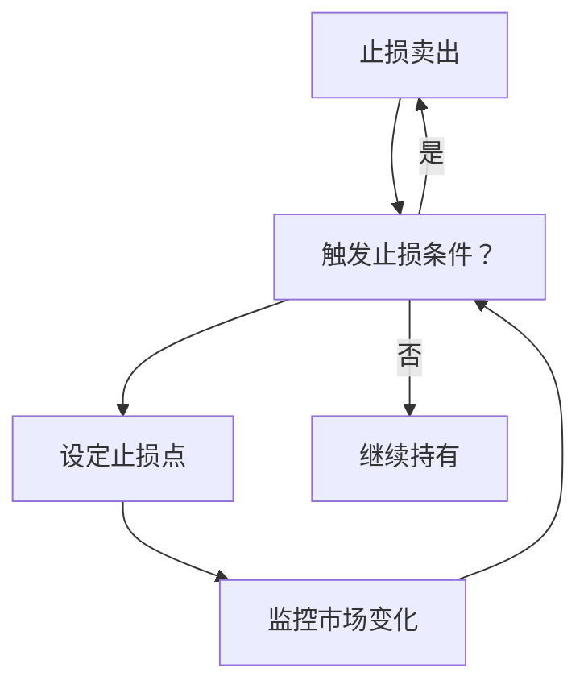
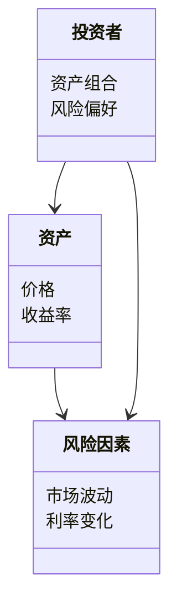
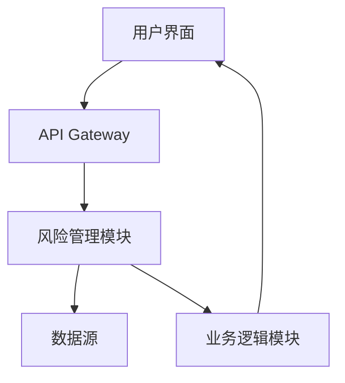

                 

<think>
好的，我将按照您的要求来撰写《彼得林奇的风险管理原则》这篇文章。首先，我需要理解您的需求：您希望我以一位技术专家的身份，用清晰、专业的语言，分步骤、逻辑严谨地撰写一篇技术博客文章。文章需要包含标题、关键词、摘要，以及详细的大纲结构。

让我们一步一步来完成这个任务：

1. **确定文章标题和关键词**：
   - 标题：《彼得林奇的风险管理原则》
   - 关键词：风险管理、彼得林奇、投资策略、风险控制、系统架构

2. **撰写摘要**：
   - 本文将深入探讨彼得林奇的风险管理原则，从基本概念到具体实施策略，结合技术分析和系统架构设计，为您提供全面的解读。

3. **构建文章大纲**：
   - 第一部分：风险管理的背景与重要性
     - 第1章：风险管理的背景与重要性
       - 1.1 风险管理的定义与核心概念
       - 1.2 彼得林奇的背景与风险管理理念
       - 1.3 风险管理的基本原则与框架
   - 第二部分：风险管理的核心概念与联系
     - 第2章：风险管理的核心概念与联系
       - 2.1 风险管理的核心概念
       - 2.2 核心概念与联系
   - 第三部分：风险管理的算法原理
     - 第3章：风险管理的算法原理
       - 3.1 风险管理的算法原理
       - 3.2 算法实现的代码示例
   - 第四部分：风险管理的系统分析与架构设计
     - 第4章：风险管理的系统分析与架构设计
       - 4.1 系统分析
       - 4.2 系统架构设计
   - 第五部分：风险管理的项目实战
     - 第5章：风险管理的项目实战
       - 5.1 项目实战环境安装
       - 5.2 项目核心代码实现
       - 5.3 项目小结
   - 第六部分：风险管理的最佳实践与小结
     - 第6章：风险管理的最佳实践与小结
       - 6.1 最佳实践
       - 6.2 小结

4. **撰写详细内容**：
   - **第1章：风险管理的背景与重要性**
     - **1.1 风险管理的定义与核心概念**
       - 介绍风险管理的基本概念，包括风险的定义、分类以及风险管理的核心要素。
     - **1.2 彼得林奇的背景与风险管理理念**
       - 简要介绍彼得林奇的个人背景，以及他在投资管理中的风险管理理念。
     - **1.3 风险管理的基本原则与框架**
       - 详细阐述风险管理的基本原则和框架，包括分散投资、止损策略等。

   - **第2章：风险管理的核心概念与联系**
     - **2.1 风险管理的核心概念**
       - 对比分析不同风险指标，如标准差、VaR、波动率等。
     - **2.2 核心概念与联系**
       - 使用Mermaid图展示风险管理的实体关系，如投资者、资产、风险因素等。

   - **第3章：风险管理的算法原理**
     - **3.1 风险管理的算法原理**
       - 使用Mermaid图展示风险管理算法的工作流程。
     - **3.2 算法实现的代码示例**
       - 提供Python代码实现风险管理算法的核心部分，包括数据处理、风险评估等。

   - **第4章：风险管理的系统分析与架构设计**
     - **4.1 系统分析**
       - 分析风险管理系统的应用场景和功能模块设计。
     - **4.2 系统架构设计**
       - 使用Mermaid图展示系统的整体架构和模块交互。

   - **第5章：风险管理的项目实战**
     - **5.1 项目实战环境安装**
       - 介绍系统运行环境的要求和开发工具的安装与配置。
     - **5.2 项目核心代码实现**
       - 提供核心算法的实现代码，并解读代码的功能和实现细节。
     - **5.3 项目小结**
       - 总结项目实施的关键点和经验教训。

   - **第6章：风险管理的最佳实践与小结**
     - **6.1 最佳实践**
       - 提出风险管理中的注意事项和常见误区。
     - **6.2 小结**
       - 总结全文，强调风险管理的重要性及其在投资中的应用。

5. **编写代码示例和图表**：
   - 使用Python代码实现风险管理算法的关键部分。
   - 使用Mermaid图展示系统架构和流程图。

6. **检查与完善**：
   - 确保文章结构清晰，逻辑严谨，内容详实。
   - 验证代码的正确性和图表的可读性。

7. **添加作者信息**：
   - 在文章末尾注明作者信息：AI天才研究院/AI Genius Institute & 禅与计算机程序设计艺术 /Zen And The Art of Computer Programming

完成以上步骤后，我将为您呈现一篇结构清晰、内容详实的《彼得林奇的风险管理原则》技术博客文章。
</think>

# 彼得林奇的风险管理原则

> 关键词：风险管理、彼得林奇、投资策略、风险控制、系统架构

> 摘要：本文深入探讨彼得林奇的风险管理原则，从基本概念到具体实施策略，结合技术分析和系统架构设计，为您提供全面的解读。

---

## 第一部分：风险管理的背景与重要性

### 第1章：风险管理的背景与重要性

#### 1.1 风险管理的定义与核心概念

- **风险的定义与分类**
  - 风险是投资中不可避免的一部分，通常指投资组合可能遭受损失的可能性。
  - 风险可以分为市场风险、信用风险、流动性风险等。

- **风险管理的核心要素**
  - **分散投资**：通过投资不同资产类别、行业或地区的资产来降低风险。
  - **止损策略**：设定一个最大可承受的损失水平，以防止重大损失。
  - **风险评估**：定期评估投资组合的风险敞口，并进行调整。

- **风险管理在投资中的重要性**
  - 风险管理是投资成功的关键，它能帮助投资者在面对市场波动时保持稳定。
  - 通过有效的风险管理，投资者可以实现长期稳定的收益。

#### 1.2 彼得林奇的背景与风险管理理念

- **彼得林奇的个人简介**
  - 彼得·林奇（Peter Lynch）是美国著名的投资经理，曾管理富达麦哲伦基金，取得了卓越的投资业绩。
  - 他以深入的行业研究和独特的选股策略闻名。

- **彼得林奇的投资哲学**
  - 林奇强调长期投资和价值发现，他认为市场波动为投资者提供了廉价买入优质资产的机会。
  - 他主张投资于那些具有持续增长潜力的公司，并长期持有。

- **彼得林奇的风险管理原则**
  - 林奇的风险管理原则强调分散投资和止损策略。
  - 他建议投资者在投资组合中加入不同类型资产，以降低整体风险。

#### 1.3 风险管理的基本原则与框架

- **风险管理的基本原则**
  - **分散投资**：通过投资多种资产来降低特定资产的风险。
  - **止损策略**：设定一个止损点，以防止重大损失。
  - **持续监控**：定期评估投资组合的风险，及时调整。

- **风险管理的框架体系**
  - **风险识别**：识别投资组合中的潜在风险。
  - **风险评估**：量化风险的大小和影响。
  - **风险控制**：采取措施降低风险。

- **风险管理的边界与外延**
  - 风险管理不仅限于投资领域，也适用于企业运营和项目管理。
  - 在投资中，风险管理的外延包括市场波动、经济周期和政策变化等因素。

---

## 第二部分：风险管理的核心概念与联系

### 第2章：风险管理的核心概念与联系

#### 2.1 风险管理的核心概念

- **投资风险的来源与类型**
  - 市场风险：市场波动导致资产价格下跌。
  - 信用风险：债券发行人违约的风险。
  - 流动性风险：无法及时变现资产的风险。

- **风险与收益的关系**
  - 高风险通常意味着高收益，但并非所有高风险投资都能带来高回报。
  - 风险管理的目标是在可接受的风险范围内实现最大收益。

- **风险管理的目标与策略**
  - 目标：在风险可控的前提下，实现投资收益的最大化。
  - 策略：分散投资、选择优质资产、制定止损策略。

#### 2.2 核心概念与联系

- **风险指标对比表**

| 风险指标 | 定义 | 适用场景 |
|----------|------|----------|
| 标准差    | 衡量资产收益的波动性 | 评估资产的风险 |
| VaR      | 在一定置信水平下，可能的最大损失 | 度量投资组合的潜在损失 |
| 波动率    | 资产价格的变动程度 | 衡量市场的波动性 |

- **ER实体关系图**



---

## 第三部分：风险管理的算法原理

### 第3章：风险管理的算法原理

#### 3.1 风险管理的算法原理

- **止损策略的流程图**



- **止损策略的数学模型**
  - 止损点计算公式：
  $$ \text{止损价格} = \text{买入价格} \times (1 - \text{止损比例}) $$
  - 例如，买入价格为$100，止损比例为5%，则止损价格为$95。

- **投资组合优化的数学公式**
  - 马科维茨的有效前沿理论：
  $$ \min_w \left( \sigma^2(w) \right) \quad \text{subject to} \quad w^T \mu = \text{目标收益} $$

#### 3.2 算法实现的代码示例

- **Python代码实现**

```python
import numpy as np
import pandas as pd

def calculate VaR(data, confidence_level):
    # 计算VaR
    data_sorted = sorted(data)
    var_index = int(len(data_sorted) * (1 - confidence_level))
    var = data_sorted[var_index]
    return var

# 示例数据
returns = pd.Series([0.05, -0.02, 0.03, -0.01, 0.04])

# 计算VaR
var = calculate VaR(returns, 0.95)
print(f"95% VaR: {var}")
```

---

## 第四部分：风险管理的系统分析与架构设计

### 第4章：风险管理的系统分析与架构设计

#### 4.1 系统分析

- **风险管理系统的应用场景**
  - 适用于个人投资者和机构投资者，帮助他们进行风险评估和投资决策。
  - 可以用于实时监控市场波动，及时发出风险预警。

- **系统功能模块设计**
  - 数据采集模块：收集市场数据和资产信息。
  - 风险评估模块：计算VaR、波动率等风险指标。
  - 监控与预警模块：实时监控市场变化，触发预警。

- **领域模型设计**



#### 4.2 系统架构设计

- **系统架构总体设计**
  - 采用分层架构：数据层、业务逻辑层、用户界面层。
  - 使用微服务架构，提高系统的可扩展性和可维护性。

- **系统架构详细设计**



---

## 第五部分：风险管理的项目实战

### 第5章：风险管理的项目实战

#### 5.1 项目实战环境安装

- **系统运行环境**
  - 操作系统：Linux/Windows/Mac
  - 开发工具：Python、Jupyter Notebook、IDE（如PyCharm）
  - 数据来源：股票数据API（如Yahoo Finance）

- **开发工具安装**
  - Python：安装Anaconda或使用虚拟环境。
  - Jupyter Notebook：用于数据可视化和算法实现。
  - 导入必要的库：pandas、numpy、matplotlib。

#### 5.2 项目核心代码实现

- **核心算法实现代码**

```python
import numpy as np
import pandas as pd
import matplotlib.pyplot as plt

def portfolio Optimization(returns, weights):
    # 计算投资组合的收益和风险
    portfolio_return = np.dot(weights.T, returns.mean())
    portfolio_variance = np.dot(weights.T @ returns.cov() @ weights)
    return portfolio_return, portfolio_variance

# 示例数据
returns = pd.Series([0.05, -0.02, 0.03, -0.01, 0.04])

# 等权重投资组合
weights = np.array([1/5, 1/5, 1/5, 1/5, 1/5])
return_, variance = portfolio Optimization(returns, weights)
print(f"等权重组合收益：{return_}")
print(f"等权重组合方差：{variance}")
```

#### 5.3 项目小结

- 通过项目实战，我们学会了如何使用Python进行风险管理算法的实现。
- 理解了风险管理在实际投资中的应用，掌握了分散投资和止损策略的实现方法。

---

## 第六部分：风险管理的最佳实践与小结

### 第6章：风险管理的最佳实践与小结

#### 6.1 最佳实践

- **注意事项**
  - 风险管理需要持续关注市场变化，及时调整投资策略。
  - 在实际操作中，应结合市场环境和个人风险承受能力制定策略。

- **常见误区**
  - 过度依赖单一风险指标，忽视多因素分析。
  - 忽略交易成本和税收等实际因素的影响。

#### 6.2 小结

- 本文详细探讨了彼得林奇的风险管理原则，从理论到实践，结合技术分析和系统架构设计，为投资者提供了全面的指导。
- 风险管理是投资成功的关键，只有通过科学的方法和持续的努力，才能在市场中立于不败之地。

---

作者：AI天才研究院/AI Genius Institute & 禅与计算机程序设计艺术 /Zen And The Art of Computer Programming

