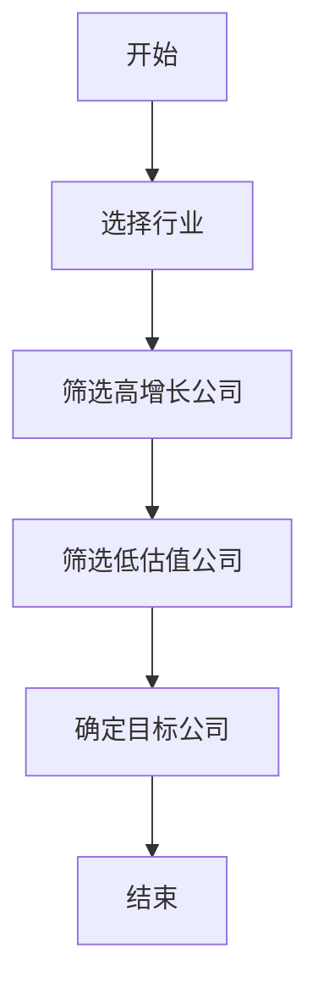

                 

# 彼得林奇的"高增长低估值"在不同行业周期中的筛选

> 关键词：彼得林奇、高增长、低估值、行业周期、投资策略

> 摘要：本文深入分析了彼得林奇的“高增长低估值”投资理念，并结合不同行业周期的特点，详细探讨了如何在实际投资中筛选出具有高增长潜力但估值较低的公司。文章从理论基础、筛选方法、行业分析、投资策略等多个维度展开，为投资者提供了系统化的指导和实战案例。

---

## 第一部分: 彼得林奇的"高增长低估值"投资理念概述

### 第1章: 彼得林奇与高增长低估值投资概述

#### 1.1 彼得林奇的生平与投资理念
彼得·林奇（Peter Lynch）是全球最著名的股票投资者之一，曾担任富达投资集团麦哲伦基金的经理。他在任职期间（1977年-1990年）取得了年均29%的复合回报率，远超市场平均水平。林奇的投资理念以“高增长低估值”为核心，强调寻找那些基本面良好、估值合理且具有持续增长潜力的公司。

**彼得林奇的核心投资理念：**
1. **长期投资**：关注公司的长期增长潜力，而非短期市场波动。
2. **基本面分析**：通过分析公司的财务数据、行业地位和竞争优势，筛选出具有成长性的公司。
3. **分散投资**：避免过度集中投资，降低风险。
4. **逆向思考**：在市场低迷时寻找被低估的投资机会。

#### 1.2 高增长低估值的定义与特征
高增长低估值的公司是指那些收入和利润快速增长，但估值（市盈率、市净率等）相对较低的企业。这类公司在市场低迷或行业低谷期往往被低估，但在行业复苏或增长期有望实现超额收益。

**高增长的定义：**
- 收入增长率：过去几年收入持续增长，且未来有望保持较高的增长速度。
- 净利润增长率：净利润持续增长，且增速高于行业平均水平。

**低估值的定义：**
- 市盈率（P/E）：股价与每股收益的比值低于行业平均水平。
- 市净率（P/B）：股价与每股净资产的比值低于行业平均水平。

#### 1.3 高增长低估值投资的适用场景
高增长低估值策略在以下场景中尤为适用：
1. **行业低谷期**：在行业周期的底部，许多优质公司因市场低迷而被低估，此时是买入的好时机。
2. **经济衰退期**：经济下行周期中，部分行业的需求可能下降，但具有强大竞争优势的公司仍能保持增长。
3. **新兴行业**：新兴行业中的公司通常增长潜力大，但估值相对较低，适合高增长低估值策略。

---

### 第2章: 高增长低估值筛选的核心概念

#### 2.1 高增长公司的识别标准
高增长公司的识别需要结合财务数据和行业趋势，重点关注以下指标：

**收入增长率：**
$$ 收入增长率 = \frac{收入增长额}{基期收入} \times 100\% $$

**净利润增长率：**
$$ 净利润增长率 = \frac{净利润增长额}{基期净利润} \times 100\% $$

**营业利润率：**
$$ 营业利润率 = \frac{营业收入}{营业成本} \times 100\% $$

#### 2.2 低估值的衡量指标
低估值的衡量需要结合市盈率、市净率等指标，重点关注以下指标：

**市盈率（P/E）：**
$$ 市盈率 = \frac{股价}{每股收益} $$

**市净率（P/B）：**
$$ 市净率 = \frac{股价}{每股净资产} $$

**市销率（P/S）：**
$$ 市销率 = \frac{股价}{每股营业收入} $$

#### 2.3 高增长与低估值的对比分析
高增长与低估值是两个看似矛盾但相辅相成的概念。高增长意味着公司有较强的盈利能力和发展潜力，而低估值意味着公司当前的市场价格低于其内在价值。两者的结合使得投资者能够在较低的价格买入具有高增长潜力的公司。

**对比表格：**

| 指标       | 高增长公司特征 | 低估值公司特征 |
|------------|----------------|----------------|
| 收入增长率 | 高             | 无特定要求     |
| 净利润增长率 | 高             | 无特定要求     |
| 市盈率（P/E） | 无特定要求     | 低             |
| 市净率（P/B） | 无特定要求     | 低             |

---

### 第3章: 高增长低估值筛选的算法原理

#### 3.1 筛选算法的数学模型
高增长低估值筛选算法的核心在于通过财务指标的组合筛选出符合条件的公司。以下是具体的数学模型：

1. **收入增长率 > 行业平均收入增长率**
2. **净利润增长率 > 行业平均净利润增长率**
3. **市盈率 < 行业平均市盈率**
4. **市净率 < 行业平均市净率**

#### 3.2 算法流程图

#### 3.3 实际案例分析
以科技行业为例，假设当前行业平均收入增长率为15%，平均市盈率为30倍。我们需要筛选出收入增长率 > 15% 且市盈率 < 30倍的公司。

---

## 第二部分: 不同行业周期中的高增长低估值筛选

### 第4章: 行业周期对高增长低估值筛选的影响

#### 4.1 科技行业的高增长低估值筛选
**科技行业特点：**
- 周期性较强，技术更新换代快。
- 高增长公司通常具有较高的研发投入和创新能力。

**筛选策略：**
1. 选择收入增长率 > 20% 的公司。
2. 选择市盈率 < 25倍的公司。
3. 重点关注云计算、人工智能等高增长领域。

#### 4.2 消费行业的高增长低估值筛选
**消费行业特点：**
- 周期性较弱，需求相对稳定。
- 高增长公司通常具有强大的品牌影响力和市场份额。

**筛选策略：**
1. 选择净利润增长率 > 15% 的公司。
2. 选择市净率 < 2倍的公司。
3. 重点关注食品饮料、家用电器等领域。

#### 4.3 制造业行业的高增长低估值筛选
**制造业行业特点：**
- 周期性较强，受宏观经济影响较大。
- 高增长公司通常具有成本优势和技术壁垒。

**筛选策略：**
1. 选择营业利润率 > 20% 的公司。
2. 选择市销率 < 1.5倍的公司。
3. 重点关注高端装备制造等领域。

---

### 第5章: 不同行业周期下的投资策略

#### 5.1 经济衰退期的投资策略
**策略：**
1. 优先选择具有强大竞争优势的公司。
2. 重点关注估值较低的行业龙头。

#### 5.2 经济复苏期的投资策略
**策略：**
1. 选择收入增长率快速回升的公司。
2. 重点关注市盈率较低的周期性行业。

#### 5.3 经济繁荣期的投资策略
**策略：**
1. 选择净利润增长率较高的公司。
2. 重点关注市净率较低的行业。

---

## 第三部分: 风险管理与投资组合优化

### 第6章: 风险管理与高增长低估值投资

#### 6.1 风险识别
1. **市场风险**：市场波动可能导致股价短期下跌。
2. **行业风险**：行业周期性波动可能影响公司业绩。
3. **公司风险**：公司自身的财务状况和管理能力可能影响投资收益。

#### 6.2 风险规避策略
1. **分散投资**：避免过度集中投资于单一行业或公司。
2. **设置止损点**：在股价下跌到一定程度时及时卖出。
3. **定期调整投资组合**：根据市场变化和公司业绩动态调整投资组合。

---

## 第四部分: 项目实战与案例分析

### 第7章: 项目实战：高增长低估值筛选与投资

#### 7.1 项目背景
假设当前市场处于经济衰退期，我们需要在制造业和科技行业中筛选高增长低估值的公司。

#### 7.2 筛选过程
1. **制造业行业**：
   - 收入增长率 > 20%。
   - 市销率 < 1.5倍。
   - 重点关注高端装备制造领域。
2. **科技行业**：
   - 净利润增长率 > 15%。
   - 市盈率 < 25倍。
   - 重点关注人工智能领域。

#### 7.3 投资组合优化
1. 选择3家制造业公司和2家科技公司。
2. 根据公司的估值和成长性分配投资比例。
3. 定期跟踪公司的财务数据和行业趋势。

---

## 第五部分: 总结与展望

### 第8章: 总结与展望

#### 8.1 全文总结
彼得林奇的“高增长低估值”投资理念为我们提供了一种有效的选股方法。通过结合行业周期和公司基本面分析，我们可以筛选出具有高增长潜力且估值较低的公司，从而实现长期稳定的收益。

#### 8.2 未来展望
随着全球经济的不断发展和科技的不断进步，高增长低估值投资策略的应用前景广阔。投资者需要持续关注行业趋势和公司基本面，灵活调整投资策略，以应对不断变化的市场环境。

---

## 作者：AI天才研究院/AI Genius Institute & 禅与计算机程序设计艺术 /Zen And The Art of Computer Programming

---

通过以上结构和内容安排，我们可以系统地分析彼得林奇的“高增长低估值”投资理念，并结合不同行业周期的特点，为投资者提供实用的筛选方法和投资策略。

