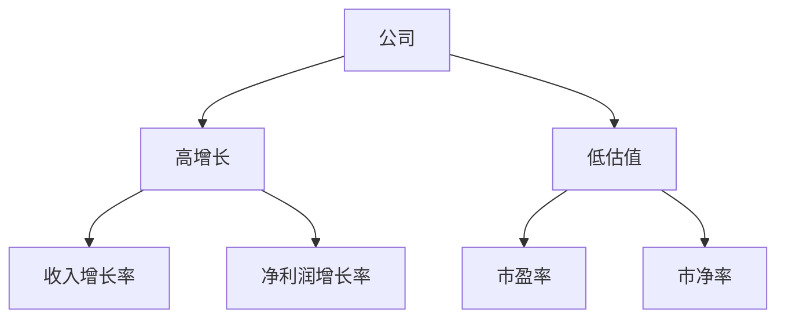
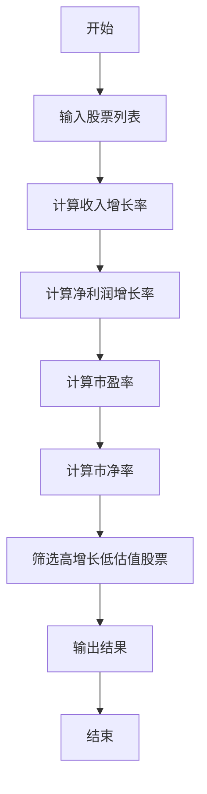
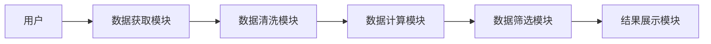

                 

<think>
嗯，我现在需要帮用户设计一个技术博客的目录大纲，标题是《彼得林奇的"高增长低估值"在新兴科技股中的筛选标准》。首先，我需要理解这个主题的核心内容，也就是高增长低估值策略在新兴科技股中的应用。

好的，高增长低估值策略主要是指寻找那些增长速度快但估值相对较低的公司。彼得·林奇是投资界的大师，他的这种方法在科技股中特别有用，因为科技公司通常增长快，但有时候估值可能被低估。

接下来，我需要考虑博客的结构。用户给的示例包括背景、核心概念、算法原理、系统分析、项目实战和最佳实践。我需要确保每个部分都有足够的细节，并且使用技术性的语言，同时保持逻辑清晰。

首先，背景介绍部分需要解释这个策略的起源和应用。可能需要从投资的基本概念开始，然后介绍彼得·林奇的理论，最后说明为什么这个策略在科技股中适用。

核心概念部分，我需要详细解释高增长和低估值的定义，以及它们之间的关系。可能还需要用表格和图表来对比两者的属性，帮助读者更好地理解。

然后是算法原理。这部分需要详细说明如何计算增长率和估值指标，比如PEG指标。可能需要使用流程图来展示算法的步骤，并附上Python代码示例，这样读者可以实际操作。

接下来是系统分析与架构设计。这部分可能需要描述一个筛选系统，包括功能设计、架构设计，可能用图表展示系统的模块和交互流程。

项目实战部分，需要指导读者如何安装必要的工具，比如数据分析库，然后提供筛选标准的Python代码，并解读代码功能，分析实际案例，最后进行总结。

最后是最佳实践部分，包括小结、注意事项和拓展阅读，帮助读者巩固所学内容，并指导他们进一步学习。

我还需要确保每个部分都细化到三级目录，内容完整且符合用户的要求。同时，注意字数限制在2000字以内，保持简洁明了。

好，现在我需要按照这些思路一步步构建目录大纲。首先，标题和关键词部分已经明确，然后是摘要，概述文章的核心内容。接下来，分章节详细展开每个部分的内容。

在编写过程中，我会注意逻辑的连贯性，确保每一部分都自然衔接，同时使用吸引人的标题和小标题，让读者一目了然。对于技术细节，我会尽量用通俗易懂的语言解释，并通过例子和图表帮助读者理解。

可能在编写过程中会遇到一些挑战，比如如何将复杂的算法流程用图表清晰表达，或者如何用简单的语言解释技术细节。这时候，我需要反复思考，确保内容准确且易于理解。

总的来说，我需要一步步分析，从背景到算法，再到实战，确保每个部分都详细且有深度，同时保持整体结构的紧凑和逻辑的清晰。
</think>

# 彼得林奇的"高增长低估值"在新兴科技股中的筛选标准

## 关键词
- 彼得·林奇
- 高增长低估值
- 新兴科技股
- 投资策略
- 股票筛选

## 摘要
本文深入探讨了彼得·林奇提出的“高增长低估值”投资策略在新兴科技股中的应用。通过分析高增长和低估值的定义、指标及两者之间的关系，结合算法原理和系统架构设计，为投资者提供了一套筛选新兴科技股的方法。文章还通过实际案例展示了如何应用该策略，并给出了最佳实践建议，帮助读者在科技股投资中做出明智决策。

---

## 第一部分: 高增长低估值策略的背景与基础

### 第1章: 高增长低估值策略概述

#### 1.1 高增长低估值策略的起源
- **1.1.1 投资策略的基本概念**
  - 投资的基本原理和目标
  - 高增长和低估值的定义
- **1.1.2 彼得·林奇的投资理念**
  - 彼得·林奇的背景与成就
  - 高增长低估值策略的核心思想
- **1.1.3 高增长低估值策略在科技股中的应用**
  - 科技股的特点与投资机会
  - 策略的适用场景与限制

#### 1.2 高增长与低估值的定义与特征
- **1.2.1 高增长公司的定义**
  - 收入增长率
  - 净利润增长率
  - 市场份额增长率
- **1.2.2 低估值公司的定义**
  - 市盈率（P/E）
  - 市净率（P/B）
  - 企业价值/息税前利润（EV/EBIT）
- **1.2.3 高增长与低估值的对比分析**
  - 表格对比：高增长与低估值的属性特征
  - 图表分析：高增长与低估值的关系

### 第2章: 高增长低估值策略的核心概念与联系

#### 2.1 核心概念原理
- **2.1.1 高增长的衡量指标**
  - 收入增长率计算公式：$$\text{收入增长率} = \frac{\text{本期收入} - \text{上期收入}}{\text{上期收入}} \times 100\%$$
  - 净利润增长率计算公式：$$\text{净利润增长率} = \frac{\text{本期净利润} - \text{上期净利润}}{\text{上期净利润}} \times 100\%$$
- **2.1.2 低估值的衡量指标**
  - 市盈率计算公式：$$\text{市盈率} = \frac{\text{股票价格}}{\text{每股净利润}}$$
  - 市净率计算公式：$$\text{市净率} = \frac{\text{股票价格}}{\text{每股净资产}}$$
- **2.1.3 高增长与低估值的平衡点**
  -PEG指标：$$\text{PEG} = \frac{\text{市盈率}}{\text{净利润增长率}}$$
  - 使用PEG指标筛选高增长低估值股票

#### 2.2 核心概念属性特征对比表格
| 指标类型 | 高增长 | 低估值 |
|----------|--------|--------|
| 收入增长率 | 高     | 无特定要求 |
| 净利润增长率 | 高     | 无特定要求 |
| 市盈率（P/E） | 无特定要求 | 低 |
| 市净率（P/B） | 无特定要求 | 低 |

#### 2.3 ER实体关系图


---

## 第二部分: 高增长低估值策略的算法原理

### 第3章: 算法原理与实现

#### 3.1 算法原理概述
- **3.1.1 算法的基本思路**
  - 筛选步骤：计算收入增长率、净利润增长率、市盈率和市净率
  - 筛选标准：收入增长率>20%且PEG<1.5
- **3.1.2 算法的核心步骤**
  - 数据获取：从数据库或API获取股票数据
  - 数据清洗：处理缺失值和异常值
  - 数据计算：计算各项指标并进行排序
  - 数据筛选：根据筛选标准选出符合条件的股票

#### 3.2 算法流程图


#### 3.3 算法实现代码
```python
import pandas as pd

# 假设我们有一个包含股票数据的DataFrame df
df = pd.DataFrame({
    '股票代码': ['A', 'B', 'C', 'D', 'E'],
    '收入增长率': [30, 15, 25, 10, 20],
    '净利润增长率': [25, 10, 30, 5, 15],
    '市盈率': [15, 10, 20, 8, 12],
    '市净率': [2, 1, 3, 0.5, 1.5]
})

# 计算PEG指标
df['PEG'] = df['市盈率'] / df['净利润增长率']

# 筛选条件：收入增长率 > 20% 且 PEG < 1.5
筛选结果 = df[(df['收入增长率'] > 20) & (df['PEG'] < 1.5)]
```

---

## 第三部分: 高增长低估值策略的系统分析与架构设计

### 第4章: 系统分析与架构设计

#### 4.1 系统功能设计
- **4.1.1 功能模块**
  - 数据获取模块：从数据库或API获取股票数据
  - 数据清洗模块：处理缺失值和异常值
  - 数据计算模块：计算各项指标
  - 数据筛选模块：根据筛选标准选出符合条件的股票
  - 结果展示模块：展示筛选结果

#### 4.2 系统架构设计


#### 4.3 系统接口设计
- **接口1**: 获取股票数据
  - 输入：股票代码
  - 输出：股票数据
- **接口2**: 计算指标
  - 输入：数据
  - 输出：计算结果

#### 4.4 系统交互流程


---

## 第四部分: 高增长低估值策略的项目实战

### 第5章: 项目实战与案例分析

#### 5.1 环境安装与配置
- **安装必要的工具**
  - Python
  - pandas库
  - matplotlib库
- **配置数据源**
  - 数据库连接
  - API接口配置

#### 5.2 核心代码实现
```python
import pandas as pd
import requests

# 获取股票数据
def get_stock_data(stock_code):
    url = f"https://api.example.com/stock/{stock_code}"
    response = requests.get(url)
    data = response.json()
    return data

# 数据清洗
def clean_data(data):
    df = pd.DataFrame(data)
    df.dropna(inplace=True)
    return df

# 数据计算
def calculate_metrics(df):
    df['PEG'] = df['市盈率'] / df['净利润增长率']
    return df

# 数据筛选
def screen_stocks(df):
    selected = df[(df['收入增长率'] > 20) & (df['PEG'] < 1.5)]
    return selected

# 主函数
def main():
    stock_code = input("请输入股票代码：")
    data = get_stock_data(stock_code)
    cleaned_data = clean_data(data)
    metrics_data = calculate_metrics(cleaned_data)
    selected_stocks = screen_stocks(metrics_data)
    print("筛选结果：")
    print(selected_stocks)

if __name__ == "__main__":
    main()
```

#### 5.3 案例分析与解读
- **案例1**: 假设筛选标准为收入增长率>20%且PEG<1.5
  - 输入股票代码：'ABC'
  - 数据获取：从API获取'ABC'的股票数据
  - 数据清洗：处理缺失值
  - 数据计算：计算PEG指标
  - 数据筛选：筛选符合条件的股票
  - 结果展示：显示筛选结果

---

## 第五部分: 高增长低估值策略的最佳实践

### 第6章: 最佳实践与总结

#### 6.1 小结
- 高增长低估值策略的核心在于找到增长速度快且估值合理的公司
- 通过算法和系统架构设计，可以有效筛选出符合条件的科技股

#### 6.2 注意事项
- 数据质量：确保数据的准确性和完整性
- 策略适用性：根据市场变化调整筛选标准
- 风险控制：分散投资，避免过度集中

#### 6.3 拓展阅读
- 《彼得·林奇的成功投资》
- 《股票投资的逻辑》
- 《技术分析的真谛》

---

## 作者

作者：AI天才研究院/AI Genius Institute & 禅与计算机程序设计艺术 /Zen And The Art of Computer Programming

---

感谢您的阅读，希望本文能为您提供有价值的投资策略和方法，帮助您在新兴科技股中找到高增长低估值的投资机会！

