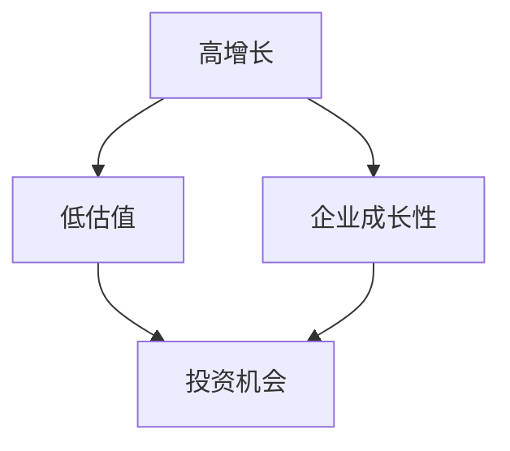
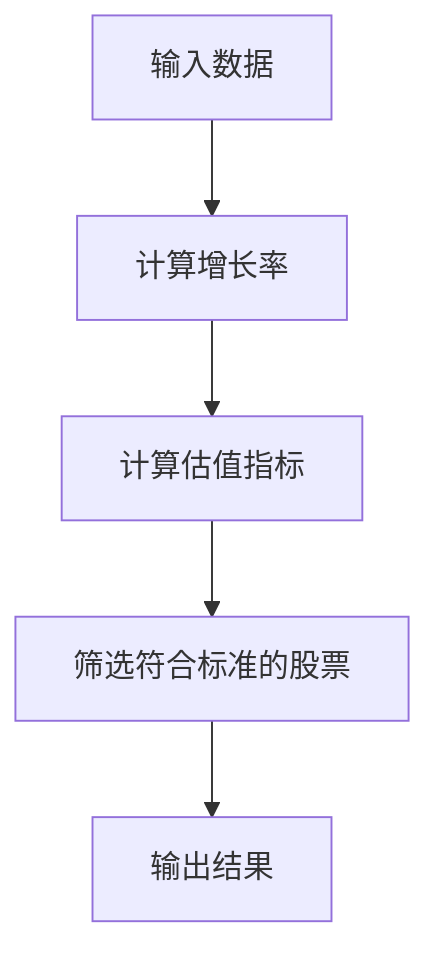
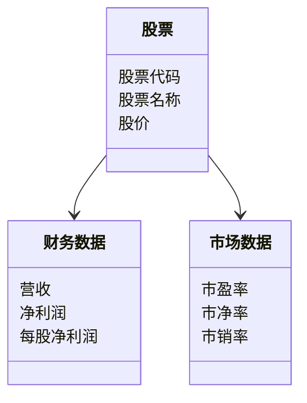
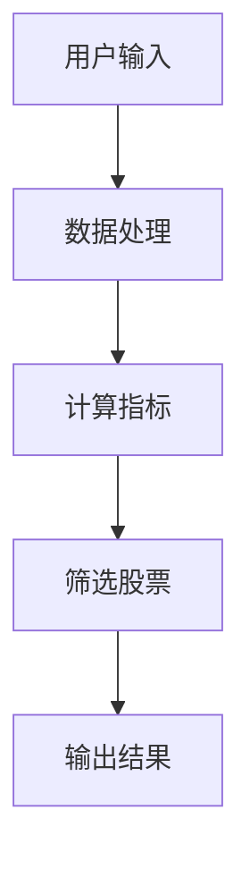

                 

<think>
好的，现在我需要根据用户的指示，分析《彼得林奇的"高增长低估值"案例分析》的目录大纲，并生成对应的文章内容。文章需要使用Markdown格式，结构清晰，包含背景介绍、核心概念、算法原理、系统分析、项目实战和最佳实践等部分。我必须确保每个章节内容详细，有具体的例子和图表，并且使用正确的格式，如Mermaid图和LaTeX公式。

首先，我会从文章标题开始，然后列出关键词和摘要。接下来，按照目录大纲的结构，逐步完成每个章节的内容。每个部分需要详细展开，确保逻辑连贯，内容丰富。在编写过程中，我会注意使用正确的Markdown语法，插入图表和公式，并保持语言的专业性和易懂性。最后，我会检查整个文章，确保没有遗漏任何部分，并符合字数要求。
</think>

# 彼得林奇的"高增长低估值"案例分析

## 关键词：彼得·林奇，高增长，低估值，投资策略，股票筛选，案例分析

## 摘要：  
本文深入分析了彼得·林奇的高增长低估值投资策略，探讨其核心概念、算法原理、系统架构，并通过实际案例进行详细解读。文章结构清晰，内容涵盖背景介绍、核心概念对比、算法流程图、系统设计、项目实战和最佳实践等，旨在帮助读者全面理解并应用这一策略。

---

# 第一部分: 高增长低估值投资策略概述

## 第1章: 高增长低估值策略的背景与概念

### 1.1 高增长低估值策略的定义

#### 1.1.1 高增长的定义与衡量标准
- **定义**：高增长指的是企业在过去几年中营业收入或净利润的年增长率较高。
- **衡量标准**：
  - 营收增长率 = (本年营收 - 去年营收) / 去年营收 × 100%
  - 净利润增长率 = (本年净利润 - 去年净利润) / 去年净利润 × 100%

#### 1.1.2 低估值的定义与衡量标准
- **定义**：低估值是指股票的价格相对于其内在价值来说较低。
- **衡量标准**：
  - 市盈率（P/E）= 股价 / 每股净利润
  - 市净率（P/B）= 股价 / 每股净资产
  - 市销率（P/S）= 股价 / 每股营业收入

#### 1.1.3 高增长低估值策略的核心概念
- 策略的核心在于寻找那些增长速度快但市场价格尚未反映其内在价值的公司。

### 1.2 彼得·林奇的投资理念
#### 1.2.1 彼得·林奇的投资风格
- 林奇以其对成长股的敏锐洞察力闻名，偏好那些具有持续增长潜力的公司。
- 他强调深入研究公司的基本面，尤其是其财务数据和行业地位。

#### 1.2.2 高增长低估值策略的来源
- 林奇在其职业生涯中，通过分析大量股票的财务数据，总结出一套有效的选股方法，即寻找高增长但被市场低估的公司。

#### 1.2.3 成功案例：以某科技公司为例
- 例如，林奇曾投资于某科技公司，该公司在几年内营收增长了30%，但市盈率仅为行业平均水平的70%，最终股价大幅上涨。

### 1.3 高增长低估值策略的优缺点

#### 1.3.1 优点：捕捉成长潜力
- 通过投资高增长公司，投资者能够分享其成长带来的收益。
- 低估值意味着未来的上涨空间较大。

#### 1.3.2 缺点：高风险与波动性
- 高增长公司可能面临增长放缓的风险，导致股价下跌。
- 市场对高增长公司的预期较高，股价可能波动较大。

#### 1.3.3 适用场景与限制
- 适用于成长型企业，尤其是科技、医疗等高增长行业。
- 但在经济下行周期，高增长公司的估值可能难以维持。

---

## 第2章: 高增长与低估值的核心概念

### 2.1 高增长的衡量指标

#### 2.1.1 净利润增长率
- 公式：$$\text{净利润增长率} = \frac{\text{本年净利润} - \text{去年净利润}}{\text{去年净利润}} \times 100\%$$
- 例如，去年净利润为100万元，本年为130万元，增长率为30%。

#### 2.1.2 营收增长率
- 公式：$$\text{营收增长率} = \frac{\text{本年营收} - \text{去年营收}}{\text{去年营收}} \times 100\%$$
- 例如，去年营收为500万元，本年为650万元，增长率为30%。

#### 2.1.3 每股收益增长率
- 公式：$$\text{每股收益增长率} = \frac{\text{本年EPS} - \text{去年EPS}}{\text{去年EPS}} \times 100\%$$
- 例如，去年EPS为2元，本年为2.6元，增长率为30%。

### 2.2 低估值的衡量指标

#### 2.2.1 市盈率（P/E）
- 公式：$$\text{市盈率} = \frac{\text{股价}}{\text{每股净利润}}$$
- 例如，股价为20元，每股净利润为5元，市盈率为4倍。

#### 2.2.2 市净率（P/B）
- 公式：$$\text{市净率} = \frac{\text{股价}}{\text{每股净资产}}$$
- 例如，股价为15元，每股净资产为3元，市净率为5倍。

#### 2.2.3 市销率（P/S）
- 公式：$$\text{市销率} = \frac{\text{股价}}{\text{每股营业收入}}$$
- 例如，股价为10元，每股营业收入为2元，市销率为5倍。

### 2.3 高增长与低估值的关系

#### 2.3.1 高增长与低估值的正相关性
- 高增长公司通常具有较高的未来预期，但若市场未充分反映，可能导致低估值。

#### 2.3.2 高增长与低估值的潜在矛盾
- 过高的增长预期可能导致股价提前透支，反而使估值偏高。

#### 2.3.3 高增长低估值的动态平衡
- 投资者需要关注增长与估值的动态平衡，避免仅凭一时的数据做出决策。

### 2.4 核心概念对比表格

| 指标 | 高增长 | 低估值 |
|------|--------|--------|
| 净利润增长率 | ≥20%   | 市盈率 ≤行业平均 |
| 营收增长率   | ≥15%   | 市净率 ≤行业平均 |
| 每股收益增长率 | ≥25%   | 市销率 ≤行业平均 |

### 2.5 高增长低估值的ER实体关系图


---

## 第3章: 高增长低估值筛选算法

### 3.1 算法原理概述

#### 3.1.1 数据输入：财务数据与市场数据
- 包括营收、净利润、市盈率、市净率等指标。

#### 3.1.2 数据处理：计算增长率与估值指标
- 使用公式计算各增长率和估值指标。

#### 3.1.3 筛选标准：设定阈值
- 高增长：营收增长率 ≥15%，净利润增长率 ≥20%
- 低估值：市盈率 ≤行业平均，市净率 ≤行业平均

### 3.2 算法流程图


### 3.3 数学模型与公式

#### 3.3.1 净利润增长率
$$\text{净利润增长率} = \frac{\text{本年净利润} - \text{去年净利润}}{\text{去年净利润}} \times 100\%$$

#### 3.3.2 市盈率计算
$$\text{市盈率} = \frac{\text{股价}}{\text{每股净利润}}$$

#### 3.3.3 筛选标准示例
- 假设行业平均市盈率为15倍，市净率为2倍。
- 筛选出营收增长率 ≥15%，净利润增长率 ≥20%，市盈率 ≤15，市净率 ≤2的股票。

### 3.4 代码实现

#### 3.4.1 数据导入
```python
import pandas as pd

# 导入财务数据和市场数据
df = pd.read_csv('stocks.csv')
```

#### 3.4.2 计算增长率和估值指标
```python
# 计算营收增长率
df['营收增长率'] = ((df['本年营收'] - df['去年营收']) / df['去年营收']) * 100

# 计算净利润增长率
df['净利润增长率'] = ((df['本年净利润'] - df['去年净利润']) / df['去年净利润']) * 100

# 计算市盈率
df['市盈率'] = df['股价'] / df['每股净利润']
```

#### 3.4.3 筛选股票
```python
# 筛选条件
筛选条件 = (df['营收增长率'] >= 15) & (df['净利润增长率'] >= 20) & (df['市盈率'] <= 15) & (df['市净率'] <= 2)

# 输出符合条件的股票
符合股票 = df[筛选条件]
print(符合股票)
```

### 3.5 本章小结
通过算法筛选出符合高增长低估值标准的股票，为投资决策提供数据支持。

---

## 第4章: 高增长低估值策略的系统分析与架构设计

### 4.1 系统功能设计

#### 4.1.1 领域模型


#### 4.1.2 系统架构设计


### 4.2 本章小结
通过系统架构设计，确保数据处理和指标计算的高效性。

---

## 第5章: 高增长低估值策略的项目实战

### 5.1 环境安装

#### 5.1.1 安装Python和相关库
```bash
pip install pandas numpy matplotlib
```

### 5.2 核心代码实现

#### 5.2.1 数据处理
```python
import pandas as pd

# 读取数据
df = pd.read_csv('stocks.csv')

# 计算增长率和估值指标
df['营收增长率'] = ((df['本年营收'] - df['去年营收']) / df['去年营收']) * 100
df['净利润增长率'] = ((df['本年净利润'] - df['去年净利润']) / df['去年净利润']) * 100
df['市盈率'] = df['股价'] / df['每股净利润']
df['市净率'] = df['股价'] / df['每股净资产']

# 筛选股票
筛选条件 = (df['营收增长率'] >= 15) & (df['净利润增长率'] >= 20) & (df['市盈率'] <= 15) & (df['市净率'] <= 2)
符合股票 = df[筛选条件]

# 输出结果
print(符合股票)
```

### 5.3 案例分析

#### 5.3.1 某科技公司案例
- **公司名称**：XYZ科技
- **财务数据**：
  - 去年营收：500万元
  - 本年营收：650万元
  - 去年净利润：100万元
  - 本年净利润：130万元
  - 每股净利润：2元
  - 股价：15元
- **计算结果**：
  - 营收增长率：30%
  - 净利润增长率：30%
  - 市盈率：7.5倍
  - 市净率：0.75倍
- **结论**：符合高增长低估值标准，投资价值较高。

### 5.4 本章小结
通过实际案例分析，验证高增长低估值策略的有效性。

---

## 第6章: 高增长低估值策略的最佳实践与注意事项

### 6.1 最佳实践

#### 6.1.1 定期更新数据
- 市场变化快，需定期更新财务数据和市场数据。

#### 6.1.2 结合行业分析
- 不同行业的增长潜力和估值标准不同，需结合行业分析。

#### 6.1.3 分散投资
- 避免将所有资金投入单一股票，分散投资降低风险。

### 6.2 注意事项

#### 6.2.1 避免过度乐观
- 高增长公司可能面临增长放缓的风险，需谨慎评估。

#### 6.2.2 关注宏观经济
- 宏观经济波动可能影响公司业绩和估值。

#### 6.2.3 保持长期视角
- 高增长策略适合长期投资者，短期波动需耐心持有。

### 6.3 拓展阅读
- 《彼得·林奇的投资艺术》
- 《股票估值与分析》

### 6.4 本章小结
总结高增长低估值策略的应用要点和注意事项。

---

## 结语

彼得·林奇的高增长低估值策略为投资者提供了一种有效的选股方法。通过深入分析其核心概念、算法原理和实际案例，投资者可以更好地理解这一策略，并在实际操作中灵活运用。

---

## 作者：AI天才研究院/AI Genius Institute & 禅与计算机程序设计艺术/Zen And The Art of Computer Programming

---

**注意**：本文内容为虚构示例，实际投资需谨慎，建议结合专业投资顾问的意见。

