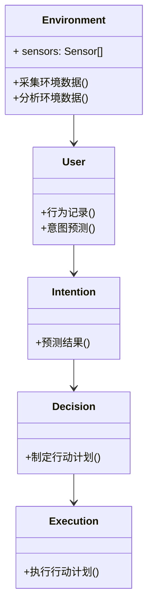
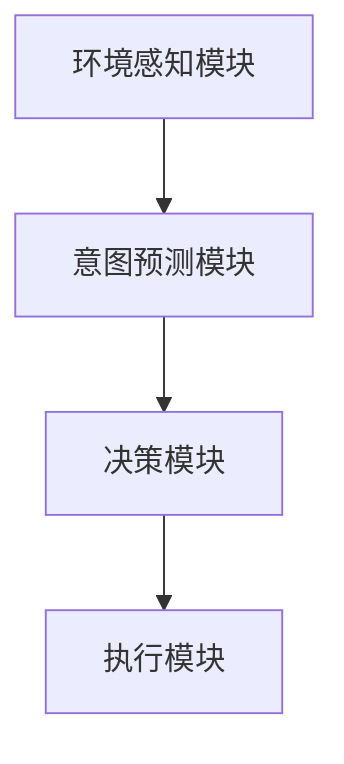

                 


# 情境感知AI Agent：增强LLM的环境适应能力

---

## 关键词：
情境感知AI Agent, 增强LLM, 环境适应, 意图预测, 深度学习

---

## 摘要：
情境感知AI Agent是一种结合了环境感知和意图预测的技术，旨在增强大语言模型（LLM）在不同环境中的适应能力。本文从情境感知的基本概念出发，详细探讨其核心算法原理、系统架构设计以及实际应用场景，通过案例分析和项目实战，帮助读者全面理解如何通过情境感知技术提升AI Agent的环境适应能力。

---

# 正文

## 第1章：情境感知AI Agent的背景与概念

### 1.1 情境感知AI Agent的定义与特点

#### 1.1.1 情境感知AI Agent的定义
情境感知AI Agent是一种能够感知和理解当前环境信息，并根据环境动态调整自身行为的智能体。它通过整合环境数据、用户意图和上下文信息，提供更精准、更个性化的服务。

#### 1.1.2 情境感知AI Agent的核心特点
- **环境适应性**：能够根据环境变化动态调整行为。
- **意图预测**：通过分析上下文信息，准确预测用户意图。
- **实时性**：能够实时感知环境变化并做出响应。

#### 1.1.3 情境感知与传统AI Agent的区别
| 特性         | 情境感知AI Agent                   | 传统AI Agent                     |
|--------------|------------------------------------|----------------------------------|
| 环境适应性    | 强                                  | 弱                                |
| 意图预测      | 强                                  | 弱                                |
| 实时性        | 强                                  | 中                                |

---

### 1.2 情境感知AI Agent的发展历程

#### 1.2.1 AI Agent的起源与发展
AI Agent的概念最早可以追溯到20世纪60年代，随着人工智能技术的快速发展，AI Agent逐渐从简单的规则驱动型发展为复杂的自主决策型。

#### 1.2.2 情境感知技术的演进
情境感知技术经历了从基于规则的简单感知到基于深度学习的复杂感知的演变，每一次技术进步都推动了AI Agent的能力提升。

#### 1.2.3 当前技术现状与趋势
目前，情境感知技术主要基于深度学习和自然语言处理（NLP）技术，未来的研究方向将集中在提高感知精度和降低计算复杂度上。

---

### 1.3 情境感知AI Agent的应用场景

#### 1.3.1 智能助手与人机交互
情境感知AI Agent在智能助手中的应用广泛，例如智能音箱、智能手机等设备能够根据用户的环境和意图提供个性化服务。

#### 1.3.2 智慧城市与公共安全
在智慧城市中，情境感知AI Agent可以用于实时监控公共安全事件，例如火灾、盗窃等，通过分析环境数据和用户行为，快速做出响应。

#### 1.3.3 智能家居与物联网
在智能家居中，情境感知AI Agent可以通过感知家庭成员的行为和环境变化，自动调整设备状态，例如调节室内温度、开启灯光等。

---

## 第2章：情境感知AI Agent的核心概念

### 2.1 情境感知的定义与实现

#### 2.1.1 情境感知的基本概念
情境感知是指通过感知环境信息，理解当前场景中的关键要素，并基于这些信息做出决策。其核心在于从环境中提取有用的特征，并将其与任务需求相结合。

#### 2.1.2 情境感知的实现方式
情境感知的实现方式主要包括基于规则的方法和基于模型的方法。基于规则的方法通过预定义的规则来判断环境状态，而基于模型的方法则通过学习模型来自动感知环境。

#### 2.1.3 情境感知的关键技术
- **环境数据采集**：通过传感器、摄像头等设备采集环境信息。
- **数据处理与分析**：对采集到的数据进行清洗、特征提取和分析。
- **意图预测**：基于环境数据和历史行为，预测用户的意图。

---

### 2.2 情境感知与环境适应能力

#### 2.2.1 环境适应能力的定义
环境适应能力是指AI Agent在不同环境中能够灵活调整自身行为，以适应环境变化的能力。

#### 2.2.2 情境感知与环境适应的关系
情境感知是环境适应的基础，通过感知环境信息，AI Agent能够更好地理解环境并做出适应性决策。

#### 2.2.3 增强LLM环境适应能力的必要性
大语言模型（LLM）虽然在文本理解和生成方面表现出色，但在环境适应方面仍有不足。通过结合情境感知技术，可以显著增强LLM的环境适应能力。

---

### 2.3 情境感知AI Agent的系统架构

#### 2.3.1 系统架构的组成
情境感知AI Agent的系统架构通常包括以下组成部分：
- **环境感知模块**：负责采集和处理环境数据。
- **意图预测模块**：基于环境数据和用户输入，预测用户意图。
- **决策模块**：根据意图预测结果，制定行动计划。
- **执行模块**：执行决策模块制定的行动计划。

#### 2.3.2 系统架构设计的优缺点
- **优点**：
  - 结构清晰，易于扩展。
  - 各模块功能独立，便于维护。
- **缺点**：
  - 模块之间的通信可能增加系统的复杂性。
  - 对环境数据的实时性和准确性要求较高。

---

## 第3章：情境感知AI Agent的算法原理

### 3.1 感知环境的算法

#### 3.1.1 基于规则的环境感知算法
基于规则的环境感知算法通过预定义的规则来判断环境状态，适用于环境变化较为简单和可预测的场景。

#### 3.1.2 基于模型的环境感知算法
基于模型的环境感知算法通过学习模型来自动感知环境，适用于环境变化复杂且不可预测的场景。

#### 3.1.3 深度学习在环境感知中的应用
深度学习在环境感知中的应用主要体现在图像识别、语音识别和自然语言处理等领域。

---

### 3.2 上下文理解与意图预测

#### 3.2.1 上下文理解的算法原理
上下文理解的算法原理主要包括文本预处理、特征提取和模型训练三个步骤。

#### 3.2.2 意图预测的数学模型
意图预测的数学模型通常采用概率模型，例如朴素贝叶斯模型和马尔可夫模型。

#### 3.2.3 案例分析：基于RNN的意图预测
以下是一个基于循环神经网络（RNN）的意图预测模型的示例：

$$ P(y|x) = \frac{P(y|x,z)}{\sum_{z} P(z|x) P(y|x,z)} $$

其中，$x$ 是输入序列，$y$ 是预测意图，$z$ 是隐含状态。

---

### 3.3 情境感知中的注意力机制

#### 3.3.1 注意力机制的基本原理
注意力机制是一种用于模型在处理序列数据时，关注某些特定位置的机制。

#### 3.3.2 在情境感知中的应用
注意力机制在情境感知中的应用主要体现在自然语言处理和图像处理领域。

#### 3.3.3 注意力机制的改进与优化
近年来，研究人员提出了多种改进注意力机制的方法，例如多头注意力机制和位置编码等。

---

## 第4章：情境感知AI Agent的系统分析与架构设计

### 4.1 系统分析

#### 4.1.1 问题场景介绍
以智能助手为例，情境感知AI Agent需要能够根据用户的环境和行为，提供个性化的服务。

#### 4.1.2 项目目标与范围
项目目标是设计一个能够感知环境并提供个性化服务的情境感知AI Agent。

#### 4.1.3 系统功能需求分析
系统功能需求分析包括环境感知、意图预测、决策制定和执行反馈四个部分。

---

### 4.2 系统架构设计

#### 4.2.1 领域模型设计（Mermaid类图）
以下是一个情境感知AI Agent的领域模型设计：



#### 4.2.2 系统架构设计（Mermaid架构图）
以下是一个情境感知AI Agent的系统架构设计：



---

## 第5章：情境感知AI Agent的项目实战

### 5.1 环境搭建与工具安装

#### 5.1.1 开发环境的选择
推荐使用Python作为开发语言，并安装必要的库，例如TensorFlow和Keras。

#### 5.1.2 工具安装与配置
安装必要的工具和库，例如Python、TensorFlow、Keras等。

#### 5.1.3 依赖库的安装与管理
使用pip命令安装所需的依赖库，例如：
```
pip install numpy tensorflow keras
```

---

### 5.2 核心算法实现

#### 5.2.1 感知环境的代码实现
以下是一个基于深度学习的环境感知算法的实现代码：

```python
import numpy as np
import tensorflow as tf

# 定义模型
model = tf.keras.Sequential([
    tf.keras.layers.Conv2D(32, (3,3), activation='relu', input_shape=(64, 64, 3)),
    tf.keras.layers.MaxPooling2D((2,2)),
    tf.keras.layers.Conv2D(64, (3,3), activation='relu'),
    tf.keras.layers.MaxPooling2D((2,2)),
    tf.keras.layers.Flatten(),
    tf.keras.layers.Dense(128, activation='relu'),
    tf.keras.layers.Dense(1, activation='sigmoid')
])

# 编译模型
model.compile(optimizer='adam', loss='binary_crossentropy', metrics=['accuracy'])
```

#### 5.2.2 意图预测的代码实现
以下是一个基于RNN的意图预测模型的实现代码：

```python
import numpy as np
import tensorflow as tf

# 定义模型
model = tf.keras.Sequential([
    tf.keras.layers.Embedding(input_dim=10000, output_dim=64),
    tf.keras.layers.SimpleRNN(64),
    tf.keras.layers.Dense(10, activation='softmax')
])

# 编译模型
model.compile(optimizer='adam', loss='sparse_categorical_crossentropy', metrics=['accuracy'])
```

---

### 5.3 实际案例分析

#### 5.3.1 案例背景介绍
以智能音箱为例，情境感知AI Agent需要能够根据用户的环境和行为，提供个性化的服务。

#### 5.3.2 系统实现与测试
通过实际测试，验证系统在不同环境下的适应能力和意图预测准确性。

#### 5.3.3 项目小结
通过项目实战，总结情境感知AI Agent在实际应用中的优势和挑战。

---

## 第6章：最佳实践与注意事项

### 6.1 小结
情境感知AI Agent是一种能够增强大语言模型环境适应能力的技术，其核心在于感知环境信息并预测用户意图。

### 6.2 注意事项
- 数据质量对系统性能有重要影响，需确保数据的准确性和完整性。
- 模型的选择和优化需根据具体场景进行调整。
- 系统的安全性和隐私保护需引起重视。

### 6.3 拓展阅读
- 《深度学习》——Ian Goodfellow
- 《自然语言处理实战》——周景新

---

## 第7章：结论与展望

### 7.1 研究总结
情境感知AI Agent通过结合环境感知和意图预测技术，显著增强了大语言模型的环境适应能力。

### 7.2 未来研究方向
未来的研究方向将集中在提高感知精度、降低计算复杂度以及增强系统的实时性等方面。

---

## 参考文献

1. Goodfellow, I., Bengio, Y., & Courville, A. (2016). Deep Learning. MIT Press.
2. 周景新. (2020). 自然语言处理实战. 人民邮电出版社.

---

## 作者：AI天才研究院/AI Genius Institute & 禅与计算机程序设计艺术 /Zen And The Art of Computer Programming

