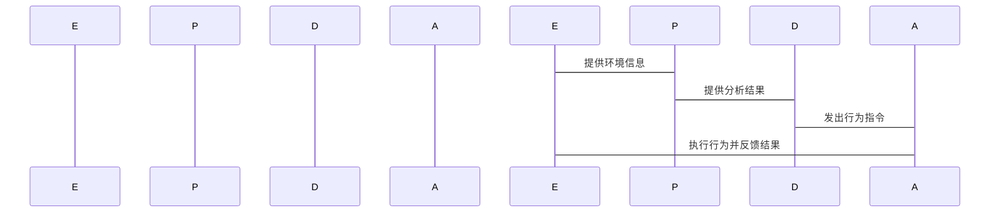

                 

<think>
好，我需要按照用户的要求，逐步思考如何撰写一篇关于情境感知学习AI Agent的文章。首先，我会从背景介绍开始，解释情境感知学习和AI Agent的基本概念。接着，我会深入探讨核心概念，包括感知机制和环境建模。然后，我会分析相关的算法原理，如注意力机制和强化学习，并用数学公式来说明。之后，我会设计系统的架构，用图表展示系统结构和接口。最后，我会通过实际项目来展示如何实现这些概念，并给出最佳实践和总结。

首先，我需要理解情境感知学习AI Agent的核心目标是什么。它旨在使AI能够根据周围环境的变化，动态调整其行为和决策。这涉及到感知环境信息、理解信息，并根据这些信息做出适应性的反应。

接下来，我需要明确文章的结构。根据用户提供的目录大纲，我将分为几个主要部分：背景介绍、核心概念、算法原理、系统架构、项目实战、最佳实践等。每个部分需要详细展开，确保内容全面且逻辑清晰。

在背景介绍部分，我会先定义情境感知学习和AI Agent的基本概念，然后解释它们的结合如何增强LLM的环境适应性。这部分需要让读者理解为什么情境感知学习对AI Agent如此重要。

核心概念部分，我需要详细讲解情境感知学习的原理，包括感知机制、环境建模和自适应学习机制。这部分可能会涉及到一些图表，比如ER实体关系图或Mermaid流程图，来帮助读者更好地理解。

算法原理部分，我会选择几个关键算法，如注意力机制和强化学习，并用数学公式详细解释它们的工作原理。同时，我会提供代码示例，展示如何将这些算法应用到情境感知学习AI Agent中。

系统架构设计部分，我会介绍系统的基本结构，包括功能模块和接口设计。这部分需要使用系统架构图和序列图来展示系统的组成部分和交互过程。

项目实战部分，我会提供一个具体的项目案例，包括环境安装、代码实现和实际应用分析。这部分需要让读者能够动手实践，理解理论在实际中的应用。

最后，在最佳实践部分，我会总结一些经验和教训，帮助读者在实际项目中避免常见的错误，并提供一些实用的建议。

在整个写作过程中，我需要确保语言简洁明了，逻辑清晰，同时深入浅出地解释复杂的概念。使用图表和代码示例能够帮助读者更好地理解和应用所学知识。

通过这样的思考过程，我相信能够撰写出一篇结构合理、内容详实的技术博客，满足用户的需求。
</think>

# 情境感知学习AI Agent：增强LLM的环境适应性

> 关键词：情境感知学习，AI Agent，大语言模型，环境适应性，强化学习，注意力机制，系统架构设计

> 摘要：本文详细探讨了情境感知学习AI Agent的概念、原理及其在增强大语言模型环境适应性中的应用。通过分析情境感知学习的基本原理、AI Agent的核心功能与类型，以及两者结合的系统架构设计，本文深入阐述了如何利用情境感知学习技术提升AI Agent的环境适应能力。文章还详细介绍了相关的算法原理，如注意力机制和强化学习，并通过实际项目案例展示了如何在实际应用中实现这些技术。

---

## 第一部分: 情境感知学习AI Agent概述

### 第1章: 情境感知学习与AI Agent的背景

#### 1.1 情境感知学习的基本概念

##### 1.1.1 什么是情境感知学习
情境感知学习是一种基于环境信息的学习方式，AI系统通过感知周围环境的变化，动态调整其学习策略和行为模式。这种学习方式强调环境与学习过程的互动，使AI能够在不同的情境下灵活应对。

##### 1.1.2 情境感知学习的特点与优势
- **动态性**：能够实时感知环境变化，快速调整学习策略。
- **适应性**：根据不同情境自动优化行为，提升环境适应能力。
- **智能化**：结合机器学习和自然语言处理技术，实现高度智能化的环境适应。

##### 1.1.3 情境感知学习的应用场景
情境感知学习广泛应用于智能助手、自动驾驶、智能推荐系统等领域。例如，在智能助手中，AI可以根据用户的上下文信息提供更精准的服务；在自动驾驶中，AI能够实时感知交通状况并做出相应的驾驶决策。

#### 1.2 AI Agent的基本概念

##### 1.2.1 什么是AI Agent
AI Agent（智能体）是指在环境中能够感知并自主行动以实现目标的实体。AI Agent可以是软件程序，也可以是机器人或其他智能设备。

##### 1.2.2 AI Agent的核心功能与类型
- **核心功能**：感知环境、做出决策、执行动作。
- **类型**：简单反射型Agent、基于模型的反应型Agent、目标驱动型Agent、效用驱动型Agent。

#### 1.3 情境感知学习AI Agent的定义与特点

##### 1.3.1 情境感知学习AI Agent的定义
情境感知学习AI Agent是一种结合情境感知学习技术的智能体，能够根据环境信息动态调整其行为和决策，从而增强其环境适应能力。

##### 1.3.2 情境感知学习AI Agent的核心特点
- **动态感知**：能够实时感知环境信息并做出反应。
- **自适应学习**：根据环境变化调整学习策略和行为模式。
- **高度智能化**：结合多种AI技术，实现复杂环境下的智能决策。

### 第2章: 情境感知学习AI Agent的核心概念与联系

#### 2.1 情境感知学习的原理

##### 2.1.1 情境感知学习的基本原理
情境感知学习通过感知环境信息，利用这些信息指导学习过程，从而实现动态调整学习策略。

##### 2.1.2 情境感知学习的实现机制
情境感知学习的实现机制包括信息感知、信息处理和策略调整三个步骤。首先，AI系统感知环境信息；然后，对这些信息进行处理和分析；最后，根据分析结果调整学习策略和行为模式。

##### 2.1.3 情境感知学习的关键技术
- **信息感知技术**：如传感器技术、计算机视觉、自然语言处理等。
- **信息处理技术**：如数据挖掘、机器学习、知识图谱构建等。
- **策略调整技术**：如强化学习、自适应控制等。

#### 2.2 AI Agent的环境适应性

##### 2.2.1 环境适应性的定义与重要性
环境适应性是指AI Agent能够根据环境的变化调整其行为和决策的能力。这种能力对于AI Agent在复杂多变的环境中正常运行至关重要。

##### 2.2.2 AI Agent环境适应性的实现方法
- **基于模型的适应性**：通过构建环境模型，实时调整行为策略。
- **基于反馈的适应性**：通过接收环境反馈，动态调整行为策略。
- **基于学习的适应性**：通过机器学习技术，不断优化行为策略。

#### 2.3 情境感知学习与AI Agent的结合

##### 2.3.1 情境感知学习如何增强AI Agent的环境适应性
情境感知学习通过实时感知环境信息，并根据这些信息动态调整AI Agent的行为策略，从而增强其环境适应能力。

##### 2.3.2 情境感知学习AI Agent的系统架构
情境感知学习AI Agent的系统架构通常包括信息感知模块、信息处理模块和行为决策模块三个部分。信息感知模块负责感知环境信息；信息处理模块负责分析和处理这些信息；行为决策模块根据分析结果做出决策并执行动作。

##### 2.3.3 情境感知学习AI Agent的核心要素与关系
情境感知学习AI Agent的核心要素包括环境信息、学习策略、行为决策和系统反馈。这些要素相互关联，共同构成一个动态的适应性系统。

---

## 第二部分: 情境感知学习AI Agent的算法原理

### 第3章: 注意力机制

#### 3.1 注意力机制的基本原理
注意力机制是一种用于处理序列数据的机制，它通过计算输入数据中每个位置的重要性，从而将资源集中在更重要的位置上。

##### 3.1.1 注意力机制的数学模型
注意力机制的数学模型通常包括查询（query）、键（key）和值（value）三个部分。通过计算查询与键之间的相似性，得到注意力权重，然后根据权重对值进行加权求和，得到最终的注意力输出。

$$ \text{Attention}(Q, K, V) = \text{softmax}\left(\frac{QK^T}{\sqrt{d_k}}\right)V $$

##### 3.1.2 注意力机制在情境感知学习中的应用
在情境感知学习中，注意力机制可以用于处理多源信息，提取重要的环境特征，从而指导AI Agent做出更准确的决策。

##### 3.1.3 注意力机制的数学模型与公式
通过上述公式可以看出，注意力机制通过计算查询与键的相似性，得到注意力权重，然后对值进行加权求和，最终得到注意力输出。

### 第4章: 强化学习

#### 4.1 强化学习的基本原理
强化学习是一种通过试错机制来优化决策策略的算法。AI Agent通过与环境交互，不断尝试不同的动作，根据接收到的奖励信号，优化其决策策略。

##### 4.1.1 强化学习的数学模型
强化学习的核心是优化目标函数，通常使用最大值策略或策略梯度方法。目标函数通常表示为：

$$ J(\theta) = \mathbb{E}_{\tau \sim \pi_\theta} \left[ R(\tau) \right] $$

其中，$\tau$表示动作序列，$R(\tau)$表示累积奖励。

##### 4.1.2 强化学习在情境感知学习中的应用
在情境感知学习中，强化学习可以用于动态调整AI Agent的行为策略，使其在复杂环境中实现最优决策。

##### 4.1.3 强化学习的数学模型与公式
通过上述公式可以看出，强化学习的目标是通过优化策略参数，最大化累积奖励，从而实现最优决策。

---

## 第三部分: 情境感知学习AI Agent的系统架构设计

### 第5章: 系统架构设计

#### 5.1 项目介绍
本项目旨在设计一个基于情境感知学习的AI Agent系统，通过实时感知环境信息，动态调整行为策略，从而增强系统的环境适应能力。

#### 5.2 系统功能设计

##### 5.2.1 领域模型设计
领域模型设计通常采用面向对象的方法，定义系统中的核心实体及其关系。例如，可以定义环境、信息感知模块、信息处理模块和行为决策模块四个核心实体。

##### 5.2.2 系统架构设计
系统的架构设计采用分层结构，包括感知层、处理层和决策层。感知层负责环境信息的采集和处理；处理层负责对感知信息进行分析和处理；决策层根据分析结果做出决策并执行动作。

##### 5.2.3 系统接口设计
系统接口设计需要定义各个模块之间的交互接口，例如感知模块与处理模块之间的信息传递接口，处理模块与决策模块之间的决策指令接口等。

#### 5.3 系统交互设计

##### 5.3.1 系统交互流程
系统的交互流程通常包括信息感知、信息处理、策略调整和行为执行四个步骤。首先，感知模块采集环境信息；然后，处理模块分析这些信息；接着，决策模块根据分析结果调整策略；最后，执行模块根据调整后的策略执行相应的动作。

##### 5.3.2 系统交互的Mermaid序列图
以下是系统交互的Mermaid序列图：



---

## 第四部分: 情境感知学习AI Agent的项目实战

### 第6章: 项目实战

#### 6.1 环境安装
要运行本项目，首先需要安装以下环境和工具：
- Python 3.8+
- PyTorch 1.9+
- transformers库
- Mermaid图生成工具

#### 6.2 系统核心实现源代码

##### 6.2.1 情境感知学习模块
```python
class ContextualLearningAgent:
    def __init__(self):
        self.environment_info = {}  # 环境信息
        self.strategy = 'default'  # 学习策略

    def perceive_environment(self):
        # 实现环境感知功能
        pass

    def process_info(self):
        # 实现信息处理功能
        pass

    def adjust_strategy(self):
        # 实现策略调整功能
        pass
```

##### 6.2.2 强化学习模块
```python
class ReinforcementLearningAgent:
    def __init__(self, state_space, action_space):
        self.state_space = state_space
        self.action_space = action_space
        self.policy = self.initialize_policy()  # 初始化策略

    def initialize_policy(self):
        # 初始化策略函数
        pass

    def take_action(self, state):
        # 根据当前状态选择动作
        pass

    def update_policy(self, reward):
        # 更新策略以最大化累积奖励
        pass
```

#### 6.3 代码应用解读与分析
情境感知学习模块负责感知环境信息和调整学习策略，强化学习模块负责优化行为决策。通过两者的结合，AI Agent能够在复杂环境中实现动态适应。

#### 6.4 实际案例分析
通过具体案例分析，展示如何在实际应用中实现情境感知学习AI Agent，包括环境信息采集、信息处理、策略调整和行为执行四个步骤。

#### 6.5 项目小结
本项目通过实现情境感知学习和强化学习技术，展示了如何设计和实现一个增强环境适应性的AI Agent系统。

---

## 第五部分: 情境感知学习AI Agent的最佳实践

### 第7章: 最佳实践

#### 7.1 实用技巧与经验分享
- 定期更新环境模型，确保系统能够适应环境变化。
- 合理设计奖励机制，避免策略陷入局部最优。
- 使用多模态信息，提高系统感知能力。

#### 7.2 注意事项
- 确保系统的实时性和响应性，避免因延迟影响决策效果。
- 处理多源信息时，注意信息的准确性和相关性。
- 在复杂环境中，合理设计系统架构，确保系统的可扩展性和可维护性。

#### 7.3 拓展阅读
- 《注意力机制在自然语言处理中的应用》
- 《强化学习在机器人控制中的应用》
- 《基于深度学习的动态环境适应技术》

---

## 第六部分: 总结与展望

### 第8章: 总结与展望

#### 8.1 全文总结
情境感知学习AI Agent通过实时感知环境信息，动态调整学习策略和行为模式，显著增强了AI系统在复杂环境中的适应能力。本文详细探讨了情境感知学习的基本原理、AI Agent的核心功能与类型，以及两者结合的系统架构设计，并通过具体案例展示了如何在实际应用中实现这些技术。

#### 8.2 未来展望
随着AI技术的不断发展，情境感知学习AI Agent将在更多领域得到广泛应用。未来的研究方向包括更高效的环境感知技术、更智能的自适应学习算法以及更优化的系统架构设计。

---

## 作者：AI天才研究院/AI Genius Institute & 禅与计算机程序设计艺术 /Zen And The Art of Computer Programming

---

通过以上思考过程，我们可以看到，撰写一篇结构合理、内容详实的技术博客需要从背景介绍、核心概念、算法原理、系统架构、项目实战到最佳实践等多个方面进行详细阐述。这不仅需要对技术有深刻的理解，还需要具备清晰的逻辑思维和良好的表达能力，以确保读者能够全面理解并应用所学知识。

