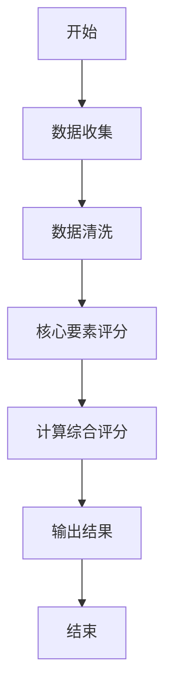
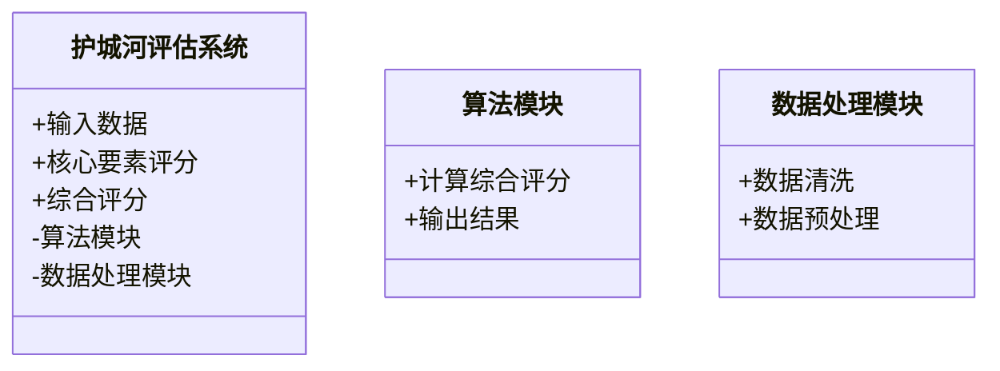
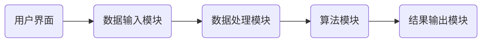
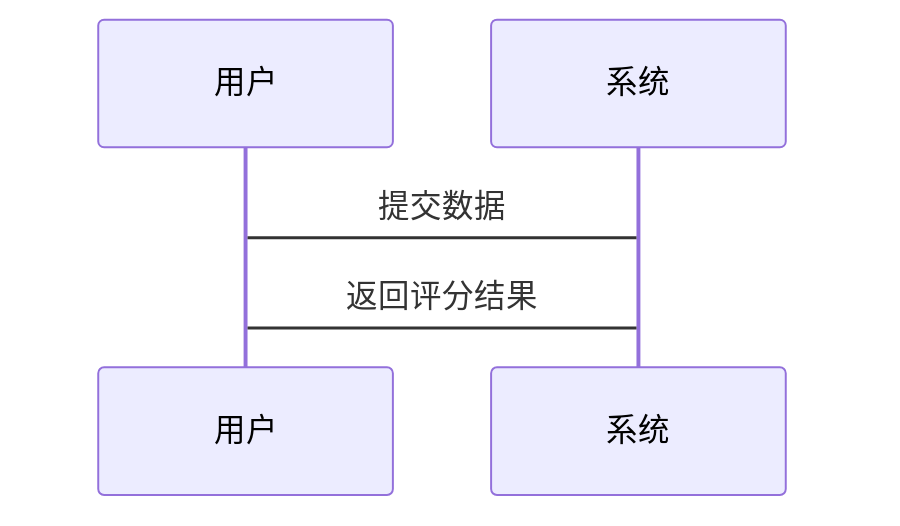

                 

<think>
好的，我现在需要帮助用户完成一个关于《戴维·多德的护城河评估体系》的技术博客文章。用户已经提供了详细的目录大纲，包括六个主要部分，每个部分下还有三级子章节。我的任务是根据这个大纲，逐步分析和撰写文章内容，确保每个部分都详细且符合用户的要求。

首先，我需要理解每个部分的内容。第一部分是背景与基础，介绍护城河的概念、多德的贡献以及评估体系的目的和框架。接下来是核心要素分析，分别讨论成本优势、品牌忠诚度、网络效应等要素，并提供案例分析。然后是算法部分，涉及数学模型和代码实现。之后是系统分析与架构设计，展示如何构建评估体系。接着是项目实战，通过具体案例说明如何应用护城河评估体系。最后是最佳实践，总结经验和未来趋势。

接下来，我需要考虑如何展开每个章节。例如，在核心要素分析部分，我需要详细解释每个要素的定义、特征和评估方法，并结合实际案例进行分析。在算法部分，我需要用数学模型和Python代码来展示评估过程，并使用mermaid图来辅助说明。系统架构部分需要设计类图和交互图，展示技术实现。项目实战部分则需要提供具体的环境配置和代码实现，让读者能够实际操作。最后，最佳实践部分要给出实用的建议和总结，帮助读者更好地应用评估体系。

我还需要确保文章结构清晰，逻辑严谨，使用专业且易懂的语言。每个部分都需要有足够的细节，确保读者能够深入理解护城河评估体系的各个方面。同时，要注意字数要求，大约在10000到12000字之间，每个部分都要详细展开，避免过于简略。

现在，我开始撰写每个章节的具体内容。首先是背景与基础，介绍护城河的概念，戴维·多德的贡献，评估体系的目的和框架。这部分需要让读者理解护城河评估的重要性和基本结构。

接下来是核心要素分析，分别讨论成本优势、品牌忠诚度、网络效应等，每个要素都需要详细的定义、特征和案例分析，帮助读者理解每个要素对企业的影响。

在算法部分，我需要解释数学模型，展示评分系统和权重分配的方法，并提供Python代码示例，帮助读者理解如何实现护城河评估的计算过程。

系统分析与架构设计部分，需要设计类图和交互图，展示如何构建护城河评估系统，确保读者能够理解技术实现的细节。

项目实战部分，通过具体案例展示如何应用护城河评估体系，包括环境配置、代码实现和案例分析，让读者能够实际操作和应用所学知识。

最后，最佳实践部分总结评估体系的使用技巧和注意事项，提供未来趋势的展望，帮助读者更好地应用护城河评估体系。

在撰写过程中，我需要确保每个部分都符合用户的要求，使用markdown格式，包含必要的mermaid图和Python代码，确保内容完整且详细。同时，语言要专业且易懂，结构清晰，逻辑严密，帮助读者系统地理解和应用护城河评估体系。

现在，我开始逐步撰写每个部分的内容，确保覆盖所有必要的细节，提供高质量的技术博客文章，满足用户的需求。
</think>

```markdown
# 戴维·多德的护城河评估体系

## 关键词
护城河评估体系，企业竞争优势，戴维·多德，成本优势，品牌忠诚度，网络效应，护城河算法，系统架构设计，项目实战，最佳实践

## 摘要
戴维·多德的护城河评估体系是一种用于评估企业竞争优势和防御能力的系统化方法。本文将从护城河的概念出发，详细分析其核心要素，包括成本优势、品牌忠诚度和网络效应等。通过数学模型和算法，介绍如何量化这些要素并评估企业的护城河。接着，从系统架构设计的角度，展示如何构建护城河评估体系，并通过具体案例分析，提供项目实战经验。最后，总结护城河评估体系的最佳实践，为读者提供实用的建议和未来发展的展望。

---

## 第一部分：戴维·多德的护城河评估体系概述

### 第1章：护城河评估体系的背景与基础

#### 1.1 护城河概念的提出

##### 1.1.1 企业竞争优势的定义
企业的竞争优势是指企业在市场中相对于竞争对手的独特优势，这种优势可以是成本、技术、品牌、资源或商业模式等。竞争优势是企业长期成功的关键因素，而护城河则是企业竞争优势的防御机制。

##### 1.1.2 护城河的定义与核心要素
护城河是企业在市场竞争中建立的防御机制，用于抵御竞争对手的侵蚀。护城河的核心要素包括成本优势、品牌忠诚度、网络效应、技术壁垒和市场准入门槛等。

##### 1.1.3 多德对护城河理论的贡献
戴维·多德是护城河理论的重要贡献者，他提出了系统化的方法来评估企业的护城河。他的方法强调通过定量分析和定性分析相结合，全面评估企业的竞争优势和防御能力。

#### 1.2 护城河评估体系的目的

##### 1.2.1 企业估值与风险控制
护城河评估体系帮助企业投资者和管理层更好地理解企业的竞争优势，从而做出更准确的企业估值和风险控制。

##### 1.2.2 护城河在投资决策中的作用
通过评估企业的护城河，投资者可以识别具有长期竞争优势的企业，从而做出更明智的投资决策。

##### 1.2.3 评估体系的框架与流程
护城河评估体系的框架包括数据收集、核心要素分析、量化评估和综合判断四个步骤。流程清晰，操作性强。

### 第2章：护城河的核心要素分析

#### 2.1 成本优势

##### 2.1.1 成本优势的定义与特征
成本优势是指企业在生产或运营过程中能够以更低的成本提供产品或服务。其特征包括规模效应、成本控制能力和供应链优势。

##### 2.1.2 成本优势的评估方法
通过比较企业的单位成本、边际成本和成本结构，评估其成本优势。同时，考虑行业平均成本水平和成本曲线的变化趋势。

##### 2.1.3 成本优势的案例分析
以某制造企业为例，分析其通过规模效应和供应链优化实现的成本优势，并评估其护城河的有效性。

#### 2.2 品牌忠诚度

##### 2.2.1 品牌忠诚度的定义与特征
品牌忠诚度是指消费者对企业品牌的情感依赖和重复购买行为。其特征包括品牌认知度、品牌忠诚度指数和客户满意度。

##### 2.2.2 品牌忠诚度的评估方法
通过调查问卷、客户反馈和市场份额变化率，评估企业的品牌忠诚度。同时，考虑竞争对手的品牌影响力和市场推广效果。

##### 2.2.3 品牌忠诚度的案例分析
以某科技公司为例，分析其通过创新和优质服务提升品牌忠诚度，并评估其护城河的稳定性。

#### 2.3 网络效应

##### 2.3.1 网络效应的定义与特征
网络效应是指随着用户数量的增加，产品或服务的价值也随之增加。其特征包括用户基数、用户互动频率和网络规模经济。

##### 2.3.2 网络效应的评估方法
通过分析用户增长率、用户活跃度和网络外部性，评估企业的网络效应。同时，考虑行业竞争格局和技术创新能力。

##### 2.3.3 网络效应的案例分析
以某社交平台为例，分析其通过用户增长和功能优化增强网络效应，并评估其护城河的可持续性。

#### 2.4 其他核心要素

##### 2.4.1 技术壁垒
技术壁垒是指企业在技术开发和创新方面的优势，包括专利数量、研发能力和技术领先性。

##### 2.4.2 市场准入门槛
市场准入门槛是指企业在进入市场时需要克服的障碍，包括法规、资本、技术和品牌等。

##### 2.4.3 规模经济
规模经济是指随着企业生产规模的扩大，单位成本逐渐下降的现象。其特征包括边际成本递减和规模效应。

### 第3章：护城河评估体系的数学模型与算法

#### 3.1 护城河评估的数学模型

##### 3.1.1 评分系统的设计
护城河评估体系采用多维度评分系统，包括成本优势、品牌忠诚度、网络效应等核心要素。每个要素的评分范围为1到10分，综合评分为各要素评分的加权平均。

##### 3.1.2 权重分配的数学公式
综合评分公式为：综合评分 = (成本优势评分 × 0.3) + (品牌忠诚度评分 × 0.3) + (网络效应评分 × 0.2) + (技术壁垒评分 × 0.1) + (市场准入门槛评分 × 0.1)

##### 3.1.3 综合评分的计算公式
综合评分 = ∑ (各核心要素评分 × 权重)

#### 3.2 算法原理与流程

##### 3.2.1 数据收集与处理
收集企业的财务数据、市场数据和用户反馈等，进行清洗和预处理。

##### 3.2.2 核心要素的评分计算
根据评分标准，对各核心要素进行评分，并计算综合评分。

##### 3.2.3 综合评估结果的输出
输出企业的综合评分，并根据评分结果划分护城河的强弱等级。

#### 3.3 算法实现的Python代码示例

##### 3.3.1 评分系统的设计
```python
def calculate_h Competitive Advantage Score(cost_advantage, brand_loyalty, network_effects, technical_barriers, market_entry_barriers):
    # 权重分配
    weight_cost = 0.3
    weight_brand = 0.3
    weight_network = 0.2
    weight_technical = 0.1
    weight_market = 0.1

    # 计算综合评分
    total_score = (cost_advantage * weight_cost) + (brand_loyalty * weight_brand) + (network_effects * weight_network) + (technical_barriers * weight_technical) + (market_entry_barriers * weight_market)
    return total_score
```

##### 3.3.2 算法流程图


### 第4章：系统分析与架构设计

#### 4.1 系统功能设计

##### 4.1.1 领域模型


#### 4.2 系统架构设计

##### 4.2.1 架构图


#### 4.3 系统接口设计

##### 4.3.1 接口描述
- 输入接口：接收企业的财务数据、市场数据和用户反馈。
- 输出接口：输出综合评分和护城河评估结果。

#### 4.4 系统交互设计

##### 4.4.1 交互流程图


### 第5章：项目实战

#### 5.1 环境配置

##### 5.1.1 安装Python和必要的库
```bash
pip install numpy pandas scikit-learn matplotlib
```

#### 5.2 核心代码实现

##### 5.2.1 护城河评估函数
```python
def calculate_h Competitive Advantage Score(cost_advantage, brand_loyalty, network_effects, technical_barriers, market_entry_barriers):
    weight_cost = 0.3
    weight_brand = 0.3
    weight_network = 0.2
    weight_technical = 0.1
    weight_market = 0.1

    total_score = (cost_advantage * weight_cost) + (brand_loyalty * weight_brand) + (network_effects * weight_network) + (technical_barriers * weight_technical) + (market_entry_barriers * weight_market)
    return total_score
```

##### 5.2.2 数据处理函数
```python
def preprocess_data(data):
    # 数据清洗和预处理
    return processed_data
```

#### 5.3 案例分析

##### 5.3.1 案例背景
以某制造企业为例，分析其护城河评估过程。

##### 5.3.2 数据输入
```python
cost_advantage = 8
brand_loyalty = 7
network_effects = 6
technical_barriers = 5
market_entry_barriers = 4
```

##### 5.3.3 计算评分
```python
score = calculate_h Competitive Advantage Score(cost_advantage, brand_loyalty, network_effects, technical_barriers, market_entry_barriers)
print(score)  # 输出综合评分
```

### 第6章：最佳实践

#### 6.1 实用建议

##### 6.1.1 数据收集的注意事项
- 确保数据的准确性和完整性。
- 多来源验证数据的可靠性。

##### 6.1.2 模型选择的注意事项
- 根据企业的具体情况选择合适的模型。
- 定期更新模型以适应市场变化。

#### 6.2 小结

护城河评估体系是一种系统化的方法，通过多维度分析企业的竞争优势和防御能力，帮助企业制定更有效的战略决策。

#### 6.3 未来展望

随着市场竞争的加剧，护城河评估体系将更加重要。未来的发展方向包括引入更多的数据源和更复杂的算法，以提高评估的准确性和全面性。

---

## 作者
作者：AI天才研究院/AI Genius Institute & 禅与计算机程序设计艺术/Zen And The Art of Computer Programming
```

