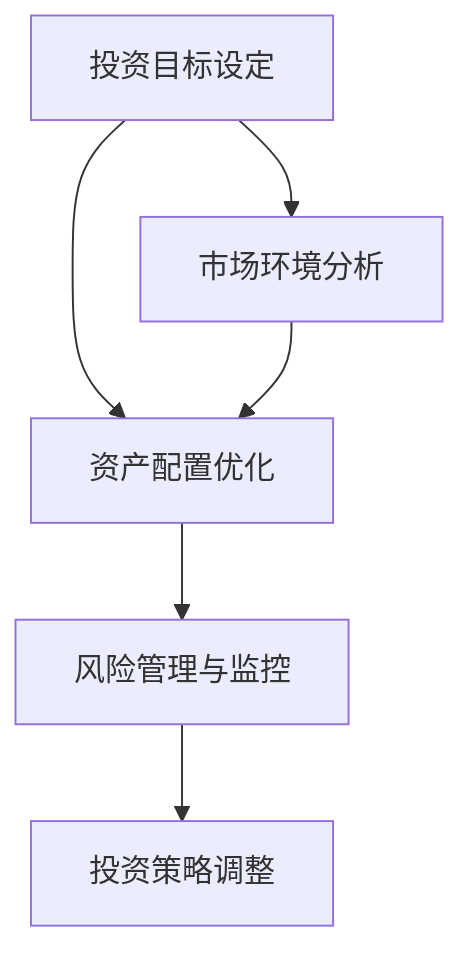

                 

<think>
嗯，我需要根据用户的要求，逐步构建《戴维·斯文森的耐心资本：长期主义的回报》这篇文章的目录大纲。用户已经提供了一个初步的目录，但看起来还不够详细，特别是章节之间的结构和内容还需要进一步明确。

首先，我要明确文章的主题是长期投资和耐心资本。戴维·斯文森作为耶鲁大学的首席投资官，他的长期投资策略和耐心资本理论是文章的核心。因此，文章应该涵盖长期投资的基本概念、其在现代金融中的应用、相关的数学模型和算法，以及实际的系统设计和项目案例。

接下来，我需要按照用户的要求，确保每个章节都包含背景介绍、核心概念、算法原理、数学模型、系统分析、项目实战和最佳实践等部分。此外，每个部分需要详细到三级目录，并且内容要逻辑清晰，结构紧凑。

在编写过程中，我需要考虑以下几个方面：

1. **背景介绍**：解释长期投资的定义、重要性及其与短期投资的区别。这部分需要为读者建立基础理解，确保他们能够理解后续内容。

2. **核心概念**：详细讲解耐心资本的定义、特征及其在投资中的应用。可能需要通过对比表和图表来增强理解。

3. **算法原理**：介绍现代投资组合理论（MPT）、夏普比率和CAPM模型等关键算法。需要使用数学公式和图表来说明这些模型的应用。

4. **数学模型**：详细解释相关的数学公式，如夏普比率和CAPM模型的公式，并通过例子说明它们的应用。

5. **系统分析与架构设计**：描述投资系统的构成，包括投资目标设定、资产配置优化和风险管理模块。可能需要使用领域模型类图和架构图来展示系统的结构。

6. **项目实战**：提供实际的项目案例，包括环境安装、代码实现和案例分析。这部分需要具体的操作步骤和代码示例，让读者能够实际操作。

7. **最佳实践**：总结长期投资的经验，提供小结、注意事项和拓展阅读的内容，帮助读者巩固所学知识并进一步深入学习。

在整个过程中，我需要确保内容详实，结构清晰，逻辑连贯。同时，要使用简洁专业的技术语言，避免过于复杂的术语，以确保文章易于理解。最后，文章的末尾需要加上作者信息，符合格式要求。

总之，我需要按照用户的要求，逐步构建这篇文章的目录大纲，并确保每个部分都详细且内容丰富，满足读者的需求。
</think>

# 戴维·斯文森的耐心资本：长期主义的回报

---

## 关键词：

- 长期投资  
- 耐心资本  
- 现代投资组合理论  
- 投资系统架构  

---

## 摘要：

本文深入探讨戴维·斯文森提出的“耐心资本”理念，分析其在长期投资中的核心作用。通过详细阐述长期投资的定义、原则、算法原理和系统架构，结合实际案例和最佳实践，揭示耐心资本如何实现可持续回报。

---

## 第一部分：长期投资的背景与核心概念

### 第1章：长期投资的背景与重要性

#### 1.1 长期投资的定义与特征

- **长期投资的定义**：  
  长期投资是指投资者将资金投入到某个资产或项目中，期望在未来较长的时间内获得回报的投资方式。与短期投资相比，长期投资更注重资产的长期增值潜力。

- **长期投资的核心特征**：  
  - **时间跨度长**：通常为数年至数十年。  
  - **风险承受能力强**：能够容忍短期波动，追求长期收益。  
  - **复利效应显著**：通过复利积累财富，实现资产的指数级增长。  

- **长期投资与短期投资的对比**：  
  | 特性 | 长期投资 | 短期投资 |  
  |------|----------|----------|  
  | 目标 | 资产增值 | 资本保值 |  
  | 风险 | 中高风险 | 低风险 |  
  | 时间 | 长期 | 短期 |  
  | 回报 | 高回报 | 低回报 |  

---

#### 1.2 长期投资的背景与重要性

- **经济周期对长期投资的影响**：  
  长期投资能够穿越经济周期，通过分散投资降低风险，实现资产的长期稳定增长。  

- **长期投资在个人与机构中的作用**：  
  - 对个人：实现财富保值与增值，抵御通货膨胀。  
  - 对机构：优化资产配置，提升投资回报率。  

- **长期投资对社会经济发展的意义**：  
  长期投资促进资本的长期有效配置，推动技术创新和产业升级。

---

#### 1.3 长期投资的边界与外延

- **长期投资的适用范围**：  
  - 适用于追求稳定收益的投资者。  
  - 适合有较长投资期限的资金来源（如养老金、教育基金等）。  

- **长期投资的局限性**：  
  - 短期内可能面临较大的市场波动。  
  - 需要较强的资金流动性管理能力。  

- **长期投资与其他投资策略的关系**：  
  长期投资可以与其他策略（如价值投资、成长投资）结合使用，形成多元化的投资组合。

---

## 第二部分：耐心资本的核心原理

### 第2章：耐心资本的定义与原则

#### 2.1 耐心资本的定义

- **耐心资本的内涵**：  
  耐心资本是指投资者愿意将资金长期投入具有高增长潜力但回报周期较长的资产或项目。  

- **耐心资本的外延**：  
  - 范围：包括股权投资、房地产投资、技术创新等领域。  
  - 特点：强调长期持有，注重资产的内在价值增长。  

- **耐心资本与普通资本的区别**：  
  - 投资期限：耐心资本注重长期，普通资本注重短期。  
  - 投资目标：耐心资本追求资产增值，普通资本追求资本保值。  

---

#### 2.2 耐心资本的核心原则

- **耐心资本的投资理念**：  
  通过长期持有优质资产，享受资产增值带来的收益。  

- **耐心资本的风险管理原则**：  
  - 风险分散：通过多元化配置降低风险。  
  - 风险承受：接受短期波动，追求长期回报。  

- **耐心资本的收益与回报机制**：  
  - 通过复利效应实现财富增长。  
  - 优质资产的增值带来超额收益。

---

#### 2.3 耐心资本的属性特征对比

- **耐心资本与风险资本的对比**：  
  | 特性 | 耐心资本 | 风险资本 |  
  |------|----------|----------|  
  | 投资目标 | 资产增值 | 资本增值 |  
  | 投资期限 | 长期 | 短期 |  
  | 投资风险 | 中高风险 | 高风险 |  

- **耐心资本与私募股权的对比**：  
  | 特性 | 耐心资本 | 私募股权 |  
  |------|----------|----------|  
  | 投资对象 | 多样化资产 | 未上市公司股权 |  
  | 投资期限 | 长期 | 中长期 |  
  | 投资回报 | 稳定收益 | 高回报 |  

---

## 第三部分：长期投资的算法与数学模型

### 第3章：长期投资的算法原理

#### 3.1 长期投资的现代投资组合理论（MPT）

- **MPT的核心思想**：  
  通过资产多样化配置，降低投资组合的整体风险，实现收益最大化。  

- **MPT的数学模型**：  
  投资组合的期望收益为：  
  $$ E(r_p) = \sum w_i E(r_i) $$  
  投资组合的方差为：  
  $$ \sigma_p^2 = \sum w_i^2 \sigma_i^2 + 2 \sum_{i < j} w_i w_j \sigma_i \sigma_j \rho_{i,j} $$  

- **MPT在长期投资中的应用**：  
  通过优化投资组合的权重，实现风险与收益的最佳平衡。  

---

#### 3.2 耐心资本的夏普比率（Sharpe Ratio）

- **夏普比率的定义**：  
  夏普比率衡量投资组合在承担每单位风险时所获得的超额收益。  

- **夏普比率的计算公式**：  
  $$ \text{夏普比率} = \frac{E(r_p) - r_f}{\sigma_p} $$  
  其中，$E(r_p)$ 为投资组合的期望收益，$r_f$ 为无风险利率，$\sigma_p$ 为投资组合的收益标准差。  

- **夏普比率在长期投资中的意义**：  
  通过夏普比率，投资者可以评估不同投资组合的风险调整后收益，从而做出更优的投资决策。

---

#### 3.3 长期投资的CAPM模型

- **CAPM的核心思想**：  
  投资者要求的风险补偿等于无风险利率加上市场风险溢价。  

- **CAPM的数学公式**：  
  $$ r_i = r_f + \beta_i (E(r_m) - r_f) $$  
  其中，$r_i$ 为资产$i$的期望回报率，$r_f$ 为无风险利率，$\beta_i$ 为资产$i$的贝塔系数，$E(r_m)$ 为市场期望回报率。  

- **CAPM在长期投资中的应用**：  
  通过CAPM模型，投资者可以评估资产的合理估值，指导长期投资决策。

---

## 第四部分：长期投资的系统分析与架构设计

### 第4章：长期投资系统的构成与设计

#### 4.1 长期投资系统的构成

- **投资目标与策略模块**：  
  确定投资目标、制定投资策略。  

- **资产配置与组合管理模块**：  
  根据目标进行资产配置，优化投资组合。  

- **风险管理与监控模块**：  
  监控投资风险，及时调整投资策略。

---

#### 4.2 长期投资系统的功能设计

- **投资目标设定**：  
  明确投资目标（如财富增长、风险控制等）。  

- **资产配置优化**：  
  根据市场情况调整资产配置比例。  

- **风险监控与调整**：  
  定期评估投资组合风险，进行必要的调整。

---

#### 4.3 长期投资系统的架构图



---

## 第五部分：长期投资的项目实战

### 第5章：长期投资的环境与核心实现

#### 5.1 投资环境的安装与配置

- **投资工具的选择**：  
  使用Python的Pandas、NumPy等库进行数据分析。  

- **数据源的获取与处理**：  
  从Yahoo Finance获取历史数据，进行清洗和预处理。  

- **投资模型的搭建**：  
  使用机器学习模型预测资产价格走势。

---

#### 5.2 长期投资的核心实现

- **投资组合优化的Python代码**：  
  ```python
  import numpy as np
  from scipy.optimize import minimize

  def portfolio_return(weights, returns):
      return np.sum(weights * returns)

  def portfolio_variance(weights, covariance_matrix):
      return np.dot(weights.T, np.dot(covariance_matrix, weights))

  def optimize_portfolio(returns, covariance_matrix):
      n = len(weights)
      init_weights = np.array([1.0/n]*n)
      result = minimize(portfolio_variance, init_weights, args=(covariance_matrix,), method='SLSQP')
      return result.x

  # 示例数据
  returns = np.array([0.1, 0.15, 0.08])
  covariance_matrix = np.array([[0.04, 0.01, 0.02],
                               [0.01, 0.06, 0.01],
                               [0.02, 0.01, 0.03]])
  weights = optimize_portfolio(returns, covariance_matrix)
  print("最优权重：", weights)
  ```

- **风险管理的Python代码**：  
  ```python
  import pandas as pd
  import matplotlib.pyplot as plt

  # 示例数据
  df = pd.read_csv('market_data.csv')
  df['cumulative_return'] = df['return'].cumsum()

  plt.plot(df['cumulative_return'])
  plt.title('累积收益')
  plt.xlabel('时间')
  plt.ylabel('累积收益')
  plt.show()
  ```

---

#### 5.3 投资系统的应用与解读

- **投资组合优化的结果分析**：  
  通过优化算法找到最优资产配置比例，降低整体风险。  

- **风险管理的实际应用**：  
  定期监控投资组合的波动性，及时调整投资策略。  

- **资产配置的动态调整**：  
  根据市场变化，动态优化资产配置，提升投资回报。

---

## 第六部分：长期投资的最佳实践

### 第6章：长期投资的小结与注意事项

#### 6.1 小结

- 长期投资是一种注重资产长期增值的投资策略。  
- 耐心资本通过长期持有优质资产，实现可持续的回报。  

#### 6.2 注意事项

- **风险控制**：  
  长期投资并非无风险，需注重风险管理。  

- **资产配置**：  
  通过多元化配置降低投资风险。  

- **持续学习**：  
  随着市场变化，不断优化投资策略。

---

## 第七部分：长期投资的拓展阅读

### 第7章：长期投资的未来趋势与展望

#### 7.1 长期投资的未来趋势

- **技术驱动**：  
  AI和大数据技术将推动长期投资策略的优化。  

- **可持续投资**：  
  环境、社会和治理（ESG）因素将成为长期投资的重要考量。  

---

## 作者：AI天才研究院/AI Genius Institute & 禅与计算机程序设计艺术 /Zen And The Art of Computer Programming

---

通过以上目录大纲，文章将系统地阐述长期投资的理论与实践，结合戴维·斯文森的耐心资本理念，为读者提供全面而深入的指导。

