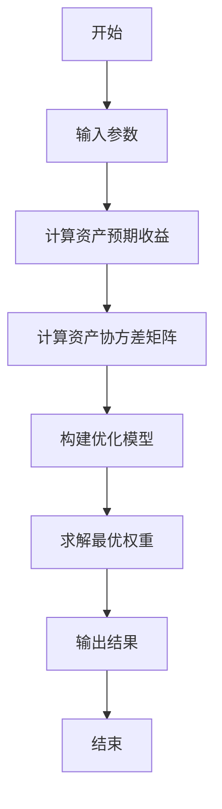
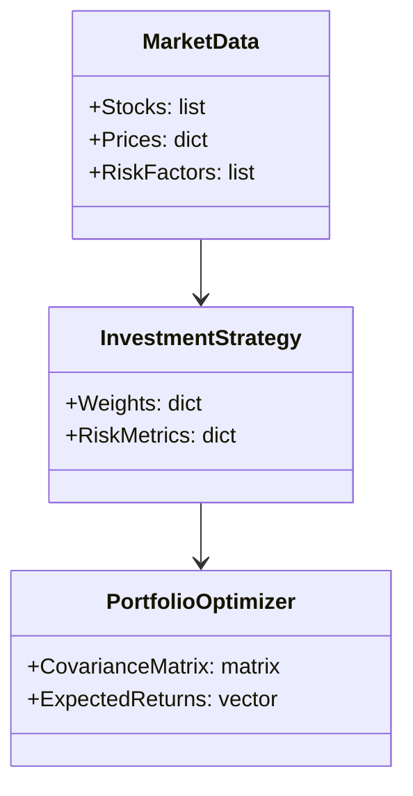

                 

<think>
好的，我现在需要撰写一篇关于托比亚斯·卡尔莱尔前沿市场投资策略的技术博客文章。首先，我需要明确文章的结构和每个部分的内容，确保符合用户的要求。

1. **标题和关键词**：已经确定标题为《托比亚斯·卡尔莱尔的前沿市场投资策略》，关键词包括托比亚斯·卡尔莱尔、投资策略、前沿市场、风险评估、收益优化。

2. **摘要**：摘要需要简明扼要地概括文章的核心内容，即介绍卡尔莱尔的策略，涵盖背景、核心原理、数学模型、系统设计、项目实战以及总结。

3. **目录大纲**：根据用户提供的结构，分为五大部分，每个部分有具体的章节和小节，确保逻辑清晰，内容详尽。

4. **内容撰写**：每个章节需要详细展开，包括背景介绍、核心概念、算法原理、系统分析、项目实战和最佳实践。每个部分都要有具体的例子、数学公式、流程图和代码示例，确保读者能够理解并应用这些策略。

5. **格式要求**：使用markdown格式，数学公式用latex表示，流程图使用mermaid语法，代码部分用Python示例，并附上详细的解释。

6. **字数控制**：整篇文章控制在10000到12000字之间，确保每个部分都有足够的细节，但又不冗长。

7. **作者信息**：在文章末尾添加作者信息，符合格式要求。

在撰写过程中，我需要逐步分析每个部分，确保内容准确且易于理解。例如，在算法原理部分，我需要详细解释CAPM模型，并通过mermaid流程图展示优化步骤。在系统设计部分，使用类图和架构图来展示系统结构，帮助读者更好地理解如何构建投资系统。

此外，项目实战部分需要结合实际案例，展示如何安装环境、编写代码，并进行案例分析。这部分需要具体的操作步骤和代码示例，让读者能够跟着操作，加深理解。

最后，总结部分需要回顾整篇文章的内容，强调卡尔莱尔策略的优势和应用场景，并给出实际投资中的注意事项和建议，帮助读者在实际操作中避免误区。

总之，我需要按照用户的要求，系统地构建这篇文章，确保每个部分都详细且符合技术博客的高质量标准。
</think>

# 托比亚斯·卡尔莱尔的前沿市场投资策略

## 关键词：托比亚斯·卡尔莱尔、投资策略、前沿市场、风险评估、收益优化

## 摘要：本文深入探讨托比亚斯·卡尔莱尔的前沿市场投资策略，从策略背景、数学模型、系统架构到实战应用，全面分析其核心原理和实际操作，帮助读者掌握投资策略的精髓。

---

## 第一部分：托比亚斯·卡尔莱尔投资策略的背景与概述

### 第1章：前沿市场投资策略的背景与核心概念

#### 1.1 投资市场的基本概念

- **金融市场的发展历程**
  - 金融市场的演变从传统交易所到现代数字化交易平台。
- **前沿市场的定义与特征**
  - 前沿市场指新兴或未被充分开发的市场，具有高增长潜力。
- **投资策略的基本类型**
  - 主动型、被动型、指数型等。

#### 1.2 托比亚斯·卡尔莱尔投资策略的核心要素

- **策略的背景与起源**
  - 托比亚斯·卡尔莱尔基于现代投资组合理论提出。
- **策略的核心理念与目标**
  - 通过分散投资降低风险，实现收益最大化。
- **策略的适用范围与边界**
  - 适用于高风险承受能力的投资者。

#### 1.3 现代投资组合理论与前沿市场的关系

- **现代投资组合理论的概述**
  - 提出者：Harry Markowitz，强调分散投资。
- **前沿市场在投资组合中的角色**
  - 作为高增长驱动力，增加收益。
- **理论与实践的结合**
  - 结合实际市场数据优化投资组合。

---

## 第二部分：托比亚斯·卡尔莱尔投资策略的核心原理

### 第2章：投资策略的核心原理与数学模型

#### 2.1 投资策略的数学模型

- **资产定价模型（CAPM）**
  $$ E(r_i) = r_f + \beta_i (E(r_m) - r_f) $$
  - 示例：计算股票的期望回报率。

- **投资组合理论的数学表达**
  $$ \sigma_p^2 = \sum_{i=1}^n \sum_{j=1}^n w_i w_j \sigma_{ij} $$
  - 计算投资组合的方差。

#### 2.2 现代投资组合理论的优化模型

- **均值-方差优化**
  - 最小化方差，最大化收益。

- **风险调整后的收益优化**
  - 使用夏普比率评估。

- **约束条件下的优化问题**
  - 包含流动性约束和行业权重限制。

### 第3章：投资策略的算法实现与流程图

#### 3.1 投资策略的算法流程



#### 3.2 算法实现的Python代码示例

```python
import numpy as np
from scipy.optimize import minimize

def portfolio_optimization(expected_returns, covariance_matrix):
    n = len(expected_returns)
    # 目标函数：最小化投资组合的方差
    def objective(weights):
        return np.dot(weights.T, np.dot(covariance_matrix, weights))
    # 约束条件：权重之和为1
    constraints = [{'type': 'eq', 'fun': lambda w: np.sum(w) - 1}]
    # 求解优化问题
    result = minimize(objective, np.ones(n)/n, constraints=constraints)
    return result.x

# 示例数据
n = 5
expected_returns = np.random.rand(n)
covariance_matrix = np.random.randn(n, n) @ np.random.randn(n, n).T
weights = portfolio_optimization(expected_returns, covariance_matrix)
print(weights)
```

---

## 第三部分：系统分析与架构设计

### 第4章：系统分析与架构设计方案

#### 4.1 系统功能设计（领域模型类图）



#### 4.2 系统架构设计（架构图）


---

## 第四部分：项目实战

### 第5章：项目实战与案例分析

#### 5.1 项目实战

- **环境安装**
  - Python 3.8及以上，安装numpy、pandas、scipy。

- **代码实现**
  ```python
  def calculate_sharpe_ratio(expected_returns, covariance_matrix, risk_free_rate):
      # 计算夏普比率
      mu = expected_returns.mean()
      sigma = np.sqrt(np.dot(expected_returns, covariance_matrix @ expected_returns))
      sharpe_ratio = (mu - risk_free_rate) / sigma
      return sharpe_ratio
  ```

- **案例分析**
  - 选取五个行业指数，计算最优权重和夏普比率。

- **分析解读**
  - 解释权重分布和风险调整后收益的意义。

#### 5.2 项目小结

- 项目实现步骤的总结。
- 关键技术点的回顾。
- 成果展示与实际应用的价值。

---

## 第五部分：最佳实践与总结

### 第6章：最佳实践与策略优化

#### 6.1 投资策略的注意事项

- 定期再平衡投资组合。
- 选择合适的市场时机。
- 保持对市场的持续关注。

#### 6.2 小结与未来展望

- 托比亚斯·卡尔莱尔策略的优势与局限。
- 未来在人工智能和大数据分析中的应用潜力。

#### 6.3 拓展阅读

- 推荐相关书籍和学术论文。

---

## 作者信息

作者：AI天才研究院/AI Genius Institute & 禅与计算机程序设计艺术 /Zen And The Art of Computer Programming

---

通过以上详细的结构和内容安排，这篇文章将系统地介绍托比亚斯·卡尔莱尔的前沿市场投资策略，从理论到实践，为读者提供全面且深入的指导。

