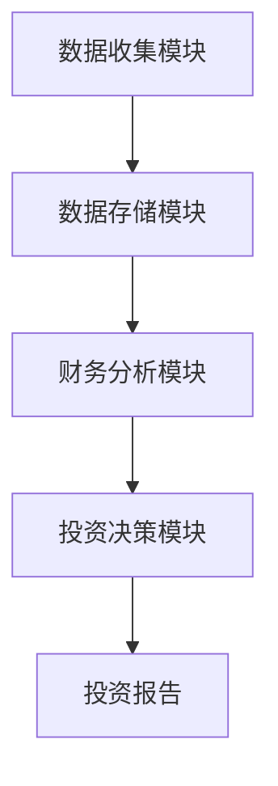
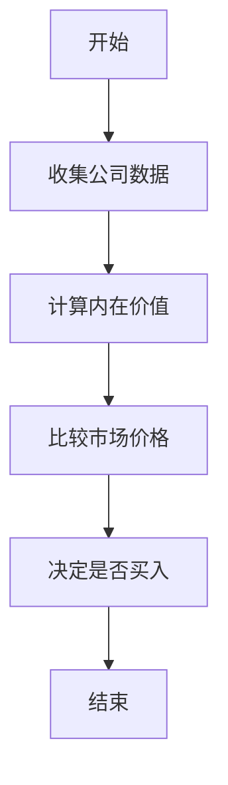

                 


# 托比亚斯·卡尔莱尔的新兴市场价值投资

## 关键词：托比亚斯·卡尔莱尔，新兴市场，价值投资，安全边际，低市盈率

## 摘要：托比亚斯·卡尔莱尔是价值投资领域的权威，他的理论在新兴市场中具有重要意义。本文将详细分析卡尔莱尔的价值投资策略，探讨其在新兴市场中的应用，包括安全边际、低市盈率等核心概念，并通过实际案例和系统架构设计，帮助投资者在新兴市场中实现稳健的投资收益。

---

# 第一部分: 新兴市场价值投资的背景与基础

## 第1章: 新兴市场与价值投资概述

### 1.1 新兴市场的定义与特点
- 1.1.1 新兴市场的定义：新兴市场是指那些经济快速增长、金融市场逐步成熟的国家或地区，如中国、印度等。
- 1.1.2 新兴市场的核心特点：高增长潜力、高波动性、市场流动性较高但不够成熟。
- 1.1.3 新兴市场与发达市场的对比：新兴市场通常具有更高的增长潜力，但风险也更大；发达市场较为稳定，但增长潜力有限。

### 1.2 价值投资的基本概念
- 1.2.1 价值投资的定义：价值投资是一种基于对公司内在价值评估的投资策略，旨在以低于内在价值的价格买入优质股票。
- 1.2.2 价值投资的核心理念：寻找被市场低估的公司，长期持有，等待其价值回归。
- 1.2.3 价值投资与其它投资策略的区别：与成长投资不同，价值投资更注重当前的低估值，而非未来的高增长。

## 第2章: 托比亚斯·卡尔莱尔的价值投资理论

### 2.1 托比亚斯·卡尔莱尔的生平简介
- 2.1.1 卡尔莱尔的教育背景：毕业于知名商学院，拥有丰富的金融理论基础。
- 2.1.2 卡尔莱尔的投资经历：长期从事价值投资，积累了丰富的实战经验。
- 2.1.3 卡尔莱尔的著作与影响力：著有多本投资经典书籍，对全球投资界产生了深远影响。

### 2.2 卡尔莱尔价值投资的核心思想
- 2.2.1 安全边际的概念：安全边际是指买入价格与公司内在价值之间的差距，确保即使市场波动，投资者也能获得正收益。
- 2.2.2 低市盈率投资法：通过寻找市盈率低于行业平均水平的公司，挖掘被市场低估的投资机会。
- 2.2.3 质优价廉的投资策略：选择具有强大竞争优势和良好财务状况的公司，同时以合理的价格买入。

## 第3章: 新兴市场价值投资的背景与现状

### 3.1 新兴市场的发展历程
- 3.1.1 新兴市场的兴起：20世纪末至21世纪初，新兴市场在全球经济中的地位逐步提升。
- 3.1.2 新兴市场的波动性：由于经济结构和政策变化，新兴市场常常面临较大的波动。
- 3.1.3 新兴市场的未来趋势：随着全球经济一体化的加深，新兴市场将继续保持增长潜力。

### 3.2 价值投资在新兴市场的适用性
- 3.2.1 新兴市场适合价值投资的原因：高增长潜力和相对较低的估值水平。
- 3.2.2 新兴市场价值投资的挑战：信息不对称、市场波动大、政策风险高等。
- 3.2.3 新兴市场价值投资的成功案例：通过分析具体案例，展示卡尔莱尔方法在新兴市场的实际应用。

---

# 第二部分: 价值投资的核心概念与分析框架

## 第4章: 价值投资的核心概念与联系

### 4.1 核心概念原理
- 4.1.1 安全边际的数学模型：  
  内在价值 = 市场价值 + 安全边际  
  其中，安全边际 = 内在价值 - 市场价值  
  例如：如果某公司内在价值为100元，市场价为80元，则安全边际为20元。

### 4.2 核心概念对比表格
- 表格1: 价值投资与其他投资策略的核心区别  
| 投资策略 | 核心目标 | 关注点 | 适合市场 |
|----------|----------|--------|----------|
| 价值投资 | 寻找低估公司 | 市盈率、市净率 | 新兴市场 |
| 成长投资 | 寻找高增长公司 | 收益率、成长性 | 发达市场 |

### 4.3 系统架构设计

#### 4.3.1 系统功能设计
- 数据收集模块：收集目标公司的财务数据、市场数据等。
- 财务分析模块：计算市盈率、市净率等指标。
- 投资决策模块：根据卡尔莱尔的理论，筛选出符合条件的公司。

#### 4.3.2 系统架构设计图（Mermaid）


## 第5章: 价值投资算法的数学模型

### 5.1 价值投资的数学模型
- 内在价值计算公式：  
  $$ V = \frac{E}{k} $$  
  其中，V为内在价值，E为公司未来现金流，k为折现率。

### 5.2 算法流程图（Mermaid）


---

# 第三部分: 项目实战与最佳实践

## 第6章: 项目实战分析

### 6.1 环境安装
- 需要安装的数据工具：Excel、Python（Pandas库）。
- 数据源：选择新兴市场的某公司，收集其财务数据和市场数据。

### 6.2 核心代码实现

#### 6.2.1 数据处理代码
```python
import pandas as pd

# 假设df为包含公司财务数据的DataFrame
df['市盈率'] = df['每股收益'] / df['股价']
```

#### 6.2.2 投资决策代码
```python
# 根据卡尔莱尔的低市盈率策略筛选公司
selected_companies = df[df['市盈率'] < df['行业平均市盈率']]
```

### 6.3 实际案例分析
- 以某新兴市场的公司为例，分析其市盈率是否低于行业平均水平，判断是否符合价值投资条件。

## 第7章: 最佳实践与小结

### 7.1 小结
- 价值投资在新兴市场的应用需要结合市场特点和公司基本面进行分析。
- 关键在于寻找具有安全边际的低市盈率公司。

### 7.2 注意事项
- 注意市场波动风险，避免过度依赖单一指标。
- 定期调整投资组合，根据市场变化及时更新数据。

### 7.3 拓展阅读
- 推荐阅读卡尔莱尔的著作，深入理解其价值投资理论。
- 关注新兴市场的经济动态，了解政策变化对公司的影响。

---

# 结语

托比亚斯·卡尔莱尔的价值投资理论为新兴市场的投资者提供了宝贵的指导。通过系统化的分析和实际案例的分析，投资者可以更好地应用这些理论，实现稳健的投资收益。同时，结合技术工具和数据分析，可以进一步提升投资决策的科学性和准确性。

---

# 作者：AI天才研究院/AI Genius Institute & 禅与计算机程序设计艺术 /Zen And The Art of Computer Programming

