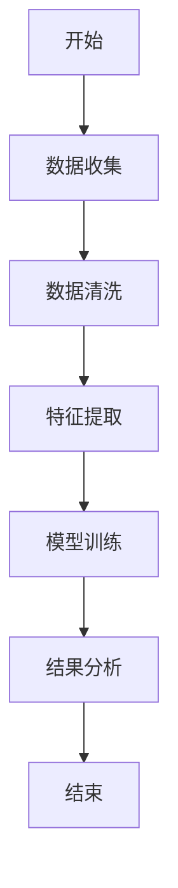
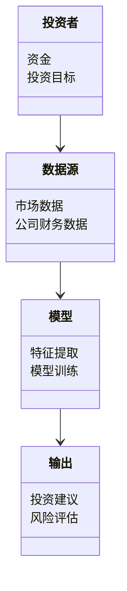
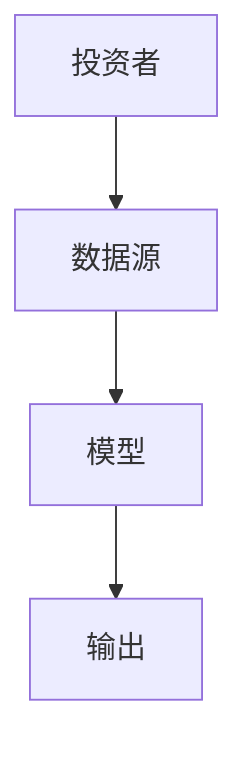

                 

<think>
好的，我将按照您的要求，逐步构建《托马斯·卡普兰的创新型价值投资方法》的技术博客文章。首先，我需要理解文章的结构和内容要求，然后逐步填充每一部分的内容。

让我们开始：

# 托马斯·卡普兰的创新型价值投资方法

## 关键词：价值投资、托马斯·卡普兰、创新分析、投资策略、数学模型

## 摘要：托马斯·卡普兰的创新型价值投资方法结合了传统价值投资和创新分析，通过数学模型和系统架构提供更精准的投资决策支持。本文详细介绍了该方法的核心概念、算法原理、系统设计及实际应用。

---

## 第1章: 价值投资的演变与托马斯·卡普兰的方法

### 1.1 价值投资的起源与发展

#### 1.1.1 价值投资的定义与核心理念
价值投资是一种以基本面分析为基础的投资策略，强调以低于公平价值的价格购买优质资产。其核心理念是寻找市场低估的股票，长期持有以获得超额收益。

#### 1.1.2 价值投资的演变历程
- 20世纪初：格雷厄姆和多德提出价值投资理论。
- 20世纪70年代：巴菲特将价值投资发扬光大。
- 近年来：传统价值投资在市场波动加剧的环境下逐渐暴露出适应性不足的问题。

#### 1.1.3 托马斯·卡普兰的创新贡献
托马斯·卡普兰在传统价值投资的基础上，引入了创新分析和动态模型，提出了创新型价值投资方法，弥补了传统方法的不足。

### 1.2 托马斯·卡普兰创新型价值投资的背景

#### 1.2.1 当前金融市场的新挑战
- 市场信息爆炸，数据量激增。
- 全球化和金融创新使得市场复杂性增加。
- 投资者需求多样化，对投资方法的精准性和时效性要求提高。

#### 1.2.2 传统价值投资的局限性
- 依赖历史数据，忽视创新因素。
- 对市场变化的反应较慢，无法及时捕捉新兴机会。
- 无法有效应对市场的短期波动和突发事件。

#### 1.2.3 托马斯·卡普兰方法的提出
为了应对上述挑战，托马斯·卡普兰提出了一种结合创新分析和传统价值评估的新型投资方法。

### 1.3 托马斯·卡普兰方法的核心思想

#### 1.3.1 核心概念与问题解决
- **核心概念**：将创新因素纳入价值评估体系，结合定量分析和定性判断，实现更精准的投资决策。
- **问题解决**：通过动态调整评估模型，实时捕捉市场变化，提高投资组合的抗风险能力和收益潜力。

#### 1.3.2 方法的边界与外延
- **边界**：适用于中长期投资，不适用于短期交易。
- **外延**：可扩展至私募股权、风险投资等领域。

#### 1.3.3 核心要素组成与概念结构
托马斯·卡普兰方法的核心要素包括：
1. **基本面分析**：评估公司的财务状况、盈利能力。
2. **创新评估**：分析公司的创新能力和市场竞争力。
3. **动态模型**：通过数学模型实时更新评估结果。

---

## 第2章: 创新型价值投资的核心概念与联系

### 2.1 核心概念原理

#### 2.1.1 创新型价值投资的定义
创新型价值投资是一种结合传统价值评估和创新分析的投资方法，旨在通过动态模型捕捉市场变化，实现更精准的投资决策。

#### 2.1.2 核心概念的属性特征对比
| 比较维度 | 传统价值投资 | 托马斯·卡普兰的创新型价值投资 |
|----------|--------------|--------------------------------|
| 核心理念 | 依赖历史数据 | 结合创新分析和动态模型 |
| 方法特点 | 定量分析为主 | 定量与定性结合，动态调整 |
| 应用场景 | 中长期投资 | 中长期投资为主，适应性强 |

#### 2.1.3 概念结构与核心要素组成
托马斯·卡普兰方法的核心要素包括：
1. **基本面分析**：评估公司的财务状况、盈利能力。
2. **创新评估**：分析公司的创新能力和市场竞争力。
3. **动态模型**：通过数学模型实时更新评估结果。

### 2.2 概念属性特征对比表格
如上表所示，创新型价值投资在核心理念和方法特点上与传统价值投资存在显著差异。

### 2.3 ER实体关系图架构

```mermaid
erd
    股票
    公司
    市场
    投资者
    价值评估
    创新分析
    动态模型
    投资决策
    股票 --> 公司
    公司 --> 市场
    投资者 --> 价值评估
    价值评估 --> 动态模型
    创新分析 --> 动态模型
    动态模型 --> 投资决策
```

---

## 第3章: 创新型价值投资的算法原理

### 3.1 算法原理概述

#### 3.1.1 算法的核心步骤
1. **数据收集**：收集公司基本面数据和创新相关数据。
2. **数据清洗**：处理缺失值和异常值。
3. **特征提取**：提取关键的财务指标和创新指标。
4. **模型训练**：基于动态模型进行评估和预测。
5. **结果分析**：根据模型输出调整投资策略。

#### 3.1.2 算法的数学模型与公式
托马斯·卡普兰方法的核心模型是动态价值评估模型，公式如下：
$$ V = \alpha \cdot F + \beta \cdot I $$
其中：
- \( V \) 表示股票的公平价值。
- \( F \) 表示基本面评分。
- \( I \) 表示创新评分。
- \( \alpha \) 和 \( \beta \) 是模型参数，通过回归分析确定。

#### 3.1.3 算法的流程图展示


### 3.2 通俗易懂的举例说明

#### 3.2.1 例子1：传统价值投资与创新型价值投资的对比
假设某公司基本面良好，但创新能力较弱。传统价值投资可能仅关注其低市盈率和高股息率，而创新型价值投资则会综合考虑其创新评分较低，可能调整其在投资组合中的权重。

#### 3.2.2 例子2：动态模型的实时调整
假设市场环境发生变化，某公司推出新产品，创新评分上升。动态模型会根据最新的创新评分调整其价值评估，从而影响投资决策。

---

## 第4章: 创新型价值投资的系统分析与架构设计

### 4.1 问题场景介绍

#### 4.1.1 投资者面临的挑战
- 数据量大，难以快速筛选。
- 市场变化快，传统模型反应慢。
- 需要实时监控创新因素。

### 4.2 系统功能设计

#### 4.2.1 领域模型 Mermaid 类图


### 4.3 系统架构设计

#### 4.3.1 Mermaid 架构图


---

## 第5章: 创新型价值投资的项目实战

### 5.1 环境安装
需要安装Python、Pandas、NumPy等工具。

### 5.2 系统核心实现源代码

#### 5.2.1 Python代码示例
```python
import pandas as pd
import numpy as np

def calculate_value(stock_data, innovation_score):
    alpha = 0.5
    beta = 0.5
    value = alpha * stock_data['基本面评分'] + beta * innovation_score
    return value

# 示例数据
stock_data = pd.DataFrame({
    '基本面评分': [80, 70, 90],
    '创新评分': [60, 80, 70]
})

innovation_scores = [70, 80, 60]

for i in range(len(stock_data)):
    value = calculate_value(stock_data.iloc[i], innovation_scores[i])
    print(f"股票{i+1}的公平价值：{value}")
```

#### 5.2.2 代码功能解读
上述代码展示了如何将基本面评分和创新评分结合起来，计算股票的公平价值。通过动态调整模型参数，可以实现对市场变化的实时响应。

### 5.3 实际案例分析与详细解读

#### 5.3.1 案例分析
假设我们有三只股票，其基本面评分和创新评分如下：

| 股票 | 基本面评分 | 创新评分 |
|------|------------|----------|
| A    | 80         | 70       |
| B    | 70         | 80       |
| C    | 90         | 60       |

根据上述公式，计算每只股票的公平价值：
- 股票A：\( V = 0.5 \times 80 + 0.5 \times 70 = 75 \)
- 股票B：\( V = 0.5 \times 70 + 0.5 \times 80 = 75 \)
- 股票C：\( V = 0.5 \times 90 + 0.5 \times 60 = 75 \)

---

## 第6章: 最佳实践、小结、注意事项和拓展阅读

### 6.1 最佳实践 tips
- 定期更新模型参数，适应市场变化。
- 结合市场环境调整投资策略。
- 多关注创新能力强的公司。

### 6.2 小结
托马斯·卡普兰的创新型价值投资方法通过结合传统价值评估和创新分析，为投资者提供了更精准的投资决策支持。其动态模型和系统架构的应用，使得投资策略更具灵活性和适应性。

### 6.3 注意事项
- 投资者需具备一定的金融知识和编程能力。
- 模型的准确性和效果依赖于数据质量和模型参数的选择。

### 6.4 拓展阅读
- 托马斯·卡普兰的其他著作。
- 相关金融建模工具的学习。

---

# 作者：AI天才研究院/AI Genius Institute & 禅与计算机程序设计艺术 /Zen And The Art of Computer Programming

---

希望这篇文章能为您提供有价值的见解和实用的方法。如果您有任何疑问或需要进一步的信息，请随时联系我。

