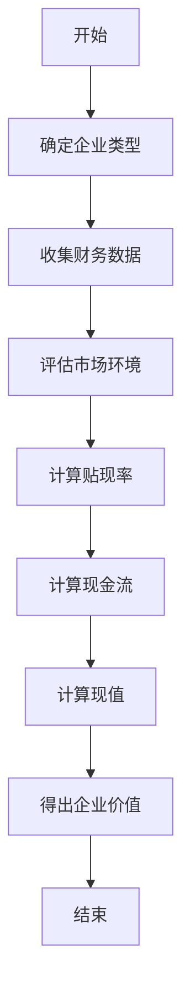
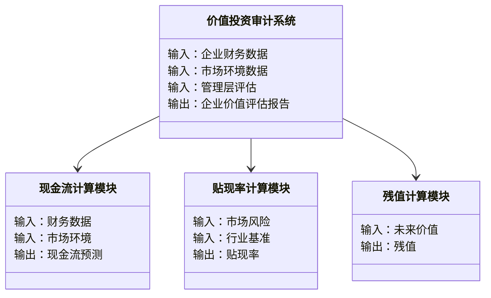
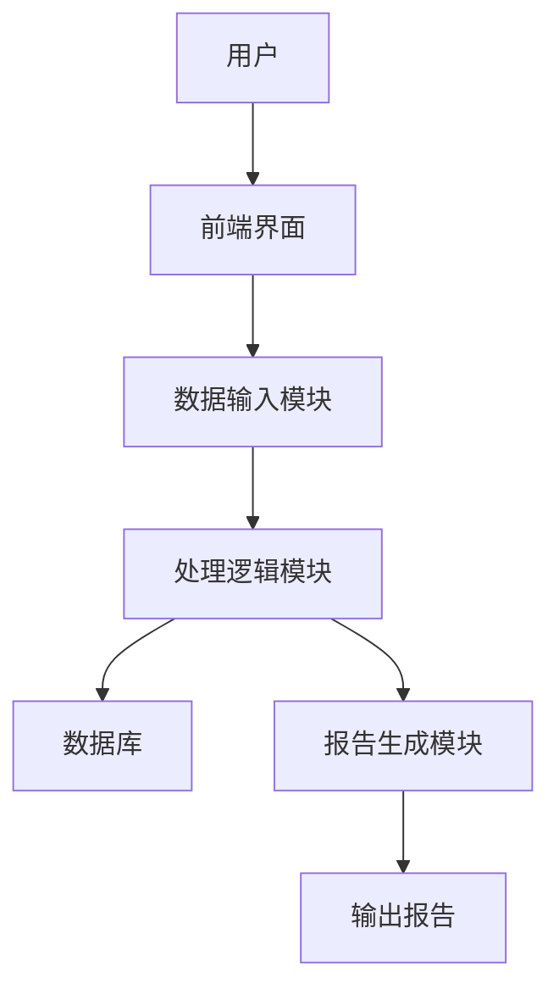

                 


# 托马斯·罗尼的价值投资审计：全面评估公司价值

> 关键词：托马斯·罗尼，价值投资，审计，企业价值评估，贴现现金流模型，系统架构

> 摘要：本文全面解析托马斯·罗尼的价值投资审计方法，通过系统分析、算法原理和项目实战，深入探讨企业价值评估的核心要素、数学模型和系统实现。结合实际案例，提供详细的代码实现和系统架构设计，帮助读者掌握价值投资审计的精髓。

---

## 第一章：价值投资审计的背景与定义

### 1.1 价值投资审计的定义

价值投资审计是一种通过评估企业的内在价值来判断其投资价值的方法。它基于托马斯·罗尼的理论，强调通过分析企业的财务状况、市场环境和管理层质量，确定其合理的企业价值。

### 1.2 价值投资审计的背景

随着全球经济的波动和企业财务造假的频发，投资者需要更准确的方法来评估企业价值。托马斯·罗尼的价值投资审计方法提供了系统的解决方案，帮助投资者在复杂的市场环境中做出明智决策。

### 1.3 价值投资审计的重要性

通过价值投资审计，投资者可以降低投资风险，提高决策的准确性。它不仅帮助企业识别潜在风险，还能为投资者提供可靠的参考依据。

---

## 第二章：价值投资审计的核心概念

### 2.1 核心概念

- **现金流**：企业未来产生的现金流是评估其价值的关键。
- **贴现率**：反映投资的风险和机会成本。
- **残值**：企业在预测期结束后的残余价值。

### 2.2 概念属性对比表格

| 概念       | 定义                         | 重要性       |
|------------|------------------------------|--------------|
| 现金流     | 企业未来产生的现金流         | 核心         |
| 贴现率     | 折现率，反映风险和回报        | 至关重要     |
| 残值       | 预测期后的残余价值           | 次要         |

### 2.3 ER实体关系图

```mermaid
erDiagram
    企业价值 <---( 现金流 )--- 企业
    企业价值 <---( 贴现率 )--- 市场环境
    企业价值 <---( 残值 )--- 未来价值
```

---

## 第三章：价值投资审计的算法原理

### 3.1 贴现现金流模型的算法流程图



### 3.2 数学模型与公式

#### 贴现现金流模型公式

$$
\text{企业价值} = \sum_{t=1}^{n} \frac{\text{现金流}_t}{(1 + r)^t} + \frac{\text{残值}}{(1 + r)^n}
$$

其中，$r$ 是贴现率，$n$ 是预测期数，$\text{现金流}_t$ 是第 $t$ 年的现金流。

#### 示例计算

假设某企业未来3年的现金流分别为100万、120万、150万，贴现率为10%。计算现值：

$$
PV = \frac{100}{1.1} + \frac{120}{1.1^2} + \frac{150}{1.1^3} \approx 100 + 100.83 + 113.64 \approx 314.47 \text{万}
$$

---

## 第四章：价值投资审计的系统分析

### 4.1 系统功能设计

#### 领域模型



### 4.2 系统架构设计



---

## 第五章：项目实战

### 5.1 环境安装

安装Python和必要的库（如numpy、pandas）。

### 5.2 核心代码实现

```python
import numpy as np

def discounted_cash_flow(cash_flows, discount_rate, residual_value):
    n = len(cash_flows)
    present_value = 0
    for t in range(n):
        present_value += cash_flows[t] / (1 + discount_rate) ** (t + 1)
    present_value += residual_value / (1 + discount_rate) ** n
    return present_value

# 示例数据
cash_flows = [100, 120, 150]
discount_rate = 0.10
residual_value = 50

enterprise_value = discounted_cash_flow(cash_flows, discount_rate, residual_value)
print(f"企业价值：{enterprise_value:.2f}万元")
```

### 5.3 案例分析

以某制造企业为例，分析其现金流、贴现率和残值，计算企业价值。

### 5.4 结果解读

通过计算结果，判断企业价值是否合理，调整贴现率或现金流预测。

---

## 第六章：总结与建议

### 6.1 总结

价值投资审计通过系统的财务分析和数学模型，帮助投资者准确评估企业价值。托马斯·罗尼的方法提供了理论和实践的双重指导。

### 6.2 注意事项

- 数据的准确性和完整性是关键。
- 贴现率的选择需结合市场环境和企业风险。
- 模型结果需结合实际情况进行调整。

### 6.3 拓展阅读

建议阅读托马斯·罗尼的原著及相关文献，深入了解价值投资的精髓。

---

## 作者信息

作者：AI天才研究院/AI Genius Institute & 禅与计算机程序设计艺术 /Zen And The Art of Computer Programming

---

## 参考文献

1. 托马斯·罗尼，《价值投资审计》
2. Python官方文档
3. Mermaid图表语法

