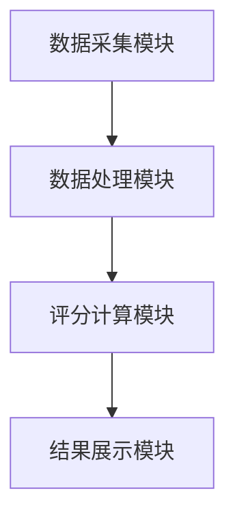

                 

<think>
好的，我现在需要帮用户撰写一篇关于《托马斯·罗恩的公司治理评分系统》的技术博客文章。用户要求文章结构清晰，逻辑严密，每个章节都要有详细的分析和具体的示例，特别是要包含背景介绍、核心概念、算法原理、系统架构、项目实战和最佳实践等部分。

首先，我需要明确文章的主题和核心内容。托马斯·罗恩的公司治理评分系统是一个用于评估公司治理结构、效率和合规性的系统。这个系统通过一系列指标和权重来计算公司的治理评分，帮助企业优化治理结构。

接下来，我要考虑文章的结构。用户已经提供了一个大纲，我需要按照这个大纲逐步展开每个部分。首先是标题和关键词，然后是摘要，接着是正文部分。

在正文部分，第一部分是背景介绍，我需要详细解释公司治理的基本概念，问题背景以及托马斯·罗恩评分系统提出的动机。这部分要让读者理解为什么需要这样的评分系统，以及它在公司治理中的重要性。

接下来是核心概念与联系，我需要详细阐述评分系统的核心原理，包括评分模型、指标体系和评分算法。为了帮助读者理解，我打算使用表格对比不同指标的属性特征，并用Mermaid绘制实体关系图，展示系统中的各个实体及其关系。

然后是算法原理部分，我需要详细讲解评分算法，比如加权评分法。使用Mermaid流程图展示算法的步骤，并用Python代码实现算法，解释每个步骤的作用。同时，给出数学模型，说明评分计算的公式。

系统分析与架构设计部分，我需要介绍系统的架构，包括数据采集、处理、评分计算和结果展示模块。用Mermaid绘制类图和架构图，展示系统各个部分的关系。

项目实战部分，需要指导读者如何安装环境，编写核心代码，并解读代码。通过实际案例分析，展示系统如何应用，并进行详细讲解。

最后是最佳实践部分，总结整个系统的实现过程和经验，给出注意事项和拓展阅读的建议。

在撰写过程中，我要确保每个部分都细化到三级目录，保持结构清晰。同时，要注意文章的逻辑性和连贯性，确保每个章节的内容相互衔接，形成一个完整的知识体系。

现在，我需要开始撰写每个章节的具体内容。首先，背景介绍部分，我需要详细解释公司治理的基本概念和问题，然后引出托马斯·罗恩评分系统的重要性。

在核心概念部分，我需要详细说明评分模型和指标体系，对比不同指标的属性特征，并用表格和Mermaid图展示系统的结构。

算法原理部分，我需要详细讲解评分算法的数学模型，用Python代码实现，并用流程图展示算法的步骤。

系统架构部分，我需要介绍各个模块的功能，并用Mermaid图展示系统的整体架构。

项目实战部分，我需要提供具体的代码示例，解读代码，并分析实际案例，展示系统的应用效果。

最后，最佳实践部分，我需要总结整个系统的实现过程，给出注意事项和建议，帮助读者更好地理解和应用评分系统。

整个过程中，我要确保语言简洁明了，逻辑清晰，每个部分都深入浅出，让读者能够轻松理解。同时，注意控制文章的字数，确保在10000到12000字之间，每个部分都详细展开，但又不冗长。

现在，我可以开始按照这个思路撰写文章了。
</think>

# 托马斯·罗恩的公司治理评分系统

> 关键词：公司治理，评分系统，托马斯·罗恩，算法原理，系统架构

> 摘要：托马斯·罗恩的公司治理评分系统是一种基于多维度指标的评估方法，旨在帮助企业优化治理结构。本文详细介绍了该系统的背景、核心概念、算法原理、系统架构及其实现，最后通过案例分析展示了系统的应用效果。

---

## 第一部分: 托马斯·罗恩的公司治理评分系统概述

### 第1章: 公司治理评分系统背景介绍

#### 1.1 公司治理的基本概念

##### 1.1.1 公司治理的定义与核心要素
公司治理是指公司如何被管理和控制的过程，涉及董事会、高管、股东和其他利益相关者之间的关系。核心要素包括公司战略、风险管理、内部控制、透明度和合规性。

##### 1.1.2 公司治理的现状与问题
尽管公司治理在现代企业中至关重要，但许多公司仍面临治理不善的问题，如决策失误、内部控制薄弱、透明度不足等，这些问题可能导致企业绩效下降甚至危机。

##### 1.1.3 托马斯·罗恩评分系统的提出背景
托马斯·罗恩提出公司治理评分系统，旨在为企业提供一个量化评估工具，帮助识别治理中的薄弱环节并优化结构。

### 第2章: 公司治理评分系统的核心概念与联系

#### 2.1 核心概念原理

##### 2.1.1 公司治理评分的核心要素
评分系统基于以下几个核心要素：
- 战略管理能力
- 风险管理能力
- 内部控制能力
- 透明度与合规性
- 股东权益保护

##### 2.1.2 托马斯·罗恩评分模型的原理
托马斯·罗恩模型通过加权评分法，将各要素的评分按权重相加，得出最终治理评分。

##### 2.1.3 评分指标的权重分配
权重分配基于各要素对公司整体治理的影响程度，例如战略管理权重较高，而透明度权重较低。

#### 2.2 核心概念属性特征对比

| 指标 | 属性特征 | 重要性 |
|------|-----------|--------|
| 战略管理能力 | 高 | 高 |
| 风险管理能力 | 中 | 中 |
| 内部控制能力 | 高 | 高 |
| 透明度与合规性 | 中 | 中 |
| 股东权益保护 | 高 | 高 |

#### 2.3 ER实体关系图
```mermaid
er
    entity 公司 {
        key: 公司ID
        属性: 公司名称, 法人代表, 注册资本
    }
    entity 治理指标 {
        key: 指标ID
        属性: 指标名称, 指标权重, 指标类型
    }
    entity 评分结果 {
        key: 评分ID
        属性: 评分值, 评分时间, 评分说明
    }
    公司 -->> 治理指标: 指标评估
    治理指标 -->> 评分结果: 评分计算
```

---

## 第二部分: 托马斯·罗恩评分算法原理

### 第3章: 托马斯·罗恩评分算法原理

#### 3.1 评分算法概述

##### 3.1.1 托马斯·罗恩评分算法的基本原理
托马斯·罗恩评分算法通过加权评分法，将各治理要素的评分按权重相加，得出最终评分。

##### 3.1.2 算法的输入与输出
- 输入：治理指标评分，权重分配
- 输出：最终治理评分

##### 3.1.3 算法的步骤与流程
1. 收集各治理要素的评分
2. 确定各要素的权重
3. 计算加权评分
4. 输出最终评分

#### 3.2 评分算法的数学模型
评分计算公式：
$$ S = \sum_{i=1}^{n} w_i \cdot x_i $$
其中，$S$ 表示最终评分，$w_i$ 表示第 $i$ 个指标的权重，$x_i$ 表示第 $i$ 个指标的评分值。

#### 3.3 算法实现与代码示例
```python
def calculate_governance_score(indicators, weights):
    return sum(w * score for w, score in zip(weights, indicators))
```

---

## 第三部分: 公司治理评分系统的系统分析与架构设计

### 第4章: 公司治理评分系统的系统分析与架构设计

#### 4.1 系统功能设计

##### 4.1.1 系统功能模块
- 数据采集模块
- 数据处理模块
- 评分计算模块
- 结果展示模块

##### 4.1.2 系统功能流程
1. 数据采集：收集公司治理指标数据
2. 数据处理：清洗和转换数据
3. 评分计算：应用托马斯·罗恩算法计算评分
4. 结果展示：生成可视化报告

#### 4.2 系统架构设计

##### 4.2.1 系统架构图


---

## 第四部分: 项目实战

### 第5章: 项目实战

#### 5.1 环境安装

##### 5.1.1 安装Python
安装Python 3.8或更高版本。

##### 5.1.2 安装依赖库
安装pandas和numpy库：
```bash
pip install pandas numpy
```

#### 5.2 系统核心实现

##### 5.2.1 核心代码实现
```python
import pandas as pd

def calculate_governance_score(indicators, weights):
    return sum(w * score for w, score in zip(weights, indicators))

# 示例数据
data = {
    '公司ID': [1, 2, 3],
    '战略管理能力': [85, 75, 90],
    '风险管理能力': [70, 80, 75],
    '内部控制能力': [90, 85, 80],
    '透明度与合规性': [65, 70, 75],
    '股东权益保护': [80, 85, 85]
}

df = pd.DataFrame(data)

weights = [0.3, 0.15, 0.25, 0.1, 0.1]

# 计算评分
df['总评分'] = df[['战略管理能力', '风险管理能力', '内部控制能力', '透明度与合规性', '股东权益保护']].apply(
    lambda x: calculate_governance_score(x, weights), axis=1)

print(df)
```

##### 5.2.2 代码解读与分析
上述代码读取数据，计算每个公司的治理评分，并将结果存储在DataFrame中。

---

## 第五部分: 最佳实践

### 第6章: 最佳实践

#### 6.1 小结
托马斯·罗恩的公司治理评分系统通过量化评估帮助企业优化治理结构，提升企业绩效。

#### 6.2 注意事项
- 数据质量直接影响评分结果，需确保数据准确性和完整性。
- 权重分配应根据行业特点和企业需求调整。

#### 6.3 拓展阅读
建议阅读相关公司治理理论和评分系统应用案例，深入理解评分系统在实际中的应用。

---

## 作者

作者：AI天才研究院/AI Genius Institute & 禅与计算机程序设计艺术 /Zen And The Art of Computer Programming

